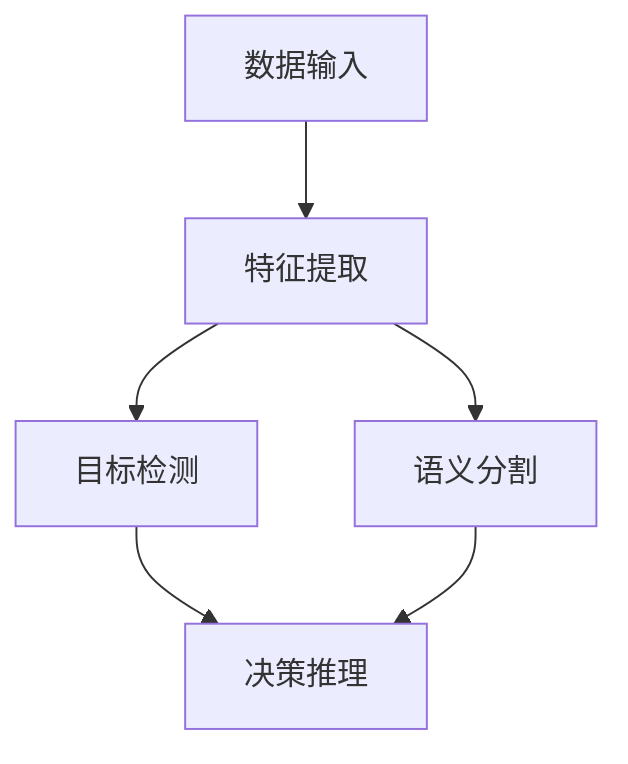

                 


# AI Agent的视觉理解能力增强

> 关键词：AI Agent，视觉理解，多模态数据融合，注意力机制，自监督学习，Transformer，视觉模型

> 摘要：AI Agent的视觉理解能力是实现智能化系统的核心技术之一。本文从AI Agent的基本概念出发，详细探讨了视觉理解在AI Agent中的重要性，分析了多模态数据融合、注意力机制和自监督学习等核心概念。通过结合Transformer和视觉模型的融合，本文详细讲解了视觉理解的算法原理，并通过实际案例分析展示了AI Agent在视觉理解能力增强中的应用。

---

## 第1章: AI Agent与视觉理解概述

### 1.1 AI Agent的基本概念

AI Agent（人工智能代理）是指能够感知环境、做出决策并执行动作的智能实体。AI Agent可以通过传感器获取信息，通过推理和学习做出决策，并通过执行器与环境互动。AI Agent的核心特征包括自主性、反应性、目标导向性和社会性。

#### 1.1.1 什么是AI Agent
AI Agent是一种能够感知环境、处理信息并采取行动的智能系统。它可以是一个软件程序，也可以是一个物理机器人。AI Agent的目标是通过与环境的交互，实现特定的任务。

#### 1.1.2 AI Agent的核心特征
- **自主性**：AI Agent可以在没有外部干预的情况下自主决策。
- **反应性**：AI Agent能够实时感知环境并做出反应。
- **目标导向性**：AI Agent的行为通常是为了实现特定的目标。
- **社会性**：AI Agent可以与其他AI Agent或人类进行交互。

#### 1.1.3 AI Agent的应用场景
AI Agent广泛应用于自动驾驶、智能助手、机器人、推荐系统等领域。例如，自动驾驶汽车就是一个复杂的AI Agent，能够感知环境、做出决策并控制车辆。

### 1.2 视觉理解的基本概念

视觉理解是指AI系统通过视觉传感器（如摄像头）获取图像信息，并对其进行解析、理解和应用的过程。视觉理解的核心技术包括图像识别、目标检测、语义分割等。

#### 1.2.1 视觉理解的定义
视觉理解是AI系统对图像或视频中的内容进行分析、理解和解释的过程。它是实现视觉感知的基础，能够帮助AI Agent更好地理解周围环境。

#### 1.2.2 视觉理解的关键技术
- **图像识别**：识别图像中的物体或场景。
- **目标检测**：检测图像中的特定目标并定位其位置。
- **语义分割**：将图像中的每个像素分配一个类别标签。

#### 1.2.3 视觉理解的挑战与难点
视觉理解面临许多挑战，例如光照变化、物体遮挡、视角变换等。此外，如何提高视觉理解的准确性和鲁棒性也是研究的难点。

### 1.3 AI Agent视觉理解能力的重要性

视觉理解是AI Agent感知环境的重要方式之一。通过视觉理解，AI Agent可以获取丰富的环境信息，从而做出更智能的决策。

#### 1.3.1 视觉理解在AI Agent中的作用
- 提供环境感知能力。
- 支持决策和推理。
- 与其他感知方式（如听觉、触觉）结合，提高整体感知能力。

#### 1.3.2 视觉理解能力增强的意义
- 提高AI Agent的智能化水平。
- 增强AI Agent在复杂环境中的适应能力。
- 为AI Agent在实际应用中的成功部署奠定基础。

#### 1.3.3 当前AI Agent视觉理解的发展现状
当前，AI Agent的视觉理解能力已经取得了显著进展。基于深度学习的视觉模型（如CNN）在图像识别、目标检测等任务中表现优异。然而，如何进一步增强视觉理解能力，仍然是一个重要的研究方向。

## 第2章: 多模态数据融合

### 2.1 多模态数据的基本概念

多模态数据是指来自不同感知方式的数据，例如图像、文本、语音、传感器数据等。多模态数据融合是指将不同模态的数据结合起来，以提高感知系统的准确性和鲁棒性。

#### 2.1.1 多模态数据的定义
多模态数据是指来自不同感知方式的数据。例如，图像数据（视觉模态）和文本数据（语言模态）。

#### 2.1.2 多模态数据的类型
- **视觉模态**：图像、视频等。
- **语言模态**：文本、语音等。
- **其他模态**：如传感器数据（加速度、陀螺仪等）。

#### 2.1.3 多模态数据融合的意义
多模态数据融合可以通过结合不同模态的信息，提高感知系统的准确性和鲁棒性。例如，在视觉识别中，结合文本信息可以提高识别的准确性。

### 2.2 注意力机制在视觉理解中的应用

注意力机制是一种模拟人类注意力的机制，能够在处理信息时关注重要的部分，忽略不重要的部分。

#### 2.2.1 注意力机制的基本原理
注意力机制的核心思想是通过计算输入数据中各个部分的重要性权重，关注重要的部分，忽略不重要的部分。

#### 2.2.2 视觉注意力机制的实现方法
视觉注意力机制可以通过卷积神经网络（CNN）和自注意力机制相结合的方式实现。例如，基于Transformer的视觉注意力机制。

#### 2.2.3 注意力机制在AI Agent中的应用案例
注意力机制在图像识别、目标检测等任务中都有广泛的应用。例如，在自动驾驶中，AI Agent可以通过注意力机制关注道路上的重要目标（如车辆、行人）。

### 2.3 自监督学习在视觉理解中的应用

自监督学习是一种通过利用未标记的数据进行监督学习的方法。自监督学习的核心思想是通过构建 pretext tasks（预文本任务）来学习数据的特征表示。

#### 2.3.1 自监督学习的定义与特点
自监督学习是一种无监督学习方法，通过构建预文本任务来学习数据的特征表示。

#### 2.3.2 自监督学习在视觉任务中的应用
自监督学习在图像重建、图像旋转、图像分割等任务中都有广泛的应用。例如，在图像旋转任务中，模型需要根据旋转后的图像推断原始图像的旋转角度。

#### 2.3.3 自监督学习的优势与挑战
自监督学习的优势在于可以充分利用未标记的数据进行学习，降低对标注数据的依赖。然而，自监督学习的挑战在于如何设计有效的预文本任务。

## 第3章: Transformer与视觉模型的融合

### 3.1 Transformer的基本原理

Transformer是一种基于自注意力机制的神经网络模型，最初用于自然语言处理任务。

#### 3.1.1 Transformer的结构与特点
Transformer由编码器和解码器组成。编码器用于将输入数据编码为特征表示，解码器用于根据编码器的输出生成目标输出。

#### 3.1.2 Transformer在自然语言处理中的应用
Transformer在自然语言处理任务（如机器翻译、文本生成）中表现出色。

#### 3.1.3 Transformer的变体与优化
- **BERT**：一种基于Transformer的预训练模型，广泛应用于自然语言处理任务。
- **GPT**：一种基于Transformer的生成式模型，广泛应用于文本生成任务。

### 3.2 视觉模型的基本原理

视觉模型是一种用于处理图像数据的神经网络模型。常用的视觉模型包括卷积神经网络（CNN）和Transformer-based视觉模型。

#### 3.2.1 CNN与视觉模型
CNN通过卷积操作提取图像的空间特征，广泛应用于图像识别、目标检测等任务。

#### 3.2.2 视觉模型的关键技术
- **深度卷积神经网络**：通过多层卷积操作提取图像的高层次特征。
- **区域卷积神经网络（R-CNN）**：一种基于区域的卷积神经网络，广泛应用于目标检测任务。

#### 3.2.3 视觉模型的应用场景
视觉模型广泛应用于图像识别、目标检测、语义分割等任务。

### 3.3 Transformer与视觉模型的融合

将Transformer与视觉模型融合可以充分利用Transformer的全局注意力机制和视觉模型的局部特征提取能力。

#### 3.3.1 Transformer与视觉模型融合的动机
通过融合Transformer和视觉模型，可以同时利用全局注意力机制和局部特征提取能力，提高视觉理解的准确性和鲁棒性。

#### 3.3.2 Transformer与视觉模型融合的实现方法
- **视觉-Transformer融合模型**：将视觉模型的特征输入到Transformer中，通过自注意力机制进行全局特征交互。
- **多模态Transformer模型**：结合视觉、文本等多种模态的数据，通过自注意力机制进行多模态特征交互。

#### 3.3.3 Transformer与视觉模型融合的优势
通过融合Transformer和视觉模型，可以实现更高效的全局特征交互，提高视觉理解的准确性和鲁棒性。

## 第4章: AI Agent视觉理解的系统架构设计

### 4.1 系统功能设计

AI Agent视觉理解系统的功能模块包括数据预处理、特征提取、目标检测、语义分割、决策推理等。

#### 4.1.1 数据预处理
数据预处理包括图像 resize、归一化、增强等操作。

#### 4.1.2 特征提取
特征提取模块通过视觉模型提取图像的特征表示。

#### 4.1.3 目标检测
目标检测模块用于检测图像中的目标并定位其位置。

#### 4.1.4 语义分割
语义分割模块用于将图像中的每个像素分配一个类别标签。

#### 4.1.5 决策推理
决策推理模块根据视觉理解结果和其他感知信息做出决策。

### 4.2 系统架构设计

AI Agent视觉理解系统的架构设计包括数据输入、特征提取、目标检测、语义分割、决策推理等模块。

#### 4.2.1 系统架构图


#### 4.2.2 系统接口设计
系统接口设计包括数据输入接口、特征提取接口、目标检测接口、语义分割接口、决策推理接口等。

#### 4.2.3 系统交互流程
系统交互流程包括数据输入、特征提取、目标检测、语义分割、决策推理等步骤。

### 4.3 项目实战

#### 4.3.1 环境安装
需要安装的环境包括Python、深度学习框架（如TensorFlow、PyTorch）、视觉模型库（如OpenCV、Mask R-CNN）等。

#### 4.3.2 核心代码实现
以下是一个简单的AI Agent视觉理解系统的实现代码示例：

```python
import tensorflow as tf
from tensorflow.keras.models import Model
from tensorflow.keras.layers import Input, Conv2D, MaxPooling2D, Dense, Flatten

def build_model():
    input_layer = Input(shape=(224, 224, 3))
    conv1 = Conv2D(32, (3,3), activation='relu')(input_layer)
    pool1 = MaxPooling2D((2,2))(conv1)
    conv2 = Conv2D(64, (3,3), activation='relu')(pool1)
    pool2 = MaxPooling2D((2,2))(conv2)
    flatten = Flatten()(pool2)
    dense = Dense(128, activation='relu')(flatten)
    output_layer = Dense(10, activation='softmax')(dense)
    model = Model(inputs=input_layer, outputs=output_layer)
    return model

model = build_model()
model.compile(optimizer='adam', loss='sparse_categorical_crossentropy', metrics=['accuracy'])
model.fit(x_train, y_train, epochs=10, batch_size=32)
```

#### 4.3.3 实际案例分析
以下是一个AI Agent视觉理解系统的实际案例分析：

**案例背景**：自动驾驶汽车需要通过视觉理解技术识别道路上的物体（如车辆、行人、交通标志等）。

**案例分析**：
1. 数据预处理：将输入的图像 resize到224x224，并进行归一化处理。
2. 特征提取：通过视觉模型提取图像的特征表示。
3. 目标检测：检测图像中的车辆、行人等目标，并定位其位置。
4. 语义分割：将图像中的每个像素分配一个类别标签（如道路、车辆、行人等）。
5. 决策推理：根据视觉理解结果和其他感知信息（如激光雷达数据）做出驾驶决策。

## 第5章: 总结与展望

### 5.1 本章总结
本文详细探讨了AI Agent视觉理解能力增强的技术要点，包括多模态数据融合、注意力机制、自监督学习、Transformer与视觉模型的融合等。

### 5.2 当前研究的不足
当前研究的不足之处在于如何进一步提高视觉理解的准确性和鲁棒性，如何实现多模态数据的高效融合，如何设计更高效的注意力机制等。

### 5.3 未来研究方向
未来的研究方向包括：
1. 更高效的视觉模型设计。
2. 更高效的多模态数据融合方法。
3. 更高效的注意力机制设计。
4. 更高效的自监督学习方法。
5. 更高效的AI Agent视觉理解系统架构设计。

---

# 作者：AI天才研究院/AI Genius Institute & 禅与计算机程序设计艺术 /Zen And The Art of Computer Programming

