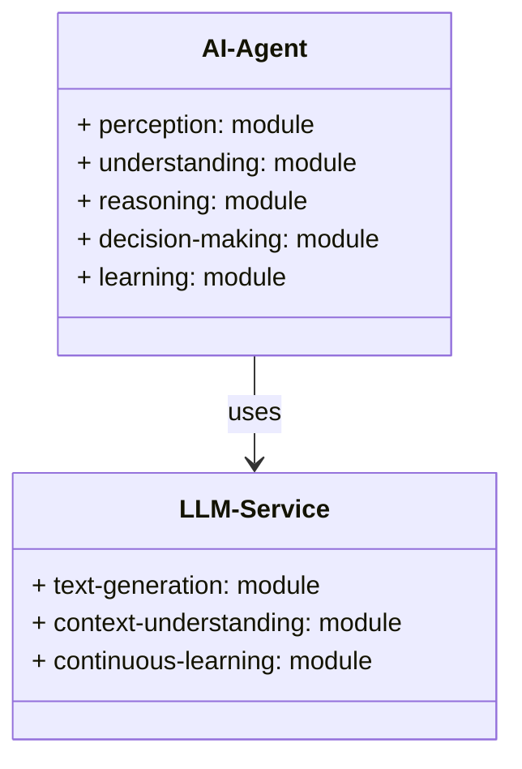
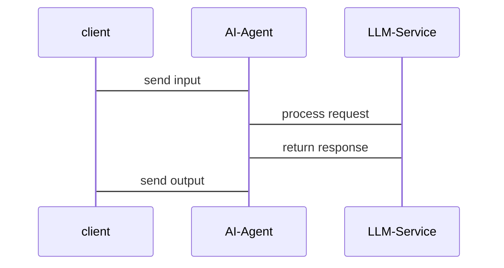

                 


# AI Agent的认知发展模拟：探索LLM的智能进化过程

**关键词**：AI Agent、LLM、认知模拟、大语言模型、智能进化、机器学习

**摘要**：  
本文探讨了AI Agent的认知发展模拟，特别是通过大语言模型（LLM）实现智能进化的过程。从AI Agent的基本概念到LLM的背景与发展，再到认知模拟的核心概念、算法原理、系统架构、项目实战及最佳实践，本文系统地分析了AI Agent认知模拟的理论基础与实践应用。通过详细讲解认知模拟的关键要素、LLM在认知模拟中的角色、算法原理、系统设计及实际案例，本文为读者提供了一个全面而深入的视角，帮助理解AI Agent如何通过认知模拟实现智能进化。

---

## 第1章: AI Agent与认知模拟概述

### 1.1 AI Agent的基本概念
#### 1.1.1 AI Agent的定义与特点
AI Agent（人工智能代理）是指能够感知环境、自主决策并执行任务的智能实体。其特点包括自主性、反应性、目标导向性和学习能力。AI Agent能够通过感知环境信息，理解任务目标，并采取相应行动以实现目标。

#### 1.1.2 认知模拟的基本原理
认知模拟是通过模拟人类认知过程（如感知、记忆、推理、决策等）来实现智能行为的技术。AI Agent的认知模拟依赖于对人类认知过程的建模，使得AI Agent能够像人类一样理解和处理复杂问题。

#### 1.1.3 AI Agent的应用场景
AI Agent广泛应用于多个领域，包括智能助手、机器人控制、自动驾驶、智能客服等。通过认知模拟，AI Agent能够在这些场景中表现出更自然、更智能的行为。

### 1.2 大语言模型（LLM）的背景与发展
#### 1.2.1 LLM的基本概念
大语言模型（Large Language Model，LLM）是一种基于深度学习的自然语言处理模型，通过大量数据训练，能够理解和生成人类语言。LLM的核心技术包括词嵌入、注意力机制和Transformer架构。

#### 1.2.2 LLM在AI Agent中的作用
LLM为AI Agent提供了强大的自然语言处理能力，使其能够理解和生成人类语言。通过LLM，AI Agent可以更自然地与人类交互，并在复杂任务中表现出更强的智能性。

#### 1.2.3 当前LLM技术的现状与挑战
当前，LLM技术在自然语言处理领域取得了显著进展，但仍然面临诸多挑战，如模型的可解释性、计算资源消耗、数据隐私等问题。如何进一步优化LLM性能并解决这些问题，是当前研究的重点。

---

## 第2章: AI Agent认知发展的核心概念

### 2.1 认知模拟的关键要素
#### 2.1.1 感知与理解
感知是AI Agent认知过程的第一步，通过感知环境信息，AI Agent能够理解当前状态。LLM在感知阶段通过自然语言处理技术，帮助AI Agent理解和解析输入信息。

#### 2.1.2 决策与推理
在感知的基础上，AI Agent需要进行决策和推理。决策是基于当前状态和目标的选择过程，而推理则是对环境信息的逻辑分析。LLM通过上下文理解和生成能力，为决策和推理提供了强大的支持。

#### 2.1.3 学习与记忆
学习是AI Agent提升智能的关键过程，通过学习，AI Agent能够不断优化自身的认知模型。记忆能力则使得AI Agent能够存储和检索先前的信息，从而支持持续的学习和推理。

### 2.2 LLM在认知模拟中的角色
#### 2.2.1 LLM的文本生成能力
LLM的文本生成能力使得AI Agent能够以自然语言形式与人类交互，增强了人机交互的流畅性和自然性。

#### 2.2.2 LLM的上下文理解能力
通过上下文理解能力，LLM能够捕捉对话中的语境信息，从而为AI Agent的推理和决策提供更丰富的信息支持。

#### 2.2.3 LLM的持续学习能力
LLM的持续学习能力使得AI Agent能够通过在线学习不断优化自身的认知模型，从而实现更高效的智能进化。

---

## 第3章: AI Agent认知发展的算法原理

### 3.1 基于LLM的认知模拟算法
#### 3.1.1 基于监督学习的LLM训练
监督学习是LLM训练的基础方法。通过大量标注数据的训练，LLM能够学习自然语言的语法规则和语义信息。例如，使用Transformer架构的模型通过自注意力机制和前馈网络进行训练。

#### 3.1.2 基于强化学习的LLM优化
强化学习通过奖励机制优化LLM的行为。例如，在对话生成任务中，模型通过最大化奖励函数来优化生成的回复质量。

#### 3.1.3 基于对比学习的LLM改进
对比学习通过对比正样本和负样本，优化模型的表征能力。例如，通过对比学习，模型能够更好地捕捉语义信息，提高生成文本的质量。

### 3.2 认知模拟的数学模型
#### 3.2.1 概率图模型在认知模拟中的应用
概率图模型（如贝叶斯网络）用于建模不确定性，帮助AI Agent进行推理和决策。例如，在感知阶段，概率图模型可以用于计算环境状态的概率分布。

#### 3.2.2 神经网络在认知模拟中的应用
神经网络（如卷积神经网络和循环神经网络）用于处理感知和生成任务。例如，用于图像识别任务的卷积神经网络，能够帮助AI Agent感知视觉信息。

#### 3.2.3 基于Transformer的LLM架构
Transformer架构通过自注意力机制和位置编码，能够高效处理序列数据。例如，在自然语言处理任务中，Transformer架构能够捕捉长距离依赖关系，提高模型的语义理解能力。

---

## 第4章: 系统分析与架构设计方案

### 4.1 问题场景介绍
#### 4.1.1 AI Agent的认知模拟需求
AI Agent需要通过认知模拟实现感知、推理、决策和学习能力，以支持复杂的智能任务。例如，在智能客服场景中，AI Agent需要通过理解用户需求，生成合适的回复。

#### 4.1.2 系统目标与范围
系统目标是设计一个基于LLM的AI Agent，实现认知模拟功能。系统范围包括感知、理解、推理、决策和学习模块。

#### 4.1.3 系统边界与交互流程
系统边界包括与用户的交互界面和后端LLM服务接口。交互流程包括用户输入、LLM处理、生成回复等步骤。

### 4.2 系统功能设计
#### 4.2.1 领域模型设计（Mermaid类图）


#### 4.2.2 系统架构设计（Mermaid架构图）
```mermaid
dataflowDiagram
    client --> AI-Agent: user input
    AI-Agent --> LLM-Service: process request
    LLM-Service --> AI-Agent: response
    AI-Agent --> client: output
```

#### 4.2.3 系统接口设计与交互流程（Mermaid序列图）


---

## 第5章: 项目实战——基于LLM的AI Agent开发

### 5.1 环境安装与配置
#### 5.1.1 开发环境的选择与搭建
推荐使用Python 3.8及以上版本，安装必要的库（如TensorFlow、PyTorch、Hugging Face库）。

#### 5.1.2 必要工具与库的安装
安装步骤：
```bash
pip install numpy
pip install pandas
pip install transformers
pip install torch
pip install matplotlib
```

### 5.2 系统核心实现
#### 5.2.1 LLM模型的调用与集成
使用Hugging Face库调用LLM模型：
```python
from transformers import pipeline

text_generation = pipeline('text-generation', model='gpt2')
response = text_generation('hello')[0]['generated_text']
print(response)
```

#### 5.2.2 认知模拟算法的实现
实现一个简单的认知模拟算法：
```python
def perceive(environment):
    # 处理环境信息
    return processed_info

def decide(action_space, state):
    # 根据状态选择动作
    return action

def learn(reward, action, state):
    # 更新认知模型
    pass
```

#### 5.2.3 系统功能模块的代码实现
实现一个完整的AI Agent系统：
```python
class AI-Agent:
    def __init__(self):
        self.llm = text_generation
        self.perception = perceive
        self.decision = decide
        self.memory = {}

    def process_input(self, input):
        state = self.perception(input)
        action = self.decision(state)
        response = self.llm.generate(action)
        return response
```

---

## 第6章: 案例分析与详细讲解

### 6.1 实际案例分析
以电商客服AI Agent为例，展示如何通过认知模拟实现智能客服系统。案例包括用户咨询、问题理解、生成回复等步骤。

### 6.2 详细讲解
分析AI Agent在电商客服中的具体应用，包括：
1. 用户输入解析
2. 上下文理解与生成回复
3. 基于LLM的持续学习优化

---

## 总结

通过本文的详细讲解，我们了解了AI Agent认知发展的基本概念、算法原理和系统架构。同时，通过实际案例分析，我们掌握了如何通过LLM实现认知模拟。未来，随着技术的不断发展，AI Agent的认知模拟将更加智能化和个性化，为人类带来更多的便利。

**作者：AI天才研究院/AI Genius Institute & 禅与计算机程序设计艺术 /Zen And The Art of Computer Programming**

