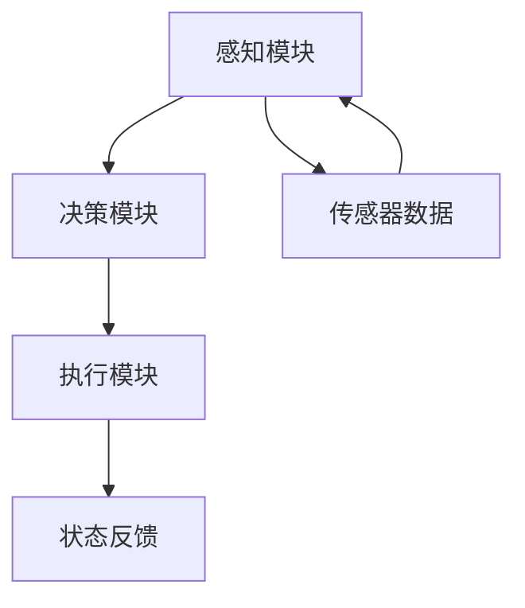
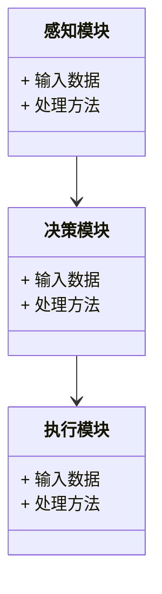
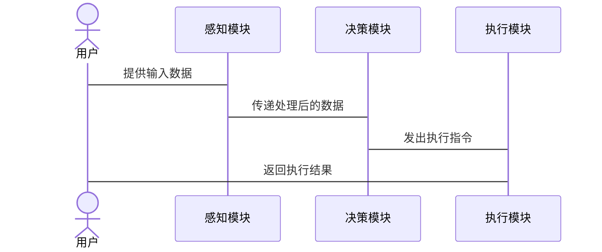

                 


# AI Agent的认知架构：从感知到决策的全流程设计

## 关键词：
- 人工智能代理
- 认知架构
- 感知
- 决策
- 机器学习

## 摘要：
本文详细探讨了AI Agent的认知架构，从感知到决策的全流程设计。通过分析多模态数据处理、注意力机制、传感器数据融合等感知技术，结合基于规则、基于模型和基于学习的决策算法，最终实现AI Agent的认知流程。文章还提供了系统架构设计和项目实战案例，帮助读者全面理解AI Agent的设计与实现。

---

## 第一部分: AI Agent认知架构的背景与核心概念

### 第1章: AI Agent的认知架构概述

#### 1.1 AI Agent的基本概念
- 1.1.1 什么是AI Agent
- 1.1.2 AI Agent的类型与特点
- 1.1.3 AI Agent与传统AI的区别

#### 1.2 AI Agent的认知架构
- 1.2.1 认知架构的定义
- 1.2.2 认知架构的核心要素
- 1.2.3 AI Agent的认知流程

#### 1.3 AI Agent的应用场景
- 1.3.1 智能助手
- 1.3.2 自动驾驶
- 1.3.3 智能推荐系统

### 第2章: AI Agent的认知架构核心概念

#### 2.1 感知模块
- 2.1.1 多模态数据处理
- 2.1.2 注意力机制
- 2.1.3 传感器数据融合

#### 2.2 决策模块
- 2.2.1 基于规则的决策
- 2.2.2 基于模型的决策
- 2.2.3 基于学习的决策

#### 2.3 执行模块
- 2.3.1 动作规划
- 2.3.2 行为优化
- 2.3.3 状态反馈

### 第3章: AI Agent的认知架构核心概念对比

#### 3.1 感知与决策的关系
- 3.1.1 感知的输入与决策的输出
- 3.1.2 感知与决策的交互过程

#### 3.2 不同认知架构的对比
- 3.2.1 基于规则的架构
- 3.2.2 基于模型的架构
- 3.2.3 基于学习的架构

#### 3.3 实体关系图


---

## 第二部分: AI Agent认知架构的算法原理

### 第4章: AI Agent的感知算法

#### 4.1 多模态数据处理算法
- 4.1.1 图像处理算法
- 4.1.2 文本处理算法
- 4.1.3 声音处理算法

#### 4.2 注意力机制
- 4.2.1 自注意力机制
- 4.2.2 相关注意力机制
- 4.2.3 门控机制

#### 4.3 传感器数据融合算法
- 4.3.1 融合方法
- 4.3.2 数据权重分配
- 4.3.3 融合后的结果处理

### 第5章: AI Agent的决策算法

#### 5.1 基于规则的决策算法
- 5.1.1 规则定义
- 5.1.2 规则的优先级
- 5.1.3 规则的动态调整

#### 5.2 基于模型的决策算法
- 5.2.1 模型构建
- 5.2.2 模型的训练
- 5.2.3 模型的预测

#### 5.3 基于学习的决策算法
- 5.3.1 强化学习
- 5.3.2 监督学习
- 5.3.3 半监督学习

### 第6章: AI Agent的数学模型与公式

#### 6.1 注意力机制的数学模型
$$
\text{Attention}(Q, K, V) = \text{softmax}\left(\frac{QK^T}{\sqrt{d_k}}\right)V
$$

#### 6.2 决策树的构建与优化
$$
\text{Entropy}(Y | X) = -\sum_{i=1}^n p_i \log p_i
$$

#### 6.3 强化学习的奖励函数
$$
R(s, a) = r + \gamma \max_{a'} Q(s', a')
$$`

---

## 第三部分: AI Agent认知架构的系统设计与实现

### 第7章: 系统架构设计

#### 7.1 系统功能模块


#### 7.2 系统交互流程


### 第8章: 项目实战

#### 8.1 环境配置
- 安装必要的库：TensorFlow, PyTorch, OpenCV
- 硬件需求：GPU支持

#### 8.2 核心代码实现
```python
import tensorflow as tf
from tensorflow.keras import layers

# 定义感知模块
def perception_module(inputs):
    x = layers.Conv2D(32, (3, 3), activation='relu')(inputs)
    x = layers.MaxPooling2D((2, 2))(x)
    x = layers.Flatten()(x)
    x = layers.Dense(64, activation='relu')(x)
    return x

# 定义决策模块
def decision_module(inputs):
    x = layers.Dense(64, activation='relu')(inputs)
    x = layers.Dense(10, activation='softmax')(x)
    return x
```

#### 8.3 案例分析
- 案例：自动驾驶中的AI Agent
- 数据流：传感器数据 -> 感知模块 -> 决策模块 -> 执行模块

#### 8.4 项目总结
- 成功实现AI Agent的认知架构
- 系统性能优化
- 实际应用中的问题与解决方案

### 第9章: 最佳实践与注意事项

#### 9.1 实践 tips
- 数据预处理的重要性
- 模型调参的技巧
- 系统优化建议

#### 9.2 注意事项
- 数据隐私保护
- 系统的可扩展性
- 算法的实时性

#### 9.3 拓展阅读
- 强化学习的经典论文
- 多模态数据处理的研究进展
- 最新AI Agent的应用案例

---

## 作者：AI天才研究院/AI Genius Institute & 禅与计算机程序设计艺术 /Zen And The Art of Computer Programming

