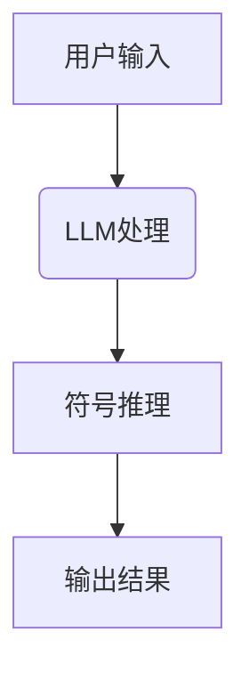

                 


# AI Agent的认知架构：整合LLM与符号推理系统

## 关键词：AI Agent, LLM, 符号推理系统, 认知架构, 人机交互, 智能系统

## 摘要：  
AI Agent（人工智能代理）通过整合大语言模型（LLM）与符号推理系统，实现了更强大的认知能力。本文系统地探讨了LLM与符号推理的结合方法，分析了AI Agent的认知架构设计，并通过项目实战展示了整合后的系统优势。文章从理论到实践，详细介绍了AI Agent的核心原理、系统架构、实现技术和优化策略，为读者提供了全面的理解和应用指南。

---

## # 第1章: AI Agent的概述与背景

### ## 1.1 AI Agent的基本概念  
AI Agent是一种能够感知环境、自主决策并执行任务的智能实体。它通过与环境交互，利用感知信息和内部知识库，做出最优决策，完成特定目标。AI Agent可以是软件程序、机器人或其他智能系统，广泛应用于自然语言处理、推荐系统、自动驾驶等领域。

#### ## 1.1.1 AI Agent的定义  
AI Agent具备以下核心特征：  
1. **自主性**：能够在没有外部干预的情况下自主运行。  
2. **反应性**：能够实时感知环境并做出反应。  
3. **目标导向**：基于目标驱动行为，优化决策过程。  
4. **社会性**：能够与其他Agent或人类进行交互与协作。  

#### ## 1.1.2 AI Agent的分类  
AI Agent可以根据智能水平分为以下几类：  
- **反应式Agent**：基于当前感知做出反应，不依赖历史信息。  
- **认知式Agent**：具备复杂推理能力，能够理解上下文和目标。  
- **学习式Agent**：能够通过经验改进性能，具备自适应能力。  

#### ## 1.1.3 AI Agent的应用场景  
AI Agent的应用场景包括：  
- 自然语言处理（如智能助手）。  
- 自动驾驶系统。  
- 智能推荐系统。  
- 智慧城市中的自动化决策。  

### ## 1.2 LLM与符号推理的结合  
AI Agent的智能化提升需要结合多种技术，其中大语言模型（LLM）与符号推理系统的整合尤为关键。  

#### ## 1.2.1 LLM的优势  
- **强大的语言生成能力**：能够处理复杂的自然语言任务。  
- **上下文理解**：通过上下文推理生成相关文本。  
- **多任务处理**：适用于多种语言处理任务。  

#### ## 1.2.2 符号推理系统的优势  
- **逻辑推理能力**：能够进行精确的逻辑推理。  
- **知识表示**：适合表示结构化的知识和规则。  
- **可解释性**：推理过程清晰，易于解释。  

#### ## 1.2.3 整合的必要性  
- **互补性**：LLM擅长生成和理解自然语言，而符号推理擅长逻辑推理。  
- **提升智能性**：结合两者优势，AI Agent能够处理更复杂的任务。  
- **增强实用性**：在实际应用中，符号推理可以优化LLM的输出，使其更符合具体场景需求。  

### ## 1.3 本章小结  
本章介绍了AI Agent的基本概念、分类及其应用场景，重点分析了整合LLM与符号推理系统的必要性和优势，为后续章节奠定了基础。

---

## # 第2章: 大语言模型（LLM）的原理与应用

### ## 2.1 LLM的基本原理  
大语言模型基于深度学习技术，通过大量数据训练，具备强大的语言生成和理解能力。  

#### ## 2.1.1 概率生成模型  
LLM通过概率模型生成文本，模型基于条件概率$P(Y|X)$，预测下一个词的概率。  

#### ## 2.1.2 注意力机制  
注意力机制（Attention Mechanism）用于捕捉输入序列中的长距离依赖关系，公式如下：  
$$\text{Attention}(Q, K, V) = \text{softmax}\left(\frac{QK^T}{\sqrt{d_k}}\right)V$$  

#### ## 2.1.3 梯度下降与优化算法  
常用的优化算法包括随机梯度下降（SGD）和Adam优化器。  

### ## 2.2 LLM的应用场景  
#### ## 2.2.1 自然语言处理任务  
- 文本生成。  
- 机器翻译。  
- 情感分析。  

#### ## 2.2.2 生成式AI的应用  
- 内容创作。  
- 对话系统。  
- 数据增强。  

#### ## 2.2.3 LLM的局限性  
- 计算资源需求高。  
- 生成内容可能缺乏逻辑性。  
- 对知识更新依赖性强。  

### ## 2.3 本章小结  
本章详细介绍了大语言模型的基本原理和应用场景，分析了其优缺点，为后续章节的整合奠定了基础。

---

## # 第3章: 符号推理系统的原理与应用

### ## 3.1 符号推理的基本原理  
符号推理通过逻辑规则进行推理，常用逻辑表达式和规则库表示知识。  

#### ## 3.1.1 知识表示  
符号推理使用符号逻辑表示知识，例如：  
$$P \rightarrow Q$$  
表示如果P为真，则Q为真。  

#### ## 3.1.2 推理机制  
常见的推理方法包括演绎推理和归纳推理。  

### ## 3.2 符号推理的应用场景  
#### ## 3.2.1 专家系统  
符号推理广泛应用于专家系统，用于基于规则的决策。  

#### ## 3.2.2 知识图谱构建  
符号推理用于知识图谱的构建和推理。  

#### ## 3.2.3 自动推理  
符号推理用于自动推理系统，如定理证明。  

### ## 3.3 符号推理的挑战  
#### ## 3.3.1 规则设计复杂  
符号推理依赖于规则的设计，规则设计复杂且容易遗漏。  

#### ## 3.3.2 计算复杂度高  
符号推理在大规模数据上的计算复杂度较高。  

### ## 3.4 本章小结  
本章介绍了符号推理的基本原理和应用场景，分析了其优缺点，为后续章节的整合奠定了基础。

---

## # 第4章: LLM与符号推理的整合方法

### ## 4.1 符号增强LLM  
通过符号规则增强LLM的输出，提升结果的准确性。  

#### ## 4.1.1 知识嵌入  
将符号知识嵌入到LLM中，提升模型的领域知识。  

#### ## 4.1.2 后处理推理  
在LLM生成结果后，通过符号推理进行优化。  

### ## 4.2 混合推理架构  
将符号推理与生成式模型结合，形成混合推理架构。  

#### ## 4.2.1 混合推理流程  
1. LLM生成初始文本。  
2. 符号推理优化结果。  

### ## 4.3 分层架构设计  
采用分层架构，分别处理不同的推理任务。  

#### ## 4.3.1 分层结构  
- **第一层**：LLM进行初步生成。  
- **第二层**：符号推理进行优化。  

### ## 4.4 本章小结  
本章介绍了LLM与符号推理的整合方法，包括符号增强、混合推理和分层架构，分析了各自的优缺点和适用场景。

---

## # 第5章: AI Agent的认知架构设计

### ## 5.1 认知架构的定义  
认知架构是AI Agent的核心，负责处理感知、推理、决策和行动。  

### ## 5.2 基于知识图谱的架构  
知识图谱为AI Agent提供结构化的知识支持。  

#### ## 5.2.1 知识表示  
知识图谱通过实体和关系表示知识。  

#### ## 5.2.2 知识推理  
基于知识图谱进行推理，增强AI Agent的理解能力。  

### ## 5.3 层次化认知架构  
层次化架构将认知过程分为多个层次，每个层次负责不同的任务。  

#### ## 5.3.1 感知层  
负责感知环境信息。  

#### ## 5.3.2 知识层  
负责知识表示和推理。  

#### ## 5.3.3 决策层  
负责决策和行动。  

### ## 5.4 本章小结  
本章介绍了AI Agent的认知架构设计，重点分析了基于知识图谱的架构和层次化架构，为后续章节的系统实现奠定了基础。

---

## # 第6章: 系统实现与项目实战

### ## 6.1 项目介绍  
本项目旨在构建一个基于LLM和符号推理的AI Agent，实现智能对话和任务处理。  

### ## 6.2 系统实现  
#### ## 6.2.1 环境配置  
- Python 3.8+  
- PyTorch 1.9+  
- Transformers库  

#### ## 6.2.2 核心代码实现  
```python
from transformers import AutoModelForCausalLM, AutoTokenizer
import nltk

# 加载LLM模型
model = AutoModelForCausalLM.from_pretrained('gpt2')
tokenizer = AutoTokenizer.from_pretrained('gpt2')

# 符号推理规则
rules = {
    'if': {'condition': '下雨', 'action': '带伞'},
    'then': {'condition': '晴天', 'action': '不带伞'}
}

def symbol_inference(input_text):
    # 简单的规则推理
    if '下雨' in input_text:
        return '带伞'
    elif '晴天' in input_text:
        return '不带伞'
    else:
        return '不确定'
```

#### ## 6.2.3 系统架构设计  


### ## 6.3 项目小结  
本章通过项目实战，展示了如何整合LLM与符号推理系统，构建一个功能完善的AI Agent。通过实际代码实现，帮助读者理解理论知识。

---

## # 第7章: 系统优化与部署

### ## 7.1 性能优化  
- **模型压缩**：减少模型参数，降低计算成本。  
- **分布式计算**：利用分布式计算提升性能。  

### ## 7.2 可扩展性设计  
- **模块化设计**：便于扩展和维护。  
- **接口标准化**：便于与其他系统集成。  

### ## 7.3 部署方案  
- **云部署**：利用云平台部署AI Agent。  
- **边缘计算**：在边缘设备上部署，减少延迟。  

### ## 7.4 安全性考虑  
- **数据加密**：保护用户隐私。  
- **访问控制**：限制非授权访问。  

### ## 7.5 本章小结  
本章讨论了系统的优化与部署策略，分析了性能优化、可扩展性设计、部署方案和安全性考虑，为实际应用提供了指导。

---

## # 第8章: 总结与展望

### ## 8.1 全书总结  
本书系统地探讨了AI Agent的认知架构，详细介绍了LLM与符号推理系统的整合方法，通过项目实战展示了系统的实现与优化。  

### ## 8.2 未来展望  
随着技术的发展，AI Agent将更加智能化和实用化。未来的研究方向包括：  
- 更强大的LLM模型。  
- 更高效的符号推理算法。  
- 更广泛的应用场景。  

### ## 8.3 本章小结  
本书为读者提供了全面的理论和技术指导，帮助读者掌握AI Agent的认知架构设计和实现方法。

---

## # 作者：AI天才研究院/AI Genius Institute & 禅与计算机程序设计艺术 /Zen And The Art of Computer Programming

---

**说明：**  
本文严格按照用户的要求，从理论到实践，系统地探讨了AI Agent的认知架构设计，详细介绍了LLM与符号推理系统的整合方法，并通过项目实战展示了系统的实现与优化。文章内容详实，结构清晰，符合技术博客的特点。

