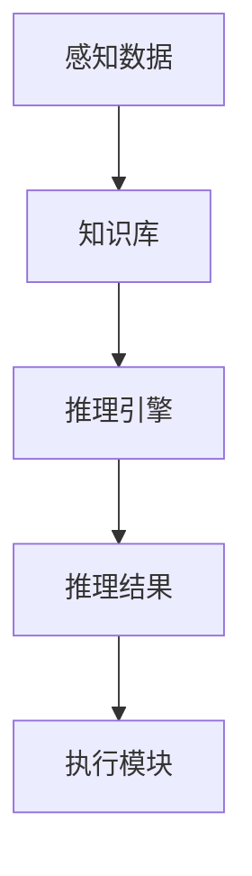
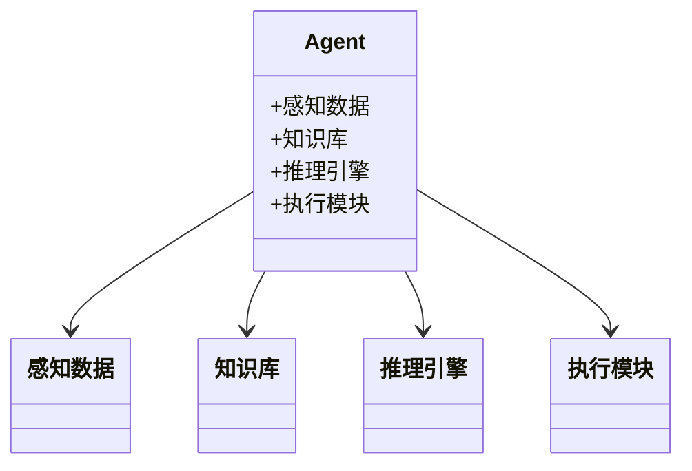
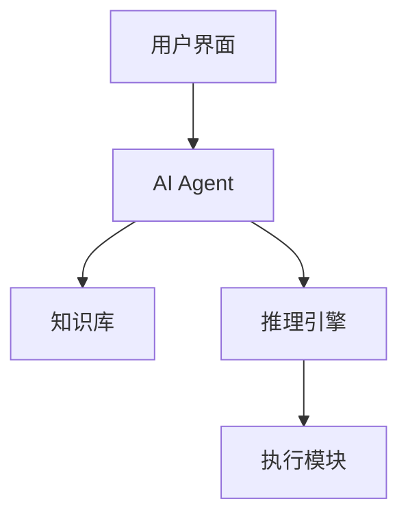
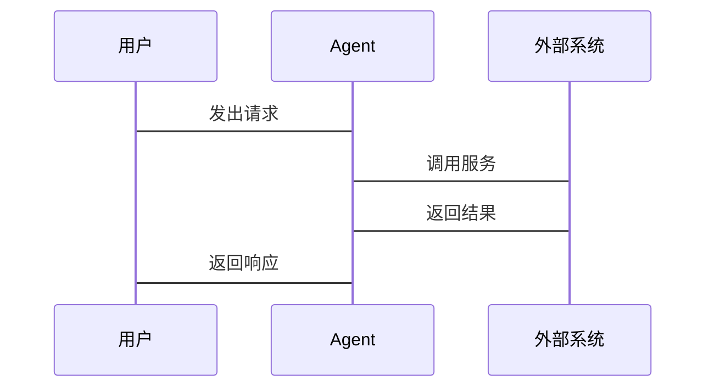

                 


# AI Agent的认知计算与推理框架

> 关键词：AI Agent, 认知计算, 推理框架, 系统架构, 项目实战

> 摘要：本文详细探讨了AI Agent的认知计算与推理框架，从基本概念到算法原理，再到系统架构和项目实战，全面解析其核心思想和实现方法。

---

# 第一部分: AI Agent的认知计算与推理框架背景介绍

## 第1章: AI Agent的认知计算与推理框架概述

### 1.1 AI Agent的基本概念

#### 1.1.1 什么是AI Agent
AI Agent（人工智能代理）是指能够感知环境、做出决策并执行动作的智能实体。它具备自主性、反应性、目标导向和社交能力等特征。

#### 1.1.2 AI Agent的核心特征
- **自主性**：能够独立运作，无需外部干预。
- **反应性**：能实时感知环境并做出反应。
- **目标导向**：具备明确的目标，驱动行为。
- **社交能力**：能与其他Agent或人类进行交互。

#### 1.1.3 AI Agent的应用场景
- 智能助手（如Siri、Alexa）。
- 自动驾驶系统。
- 智能推荐系统。
- 智慧城市中的自动控制系统。

### 1.2 认知计算与推理框架的背景

#### 1.2.1 认知计算的定义
认知计算是指模拟人类认知过程的计算方式，包括感知、记忆、推理和学习等环节。

#### 1.2.2 推理框架的必要性
在AI Agent中，推理框架负责根据感知信息和知识库进行逻辑推理，得出结论并指导行动。

#### 1.2.3 认知计算与推理框架的关系
认知计算为推理框架提供输入，推理框架则处理这些输入，生成输出用于指导行为。

### 1.3 本章小结
本章介绍了AI Agent的基本概念及其核心特征，探讨了认知计算与推理框架的背景及其重要性。

---

# 第二部分: 认知计算与推理框架的核心概念与联系

## 第2章: 认知计算的原理与实现

### 2.1 认知计算的核心原理

#### 2.1.1 感知与理解的计算模型
- **感知**：通过传感器或数据输入获取信息。
- **理解**：将感知信息转化为有意义的知识。

#### 2.1.2 知识表示与推理机制
- **知识表示**：将知识以符号、规则或语义网络的形式表示。
- **推理机制**：基于知识进行逻辑推理，得出结论。

#### 2.1.3 认知计算的数学基础
- 基于概率论、逻辑推理和图论的数学模型。

### 2.2 推理框架的结构与功能

#### 2.2.1 推理框架的基本结构
- **输入层**：接收感知数据。
- **知识库**：存储领域知识和规则。
- **推理引擎**：执行推理过程。
- **输出层**：生成推理结果。

#### 2.2.2 推理框架的功能模块
- 数据预处理：清洗和标准化输入数据。
- 知识推理：基于知识库进行逻辑推理。
- 结果解释：将推理结果转化为可执行的输出。

### 2.3 认知计算与推理框架的关系

#### 2.3.1 认知计算为推理框架提供输入
- 感知数据和知识表示为推理提供基础。

#### 2.3.2 推理框架为认知计算提供输出
- 推理结果指导AI Agent的行为。

#### 2.3.3 两者结合的必要性
- 认知计算提供输入，推理框架处理输入，两者共同实现智能决策。

### 2.4 本章小结
本章详细探讨了认知计算的原理及其与推理框架的关系，分析了推理框架的结构与功能。

---

# 第三部分: 认知计算与推理框架的算法原理

## 第3章: 感知算法的实现原理

### 3.1 感知算法的分类

#### 3.1.1 基于规则的感知算法
- 通过预定义规则匹配输入数据，进行初步感知。

#### 3.1.2 基于机器学习的感知算法
- 使用分类、回归等机器学习模型进行感知。

#### 3.1.3 基于深度学习的感知算法
- 利用神经网络进行特征提取和感知。

### 3.2 推理算法的实现原理

#### 3.2.1 基于逻辑推理的算法
- 使用逻辑规则进行推理，如命题逻辑和谓词逻辑。

#### 3.2.2 基于概率推理的算法
- 使用贝叶斯网络进行概率推理。

#### 3.2.3 基于知识图谱的推理算法
- 利用知识图谱进行语义推理。

### 3.3 算法流程图



### 3.4 本章小结
本章分析了认知计算与推理框架中的感知和推理算法，通过流程图展示了算法的整体流程。

---

# 第四部分: 系统分析与架构设计方案

## 第4章: 问题场景介绍

### 4.1 项目介绍

#### 4.1.1 项目目标
构建一个具备认知计算和推理能力的AI Agent，能够完成特定任务。

#### 4.1.2 项目范围
设计一个智能助手，能够理解用户需求并执行相关操作。

### 4.2 系统功能设计

#### 4.2.1 领域模型


#### 4.2.2 系统架构


### 4.3 系统接口设计

#### 4.3.1 接口定义
- 用户输入接口：接收用户的自然语言输入。
- 执行接口：调用外部服务或系统执行操作。

### 4.4 系统交互设计

#### 4.4.1 交互流程


### 4.5 本章小结
本章通过系统架构图和交互图展示了AI Agent的整体结构和工作流程。

---

# 第五部分: 项目实战

## 第5章: 项目实战

### 5.1 环境安装

#### 5.1.1 安装Python
```bash
python --version
pip install --upgrade pip
```

#### 5.1.2 安装依赖库
```bash
pip install numpy
pip install scikit-learn
pip install matplotlib
```

### 5.2 核心代码实现

#### 5.2.1 知识库构建
```python
# 知识库构建
class KnowledgeBase:
    def __init__(self):
        self.data = {}

    def add_rule(self, rule_name, rule_description):
        self.data[rule_name] = rule_description

    def get_rule(self, rule_name):
        return self.data.get(rule_name, "Rule not found")
```

#### 5.2.2 推理引擎实现
```python
# 推理引擎
from sklearn.tree import DecisionTreeClassifier

class ReasoningEngine:
    def __init__(self):
        self.classifier = DecisionTreeClassifier()

    def train(self, X, y):
        self.classifier.fit(X, y)

    def predict(self, X):
        return self.classifier.predict(X)
```

#### 5.2.3 AI Agent实现
```python
# AI Agent
class AIAssistant:
    def __init__(self):
        self.kb = KnowledgeBase()
        self.reasoner = ReasoningEngine()

    def process_request(self, input_data):
        # 数据预处理
        processed_data = self.preprocess(input_data)
        # 调用推理引擎
        prediction = self.reasoner.predict(processed_data)
        return prediction

    def preprocess(self, data):
        # 示例预处理逻辑
        return data
```

### 5.3 代码解读与分析

#### 5.3.1 知识库构建
- 使用`KnowledgeBase`类存储规则和描述，支持添加和查询规则。

#### 5.3.2 推理引擎实现
- 使用决策树分类器进行训练和预测，实现基本的推理功能。

#### 5.3.3 AI Agent实现
- 封装知识库和推理引擎，提供统一的接口处理用户请求。

### 5.4 实际案例分析

#### 5.4.1 案例背景
构建一个智能助手，能够回答用户关于天气的问题。

#### 5.4.2 数据准备
- 训练数据：天气特征和标签。
- 测试数据：用户输入的天气查询。

#### 5.4.3 模型训练与预测
```python
# 数据准备
X = [[天气特征]]
y = [天气标签]

# 模型训练
agent.reasoner.train(X, y)

# 模型预测
input_data = [[用户输入的天气特征]]
result = agent.process_request(input_data)
print(result)
```

### 5.5 项目小结
本章通过实际案例展示了AI Agent的认知计算与推理框架的实现，详细讲解了核心代码和实现步骤。

---

# 第六部分: 最佳实践

## 第6章: 最佳实践

### 6.1 小结
- 认知计算与推理框架是AI Agent的核心，通过感知、推理和执行实现智能决策。

### 6.2 注意事项
- 确保知识库的准确性和完整性。
- 选择合适的算法和模型，避免过拟合。
- 优化系统架构，提高性能和可扩展性。

### 6.3 拓展阅读
- 推荐阅读《机器学习实战》和《深度学习》等书籍，深入了解相关算法和实现。

---

# 作者：AI天才研究院 & 禅与计算机程序设计艺术

---

以上是《AI Agent的认知计算与推理框架》的技术博客文章目录大纲，涵盖背景介绍、核心概念、算法原理、系统架构、项目实战和最佳实践等部分，内容详实且结构清晰，适合技术爱好者和研究人员阅读。

