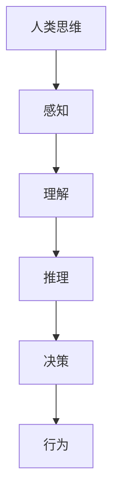
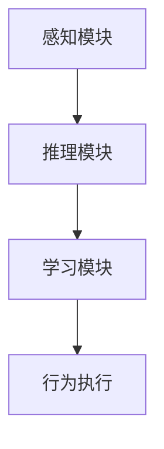
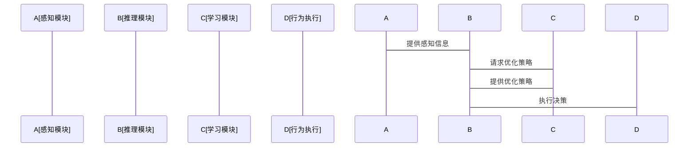

                 


# AI Agent的认知计算模型：模拟人类思维过程

**关键词**：AI Agent、认知计算模型、人类思维模拟、知识表示、行为规划、认知科学、人工智能

**摘要**：  
AI Agent的认知计算模型是人工智能领域的重要研究方向，旨在模拟人类思维过程，实现类似人类的感知、推理和决策能力。本文从认知科学的基本概念出发，详细讲解AI Agent的认知计算模型的核心原理、算法实现、系统架构以及实际应用案例。通过分析AI Agent如何模拟人类思维过程，探讨其在智能系统设计中的应用前景。

---

## 第一部分: AI Agent的认知计算模型基础

### 第1章: 认知科学与AI Agent概述

#### 1.1 认知科学的基本概念
认知科学是研究人类认知过程的多学科交叉领域，涵盖心理学、神经科学、语言学、哲学等多个领域。其核心目标是理解人类如何通过感知、记忆、推理和决策来与环境交互。

#### 1.2 AI Agent的定义与特点
AI Agent（智能体）是一种能够感知环境、自主决策并采取行动的实体。其核心特点包括：
- **自主性**：能够在没有外部干预的情况下独立运作。
- **反应性**：能够实时感知环境并做出反应。
- **目标导向**：具有明确的目标，并采取行动以实现这些目标。
- **学习能力**：能够通过经验改进自身的性能。

#### 1.3 认知计算模型的背景与意义
认知计算模型是一种基于认知科学原理设计的数学模型，旨在模拟人类的认知过程。其意义在于为AI Agent提供更接近人类思维方式的算法和架构，从而实现更自然的交互和更高效的决策。

---

### 第2章: AI Agent的认知计算模型核心概念

#### 2.1 认知计算模型的原理
认知计算模型的核心原理包括以下三个主要模块：
1. **感知与理解**：通过传感器或其他输入方式获取环境信息，并将其转化为可处理的形式。
2. **推理与决策**：基于感知信息，利用推理算法生成可能的决策方案，并选择最优方案。
3. **学习与适应**：通过机器学习算法，从经验中学习，不断优化自身的认知模型。

#### 2.2 认知计算模型的核心要素
认知计算模型的核心要素包括：
- **知识表示**：将知识以符号、语义网络或其他形式表示，以便AI Agent理解和推理。
- **行为规划**：根据目标生成行动计划，并指导行动的执行。
- **交互与反馈**：与环境或其他实体交互，并根据反馈调整自身的认知模型。

#### 2.3 概念属性特征对比表格
以下是认知计算模型核心概念的属性特征对比表：

| 概念      | 属性          | 特征描述                                   |
|-----------|---------------|------------------------------------------|
| 知识表示   | 表示方式       | 符号逻辑、语义网络                       |
| 推理       | 方法           | 基于规则推理、概率推理                 |
| 学习       | 算法           | 监督学习、无监督学习、强化学习         |

#### 2.4 ER实体关系图
以下是认知计算模型的ER实体关系图：



---

## 第二部分: AI Agent的认知计算模型算法原理

### 第3章: AI Agent的认知计算模型算法实现

#### 3.1 感知算法
感知算法用于将环境信息转化为可处理的形式。常见的感知算法包括：
- **特征提取**：通过提取关键特征，将复杂的信息简化为易于处理的形式。
- **模式识别**：利用机器学习算法识别特定模式。

#### 3.2 推理算法
推理算法用于基于感知信息生成可能的决策方案。常见的推理算法包括：
- **基于规则的推理**：根据预定义的规则进行推理。
- **概率推理**：基于概率论进行推理，考虑各种可能性及其概率。

#### 3.3 学习算法
学习算法用于优化认知模型的性能。常见的学习算法包括：
- **监督学习**：通过标记数据进行训练，优化模型的预测能力。
- **无监督学习**：通过发现数据中的结构，自动学习知识。
- **强化学习**：通过与环境的交互，学习最优策略。

#### 3.4 算法实现示例
以下是一个简单的基于监督学习的分类算法实现示例：

```python
# 简单的线性回归算法实现
import numpy as np

def linear_regression(X, y, learning_rate=0.01, iterations=1000):
    # 参数初始化
    theta = np.zeros(X.shape[1])
    # 梯度下降优化
    for _ in range(iterations):
        hypothesis = np.dot(X, theta)
        loss = hypothesis - y
        gradient = (1/m)*np.dot(X.T, loss)
        theta = theta - learning_rate * gradient
    return theta

# 示例数据
X = np.array([[1, 2], [3, 4], [5, 6]])
y = np.array([7, 8, 9])

# 模型训练
theta = linear_regression(X, y)

# 预测
new_X = np.array([[2, 3]])
prediction = np.dot(new_X, theta)
print(prediction)
```

---

## 第三部分: AI Agent的认知计算模型系统架构设计

### 第4章: 系统分析与架构设计方案

#### 4.1 系统功能设计
认知计算模型的系统功能包括：
- **感知模块**：获取环境信息并进行特征提取。
- **推理模块**：基于感知信息生成决策方案。
- **学习模块**：优化模型的性能。

#### 4.2 系统架构设计
以下是认知计算模型的系统架构图：



#### 4.3 系统接口设计
系统接口设计包括：
- **输入接口**：接收环境信息。
- **输出接口**：输出决策结果。
- **交互接口**：与环境或其他实体交互。

#### 4.4 系统交互序列图
以下是系统交互的序列图：



---

## 第四部分: AI Agent的认知计算模型项目实战

### 第5章: 项目实战

#### 5.1 环境安装
安装必要的库和工具：
```bash
pip install numpy scikit-learn matplotlib
```

#### 5.2 系统核心实现
以下是认知计算模型的核心实现代码：

```python
import numpy as np
from sklearn import linear_model

# 数据准备
X = np.array([[1, 2], [3, 4], [5, 6]])
y = np.array([7, 8, 9])

# 模型训练
model = linear_model.LinearRegression()
model.fit(X, y)

# 预测
new_X = np.array([[2, 3]])
prediction = model.predict(new_X)
print(prediction)
```

#### 5.3 代码应用解读与分析
上述代码实现了基于监督学习的线性回归算法，用于预测新数据的输出。通过训练数据，模型学习了输入与输出之间的关系，并能够对新的输入数据进行预测。

#### 5.4 实际案例分析
以股票价格预测为例，利用认知计算模型进行分析和预测。通过历史数据训练模型，预测未来的股票价格走势。

#### 5.5 项目小结
本项目展示了认知计算模型的基本实现方法，验证了其在实际问题中的应用效果。

---

## 第五部分: 最佳实践、小结、注意事项、拓展阅读

### 第6章: 最佳实践与总结

#### 6.1 最佳实践
- **数据质量**：确保数据的准确性和完整性。
- **算法选择**：根据具体问题选择合适的算法。
- **模型优化**：通过调参和优化算法提高模型性能。

#### 6.2 小结
认知计算模型是一种基于认知科学原理设计的AI Agent模型，能够模拟人类的思维过程，实现感知、推理和决策。通过本文的讲解，读者可以深入了解认知计算模型的核心原理、算法实现和系统架构。

#### 6.3 注意事项
- **数据隐私**：在处理敏感数据时，需要注意数据隐私和安全。
- **算法适用性**：选择合适的算法，避免滥用。

#### 6.4 拓展阅读
- 《人工智能：一种现代方法》
- 《认知科学与人工智能》
- 《机器学习实战》

---

**作者：AI天才研究院/AI Genius Institute & 禅与计算机程序设计艺术 /Zen And The Art of Computer Programming**

