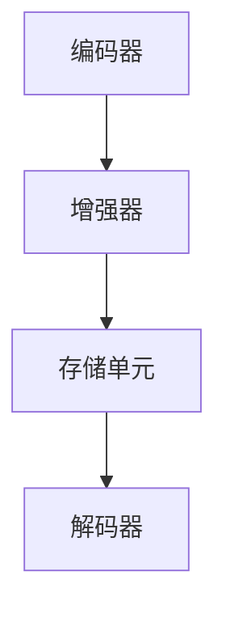
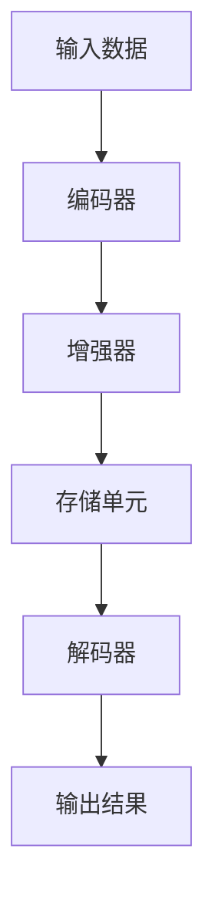
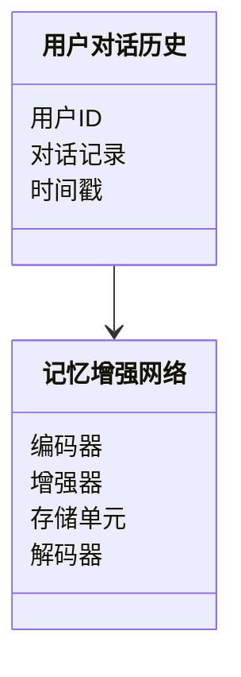
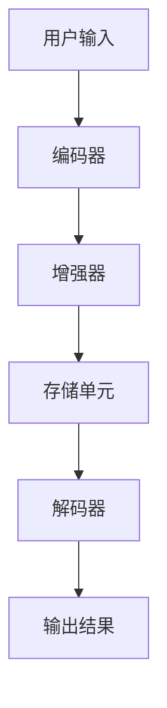
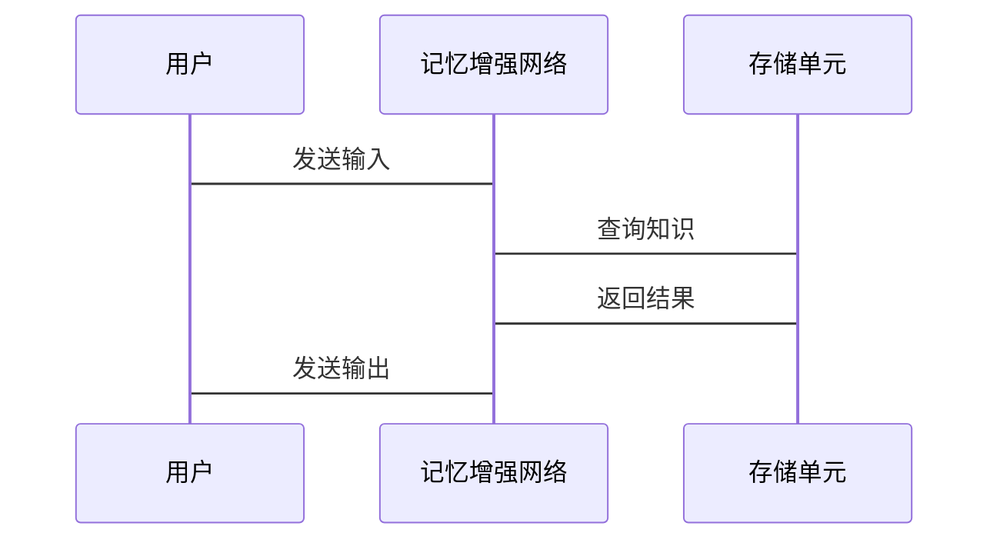

                 


# AI Agent的记忆增强网络：长期知识存储与检索

> 关键词：AI Agent，记忆增强网络，长期知识存储，知识检索，神经网络，机器学习

> 摘要：本文深入探讨了AI Agent中记忆增强网络的原理与应用，分析了其在长期知识存储与检索中的作用，结合具体案例，详细讲解了记忆增强网络的设计与实现，为读者提供了一套系统化的解决方案。

---

# 第1章 AI Agent与记忆增强网络概述

## 1.1 问题背景与问题描述

在AI Agent的发展过程中，如何实现长期有效的知识存储与快速检索，是一个亟待解决的难题。传统的神经网络模型在处理短期记忆任务上表现出色，但在需要长期记忆的任务中，如对话系统、推荐系统和自动驾驶等领域，表现却不够理想。

### 1.1.1 长期知识存储的挑战

AI Agent需要处理的任务往往具有复杂性和连续性，这要求模型能够存储大量的信息并长时间保持这些信息的有效性。然而，传统神经网络的短期记忆机制难以满足这一需求。

### 1.1.2 AI Agent的记忆需求与现有技术的局限性

现有的技术在处理动态变化和复杂任务时，往往会出现信息遗忘、检索效率低下等问题。这限制了AI Agent在实际应用中的性能和用户体验。

### 1.1.3 记忆增强网络的核心目标与应用场景

记忆增强网络的核心目标是通过增强记忆能力，提升AI Agent在复杂任务中的表现。其应用场景包括对话系统、推荐系统、自动驾驶等领域。

## 1.2 记忆增强网络的基本概念

### 1.2.1 记忆增强网络的定义

记忆增强网络是一种结合了传统神经网络和外部存储机制的模型，通过增强记忆能力，提升模型的长期知识存储和检索效率。

### 1.2.2 记忆增强网络的核心要素

记忆增强网络主要包括编码器、增强器、解码器和存储单元四个核心要素。

### 1.2.3 记忆增强网络与传统神经网络的对比

通过对比分析，记忆增强网络在长期记忆任务中的表现优于传统神经网络。

## 1.3 记忆增强网络的边界与外延

### 1.3.1 记忆增强网络的适用范围

记忆增强网络适用于需要长期记忆的任务，如对话系统、推荐系统等。

### 1.3.2 记忆增强网络与其他技术的关系

记忆增强网络可以与其他技术如注意力机制、图神经网络等结合，提升性能。

### 1.3.3 记忆增强网络的未来发展方向

未来，记忆增强网络可能会朝着更高效、更智能的方向发展。

---

# 第2章 记忆增强网络的核心概念与联系

## 2.1 记忆增强网络的原理

### 2.1.1 记忆增强网络的基本原理

通过编码器将输入数据转化为中间表示，再通过增强器将中间表示与存储单元中的知识进行增强，最后通过解码器生成输出。

### 2.1.2 记忆增强网络的数学模型

$$ f_{\text{编码}}(x) = \text{编码操作} $$
$$ f_{\text{增强}}(h) = \text{增强操作} $$
$$ f_{\text{解码}}(h) = \text{解码操作} $$

## 2.2 记忆增强网络的核心概念属性对比

| 概念 | 描述 |
|------|------|
| 编码器 | 将输入数据转化为中间表示 |
| 增强器 | 增强中间表示与存储单元的知识 |
| 解码器 | 根据增强后的表示生成输出 |

### 2.2.1 图表展示记忆增强网络的关键属性



---

# 第3章 记忆增强网络的算法原理

## 3.1 记忆增强网络的算法流程

### 3.1.1 算法步骤分解

1. 编码器将输入数据转化为中间表示。
2. 增强器将中间表示与存储单元中的知识进行增强。
3. 解码器根据增强后的表示生成输出。

### 3.1.2 算法流程图



## 3.2 记忆增强网络的数学模型

### 3.2.1 编码函数

$$ f_{\text{编码}}(x) = \text{编码操作} $$

### 3.2.2 增强函数

$$ f_{\text{增强}}(h) = \text{增强操作} $$

### 3.2.3 解码函数

$$ f_{\text{解码}}(h) = \text{解码操作} $$

---

# 第4章 系统分析与架构设计

## 4.1 系统分析

### 4.1.1 问题场景介绍

在对话系统中，AI Agent需要长期存储用户的对话历史，以便在后续对话中进行高效检索和调用。

### 4.1.2 项目介绍

设计并实现一个基于记忆增强网络的对话系统，提升对话的连贯性和准确性。

## 4.2 系统功能设计

### 4.2.1 领域模型



### 4.2.2 系统架构设计



### 4.2.3 系统接口设计

接口设计包括输入接口、存储接口和输出接口。

### 4.2.4 系统交互设计



---

# 第5章 项目实战

## 5.1 环境安装

### 5.1.1 Python环境安装

安装Python 3.8及以上版本。

### 5.1.2 依赖库安装

安装PyTorch、TensorFlow等深度学习库。

## 5.2 系统核心实现

### 5.2.1 编码器实现

```python
class Encoder:
    def encode(self, input):
        # 编码操作
        pass
```

### 5.2.2 增强器实现

```python
class Enhancer:
    def enhance(self, encoded_input, memory):
        # 增强操作
        pass
```

### 5.2.3 解码器实现

```python
class Decoder:
    def decode(self, enhanced_input):
        # 解码操作
        pass
```

### 5.2.4 存储单元实现

```python
class MemoryUnit:
    def store(self, key, value):
        # 存储操作
        pass

    def retrieve(self, key):
        # 检索操作
        pass
```

## 5.3 代码应用解读与分析

详细解读代码实现，分析每个部分的功能。

## 5.4 实际案例分析

通过具体案例，展示记忆增强网络的实际应用效果。

---

# 第6章 总结与展望

## 6.1 最佳实践 Tips

### 6.1.1 实践建议

在实际应用中，建议结合具体任务需求，合理设计记忆增强网络的参数和结构。

### 6.1.2 注意事项

注意数据存储的安全性和隐私保护。

## 6.2 本章小结

总结本文的核心内容，强调记忆增强网络的重要性和应用前景。

## 6.3 拓展阅读

推荐阅读相关领域的最新研究论文和书籍。

---

# 作者：AI天才研究院/AI Genius Institute & 禅与计算机程序设计艺术 /Zen And The Art of Computer Programming

---

通过本文的系统阐述，我们深入探讨了AI Agent记忆增强网络的原理与应用，为读者提供了一套完整的解决方案。希望本文能够为相关领域的研究和实践提供有价值的参考。

