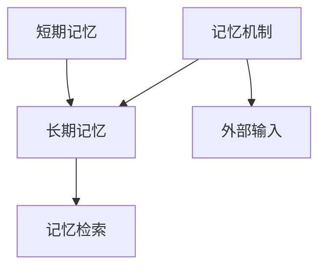
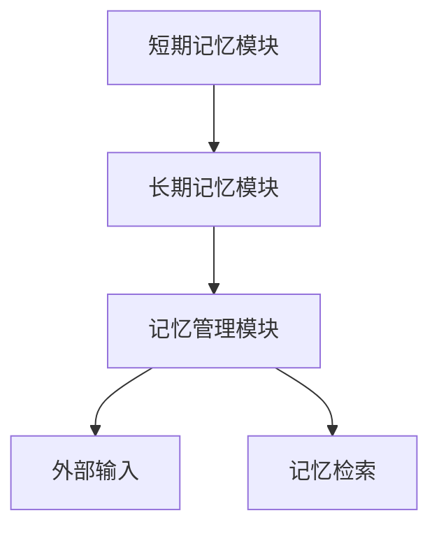
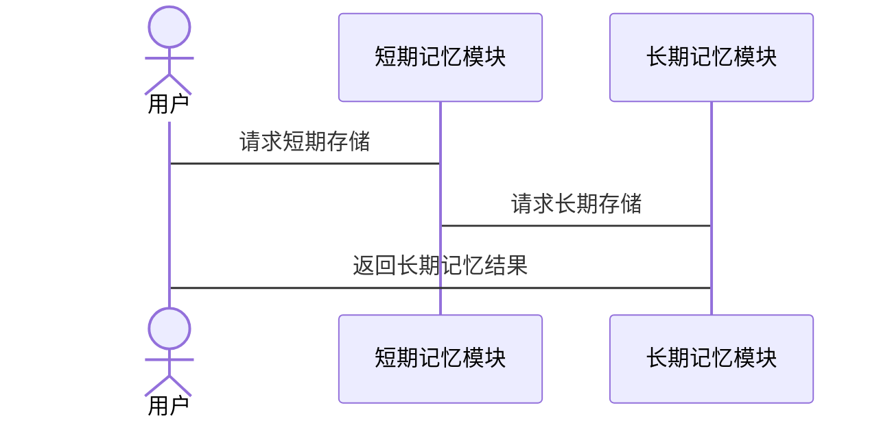

                 


# AI Agent的记忆机制：短期与长期记忆的实现

---

## 关键词：AI Agent，记忆机制，短期记忆，长期记忆，人工智能，记忆模型

---

## 摘要：  
AI Agent的记忆机制是实现智能体自主性和适应性的关键。本文详细探讨了短期记忆和长期记忆的实现方法，分析了它们在AI Agent中的作用及其相互关系。通过介绍核心概念、算法原理、系统架构和项目实战，本文为读者提供了从理论到实践的全面指导。通过Mermaid流程图、Python代码示例和数学公式的详细阐述，帮助读者深入理解记忆机制的实现细节。

---

## 第一部分: AI Agent的记忆机制概述

---

## 第1章: 背景介绍

### 1.1 问题背景
- **1.1.1 AI Agent的基本概念**  
  AI Agent是一种智能代理，能够感知环境、自主决策并执行任务。记忆机制是其实现智能的核心能力之一。

- **1.1.2 记忆机制的重要性**  
  记忆机制使AI Agent能够存储和检索信息，从而提高任务处理的效率和准确性。

- **1.1.3 当前记忆机制的挑战**  
  短期记忆容量有限，长期记忆检索复杂，如何平衡两者是当前研究的难点。

### 1.2 问题描述
- **1.2.1 短期记忆与长期记忆的定义**  
  短期记忆用于快速处理当前任务，长期记忆用于存储持久信息。

- **1.2.2 短期记忆与长期记忆的区别**  
  短期记忆容量小但处理速度快，长期记忆容量大但检索复杂。

- **1.2.3 记忆机制在AI Agent中的作用**  
  记忆机制帮助AI Agent实现任务分解、信息存储和知识复用。

### 1.3 解决方案
- **1.3.1 短期记忆的实现方法**  
  使用LSTM和注意力机制实现短期记忆。

- **1.3.2 长期记忆的实现方法**  
  基于知识图谱和检索模型实现长期记忆。

- **1.3.3 综合记忆机制的设计思路**  
  结合短期和长期记忆，优化信息存储和检索效率。

### 1.4 边界与外延
- **1.4.1 短期记忆的边界**  
  仅存储当前任务相关信息，容量有限。

- **1.4.2 长期记忆的边界**  
  存储持久信息，但检索需额外计算。

- **1.4.3 记忆机制与其他模块的关系**  
  记忆机制与感知、决策模块密切相关，需协同工作。

### 1.5 概念结构与核心要素
- **1.5.1 记忆机制的核心要素**  
  存储结构、检索算法、更新规则。

- **1.5.2 短期记忆与长期记忆的关系**  
  短期记忆支持快速决策，长期记忆支持知识复用。

- **1.5.3 记忆机制的实现流程**  
  信息感知→短期存储→长期存储→信息检索→决策执行。

---

## 第2章: 核心概念与联系

### 2.1 记忆机制的原理
- **2.1.1 短期记忆的存储方式**  
  使用LSTM网络进行序列建模，支持快速读写。

- **2.1.2 长期记忆的存储方式**  
  基于知识图谱，存储实体及其关系。

- **2.1.3 短期记忆与长期记忆的转换机制**  
  短期记忆中的重要信息逐步迁移到长期记忆中。

### 2.2 短期记忆与长期记忆的对比分析
| 特性       | 短期记忆                 | 长期记忆                 |
|------------|--------------------------|--------------------------|
| 存储时间   | 短暂，几分钟至几小时      | 长期，几天至数年          |
| 容量       | 较小，几百KB              | 较大，GB级别              |
| 存储方式   | 数组、队列               | 数据库、知识图谱          |
| 检索速度   | 快速                     | 较慢，需要查询算法       |
| 适用场景   | 快速决策、任务处理       | 知识复用、复杂推理       |

### 2.3 实体关系图


---

## 第3章: 短期记忆机制的实现

### 3.1 短期记忆的算法原理
- **3.1.1 基于LSTM的短期记忆**  
  LSTM网络通过门控机制控制信息的存储和遗忘，适用于时间序列数据的处理。

- **3.1.2 基于注意力机制的短期记忆**  
  注意力机制通过关注关键信息，提升短期记忆的精度。

- **3.1.3 短期记忆的实现流程**  
  输入数据→LSTM网络处理→输出结果。

### 3.2 短期记忆的数学模型
- LSTM的遗忘门：
  $$ f_t = \sigma(W_f \cdot [h_{t-1}, x_t] + b_f) $$
- LSTM的输入门：
  $$ i_t = \sigma(W_i \cdot [h_{t-1}, x_t] + b_i) $$
- LSTM的候选细胞：
  $$ \tilde{c}_t = \tanh(W_c \cdot [h_{t-1}, x_t] + b_c) $$
- LSTM的输出门：
  $$ o_t = \sigma(W_o \cdot [h_{t-1}, x_t] + b_o) $$
- 最终细胞状态：
  $$ c_t = f_t \cdot c_{t-1} + i_t \cdot \tilde{c}_t $$
- 最终隐藏状态：
  $$ h_t = o_t \cdot \tanh(c_t) $$

### 3.3 短期记忆的代码实现
```python
import tensorflow as tf
from tensorflow.keras import layers

# 定义LSTM层
lstm_layer = layers.LSTM(64, return_sequences=True)
# 输入序列数据
input_seq = tf.keras.Input(shape=(None, 100))
# LSTM处理
output_seq = lstm_layer(input_seq)
# 输出结果
model = tf.keras.Model(inputs=input_seq, outputs=output_seq)
```

---

## 第4章: 长期记忆机制的实现

### 4.1 长期记忆的算法原理
- **4.1.1 基于知识图谱的长期记忆**  
  使用图嵌入技术，将实体及其关系表示为向量。

- **4.1.2 基于检索模型的长期记忆**  
  使用向量检索技术，根据相似度检索相关知识。

- **4.1.3 长期记忆的实现流程**  
  输入查询→知识图谱检索→返回结果。

### 4.2 长期记忆的数学模型
- 知识图谱嵌入：
  $$ e_i = \text{lookup}(i) $$
- 向量检索：
  $$ \text{score}(i, j) = \frac{e_i \cdot e_j}{\|e_i\| \|e_j\|} $$
- 结果排序：
  $$ \text{rank}(i) = \text{argsort}(\text{score}(i, j)) $$

### 4.3 长期记忆的代码实现
```python
from faiss import IndexFlatL2

# 初始化检索索引
index = IndexFlatL2(d=100)
# 添加向量到索引
index.add(vectors)
# 检索相似向量
D, I = index.search(query_vector, k=5)
```

---

## 第5章: 系统分析与架构设计

### 5.1 问题场景介绍
- **5.1.1 应用场景**  
  智能对话系统、推荐系统、自动驾驶。

### 5.2 系统功能设计
- **5.2.1 功能模块**  
  短期记忆模块、长期记忆模块、记忆管理模块。

### 5.3 系统架构设计


### 5.4 系统接口设计
- **输入接口**  
  `PUT /short_memory/{key}/{value}`，`PUT /long_memory/{key}/{value}`。

- **输出接口**  
  `GET /short_memory/{key}`，`GET /long_memory/{key}`。

### 5.5 系统交互流程


---

## 第6章: 项目实战

### 6.1 环境安装
- **依赖库安装**  
  `pip install tensorflow faiss-cpu networkx`.

### 6.2 系统核心实现
- **短期记忆实现**  
  使用LSTM网络处理时间序列数据。

- **长期记忆实现**  
  使用知识图谱和向量检索技术存储和检索信息。

### 6.3 案例分析
- **对话系统案例**  
  用户输入问题，系统通过短期记忆处理当前对话，长期记忆提供上下文。

### 6.4 项目小结
- 项目实现了短期和长期记忆机制，验证了理论的可行性。

---

## 第7章: 最佳实践

### 7.1 总结
- 短期记忆适合快速处理，长期记忆适合持久存储。

### 7.2 注意事项
- 短期记忆容量有限，需定期清理。
- 长期记忆检索复杂，需优化索引结构。

### 7.3 拓展阅读
- 《深度学习》——Ian Goodfellow
- 《知识图谱》——Wang et al.

---

## 作者：AI天才研究院/AI Genius Institute & 禅与计算机程序设计艺术 /Zen And The Art of Computer Programming

