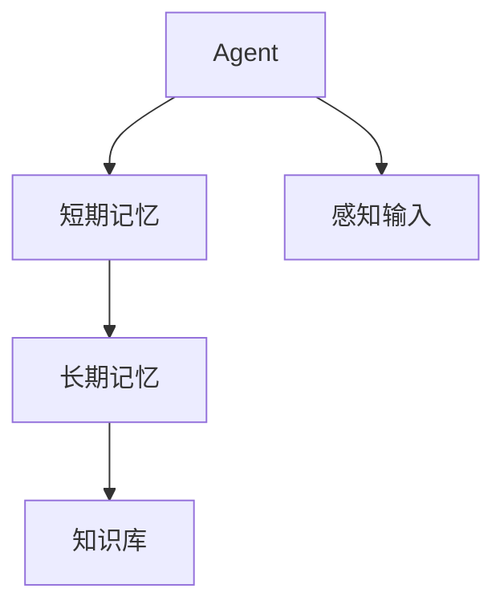

                 


# AI Agent的记忆机制：短期与长期记忆管理

> 关键词：AI Agent、短期记忆、长期记忆、记忆机制、记忆管理、记忆模型

> 摘要：本文深入探讨了AI Agent的记忆机制，重点分析了短期记忆与长期记忆的管理方法。通过结合理论与实践，详细介绍了记忆机制的核心概念、算法原理、系统架构设计以及实际应用案例。文章还提供了丰富的数学模型和公式，帮助读者更好地理解AI Agent的记忆机制，并为实际项目提供了参考。

---

## 第一部分: AI Agent记忆机制概述

### 第1章: AI Agent记忆机制的背景与核心概念

#### 1.1 什么是AI Agent
AI Agent（人工智能代理）是指能够感知环境、自主决策并执行任务的智能实体。AI Agent广泛应用于自动驾驶、智能助手、推荐系统等领域。AI Agent的核心能力在于其智能性，而智能性的重要组成部分就是记忆能力。

#### 1.2 记忆机制的重要性
记忆机制是AI Agent的核心功能之一，它使AI Agent能够：
1. 存储和检索信息，支持持续的学习和推理。
2. 处理动态环境中的信息变化。
3. 支持复杂的决策过程。

#### 1.3 短期记忆与长期记忆的定义与区别
- **短期记忆**：短期记忆主要用于存储当前任务相关的临时信息，具有容量有限、存储时间短、易遗忘等特点。例如，智能助手在处理用户当前对话的信息时使用的记忆。
- **长期记忆**：长期记忆用于存储重要且持久的信息，支持长期的知识积累和推理。例如，AI Agent的知识库中存储的知识点。

### 第2章: AI Agent记忆机制的核心概念与联系

#### 2.1 记忆机制的核心原理
- **信息编码**：将输入的信息转化为适合存储的形式。
- **信息存储**：将编码后的信息存储在相应的记忆结构中。
- **信息检索**：根据需求从记忆结构中检索相关信息。

#### 2.2 短期记忆与长期记忆的联系
- 短期记忆是长期记忆的临时存储空间。
- 长期记忆是短期记忆的补充和扩展。
- 两者通过信息的转移和整合，共同支持AI Agent的智能行为。

---

## 第二部分: AI Agent记忆机制的算法原理

### 第3章: 短期记忆的算法实现

#### 3.1 短期记忆的存储与更新
- **存储机制**：基于神经网络的短期记忆模型，如LSTM（长短期记忆网络）。
- **更新机制**：通过遗忘门和输入门控制信息的更新。

#### 3.2 短期记忆的遗忘机制
- **遗忘门公式**：
$$ f_t = \sigma(W_f x_t + U_f h_{t-1} + b_f) $$
- **更新公式**：
$$ h_t = f_t \cdot h_{t-1} + (1 - f_t) \cdot h_t $$

### 第4章: 长期记忆的算法实现

#### 4.1 长期记忆的存储与检索
- **存储机制**：基于图结构的知识图谱，存储实体及其关系。
- **检索机制**：通过图遍历算法（如BFS、DFS）检索相关实体。

#### 4.2 长期记忆的检索公式
$$ L = \{ (x_i, y_i) | i = 1,2,...,n \} $$

---

## 第三部分: AI Agent记忆机制的数学模型与公式

### 第5章: 短期记忆的数学模型

#### 5.1 短期记忆的更新公式
$$ s_{t+1} = \sigma(s_t \cdot w + b) $$

#### 5.2 短期记忆的遗忘机制
$$ f_{t} = 1 - \prod_{i=1}^{n} (1 - f_{t-1}) $$

### 第6章: 长期记忆的数学模型

#### 6.1 长期记忆的存储结构
$$ L = \{ (x_i, y_i) | i = 1,2,...,n \} $$

#### 6.2 长期记忆的检索公式
$$ R = \text{检索}(L, k) $$

---

## 第四部分: AI Agent记忆机制的系统架构设计

### 第7章: 系统架构设计

#### 7.1 系统功能设计
- **短期记忆模块**：处理当前任务相关的临时信息。
- **长期记忆模块**：存储和检索长期知识。
- **信息交互模块**：连接短期记忆和长期记忆。

#### 7.2 系统架构图


---

## 第五部分: AI Agent记忆机制的项目实战

### 第8章: 项目实战

#### 8.1 项目背景
- 开发一个智能助手，实现短期记忆和长期记忆的结合。

#### 8.2 核心代码实现
```python
# 短期记忆实现
class ShortTermMemory:
    def __init__(self):
        self.memory = {}

    def update(self, key, value):
        self.memory[key] = value

    def retrieve(self, key):
        return self.memory.get(key, None)

# 长期记忆实现
class LongTermMemory:
    def __init__(self):
        self.knowledge_base = {}

    def store(self, key, value):
        self.knowledge_base[key] = value

    def recall(self, key):
        return self.knowledge_base.get(key, None)
```

#### 8.3 项目总结
- 通过结合短期记忆和长期记忆，智能助手能够更好地理解和响应用户需求。

---

## 第六部分: 总结与展望

### 第9章: 总结

- 本文系统地探讨了AI Agent的记忆机制，重点分析了短期记忆和长期记忆的管理方法。
- 通过理论与实践相结合，展示了记忆机制在AI Agent中的重要性。

### 第10章: 未来展望

- **混合记忆模型**：进一步优化短期记忆与长期记忆的结合方式。
- **动态记忆管理**：研究动态环境下的记忆机制。
- **跨模态记忆**：探索多模态信息的记忆与检索方法。

---

## 作者：AI天才研究院 & 禅与计算机程序设计艺术

本文由AI天才研究院和“禅与计算机程序设计艺术”联合撰写，旨在为AI Agent的研究者和开发者提供深度的技术指导和实践参考。

