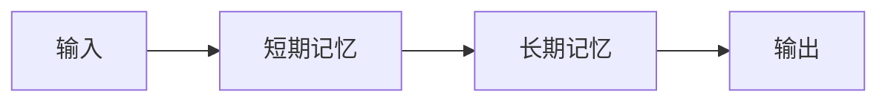
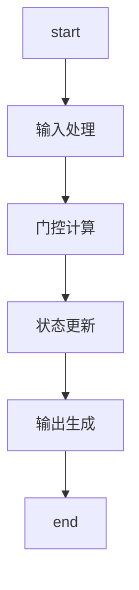
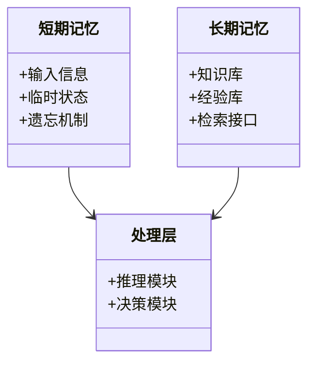
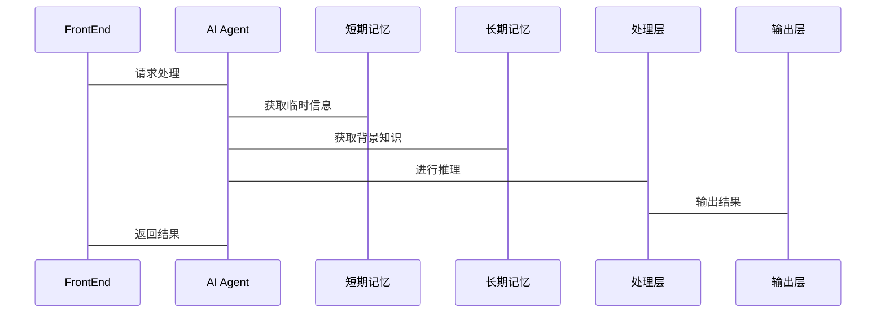

                 


# AI Agent的记忆机制：短期记忆与长期记忆的实现

---

## 关键词：
AI Agent, 短期记忆, 长期记忆, 记忆机制, 神经网络, 机器学习

---

## 摘要：
AI Agent的记忆机制是实现智能体核心功能的重要组成部分，其中短期记忆与长期记忆的实现尤为关键。短期记忆负责处理当前任务相关的临时信息，而长期记忆则负责存储和检索长期知识和经验。本文将从记忆机制的核心概念、实现原理、算法模型、系统架构以及实际应用等方面，详细探讨AI Agent中短期记忆与长期记忆的实现方法。通过理论分析与实践结合，本文旨在为读者提供一个全面的理解框架，帮助其掌握AI Agent记忆机制的设计与优化技巧。

---

## 第一部分：AI Agent记忆机制的背景介绍

### 第1章：记忆机制的基本概念

#### 1.1 什么是记忆机制
- **定义**：记忆机制是指AI Agent在与环境交互过程中，对信息进行存储、检索和更新的能力。
- **核心要素**：
  - **信息存储**：将感知到的信息转化为可存储的形式。
  - **信息检索**：根据当前任务需求，快速检索相关记忆内容。
  - **信息更新**：根据新信息，动态更新存储的内容。

#### 1.2 短期记忆与长期记忆的区别

| 特性               | 短期记忆                     | 长期记忆                     |
|--------------------|------------------------------|------------------------------|
| 存储时间           | 短暂（几分钟到几小时）        | 长期（几天到几年）            |
| 容量               | 有限                        | 较大                        |
| 内容               | 当前任务相关的信息           | 知识库、经验等                |
| 更新方式           | 易忘性，信息自动衰减         | 稳定性高，信息持久            |

#### 1.3 AI Agent记忆机制的实现方式

- **神经网络模型**：如LSTM（长短期记忆网络）和Transformer模型。
- **基于图结构**：将记忆表示为图中的节点和边，便于知识推理。
- **基于符号逻辑**：通过规则和符号表示知识。

#### 1.4 AI Agent的整体结构

- **输入层**：感知环境信息。
- **记忆层**：存储短期和长期记忆。
- **处理层**：根据记忆内容进行推理和决策。
- **输出层**：执行动作或输出结果。

#### 1.5 本章小结
- 记忆机制是AI Agent实现智能交互的基础。
- 短期记忆与长期记忆在功能和实现上各有特点。
- 神经网络模型是实现记忆机制的重要工具。

---

## 第二部分：AI Agent记忆机制的核心概念与联系

### 第2章：短期记忆的实现原理

#### 2.1 短期记忆的基本原理

- **神经网络模型**：如LSTM和GRU（门控循环单元）。
- **存储机制**：通过门控机制控制信息的存储与遗忘。
- **遗忘机制**：自动遗忘过时或不再需要的信息。

#### 2.2 短期记忆的神经网络实现

**代码示例（LSTM）**：
```python
import tensorflow as tf

# 定义LSTM单元
 lstm_cell = tf.keras.layers.LSTMCell(64)

# 初始化隐藏层状态
 initial_state = [tf.zeros((1, 64)), tf.zeros((1, 64))]
```

**数学模型**：
$$
f_t = \sigma(W_f \cdot x_t + U_f \cdot h_{t-1} + b_f)
$$
$$
i_t = \sigma(W_i \cdot x_t + U_i \cdot h_{t-1} + b_i)
$$
$$
c_t = f_t \cdot c_{t-1} + i_t \cdot tanh(W_c \cdot x_t + U_c \cdot h_{t-1} + b_c)
$$
$$
h_t = o_t \cdot tanh(c_t)
$$
其中，$f_t$为遗忘门，$i_t$为输入门，$c_t$为细胞状态，$o_t$为输出门。

#### 2.3 短期记忆与长期记忆的联系

- 短期记忆为长期记忆提供临时信息。
- 长期记忆为短期记忆提供上下文支持。

**Mermaid图示**：


---

## 第三部分：AI Agent记忆机制的算法原理

### 第3章：短期记忆的算法实现

#### 3.1 LSTM模型的流程图



**代码示例**：
```python
import tensorflow as tf
from tensorflow.keras import layers

# 定义LSTM模型
model = tf.keras.Sequential([
    layers.LSTM(64, return_sequences=True),
    layers.Dense(10)
])
```

#### 3.2 Transformer模型的应用

- **注意力机制**：
$$
\text{Attention}(Q, K, V) = \text{softmax}\left(\frac{QK^T}{\sqrt{d_k}}\right)V
$$

**代码示例**：
```python
import tensorflow as tf

def transformer_attention(Q, K, V):
    dk = tf.cast(K.shape[-1], tf.float32)
    scaled = tf.matmul(Q, K, transpose_b=True) / tf.sqrt(dk)
    attention_weights = tf.nn.softmax(scaled, axis=-1)
    return tf.matmul(attention_weights, V)
```

---

## 第四部分：AI Agent记忆机制的系统分析与架构设计

### 第4章：系统功能设计

#### 4.1 领域模型



#### 4.2 系统架构设计


#### 4.3 接口设计

- **输入接口**：接收感知数据。
- **输出接口**：输出决策结果。
- **检索接口**：与长期记忆交互。

#### 4.4 交互流程图



---

## 第五部分：AI Agent记忆机制的项目实战

### 第5章：环境安装与代码实现

#### 5.1 环境安装

```bash
pip install tensorflow numpy matplotlib
```

#### 5.2 核心代码实现

```python
import tensorflow as tf
from tensorflow.keras import layers

# 短期记忆实现（LSTM）
class ShortTermMemory(tf.keras.Model):
    def __init__(self, units=64):
        super(ShortTermMemory, self).__init__()
        self.lstm = layers.LSTM(units, return_sequences=True)
    
    def call(self, inputs):
        return self.lstm(inputs)

# 长期记忆实现（Transformer）
class LongTermMemory(tf.keras.Model):
    def __init__(self, embedding_dim=64):
        super(LongTermMemory, self).__init__()
        self.embedding = layers.Dense(embedding_dim)
        self.attention = transformer_attention
    
    def call(self, inputs, keys, values):
        keys = self.embedding(keys)
        values = self.embedding(values)
        attention_weights = self.attention(keys, keys, values)
        return attention_weights * values
```

#### 5.3 案例分析与解读

**案例：智能对话系统**

- **输入**：用户输入“今天天气怎么样？”
- **短期记忆**：存储当前对话的上下文。
- **长期记忆**：检索天气相关知识。
- **输出**：生成回答“今天天气晴朗，气温适宜。”

#### 5.4 项目总结

- 代码实现展示了短期记忆和长期记忆的基本应用。
- 实际项目中需要考虑更多复杂场景和优化策略。

---

## 第六部分：AI Agent记忆机制的最佳实践

### 第6章：总结与注意事项

#### 6.1 总结

- AI Agent的记忆机制是实现智能交互的核心。
- 短期记忆与长期记忆各有特点，需合理结合使用。
- 神经网络模型是实现记忆机制的重要工具。

#### 6.2 注意事项

- **数据质量**：长期记忆的数据需准确可靠。
- **模型优化**：定期更新模型以适应新场景。
- **隐私保护**：注意数据存储的安全性。

#### 6.3 拓展阅读

- 《神经网络与深度学习》
- 《Transformer模型详解》
- 《AI Agent的设计与实现》

---

## 作者：AI天才研究院/AI Genius Institute & 禅与计算机程序设计艺术 /Zen And The Art of Computer Programming

---

通过以上内容，我们系统地探讨了AI Agent记忆机制的实现，从理论到实践，从短期记忆到长期记忆，为读者提供了全面的指导和深入的分析。希望本文能为AI Agent的研究与应用提供有价值的参考。

