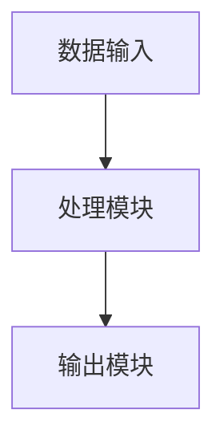

                 


# AI Agent的语义分割与场景理解

> 关键词：AI Agent，语义分割，场景理解，深度学习，图像分割，多模态融合

> 摘要：本文深入探讨了AI Agent在语义分割与场景理解中的应用，分析了相关的核心技术与算法原理，结合实际案例展示了系统的开发与优化，展望了未来的研究方向。

---

## 第1章：AI Agent与语义分割概述

### 1.1 AI Agent的基本概念

AI Agent（人工智能代理）是指能够感知环境、执行任务并做出决策的智能体。它具备以下核心特征：
1. **自主性**：能够在没有外部干预的情况下自主运作。
2. **反应性**：能够根据环境变化调整行为。
3. **目标导向**：具备明确的目标，驱动其行动。

AI Agent的应用场景广泛，包括自动驾驶、智能助手、机器人控制等。

### 1.2 语义分割的背景与意义

语义分割是将图像中的每个像素分配一个类别标签的过程，旨在理解图像内容的细节。它在AI Agent中的作用至关重要，能够帮助AI Agent更好地理解场景信息，从而做出更智能的决策。

### 1.3 AI Agent与场景理解

AI Agent通过语义分割技术，能够理解复杂的场景信息。场景理解不仅涉及图像数据，还包括多模态数据的融合，如文本、语音和深度信息。这种多模态融合能够提升场景理解的准确性和鲁棒性。

---

## 第2章：语义分割的核心概念与技术

### 2.1 语义分割的基本原理

语义分割分为以下步骤：
1. **输入图像**：获取待处理的图像数据。
2. **特征提取**：通过卷积操作提取图像的深层特征。
3. **上采样**：将深层特征上采样至与原图相同的尺寸。
4. **分类**：对每个像素进行分类，生成分割结果。

### 2.2 基于深度学习的语义分割

常用的分割算法包括：
- **FCN（全卷积网络）**：通过去除全连接层，利用卷积操作进行分割。
- **U-Net**：经典的医学图像分割模型，采用跳跃连接结构，提升边界检测能力。

### 2.3 多模态数据的融合

多模态数据的融合能够提升场景理解的准确性。例如，结合深度信息和语义信息，能够更好地理解三维空间中的物体分布。

---

## 第3章：AI Agent的语义分割算法原理

### 3.1 基于卷积神经网络的分割算法

#### 卷积操作的数学模型
卷积操作可以表示为：
$$
(I * K)(i, j) = \sum_{k,l} I(i+k, j+l) \times K(k, l)
$$
其中，\( I \) 是输入图像，\( K \) 是卷积核。

#### 池化操作的作用
池化操作用于降低计算复杂度，提取图像的高层次特征。常用的池化方式包括最大池化和平均池化。

### 3.2 基于Transformer的分割算法

#### Transformer的基本原理
Transformer由编码器和解码器组成，通过自注意力机制捕捉全局特征。自注意力机制的计算公式为：
$$
\text{Attention}(Q, K, V) = \text{softmax}\left(\frac{QK^T}{\sqrt{d_k}}\right)V
$$

#### Vision Transformer的结构
Vision Transformer将图像划分为 patches，并通过多层Transformer进行特征提取。

---

## 第4章：场景理解的系统架构与设计

### 4.1 系统功能模块划分

系统功能模块包括：
1. **数据输入模块**：接收输入的图像数据。
2. **处理模块**：执行语义分割和场景理解。
3. **输出模块**：生成分割结果并输出。

### 4.2 系统架构设计

系统架构采用模块化设计，各模块之间通过接口进行通信。以下是系统的Mermaid架构图：



---

## 第5章：项目实战：AI Agent语义分割系统开发

### 5.1 环境搭建

安装必要的库：
```bash
pip install tensorflow keras opencv-python
```

### 5.2 系统实现代码

以下是一个简单的语义分割代码示例：

```python
import tensorflow as tf
from tensorflow import keras

# 加载预训练模型
model = keras.models.load_model('segmentation_model.h5')

# 图像预处理
def preprocess_image(image):
    # 调整图像大小
    image = tf.image.resize(image, (256, 256))
    # 归一化处理
    image = image / 255.0
    return image

# 执行分割
def perform_segmentation(image):
    processed_image = preprocess_image(image)
    prediction = model.predict(tf.expand_dims(processed_image, axis=0))
    return prediction[0]

# 示例图像
import cv2
image = cv2.imread('input.jpg')
segmented_image = perform_segmentation(image)
cv2.imwrite('output.jpg', segmented_image)
```

### 5.3 实际案例分析

以自动驾驶场景为例，AI Agent通过语义分割识别道路上的障碍物、车道线等信息，从而做出智能驾驶决策。

---

## 第6章：扩展与展望

### 6.1 研究热点

当前研究热点包括：
1. **小样本学习**：在数据量有限的情况下提升分割精度。
2. **实时分割**：优化算法以实现实时处理。

### 6.2 工具与资源推荐

推荐使用以下工具和框架：
- **TensorFlow**：深度学习框架。
- **PyTorch**：深度学习框架。
- **OpenCV**：图像处理库。

---

## 作者

作者：AI天才研究院 & 禅与计算机程序设计艺术

