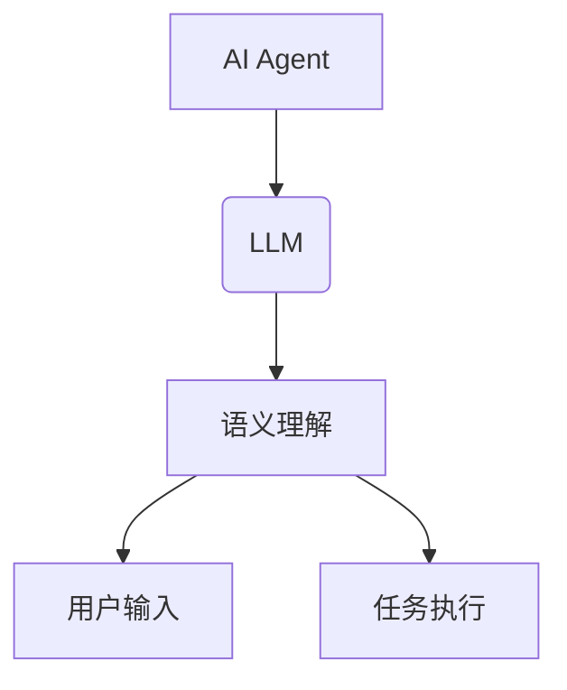
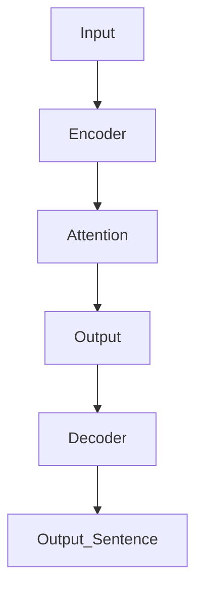
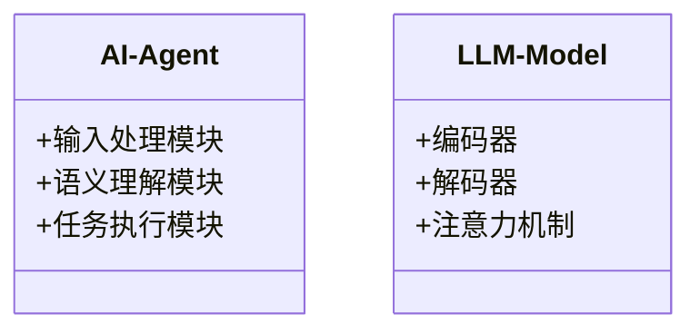
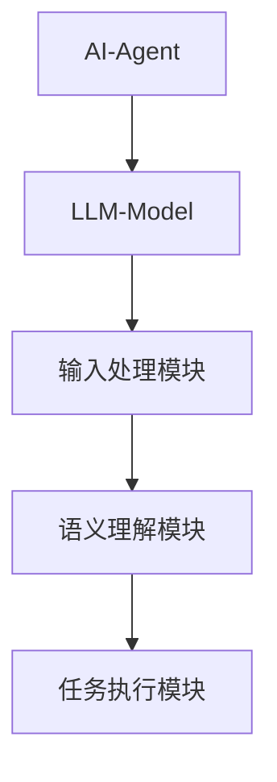
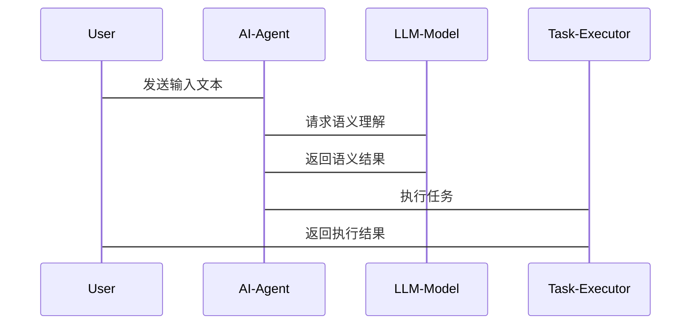

                 


# AI Agent的语义理解：提升LLM的深层文本分析

**关键词**：AI Agent，语义理解，大语言模型，LLM，深度文本分析，自然语言处理，语义表示

**摘要**：  
本文探讨了AI Agent在语义理解中的作用，重点分析了如何通过提升大语言模型（LLM）的深层文本分析能力，来增强AI Agent的语义理解能力。文章从背景介绍、核心概念、算法原理、数学模型、系统架构、项目实战等多个维度，全面解析了语义理解的关键技术与实现路径，为读者提供了一套系统化的解决方案。

---

# 第1章: AI Agent与语义理解概述

## 1.1 AI Agent的基本概念

### 1.1.1 AI Agent的定义与特点
AI Agent（人工智能代理）是指能够感知环境并采取行动以实现目标的智能实体。其特点包括自主性、反应性、目标导向性和社交能力。AI Agent能够通过与用户的交互，理解用户意图并提供相应的服务。

### 1.1.2 AI Agent的核心功能与应用场景
AI Agent的核心功能包括信息获取、决策推理、自然语言处理和执行行动。应用场景广泛，如智能助手、智能客服、智能推荐系统等。

### 1.1.3 语义理解在AI Agent中的重要性
语义理解是AI Agent实现智能化交互的关键技术。它使得AI Agent能够准确理解用户的意图，并生成符合用户需求的响应。

## 1.2 LLM的背景与发展

### 1.2.1 大语言模型（LLM）的定义与特点
大语言模型（LLM）是指经过大规模数据训练的深度学习模型，具有强大的文本生成和理解能力。其特点包括参数规模大、训练数据丰富、上下文理解能力强。

### 1.2.2 LLM在自然语言处理中的应用
LLM广泛应用于文本生成、机器翻译、问答系统、情感分析等领域，极大地推动了自然语言处理技术的发展。

### 1.2.3 LLM与AI Agent的结合
将LLM集成到AI Agent中，能够显著提升其语义理解能力，使其能够更准确地理解用户意图并提供高质量的服务。

## 1.3 语义理解的核心问题

### 1.3.1 语义理解的定义与目标
语义理解是指从文本中提取语义信息，理解文本的深层含义。其目标是使计算机能够像人类一样理解文本内容。

### 1.3.2 语义理解的关键挑战
语义理解面临的主要挑战包括歧义性、上下文依赖性和知识表示等问题。

### 1.3.3 提升语义理解能力的必要性
提升语义理解能力能够增强AI Agent的智能化水平，使其能够更好地服务于用户。

---

# 第2章: 语义理解的核心概念与联系

## 2.1 语义理解的关键原理

### 2.1.1 文本分析的层次与深度
文本分析可以从词法、句法、语义和语用四个层次进行。语义理解主要关注语义和语用层次，旨在理解文本的深层含义。

### 2.1.2 语义表示的多种方法
常用的语义表示方法包括词向量（Word Vector）、句子向量（Sentence Vector）和知识图谱（Knowledge Graph）等。

### 2.1.3 语义理解的上下文依赖性
语义理解依赖于上下文信息，不同的上下文可能导致相同的文本具有不同的语义含义。

## 2.2 AI Agent与LLM的关系

### 2.2.1 AI Agent作为语义理解的主体
AI Agent通过调用LLM模型，实现对用户输入的语义理解。

### 2.2.2 LLM作为语义理解的工具
LLM模型通过预训练和微调，能够生成与输入文本语义相关的输出。

### 2.2.3 两者结合的协同机制
AI Agent与LLM的结合实现了人机交互的智能化，AI Agent通过LLM模型实现语义理解，LLM模型通过AI Agent实现任务执行。

---

## 2.3 核心概念对比表格

| 概念         | 描述                                   |
|--------------|--------------------------------------|
| AI Agent     | 能够感知环境并采取行动的智能实体       |
| LLM          | 大规模预训练的深度学习模型             |
| 语义理解     | 从文本中提取语义信息，理解深层含义     |
| 语义表示     | 表示语义信息的方法，如词向量、知识图谱   |
| 上下文依赖   | 语义理解依赖于上下文信息               |

---

## 2.4 ER实体关系图（使用Mermaid）



---

## 2.5 本章小结

本章介绍了AI Agent和LLM的基本概念，分析了语义理解的关键原理，并通过对比表格和实体关系图，展示了各核心概念之间的联系。

---

# 第3章: 语义理解的算法原理

## 3.1 LLM的训练过程

### 3.1.1 前向传播
输入文本通过词嵌入层、编码层和解码层进行处理，生成概率分布的输出。

### 3.1.2 反向传播
通过交叉熵损失函数计算模型预测与真实值的差异，利用梯度下降优化模型参数。

## 3.2 注意力机制

### 3.2.1 注意力机制的原理
注意力机制通过计算输入序列中每个位置的权重，确定每个位置对当前输出的贡献程度。

### 3.2.2 注意力机制的数学公式
$$
\text{Attention}(Q, K, V) = \text{softmax}\left(\frac{QK^T}{\sqrt{d_k}}\right)V
$$

---

## 3.3 Transformer模型

### 3.3.1 Transformer的结构
Transformer模型由编码器和解码器组成，编码器负责将输入序列编码为向量，解码器负责根据编码结果生成输出序列。

### 3.3.2 Transformer的流程图（使用Mermaid）



---

## 3.4 本章小结

本章详细讲解了LLM的训练过程、注意力机制和Transformer模型的原理，并通过流程图直观展示了模型的运行过程。

---

# 第4章: 语义理解的数学模型与公式

## 4.1 概率分布与损失函数

### 4.1.1 概率分布的定义
概率分布用于描述随机变量在不同取值上的概率。

### 4.1.2 损失函数的公式
$$
\text{Loss} = -\sum_{i=1}^{n} \text{log}P(y_i|x)
$$

---

## 4.2 注意力机制的计算公式

### 4.2.1 查询(Q)、键(K)和值(V)的计算
$$
Q = W_q x, \quad K = W_k x, \quad V = W_v x
$$

### 4.2.2 注意力权重的计算
$$
\text{AttentionWeights} = \text{softmax}\left(\frac{QK^T}{\sqrt{d_k}}\right)
$$

---

## 4.3 生成式模型的数学基础

### 4.3.1 生成式模型的目标
生成与给定输入条件概率分布相符的输出。

### 4.3.2 生成式模型的公式
$$
P(y|x) = \text{softmax}(Wx + b)
$$

---

## 4.4 本章小结

本章从数学角度详细推导了语义理解中的关键公式，包括概率分布、注意力机制和生成式模型的数学基础。

---

# 第5章: 系统分析与架构设计方案

## 5.1 项目需求分析

### 5.1.1 问题场景介绍
构建一个基于LLM的AI Agent系统，实现对用户输入的语义理解。

### 5.1.2 系统功能需求
- 用户输入处理
- 语义理解
- 任务执行

---

## 5.2 系统功能设计

### 5.2.1 领域模型设计（使用Mermaid）



---

## 5.3 系统架构设计

### 5.3.1 系统架构图（使用Mermaid）



---

## 5.4 系统接口设计

### 5.4.1 输入接口
- 文本输入接口：接收用户输入的文本。
- 参数接口：接收模型参数。

### 5.4.2 输出接口
- 文本输出接口：输出处理结果。
- 状态接口：输出系统状态信息。

---

## 5.5 系统交互流程

### 5.5.1 交互流程图（使用Mermaid）



---

## 5.6 本章小结

本章通过系统分析与架构设计，详细阐述了AI Agent与LLM结合的系统架构，并通过图表展示了系统的交互流程。

---

# 第6章: 项目实战

## 6.1 环境安装

### 6.1.1 安装Python
```bash
python --version
pip install --upgrade pip
```

### 6.1.2 安装LLM框架
```bash
pip install transformers
pip install torch
```

---

## 6.2 核心代码实现

### 6.2.1 输入处理模块
```python
import torch
from transformers import AutoTokenizer, AutoModelForMaskedLM

class InputProcessor:
    def __init__(self):
        self.tokenizer = AutoTokenizer.from_pretrained('bert-base-uncased')
    
    def process_input(self, input_text):
        inputs = self.tokenizer(input_text, return_tensors='np')
        return inputs
```

### 6.2.2 语义理解模块
```python
import torch
from transformers import AutoModelForMaskedLM, AutoTokenizer

class SemanticUnderstanding:
    def __init__(self):
        self.model = AutoModelForMaskedLM.from_pretrained('bert-base-uncased')
        self.tokenizer = AutoTokenizer.from_pretrained('bert-base-uncased')
    
    def understand_semantics(self, input_ids, attention_mask):
        outputs = self.model(input_ids=input_ids, attention_mask=attention_mask)
        return outputs.last_hidden_state
```

---

## 6.3 代码应用解读与分析

### 6.3.1 输入处理模块解读
输入处理模块负责将用户输入的文本进行分词、编码，并返回模型所需的输入格式。

### 6.3.2 语义理解模块解读
语义理解模块利用预训练的LLM模型，对输入文本进行语义分析，并返回隐藏层状态。

---

## 6.4 实际案例分析

### 6.4.1 案例描述
用户输入：“今天天气怎么样？”

### 6.4.2 处理流程
1. 输入处理模块将输入文本分词为“今天”、“天气”、“怎么样”。
2. 语义理解模块利用BERT模型对输入进行编码，并生成隐藏层状态。
3. AI Agent根据隐藏层状态，理解用户意图，并调用天气API获取天气信息。
4. 返回天气信息给用户。

---

## 6.5 本章小结

本章通过实际案例分析，详细展示了如何将AI Agent与LLM结合，实现语义理解功能。

---

# 第7章: 总结与展望

## 7.1 本章小结

本文详细探讨了AI Agent的语义理解技术，分析了LLM在提升语义理解能力中的作用，并通过系统架构设计和项目实战，展示了技术实现的具体步骤。

## 7.2 最佳实践Tips

1. 在实际应用中，建议结合具体场景对模型进行微调。
2. 注意数据质量，确保训练数据的多样性和代表性。
3. 定期更新模型参数，保持模型的性能。

---

## 7.3 未来展望

随着AI技术的不断发展，语义理解技术将更加智能化和个性化。未来的研究方向包括多模态语义理解、实时语义分析和自适应语义学习。

---

# 作者信息

作者：AI天才研究院/AI Genius Institute & 禅与计算机程序设计艺术/Zen And The Art of Computer Programming

---

以上是《AI Agent的语义理解：提升LLM的深层文本分析》的技术博客文章大纲。接下来，您可以根据上述大纲逐步展开每个部分的内容，撰写完整的文章。

