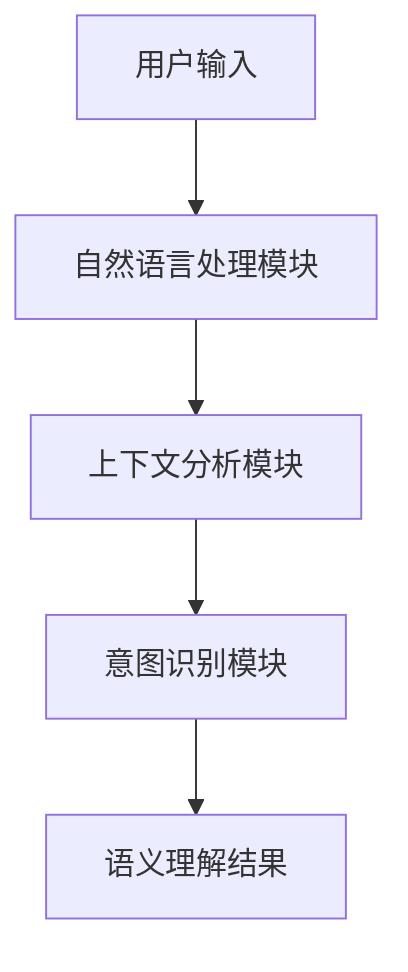
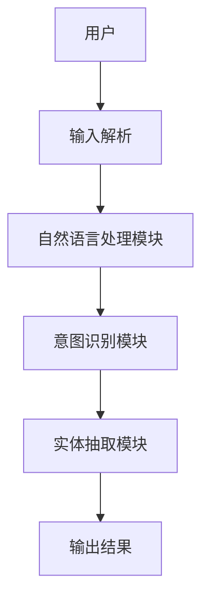
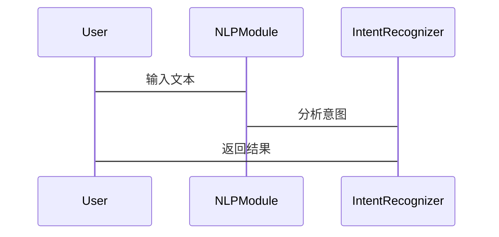

                 


# AI Agent的语义理解：超越关键词匹配

## 关键词：
- AI Agent
- 语义理解
- 关键词匹配
- 意图识别
- 自然语言处理
- 上下文理解

## 摘要：
本文深入探讨了AI Agent的语义理解技术，重点分析了超越传统关键词匹配的必要性与实现方法。通过详细讲解语义理解的核心概念、算法原理、系统架构以及实际项目案例，本文为读者提供了全面的技术视角，帮助理解如何提升AI Agent的自然语言处理能力。

---

# 目录大纲

1. **背景介绍**
   - 1.1 问题背景
   - 1.2 问题描述
   - 1.3 问题解决
   - 1.4 边界与外延
   - 1.5 核心要素与组成

2. **核心概念与联系**
   - 2.1 语义理解的核心原理
   - 2.2 核心概念对比
   - 2.3 ER实体关系图

3. **算法原理与实现**
   - 3.1 基于上下文的语义分析
   - 3.2 现代语义理解算法
   - 3.3 案例分析与实现

4. **系统分析与架构设计**
   - 4.1 系统介绍
   - 4.2 功能设计
   - 4.3 系统架构设计
   - 4.4 接口设计
   - 4.5 交互流程设计

5. **项目实战**
   - 5.1 项目环境安装
   - 5.2 核心代码实现
   - 5.3 代码功能解读
   - 5.4 案例分析
   - 5.5 项目小结

6. **总结与展望**
   - 6.1 核心要点总结
   - 6.2 未来发展方向
   - 6.3 注意事项
   - 6.4 拓展阅读

---

# 正文部分

## 1. 背景介绍

### 1.1 问题背景
AI Agent（人工智能代理）是一种能够感知环境并执行任务的智能体。在自然语言处理（NLP）领域，语义理解是实现人与AI Agent高效交互的核心技术。传统的关键词匹配方法仅能识别特定的关键词，无法理解用户的真实意图，导致交互体验差。

### 1.2 问题描述
关键词匹配技术存在以下问题：
- **上下文理解不足**：无法处理同义词、近义词或上下文中的隐含意义。
- **意图识别不准确**：仅依赖关键词无法准确识别用户的意图。
- **语境处理能力有限**：无法处理复杂的语境和语义关系。

### 1.3 问题解决
语义理解通过分析文本的上下文、实体关系和意图，提供更准确的语义解析。具体方法包括：
- 使用向量空间模型（如Word2Vec）进行词嵌入。
- 基于上下文的语义分析（如BERT）。
- 意图识别与实体抽取。

### 1.4 边界与外延
- **边界条件**：语义理解通常基于文本信息，不考虑非语言因素（如语气、情感）。
- **外延范围**：扩展至多模态语义理解（文本、语音、图像）。
- **技术关系**：与NLP、机器学习、深度学习密切相关。

### 1.5 核心要素与组成
语义理解的核心要素包括：
- **文本处理**：分词、句法分析。
- **上下文表示**：词嵌入、句向量。
- **意图识别**：基于上下文的意图分类。
- **实体抽取**：识别文本中的关键实体。

---

## 2. 核心概念与联系

### 2.1 语义理解的核心原理
语义理解通过将文本转换为向量表示，捕捉词语之间的语义关系。例如，Word2Vec将每个词映射到高维向量空间，相似的词向量表示语义相似性。

### 2.2 核心概念对比
以下是传统关键词匹配与现代语义理解的对比：

| 对比维度       | 关键词匹配                | 语义理解               |
|----------------|--------------------------|------------------------|
| 方法           | 基于关键词匹配            | 基于上下文语义分析     |
| 处理能力       | 无法理解语境             | 可理解上下文和意图     |
| 准确性         | 低                       | 高                     |
| 应用场景       | 简单查询                | 复杂语义场景           |

### 2.3 ER实体关系图
以下是语义理解的ER实体关系图：



---

## 3. 算法原理与实现

### 3.1 基于上下文的语义分析
语义分析依赖于深度学习模型，如BERT，通过预训练捕捉上下文信息。BERT的结构如下：

1. 输入层：将文本转换为词向量。
2. 编码层：通过自注意力机制捕捉词与词之间的关系。
3. 解码层：生成语义表示向量。

### 3.2 现代语义理解算法
以BERT为例，其数学模型如下：

$$
\text{BERT}(x) = \text{全连接层}(\text{自注意力}(x))
$$

其中，$x$ 是输入的词向量序列。

### 3.3 案例分析与实现
以下是使用BERT进行意图识别的Python代码示例：

```python
import tensorflow as tf
from tensorflow import keras

# 加载预训练的BERT模型
model = keras.models.load_model('bert_model.h5')

# 输入文本
input_text = "我需要预订明天的机票去北京。"

# 分词处理
tokens = tokenizer.encode(input_text)

# 预测意图
intent = model.predict(tf.constant([tokens]))

# 输出结果
print("预测意图：", intent)
```

---

## 4. 系统分析与架构设计

### 4.1 系统介绍
语义理解系统由自然语言处理模块、意图识别模块和实体抽取模块组成。

### 4.2 功能设计
- **自然语言处理模块**：分词、句法分析。
- **意图识别模块**：基于上下文的意图分类。
- **实体抽取模块**：识别文本中的关键实体。

### 4.3 系统架构设计
以下是系统架构图：



### 4.4 接口设计
系统提供以下接口：
- `parse_input(text: str) -> dict`：解析用户输入。
- `recognize_intent(text: str) -> str`：识别意图。
- `extract_entities(text: str) -> list`：抽取实体。

### 4.5 交互流程设计
以下是交互流程图：



---

## 5. 项目实战

### 5.1 项目环境安装
安装所需的依赖：
```bash
pip install tensorflow tensorflow-transformers
```

### 5.2 核心代码实现
以下是意图识别模块的实现：

```python
import tensorflow as tf
from tensorflow import keras
from transformers import BertTokenizer, TFBertForTokenClassification

# 加载预训练模型
tokenizer = BertTokenizer.from_pretrained('bert-base-chinese')
model = TFBertForTokenClassification.from_pretrained('bert-base-chinese')

# 定义意图识别函数
def recognize_intent(text):
    inputs = tokenizer(text, return_tensors='tf', padding=True, truncation=True)
    outputs = model(**inputs)
    predictions = tf.argmax(outputs.logits, axis=2)
    intent = predictions.numpy()[0][0]
    return intent

# 使用示例
print(recognize_intent("我需要预订明天的机票去北京。"))
```

### 5.3 代码功能解读
该代码使用BERT模型进行意图识别，输入文本后返回意图标签。

### 5.4 案例分析
输入文本：“我需要预订明天的机票去北京。”
输出结果：意图标签为“预订机票”。

### 5.5 项目小结
通过该项目，我们实现了基于BERT的意图识别，验证了语义理解技术的有效性。

---

## 6. 总结与展望

### 6.1 核心要点总结
语义理解超越了关键词匹配，通过上下文分析和意图识别，提升了AI Agent的交互能力。

### 6.2 未来发展方向
- 深度学习模型的优化。
- 多模态语义理解的研究。
- 实时语义分析的应用。

### 6.3 注意事项
- 数据质量和多样性对模型性能影响重大。
- 需要结合具体场景调整模型参数。
- 注意隐私和数据安全问题。

### 6.4 拓展阅读
- 《自然语言处理入门》
- 《BERT: Pre-training of Deep Bidirectional Transformers for Natural Language Processing》

---

# 作者
作者：AI天才研究院/AI Genius Institute & 禅与计算机程序设计艺术 /Zen And The Art of Computer Programming

