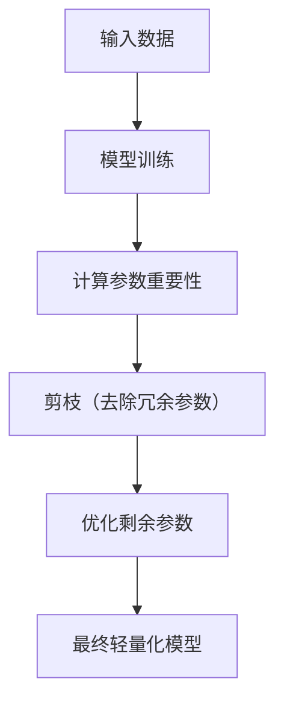
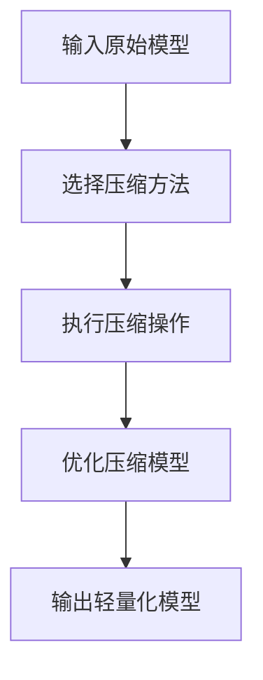
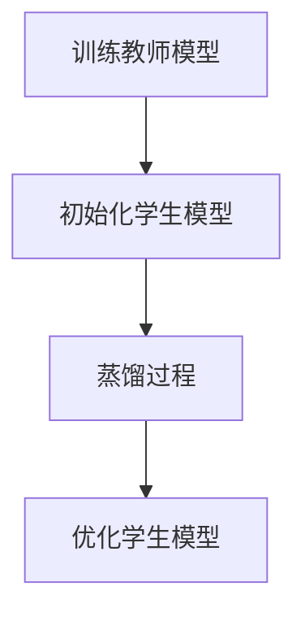
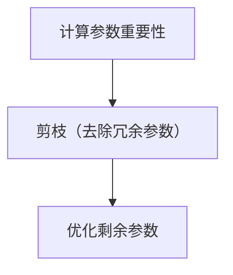
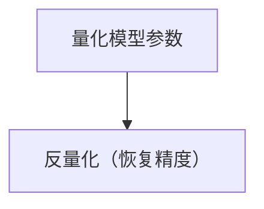

                 


# AI Agent的语言模型压缩：轻量级LLM的实现与优化

## 关键词：AI Agent, 语言模型压缩, 轻量级LLM, 模型优化, 知识蒸馏, 剪枝, 量化

## 摘要：  
本文详细探讨了AI Agent中语言模型压缩的核心技术，从背景、原理到实现，系统性地分析了轻量级LLM的实现与优化方法。文章首先介绍了AI Agent与语言模型压缩的背景及意义，随后深入讲解了模型压缩的核心概念与技术原理，包括知识蒸馏、剪枝和量化等方法。接着，通过详细的数学公式和算法流程图，阐述了每种压缩算法的实现过程，并结合实际项目案例，展示了如何通过系统设计与架构优化来实现轻量级LLM。最后，本文总结了模型压缩的最佳实践与未来发展方向，为读者提供了一套完整的轻量级LLM实现与优化方案。

---

# 第1章: AI Agent与语言模型压缩概述

## 1.1 AI Agent的定义与核心功能  
AI Agent（人工智能代理）是一种能够感知环境、自主决策并执行任务的智能实体。它通常具备以下核心功能：  
1. **感知环境**：通过传感器或API获取外部数据。  
2. **分析与推理**：利用语言模型、逻辑推理等技术处理信息。  
3. **自主决策**：基于分析结果做出决策并执行任务。  
4. **学习与优化**：通过反馈机制不断优化自身性能。  

AI Agent在多个领域有广泛应用，例如智能助手（如Siri、Alexa）、自动驾驶系统、智能客服等。语言模型作为AI Agent的核心组件之一，负责理解和生成自然语言文本，其性能直接影响AI Agent的智能水平。

---

## 1.2 语言模型压缩的背景与意义  
### 1.2.1 大模型的局限性与压缩需求  
随着深度学习技术的发展，大型语言模型（如GPT-3、BERT）在性能上表现出色，但其计算资源需求和运行成本也急剧增加。例如：  
1. **计算资源需求**：训练和推理需要大量的GPU资源。  
2. **运行成本**：电费、云服务成本高昂。  
3. **应用场景限制**：在资源受限的环境中（如移动设备、边缘计算），大模型难以部署和运行。  

### 1.2.2 轻量级LLM的必要性  
轻量级大语言模型（Lightweight Large Language Model, LLM）是一种在保证性能的前提下，显著降低计算资源需求的模型。其必要性体现在以下几个方面：  
1. **降低计算成本**：减少GPU/TPU资源消耗。  
2. **提升部署灵活性**：能够在低性能设备上运行。  
3. **加快推理速度**：适用于实时应用场景。  

### 1.2.3 压缩技术对AI Agent性能的提升  
通过模型压缩技术，AI Agent可以在以下方面实现性能提升：  
1. **推理速度**：压缩后的模型推理时间显著缩短。  
2. **资源利用率**：减少内存占用，降低能源消耗。  
3. **响应能力**：在高并发场景下表现更优。  

---

## 1.3 语言模型压缩的技术发展与现状  
### 1.3.1 模型压缩技术的演进  
模型压缩技术经历了从简单到复杂的演进过程：  
1. **早期方法**：如减少网络层数、降低参数维度。  
2. **知识蒸馏**：通过教师模型指导学生模型学习。  
3. **深度压缩**：结合剪枝、量化等技术实现轻量化。  

### 1.3.2 当前主流的模型压缩方法  
目前，主流的模型压缩方法包括：  
1. **知识蒸馏**：通过教师模型引导学生模型学习。  
2. **剪枝**：去除模型中冗余的参数或结构。  
3. **量化**：将模型参数从高精度（如浮点）降低到低精度（如整数）。  

### 1.3.3 AI Agent领域中的压缩技术应用  
在AI Agent领域，模型压缩技术主要应用于以下场景：  
1. **实时对话系统**：需要快速响应用户输入。  
2. **边缘计算**：在资源受限的设备上部署AI Agent。  
3. **多模态任务**：结合视觉、语音等多种模态信息，降低整体计算成本。  

---

## 1.4 本章小结  
本章从AI Agent的定义、核心功能出发，分析了语言模型压缩的背景与意义，并总结了当前主流的模型压缩技术及其在AI Agent领域的应用。下一章将深入探讨模型压缩的核心概念与技术原理。

---

# 第2章: 模型压缩的核心概念与技术原理  

## 2.1 模型压缩的基本原理  
模型压缩的核心思想是通过降低模型的复杂度，同时保持其性能不变或接近原始模型。常用方法包括知识蒸馏、剪枝和量化。

### 2.1.1 知识蒸馏的原理与实现  
知识蒸馏是一种通过教师模型指导学生模型学习的技术。  
1. **教师模型**：通常是一个大模型，负责生成高质量的输出。  
2. **学生模型**：一个较小的模型，通过模仿教师模型学习知识。  

**数学模型**：  
教师模型的输出概率分布为$P_{\text{teacher}}(y|x)$，学生模型的目标是让自己的概率分布$P_{\text{student}}(y|x)$接近$P_{\text{teacher}}(y|x)$。损失函数为：  
$$ L = -\sum_{y} P_{\text{teacher}}(y|x) \log P_{\text{student}}(y|x) $$  

### 2.1.2 剪枝的原理与实现  
剪枝是一种通过去除模型中冗余参数或结构来降低模型复杂度的技术。  
1. **参数重要性评估**：通过梯度或特征重要性评估参数的价值。  
2. **逐步剪枝**：去除对模型性能影响较小的参数。  

**流程图**：  


### 2.1.3 量化压缩的原理与实现  
量化是将模型参数从高精度（如浮点）降低到低精度（如整数）的技术。  
1. **参数量化**：将浮点参数映射到较低的位数（如8位整数）。  
2. **反量化**：在推理时恢复模型参数精度。  

**示例代码**：  
```python
import torch

# 假设有一个PyTorch模型
model = torch.nn.Linear(10, 5)
# 使用8位整数量化
quantized_model = torch.quantize_dynamic(model, num_bits=8)
```

---

## 2.2 压缩方法的对比分析  
### 2.2.1 不同压缩方法的优缺点对比  
以下是对几种主流压缩方法的对比分析：  

| 方法      | 优点                          | 缺点                          |
|-----------|-------------------------------|-------------------------------|
| 知识蒸馏  | 性能损失小，适用于复杂任务     | 需要教师模型，计算成本高      |
| 剪枝       | 显著降低模型复杂度             | 可能导致性能下降，难以恢复     |
| 量化       | 显著降低存储和计算成本         | 显著降低模型精度，尤其在小模型中 |

### 2.2.2 压缩方法的适用场景分析  
1. **知识蒸馏**：适用于需要保持较高性能的场景。  
2. **剪枝**：适用于对模型大小要求较高的场景。  
3. **量化**：适用于对计算效率要求较高的场景。  

### 2.2.3 压缩方法的性能对比表格  
以下是一个简化的性能对比表格：  

| 方法      | 参数减少比例 | 推理速度提升 | 模型精度损失 |
|-----------|--------------|--------------|--------------|
| 知识蒸馏  | 30%-50%       | 10%-20%       | 无或轻微     |
| 剪枝       | 50%-70%       | 20%-30%       | 中等         |
| 量化       | 70%-90%       | 30%-50%       | 显著         |

---

## 2.3 模型压缩的系统架构图  
### 2.3.1 模型压缩的ER实体关系图  
以下是一个简化的ER实体关系图：  
```mermaid
erDiagram
    actor 压缩算法 <<(拥有者)拥有者>> 压缩模型
    actor 教师模型 <<(指导者)指导者>> 学生模型
    actor 原始模型 <<(被压缩对象)被压缩对象>> 压缩模型
```

### 2.3.2 模型压缩的流程图  
以下是一个模型压缩的流程图：  


---

## 2.4 本章小结  
本章详细介绍了模型压缩的核心概念与技术原理，包括知识蒸馏、剪枝和量化三种方法，并通过对比分析和系统架构图，帮助读者理解不同方法的优缺点及应用场景。下一章将深入探讨这些算法的具体实现细节。

---

# 第3章: 模型压缩的算法原理与实现  

## 3.1 知识蒸馏算法原理  
### 3.1.1 知识蒸馏的基本概念  
知识蒸馏是一种通过教师模型指导学生模型学习的技术。教师模型通常是一个大模型，负责生成高质量的输出，而学生模型是一个较小的模型，通过模仿教师模型学习知识。

**数学模型**：  
教师模型的输出概率分布为$P_{\text{teacher}}(y|x)$，学生模型的目标是让自己的概率分布$P_{\text{student}}(y|x)$接近$P_{\text{teacher}}(y|x)$。损失函数为：  
$$ L = -\sum_{y} P_{\text{teacher}}(y|x) \log P_{\text{student}}(y|x) $$  

### 3.1.2 知识蒸馏的实现流程  
1. **教师模型训练**：训练一个高性能的大模型。  
2. **学生模型初始化**：初始化一个较小的模型。  
3. **蒸馏过程**：通过优化目标函数，使学生模型学习教师模型的知识。  

**流程图**：  


### 3.1.3 知识蒸馏的Python代码实现  
以下是一个简单的知识蒸馏实现示例：  
```python
import torch
import torch.nn as nn

# 教师模型
teacher = nn.Linear(10, 5)
# 学生模型
student = nn.Linear(10, 5)

# 定义蒸馏损失函数
def distillation_loss(output_student, output_teacher, temp=2):
    loss = nn.KLDivLoss(reduction='batchmean')(F.log_softmax(output_student / temp, dim=-1),
                                                  F.softmax(output_teacher / temp, dim=-1)) * (temp**2)
    return loss

# 示例训练过程
optimizer = torch.optim.Adam(student.parameters(), lr=0.001)
for batch in dataloader:
    inputs, labels = batch
    with torch.no_grad():
        teacher_outputs = teacher(inputs)
    student_outputs = student(inputs)
    loss = distillation_loss(student_outputs, teacher_outputs)
    optimizer.zero_grad()
    loss.backward()
    optimizer.step()
```

---

## 3.2 剪枝算法原理  
### 3.2.1 剪枝的基本概念  
剪枝是一种通过去除模型中冗余参数或结构来降低模型复杂度的技术。剪枝的核心思想是去掉对模型性能影响较小的部分。

### 3.2.2 剪枝的实现流程  
1. **参数重要性评估**：计算每个参数对模型性能的贡献。  
2. **逐步剪枝**：去除对模型性能影响最小的参数。  
3. **优化剩余参数**：对剩余的参数进行微调优化。  

**流程图**：  


### 3.2.3 剪枝的Python代码实现  
以下是一个简单的剪枝实现示例：  
```python
import torch
import torch.nn as nn

model = nn.Linear(10, 5)
# 计算参数重要性（示例）
importance = torch.abs(model.weight).sum(dim=1)
# 选择保留的参数索引
keep_indices = importance.argsort()[:2]
# 剪枝操作
pruned_weight = model.weight[:, keep_indices]
pruned_model = nn.Linear(10, 2)
pruned_model.weight.data = pruned_weight
```

---

## 3.3 量化算法原理  
### 3.3.1 量化的基本概念  
量化是将模型参数从高精度（如浮点）降低到低精度（如整数）的技术。量化可以显著降低模型的存储和计算成本。

### 3.3.2 量化的核心步骤  
1. **参数量化**：将浮点参数映射到较低的位数（如8位整数）。  
2. **反量化**：在推理时恢复模型参数精度。  

**流程图**：  


### 3.3.3 量化

