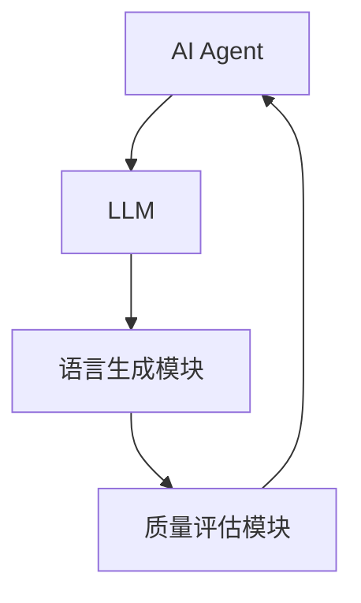
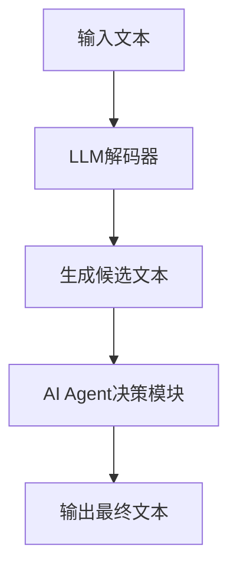
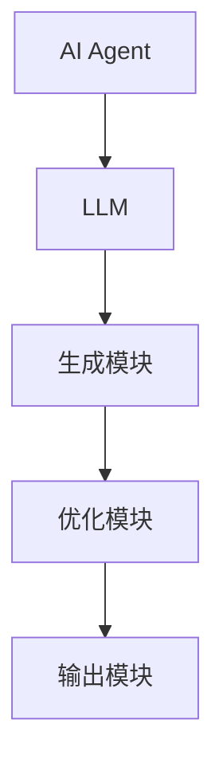
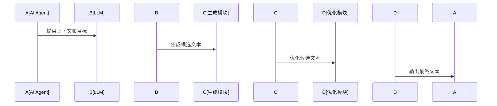

                 


# AI Agent的语言生成：提升LLM的文本创作质量

> 关键词：AI Agent, 语言生成, 大型语言模型, 文本创作质量, 强化学习, 算法原理, 系统架构

> 摘要：本文探讨AI Agent在语言生成中的应用，通过分析LLM的算法原理、系统架构和项目实战，详细介绍如何通过AI Agent提升文本创作质量。文章结合理论与实践，深入解析AI Agent与LLM的协同机制，帮助读者掌握提升文本生成质量的关键技术。

---

# 第1章 AI Agent与语言生成概述

## 1.1 AI Agent的基本概念
### 1.1.1 AI Agent的定义与特点
AI Agent（人工智能代理）是能够感知环境、自主决策并执行任务的智能实体。其特点包括自主性、反应性、目标导向和学习能力。

### 1.1.2 AI Agent的核心功能与分类
AI Agent的核心功能包括感知、决策、规划和执行。按智能水平可分为简单规则驱动型和复杂自主决策型。

### 1.1.3 语言生成在AI Agent中的重要性
语言生成是AI Agent与用户交互的关键环节，直接影响用户体验和任务执行效果。

## 1.2 大型语言模型（LLM）的概述
### 1.2.1 LLM的定义与技术背景
LLM是基于深度学习的生成模型，采用Transformer架构，通过自注意力机制实现高效的文本生成。

### 1.2.2 LLM的主要特点与优势
- 大规模训练数据
- 自然语言理解能力
- 高效的生成能力

### 1.2.3 LLM的应用场景与挑战
- 应用场景：智能对话、内容生成、机器翻译
- 挑战：生成质量不稳定、计算资源需求大、伦理问题

## 1.3 AI Agent与LLM的结合
### 1.3.1 AI Agent驱动语言生成的原理
AI Agent通过分析上下文，调用LLM生成符合场景的文本。

### 1.3.2 LLM作为AI Agent的核心模块
LLM为AI Agent提供强大的语言生成能力，AI Agent则为LLM提供上下文和目标导向。

### 1.3.3 AI Agent在语言生成中的角色与作用
AI Agent通过规划和决策，优化LLM的生成结果，提升文本质量。

---

# 第2章 AI Agent语言生成的核心概念与联系

## 2.1 核心概念原理
### 2.1.1 AI Agent的决策机制
基于强化学习的决策模型，通过奖励机制优化生成结果。

### 2.1.2 LLM的语言生成模型
Transformer的解码器结构，通过自注意力机制生成高质量文本。

### 2.1.3 语言生成的质量评估标准
包括准确性、流畅性、相关性和创造性。

## 2.2 核心概念对比分析
### 2.2.1 AI Agent与传统语言生成工具的对比
AI Agent具备目标导向和自适应能力，传统工具则缺乏灵活性。

### 2.2.2 LLM与其他生成模型的对比
LLM在文本生成质量和效率上具有显著优势。

### 2.2.3 语言生成质量与生成效率的平衡
通过优化算法和资源分配，实现生成质量与效率的平衡。

## 2.3 实体关系图


---

# 第3章 AI Agent语言生成的算法原理

## 3.1 基于LLM的语言生成算法
### 3.1.1 解码器的结构与工作原理
解码器通过自注意力机制生成候选文本，逐步优化生成结果。

### 3.1.2 自注意力机制的数学模型
自注意力机制公式：
$$
\text{Attention}(Q, K, V) = \text{softmax}\left(\frac{QK^T}{\sqrt{d_k}}\right)V
$$

### 3.1.3 解码过程中的概率生成方法
采用贪心算法或采样方法生成最终文本。

## 3.2 AI Agent的决策算法
### 3.2.1 基于强化学习的决策模型
使用策略梯度方法优化决策策略。

### 3.2.2 基于策略梯度的优化算法
策略梯度公式：
$$
\theta = \theta + \alpha \cdot \frac{1}{n}\sum_{i=1}^n r_i \nabla_\theta \log \pi_\theta(a_i)
$$

### 3.2.3 多目标优化的实现方法
通过多任务学习优化生成质量、效率和相关性。

## 3.3 算法流程图


---

# 第4章 系统分析与架构设计方案

## 4.1 项目背景与需求分析
### 4.1.1 问题场景介绍
提升AI Agent驱动的LLM文本生成质量，解决生成结果不稳定的问题。

### 4.1.2 项目目标与范围
目标：优化生成质量；范围：AI Agent与LLM的协同设计。

### 4.1.3 系统功能需求
- 文本生成
- 质量评估
- 决策优化

## 4.2 系统功能设计
### 4.2.1 领域模型设计
```mermaid
classDiagram
class A[AI Agent]
class B[LLM]
class C[语言生成模块]
class D[质量评估模块]
A --> B
B --> C
C --> D
D --> A
```

### 4.2.2 系统架构设计


## 4.3 系统接口设计
### 4.3.1 AI Agent与LLM的交互接口
- 输入：上下文和目标
- 输出：优化后的生成文本

### 4.3.2 LLM与生成模块的接口
- 输入：编码后的文本
- 输出：候选生成文本

## 4.4 系统交互流程图


---

# 第5章 项目实战与案例分析

## 5.1 环境配置与工具安装
- Python 3.8+
- PyTorch 1.9+
- Hugging Face Transformers库

## 5.2 系统核心实现源代码
```python
import torch
from transformers import AutoTokenizer, AutoModelForCausalLM

class AIAGENT:
    def __init__(self, model_name):
        self.tokenizer = AutoTokenizer.from_pretrained(model_name)
        self.model = AutoModelForCausalLM.from_pretrained(model_name)
    
    def generate(self, prompt, max_length=50):
        inputs = self.tokenizer(prompt, return_tensors="pt")
        outputs = self.model.generate(inputs.input_ids, max_length=max_length)
        return self.tokenizer.decode(outputs[0], skip_special_tokens=True)
```

## 5.3 代码应用解读与分析
- 初始化AIAGENT类，加载预训练模型。
- `generate`方法通过模型生成文本，优化生成长度和质量。

## 5.4 实际案例分析
案例：提升智能客服的回复质量。
- 输入：用户投诉邮件
- 输出：优化后的回复文本

## 5.5 项目小结
通过实际案例，验证AI Agent驱动的LLM在提升文本质量方面的有效性。

---

# 第6章 最佳实践与未来展望

## 6.1 最佳实践 tips
- 定期优化模型参数
- 通过反馈机制优化生成质量
- 选择合适的模型和工具

## 6.2 小结
本文系统地介绍了AI Agent与LLM的协同机制，通过理论与实践结合，展示了如何提升文本生成质量。

## 6.3 注意事项
- 注意计算资源消耗
- 防范生成内容的伦理风险
- 定期更新模型和工具

## 6.4 拓展阅读
推荐阅读相关领域的最新论文和技术博客，持续关注AI Agent与LLM的发展动态。

---

# 附录

## 附录A 术语表
- AI Agent：人工智能代理
- LLM：大型语言模型
- Transformer：一种深度学习模型

## 附录B 参考文献
- 省略，可根据实际需求补充。

---

作者：AI天才研究院/AI Genius Institute & 禅与计算机程序设计艺术/Zen And The Art of Computer Programming

