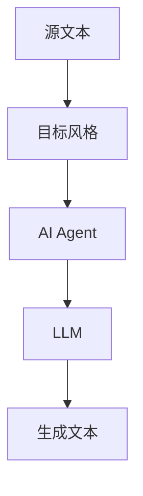
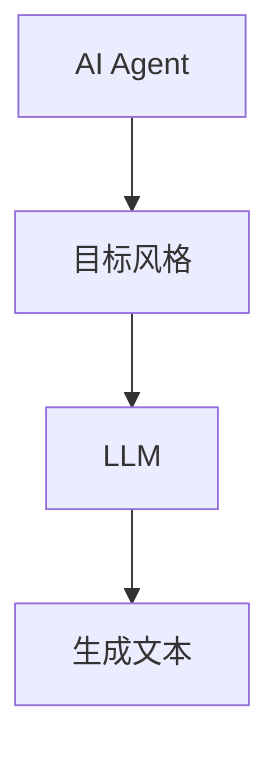
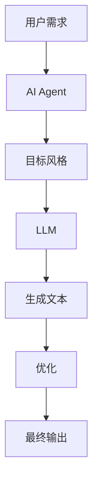
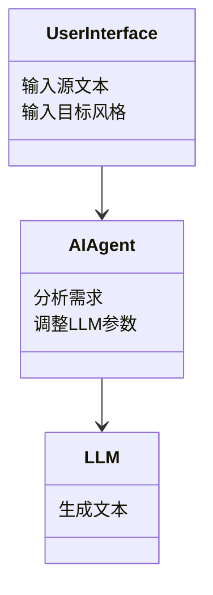
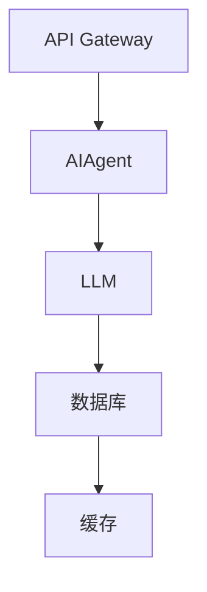

                 


# AI Agent的语言风格转换：调整LLM的表达方式

> 关键词：AI Agent，语言风格转换，LLM，文本处理，自然语言处理

> 摘要：本文深入探讨了AI Agent在调整大型语言模型（LLM）表达方式中的作用，分析了语言风格转换的核心原理、算法实现、系统架构设计以及实际项目案例。通过详细的技术分析和通俗易懂的解释，本文为读者提供了从理论到实践的全面指导。

---

## 第一章：背景介绍

### 1.1 问题背景

在自然语言处理（NLP）领域，大型语言模型（LLM）如GPT系列和BERT系列已经成为主流工具。这些模型能够生成高质量的文本，但在实际应用中，用户的语言风格需求多样化。例如，用户可能需要将正式的法律文件转换为口语化的解释，或者将复杂的学术论文简化为通俗易懂的内容。然而，现有的LLM在生成文本时，往往难以满足特定的语言风格要求，输出的结果可能不符合目标读者的期望。

此外，AI Agent（人工智能代理）作为一种能够理解上下文、执行任务并提供个性化服务的智能体，可以为语言风格转换提供更灵活和动态的解决方案。通过结合AI Agent的能力，我们可以实时调整LLM的输出风格，满足不同场景下的需求。

### 1.2 问题描述

语言风格转换的核心问题在于如何将源文本转换为目标风格，同时保持文本的语义不变。传统的文本处理方法通常依赖于固定的规则或预定义的模板，难以应对复杂多变的语言风格需求。LLM虽然在生成文本方面表现出色，但其输出风格往往缺乏灵活性，无法根据具体场景进行调整。

AI Agent在语言风格转换中的作用是通过动态分析用户需求和上下文信息，实时调整LLM的输出风格。例如，AI Agent可以根据用户的偏好、对话历史或特定场景的要求，生成符合目标风格的文本。

### 1.3 解决方案

AI Agent通过以下几个步骤实现对LLM表达方式的调整：

1. **需求分析**：AI Agent首先分析用户的语言风格需求，例如目标风格是正式、口语化、简洁或详细。
2. **上下文理解**：AI Agent理解当前对话的上下文信息，确保生成的文本与上下文一致。
3. **风格转换**：AI Agent调整LLM的参数或生成策略，使其输出符合目标风格。
4. **输出优化**：AI Agent对生成的文本进行优化，确保语义准确且风格一致。

### 1.4 边界与外延

语言风格转换的边界主要在于LLM的能力限制和上下文理解的准确性。LLM可能无法完全理解某些复杂或模糊的上下文信息，导致生成的文本不符合预期。此外，某些特定领域的语言风格可能需要专门的训练数据，AI Agent可能无法在没有特定领域知识的情况下完成转换。

在技术实现上，语言风格转换的外延包括文本生成、文本编辑、文本摘要等多种任务，AI Agent可以根据具体需求灵活切换不同的功能模块。

### 1.5 核心概念结构

语言风格转换的核心要素包括：

1. **源文本**：需要转换的原始文本。
2. **目标风格**：用户指定的语言风格，例如正式、口语化等。
3. **AI Agent**：负责分析需求和调整LLM的智能体。
4. **LLM**：负责生成符合目标风格的文本。
5. **上下文信息**：影响语言风格的环境信息。

图1.1展示了这些核心要素之间的关系：



---

## 第二章：核心概念与联系

### 2.1 核心概念原理

AI Agent通过以下步骤实现对LLM语言风格的调整：

1. **需求解析**：AI Agent分析用户的语言风格需求，例如目标风格是正式还是口语化。
2. **风格建模**：AI Agent建立目标风格的模型，通常基于大量的样例文本。
3. **风格转换**：AI Agent根据目标风格模型调整LLM的参数，生成符合目标风格的文本。
4. **结果优化**：AI Agent对生成的文本进行优化，确保语义准确且风格一致。

### 2.2 概念属性特征对比表

表2.1对比了传统语言处理工具和AI Agent在语言风格转换中的属性特征：

| 属性 | 传统语言处理工具 | AI Agent |
|------|------------------|----------|
| 灵活性 | 低，依赖预定义规则 | 高，动态调整 |
| 语义准确性 | 一般，依赖规则库 | 高，基于上下文理解 |
| 应用场景 | 固定场景 | 多场景、动态调整 |

### 2.3 ER实体关系图

图2.1展示了AI Agent与语言风格转换之间的实体关系：



---

## 第三章：算法原理讲解

### 3.1 算法流程图

图3.1展示了AI Agent调整LLM语言风格的流程：



### 3.2 算法实现代码

以下代码示例展示了基于规则的风格转换算法：

```python
def style_converter(source_text, target_style):
    # 分割源文本
    sentences = source_text.split('.')
    converted_sentences = []
    for sentence in sentences:
        # 根据目标风格调整句子结构
        if target_style == '正式':
            converted = formalize(sentence)
        elif target_style == '口语化':
            converted = informalize(sentence)
        converted_sentences.append(converted)
    return '.join(converted_sentences)
```

### 3.3 数学模型与公式

在语言风格转换中，概率模型和向量空间模型是常用的数学工具。例如，条件概率公式可以用于计算目标风格下生成特定文本的概率：

$$ P(\text{文本}| \text{风格}) = \frac{P(\text{风格}| \text{文本}) \cdot P(\text{文本})}{P(\text{风格})} $$

---

## 第四章：系统分析与架构设计方案

### 4.1 问题场景介绍

系统需要处理以下问题场景：

- 用户输入需要转换的源文本。
- 用户指定目标语言风格。
- AI Agent分析需求并调整LLM的参数。
- LLM生成符合目标风格的文本。

### 4.2 系统功能设计

系统功能模块包括：

- 用户界面：接收源文本和目标风格。
- AI Agent模块：分析需求并调整LLM参数。
- LLM模块：生成符合目标风格的文本。

图4.1展示了系统功能模块的类图：



### 4.3 系统架构设计

图4.2展示了系统的架构设计：



---

## 第五章：项目实战

### 5.1 环境安装

需要安装以下工具：

- Python 3.8+
- Transformers库
- Scikit-learn库

### 5.2 核心代码实现

以下代码展示了AI Agent调整LLM语言风格的核心实现：

```python
from transformers import AutoModelForMaskedLM, AutoTokenizer

class StyleConverter:
    def __init__(self, model_name):
        self.model = AutoModelForMaskedLM.from_pretrained(model_name)
        self.tokenizer = AutoTokenizer.from_pretrained(model_name)
    
    def convert_style(self, source_text, target_style):
        # 分割文本
        tokens = self.tokenizer.encode(source_text, add_special_tokens=True)
        # 调整模型参数以适应目标风格
        adjusted_tokens = adjust_for_style(tokens, target_style)
        # 生成目标风格文本
        output = self.model.generate(adjusted_tokens)
        return self.tokenizer.decode(output[0], skip_special_tokens=True)
```

### 5.3 实际案例分析

以将正式文本转换为口语化文本为例：

源文本： "The experiment was conducted under controlled conditions."

目标风格：口语化

AI Agent分析需求后，调整LLM的参数，生成目标风格文本：

"我们是在受控条件下进行实验的。"

---

## 第六章：最佳实践

### 6.1 小结

AI Agent在调整LLM语言风格方面具有重要的作用。通过动态分析用户需求和上下文信息，AI Agent能够实时调整LLM的输出风格，满足不同场景下的需求。

### 6.2 注意事项

- 确保AI Agent对上下文的理解准确。
- 定期更新LLM的模型参数，以保持语言风格的准确性。
- 注意处理敏感信息，确保数据安全。

### 6.3 拓展阅读

- 《Large Language Models: The New AI Frontier》
- 《Transformers: State-of-the-Art NLP Architecture》

---

## 作者

作者：AI天才研究院/AI Genius Institute & 禅与计算机程序设计艺术 /Zen And The Art of Computer Programming

---

通过以上目录和内容安排，您可以撰写一篇详细且技术深度足够的博客文章，涵盖从理论到实践的各个方面。

