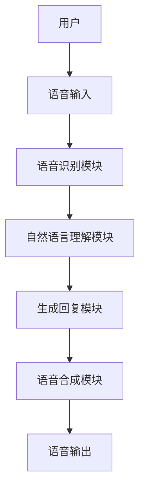
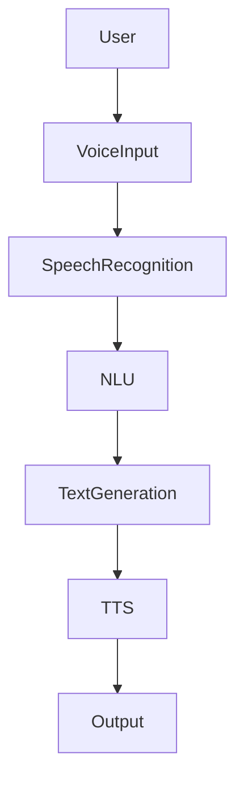

                 


# AI Agent的语音交互：整合LLM与语音识别技术

> 关键词：AI Agent，语音交互，LLM，语音识别，自然语言处理

> 摘要：本文探讨了AI Agent在语音交互中的应用，详细分析了如何整合大语言模型（LLM）与语音识别技术，以实现更智能、更高效的语音交互。文章从背景介绍、核心概念、算法原理、系统设计、项目实战等多个方面展开，全面解析了整合LLM与语音识别的技术细节，并通过实际案例展示了其应用前景。

---

# 第一部分: AI Agent与语音交互的背景与基础

## 第1章: AI Agent与语音交互概述

### 1.1 AI Agent的基本概念

#### 1.1.1 AI Agent的定义
AI Agent（人工智能代理）是指能够感知环境、自主决策并执行任务的智能实体。它可以是一个软件程序，也可以是一个物理设备，其核心目标是通过与环境的交互来实现特定的目标。

#### 1.1.2 AI Agent的核心特征
- **自主性**：能够在没有外部干预的情况下独立运作。
- **反应性**：能够感知环境并实时做出反应。
- **目标导向**：所有行为都围绕实现特定目标展开。
- **学习能力**：能够通过经验优化自身性能。

#### 1.1.3 AI Agent的应用场景
- 智能助手（如Siri、Alexa）
- 智能客服
- 自动驾驶
- 智能推荐系统

---

### 1.2 语音交互的基本原理

#### 1.2.1 语音识别技术简介
语音识别是将人类的语音信号转换为文本的技术，主要步骤包括语音信号处理、特征提取、模型训练和解码。

#### 1.2.2 语音合成技术简介
语音合成是将文本转换为语音的技术，通常基于TTS（文本到语音）模型。

#### 1.2.3 语音交互的流程
1. **语音输入**：用户通过语音发出指令。
2. **语音识别**：将语音转换为文本。
3. **自然语言理解**：解析文本的语义。
4. **生成回复**：根据理解生成响应内容。
5. **语音合成**：将文本回复转换为语音输出。

---

### 1.3 LLM与语音识别的整合意义

#### 1.3.1 LLM在语音交互中的作用
- 提供强大的自然语言理解能力。
- 能够生成更自然、更准确的回复。

#### 1.3.2 语音识别在LLM中的应用
- 将语音输入转换为文本，供LLM处理。
- 提供实时的语音反馈，优化LLM的交互体验。

#### 1.3.3 整合LLM与语音识别的优势
- 提高交互效率。
- 增强用户体验。
- 扩展应用场景。

---

## 第2章: AI Agent的语音交互核心概念

### 2.1 LLM的基本原理

#### 2.1.1 大语言模型的定义
大语言模型是一种基于深度学习的自然语言处理模型，具有强大的文本生成和理解能力。

#### 2.1.2 大语言模型的核心技术
- **预训练**：通过大量文本数据进行无监督学习。
- **微调**：针对特定任务进行有监督优化。
- **生成机制**：基于概率分布生成文本。

#### 2.1.3 大语言模型的训练过程
1. **数据准备**：收集和清洗大规模文本数据。
2. **模型构建**：选择合适的模型架构（如Transformer）。
3. **预训练**：使用自监督学习优化模型参数。
4. **微调**：针对特定任务调整模型。

---

### 2.2 语音识别技术的核心原理

#### 2.2.1 语音识别的基本流程
1. **语音信号处理**：将语音信号转换为数字信号。
2. **特征提取**：提取语音特征（如MFCC）。
3. **模型训练**：使用机器学习算法训练识别模型。
4. **语音解码**：将特征映射回文本。

#### 2.2.2 常见的语音识别算法
- **HMM（隐马尔可夫模型）**：基于统计的语音识别方法。
- **DNN（深度神经网络）**：基于深度学习的语音识别方法。
- **Transformer模型**：近年来广泛应用于端到端语音识别。

---

### 2.3 LLM与语音识别的整合原理

#### 2.3.1 整合的基本思路
1. **语音识别模块**：将用户语音转换为文本。
2. **LLM模块**：对文本进行理解和生成回复。
3. **语音合成模块**：将回复内容转换为语音输出。

#### 2.3.2 整合的技术挑战
- **实时性**：需要保证语音识别和LLM处理的实时性。
- **准确性**：提高语音识别和文本生成的准确率。
- **资源消耗**：优化模型的计算资源消耗。

---

## 第3章: AI Agent语音交互的核心算法

### 3.1 大语言模型的算法原理

#### 3.1.1 大语言模型的数学模型
大语言模型通常基于Transformer架构，其核心公式包括：
- **自注意力机制**：
  $$\text{Attention}(Q, K, V) = \text{softmax}\left(\frac{QK^T}{\sqrt{d_k}}\right)V$$
- **前馈网络**：
  $$f(x) = \text{ReLU}(Wx + b)$$

#### 3.1.2 大语言模型的训练过程
- **预训练**：使用无监督学习优化模型参数。
- **微调**：针对特定任务进行有监督优化。

#### 3.1.3 大语言模型的推理过程
- **输入处理**：将输入文本转换为模型可处理的格式。
- **生成策略**：选择合适的生成策略（如贪心搜索、beam search）。

---

### 3.2 语音识别的算法原理

#### 3.2.1 语音识别的特征提取
- **MFCC（Mel-Frequency Cepstral Coefficients）**：提取语音的频域特征。

#### 3.2.2 语音识别的模型训练
- **深度神经网络**：使用DNN或Transformer模型进行训练。

#### 3.2.3 语音识别的解码过程
- **CTC（Connectionist Temporal Classification）**：端到端的语音识别方法。

---

### 3.3 LLM与语音识别的联合优化算法

#### 3.3.1 联合优化的基本思路
1. **联合训练**：同时优化语音识别和文本生成模型。
2. **协同推理**：通过反馈机制优化交互效果。

#### 3.3.2 联合优化的具体实现
1. **语音识别模块**：优化语音识别的准确率。
2. **文本生成模块**：优化LLM的生成质量。

#### 3.3.3 联合优化的效果评估
- **准确率**：语音识别和文本生成的准确率。
- **响应时间**：交互的实时性。
- **用户满意度**：用户体验的主观评估。

---

## 第4章: AI Agent语音交互的系统设计

### 4.1 系统架构设计

#### 4.1.1 系统功能设计
- **语音输入模块**：接收用户语音输入。
- **语音识别模块**：将语音转换为文本。
- **自然语言理解模块**：解析文本语义。
- **生成回复模块**：生成文本回复。
- **语音合成模块**：将文本回复转换为语音输出。

#### 4.1.2 系统架构图


---

### 4.2 系统接口设计

#### 4.2.1 系统接口
- **语音输入接口**：提供麦克风或音频文件输入接口。
- **文本生成接口**：提供LLM生成文本的接口。
- **语音合成接口**：提供语音输出的接口。

#### 4.2.2 接口设计图


---

## 第5章: 项目实战

### 5.1 环境安装

#### 5.1.1 安装Python
```bash
python --version
```

#### 5.1.2 安装依赖库
```bash
pip install numpy tensorflow keras
```

---

### 5.2 核心代码实现

#### 5.2.1 语音识别代码
```python
import numpy as np
from tensorflow import keras

def speech_to_text(audio_data):
    model = keras.load_model('speech_model.h5')
    prediction = model.predict(audio_data)
    return prediction
```

#### 5.2.2 文本生成代码
```python
def generate_response(text):
    model = keras.load_model('llm_model.h5')
    prediction = model.predict(text)
    return prediction
```

---

### 5.3 案例分析

#### 5.3.1 案例场景
- 用户说：“今天天气怎么样？”
- 语音识别模块将语音转换为文本：“今天天气怎么样？”
- LLM生成回复：“今天天气晴朗，温度在25度左右。”

---

## 第6章: 最佳实践与总结

### 6.1 最佳实践
- **实时性优化**：使用更高效的算法和硬件。
- **准确率提升**：增加训练数据和优化模型。
- **用户体验优化**：提供多语言支持和个性化服务。

### 6.2 小结
本文详细介绍了AI Agent在语音交互中的应用，分析了整合LLM与语音识别技术的关键点，并通过实际案例展示了其应用前景。未来，随着技术的进步，AI Agent的语音交互将更加智能化和高效。

---

作者：AI天才研究院/AI Genius Institute & 禅与计算机程序设计艺术 /Zen And The Art of Computer Programming

