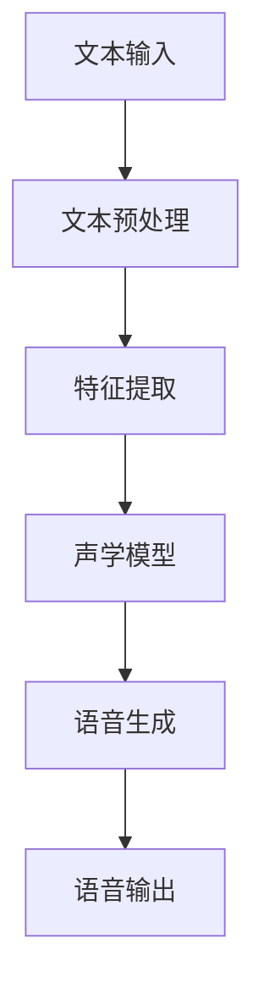

                 


# AI Agent的语音合成与克隆能力实现

> 关键词：AI Agent，语音合成，语音克隆，深度学习，自然语言处理，语音生成

> 摘要：本文深入探讨了AI Agent在语音合成与克隆领域的实现技术。通过分析语音合成与克隆的核心算法、系统架构设计以及实际项目案例，结合深度学习和自然语言处理技术，详细讲解了AI Agent如何实现语音合成与克隆能力。本文旨在为技术人员提供理论基础和实践指导，帮助他们更好地理解和应用相关技术。

---

## 第一部分: AI Agent的语音合成与克隆基础

### 第1章: 语音合成与克隆的背景与基础

#### 1.1 语音合成与克隆的定义与特点

语音合成（Text-to-Speech，TTS）是指将文本转换为自然语音的技术，其核心目标是生成与人类语音相似的音频信号。语音克隆则是指通过学习目标语音的特征，生成与目标语音高度相似的语音信号。两者的核心区别在于，语音合成通常基于文本输入生成通用语音，而语音克隆则专注于模仿特定人的语音特征。

| 特性 | 语音合成 | 语音克隆 |
|------|----------|----------|
| 输入 | 文本      | 语音样本 |
| 输出 | 任意语音 | 目标语音 |
| 应用 | 朗读、导航 | 语音助手、客服 |

#### 1.2 AI Agent的定义与能力

AI Agent是一种智能体，能够通过感知环境、执行任务并与其他实体交互来实现特定目标。AI Agent的核心能力包括自然语言处理、语音交互、学习与推理等。在语音合成与克隆领域，AI Agent能够通过文本输入生成语音，或通过语音样本模仿特定人的语音。

#### 1.3 语音合成与克隆的应用场景

语音合成广泛应用于智能助手、语音导航、教育等领域。语音克隆则在个性化语音助手、语音内容生成、语音身份验证等领域具有重要应用潜力。

---

## 第二部分: AI Agent的核心算法与原理

### 第2章: 语音合成的核心算法

#### 2.1 文本到语音（TTS）技术

##### 2.1.1 TTS的基本原理

TTS技术的核心流程包括文本预处理、特征提取、语音生成和语音输出。文本预处理包括分词和向量化，特征提取包括提取音调、音长等语音特征，语音生成基于声学模型生成语音信号。

##### 2.1.2 基于深度学习的TTS模型

基于深度学习的TTS模型主要分为两类：基于RNN的TTS和基于Transformer的TTS。RNN模型通过循环神经网络生成语音序列，而Transformer模型通过自注意力机制捕捉文本中的长距离依赖关系。

##### 2.1.3 TTS的实现流程与优化

TTS的实现流程包括文本预处理、特征提取、声学模型生成和语音合成。优化方法包括使用更高效的模型结构、优化训练数据和采用多任务学习。

#### 2.2 语音克隆的核心算法

##### 2.2.1 语音克隆的定义与目标

语音克隆的目标是通过学习目标语音的特征，生成与目标语音高度相似的语音信号。其核心算法包括基于特征提取的克隆方法和基于端到端模型的克隆技术。

##### 2.2.2 基于特征提取的克隆方法

基于特征提取的克隆方法通过提取目标语音的特征（如梅尔频谱、声学特征）并将其映射到生成语音中。这种方法通常需要大量的目标语音数据。

##### 2.2.3 基于端到端模型的语音克隆技术

基于端到端模型的语音克隆技术通过直接学习语音特征与目标语音的关系，生成与目标语音相似的语音信号。这种方法通常使用生成对抗网络（GAN）或变体模型。

#### 2.3 算法原理的数学模型与公式

##### 2.3.1 TTS模型的数学表示

$$ y = f(x) $$

其中，$x$ 是输入文本，$y$ 是输出语音信号。

##### 2.3.2 语音克隆模型的数学表示

$$ y' = g(y) $$

其中，$y$ 是目标语音，$y'$ 是生成的语音。

---

## 第三部分: AI Agent的系统架构与实现

### 第3章: AI Agent的语音处理与生成

#### 3.1 文本预处理与特征提取

##### 3.1.1 文本的分词与向量化

文本预处理包括分词和向量化。分词是将输入文本分割成词语或短语，向量化是将文本转换为数值表示。

##### 3.1.2 语音特征的提取方法

语音特征提取包括梅尔频谱提取、声学特征提取等方法。这些方法可以将语音信号转换为易于处理的特征向量。

##### 3.1.3 基于深度学习的特征提取

基于深度学习的特征提取方法通常使用卷积神经网络（CNN）或Transformer模型提取语音特征。

#### 3.2 声学模型与语音生成

##### 3.2.1 声学模型的定义与作用

声学模型用于将文本特征转换为语音信号。基于RNN的声学模型和基于Transformer的声学模型是常见的实现方式。

##### 3.2.2 基于RNN的语音生成模型

基于RNN的语音生成模型通过循环神经网络生成语音序列，具有较好的时序建模能力。

##### 3.2.3 基于Transformer的语音生成模型

基于Transformer的语音生成模型通过自注意力机制捕捉文本中的长距离依赖关系，生成更自然的语音。

#### 3.3 算法流程图（Mermaid）



---

## 第四部分: 项目实战与未来展望

### 第4章: 项目实战

#### 4.1 环境搭建

项目实战需要安装Python、深度学习框架（如TensorFlow或PyTorch）以及语音处理库（如librosa）。

#### 4.2 系统核心实现源代码

以下是一个基于Python的TTS实现示例：

```python
import tensorflow as tf
from tensorflow.keras import layers

# 定义TTS模型
def build_tts_model(input_shape, output_shape):
    model = tf.keras.Sequential()
    model.add(layers.Dense(256, activation='relu', input_shape=input_shape))
    model.add(layers.Dense(output_shape, activation='linear'))
    return model

# 编译模型
model = build_tts_model((input_dim,), output_dim)
model.compile(optimizer='adam', loss='mean_squared_error')

# 训练模型
model.fit(x_train, y_train, epochs=100, batch_size=32)
```

#### 4.3 代码应用解读与分析

上述代码定义了一个简单的TTS模型，包括输入层、隐藏层和输出层。模型通过训练生成语音特征，并在测试阶段生成语音信号。

#### 4.4 实际案例分析

以生成一段中文语音为例，输入文本经过预处理和特征提取后，通过TTS模型生成语音特征，最后通过声学模型生成语音信号。

#### 4.5 项目小结

项目实战部分通过具体代码实现，展示了AI Agent在语音合成与克隆中的应用潜力。

---

## 第五部分: 未来展望

### 5.1 AI Agent在语音合成与克隆技术的高级应用

未来，AI Agent在语音合成与克隆技术的高级应用包括多语言语音生成、个性化语音定制、语音内容生成等。

### 5.2 技术的未来发展方向

未来的语音合成与克隆技术将更加注重个性化、实时性和安全性。同时，随着深度学习技术的不断发展，语音生成的质量和效率将不断提高。

### 5.3 本章小结

本文通过对AI Agent的语音合成与克隆能力实现的深入分析，展示了该技术的潜力和未来发展方向。

---

## 作者：AI天才研究院/AI Genius Institute & 禅与计算机程序设计艺术 /Zen And The Art of Computer Programming

---

通过以上结构和内容的安排，本文系统地介绍了AI Agent的语音合成与克隆能力实现的技术细节和实际应用，为技术人员提供了全面的理论和实践指导。

