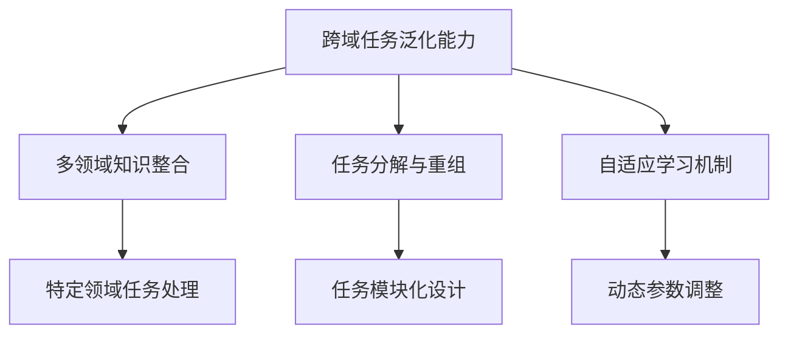
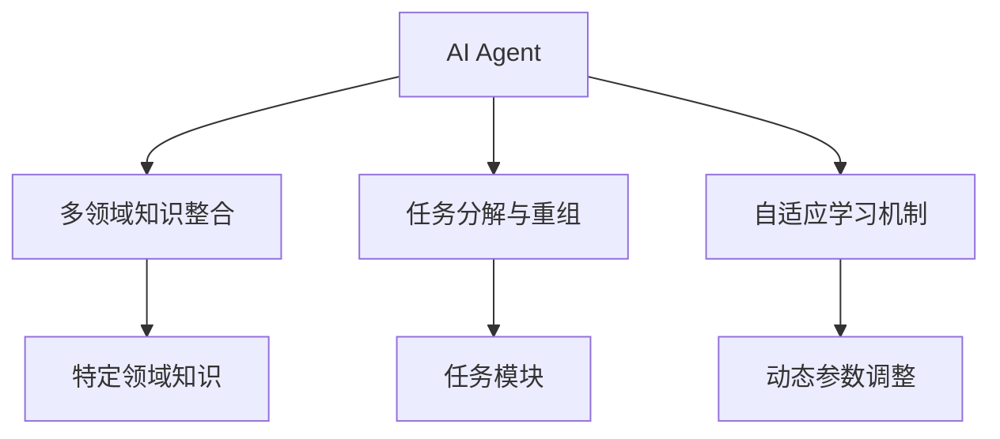
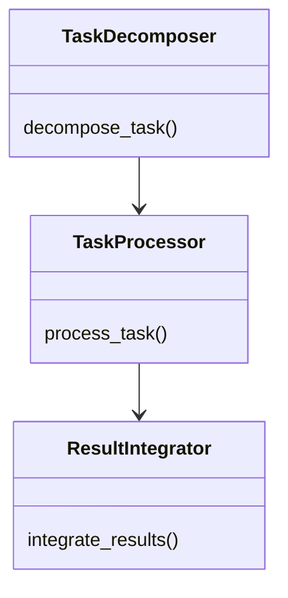
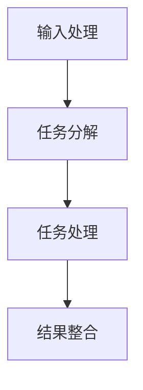
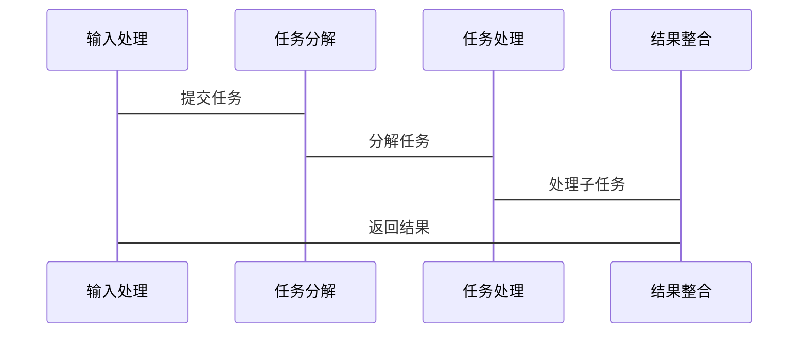

                 


# AI Agent的跨域任务泛化能力开发

## 关键词：AI Agent，跨域任务，任务泛化，多领域知识整合，自适应学习

## 摘要：AI Agent的跨域任务泛化能力开发是当前人工智能领域的重要研究方向。本文从背景介绍、核心概念、算法原理、系统架构到项目实战，全面解析AI Agent如何在不同领域任务中实现泛化能力，探讨其技术实现路径和应用潜力。

---

# 第一部分: AI Agent的跨域任务泛化能力开发背景

## 第1章: 背景介绍

### 1.1 问题背景

#### 1.1.1 当前AI Agent的发展现状
AI Agent（智能体）在多个领域展现出强大的能力，但在跨域任务处理上仍存在局限性。传统AI Agent往往局限于单一任务或特定领域，难以适应不同领域的复杂问题。

#### 1.1.2 跨域任务泛化的必要性
随着应用场景的扩展，AI Agent需要处理的任务类型日益多样化。跨域任务泛化能力是实现通用人工智能（AGI）的重要基石。

#### 1.1.3 问题解决的紧迫性
在实际应用中，AI Agent需要处理的任务可能跨越多个领域，例如客服系统需要同时处理客户咨询、订单处理和投诉处理等任务。

### 1.2 问题描述

#### 1.2.1 跨域任务的定义
跨域任务是指涉及多个不同领域或任务类型的问题。例如，一个AI Agent可能需要同时处理自然语言理解、图像识别和数据分析任务。

#### 1.2.2 泛化能力的核心要素
泛化能力是指AI Agent在不同领域任务中都能表现出色的能力。这需要在模型设计和训练过程中兼顾多个领域的特征和规律。

#### 1.2.3 当前AI Agent的局限性
现有的AI Agent通常针对特定任务或领域进行优化，缺乏跨域任务处理的能力。这限制了其在复杂应用场景中的应用。

### 1.3 解决思路

#### 1.3.1 跨域任务的分解与重组
将跨域任务分解为多个子任务，每个子任务对应特定领域的能力，然后通过模块化设计进行重组。

#### 1.3.2 泛化能力的实现路径
通过多任务学习、知识图谱整合和迁移学习等技术，提升AI Agent在不同领域任务中的适应能力。

#### 1.3.3 整体解决方案框架
构建一个模块化的AI Agent架构，每个模块负责特定领域的能力，通过协同工作实现跨域任务处理。

### 1.4 边界与外延

#### 1.4.1 跨域任务的边界界定
跨域任务的边界在于任务类型和领域的多样性，但每个任务仍需保持一定的独立性和可分解性。

#### 1.4.2 泛化能力的适用范围
泛化能力适用于需要处理多种任务类型或领域的场景，但其效果受限于模型的设计和训练数据的质量。

#### 1.4.3 相关概念的区分
跨域任务与多任务学习的区别在于，跨域任务强调任务类型和领域的多样性，而多任务学习更关注任务之间的关联性。

### 1.5 概念结构与核心要素

#### 1.5.1 核心概念的层次结构
- **顶层概念**：跨域任务泛化能力
- **中层概念**：多领域知识整合、任务分解与重组、自适应学习机制
- **底层概念**：特定领域任务处理、领域知识表示、任务模块化设计

#### 1.5.2 核心要素的详细描述
- **多领域知识整合**：整合不同领域的知识，构建统一的知识表示。
- **任务分解与重组**：将复杂任务分解为子任务，并通过模块化设计进行重组。
- **自适应学习机制**：根据任务需求动态调整模型参数和策略。

#### 1.5.3 概念之间的关系图


---

## 第2章: 核心概念与联系

### 2.1 AI Agent的定义与能力维度

#### 2.1.1 AI Agent的定义
AI Agent是一种能够感知环境、自主决策并执行任务的智能实体，具备学习、推理和自适应能力。

#### 2.1.2 能力维度
- **感知能力**：处理输入数据，理解任务需求。
- **决策能力**：基于知识和经验做出最优决策。
- **执行能力**：执行任务并输出结果。
- **学习能力**：通过反馈不断优化自身性能。

#### 2.1.3 跨域任务处理能力
AI Agent需要在不同领域任务中灵活切换，利用跨域知识库和迁移学习技术实现任务处理。

### 2.2 核心概念对比

| 概念 | 描述 | 特点 |
|------|------|------|
| 多领域知识整合 | 整合多个领域的知识，构建统一的知识表示 | 知识共享、降低领域依赖 |
| 任务分解与重组 | 将复杂任务分解为子任务，并重新组合 | 模块化设计、提升效率 |
| 自适应学习机制 | 根据任务需求动态调整模型参数 | 灵活性高、适应性强 |

### 2.3 概念结构与联系



---

## 第3章: 算法原理

### 3.1 任务分解与重组

#### 3.1.1 算法流程
1. **任务分解**：将复杂任务分解为多个子任务。
2. **任务分配**：将子任务分配给不同的处理模块。
3. **结果整合**：整合各模块的结果，输出最终答案。

#### 3.1.2 算法示例
```python
def decompose_task(main_task):
    sub_tasks = []
    for task_type in main_task.types:
        sub_tasks.append(task_type)
    return sub_tasks
```

#### 3.1.3 数学模型
$$ f_{main}(x) = \sum_{i=1}^{n} f_i(x_i) $$

### 3.2 自适应学习机制

#### 3.2.1 增量学习
$$ \theta_{new} = \theta_{old} + \alpha \cdot \nabla L $$

#### 3.2.2 迁移学习
$$ P(T|D) = \sum_{i=1}^{n} P(T|D_i)P(D_i) $$

#### 3.2.3 联合学习
$$ L_{total} = \alpha L_{source} + (1-\alpha)L_{target} $$

---

## 第4章: 系统分析与架构设计

### 4.1 问题场景介绍

#### 4.1.1 问题场景
AI Agent需要处理来自不同领域的任务，例如自然语言处理、图像识别和数据分析。

#### 4.1.2 项目介绍
开发一个通用的AI Agent系统，能够处理多种跨域任务。

### 4.2 系统功能设计

#### 4.2.1 功能模块
- **输入处理模块**：接收输入数据并进行初步处理。
- **任务分解模块**：将任务分解为子任务。
- **任务处理模块**：处理子任务并生成结果。
- **结果整合模块**：整合各子任务的结果并输出最终答案。

#### 4.2.2 领域模型类图


### 4.3 系统架构设计

#### 4.3.1 系统架构图


#### 4.3.2 接口设计
- **输入接口**：接收任务请求。
- **输出接口**：返回处理结果。

#### 4.3.3 交互序列图


---

## 第5章: 项目实战

### 5.1 环境安装

#### 5.1.1 安装Python
```bash
python --version
pip install --upgrade pip
```

#### 5.1.2 安装依赖库
```bash
pip install numpy
pip install scikit-learn
pip install matplotlib
```

### 5.2 系统核心实现

#### 5.2.1 核心代码实现
```python
class AI-Agent:
    def __init__(self):
        self.models = {}

    def decompose_task(self, task):
        sub_tasks = []
        for model in self.models:
            sub_tasks.append(task.decompose(model))
        return sub_tasks

    def process_task(self, sub_tasks):
        results = []
        for task in sub_tasks:
            results.append(self.models[task].process(task))
        return results

    def integrate_results(self, results):
        final_result = self.models['integrator'].integrate(results)
        return final_result
```

#### 5.2.2 代码解读
- **AI-Agent类**：管理多个模型，处理任务分解、任务处理和结果整合。
- **模型管理**：每个模型对应特定的子任务处理模块。

### 5.3 案例分析

#### 5.3.1 案例背景
AI Agent需要处理一个跨域任务，例如分析销售数据并生成报告。

#### 5.3.2 案例实现
```python
agent = AI-Agent()
agent.decompose_task(sales_analysis_task)
sub_tasks = agent.decompose_task(sales_analysis_task)
results = agent.process_task(sub_tasks)
final_report = agent.integrate_results(results)
```

---

## 第6章: 最佳实践

### 6.1 总结

- 跨域任务泛化能力是AI Agent的重要能力。
- 通过任务分解、知识整合和自适应学习实现跨域任务处理。

### 6.2 注意事项

- 数据质量和多样性对模型性能影响重大。
- 跨域任务处理需要平衡模块化和整体性。

### 6.3 拓展阅读

- 《Deep Learning》
- 《Multi-task Learning》
- 《Knowledge Representation and Reasoning》

---

## 作者：AI天才研究院/AI Genius Institute & 禅与计算机程序设计艺术/Zen And The Art of Computer Programming

---

以上是《AI Agent的跨域任务泛化能力开发》的技术博客文章，涵盖了从背景介绍到项目实战的完整内容，详细分析了AI Agent的跨域任务泛化能力开发的关键点。

