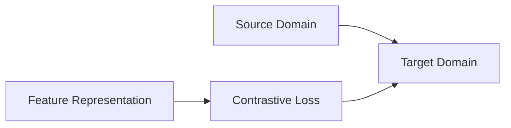
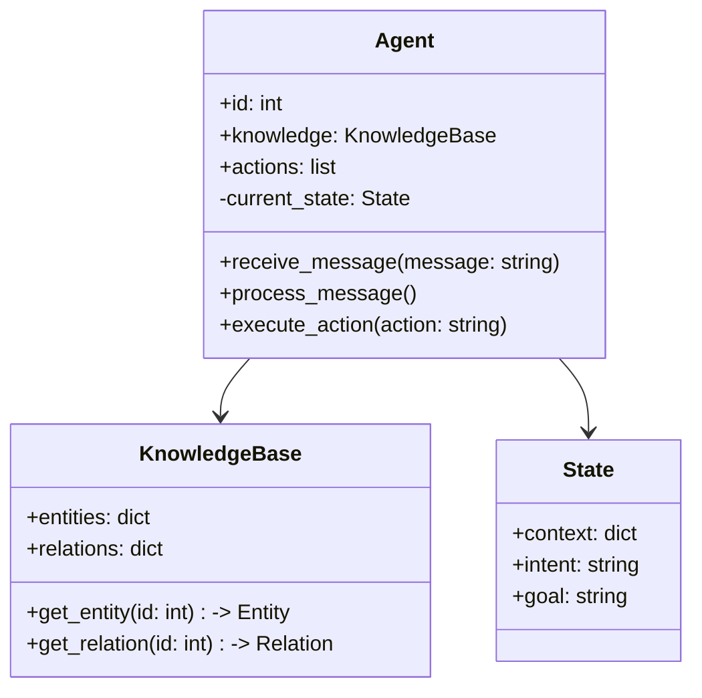
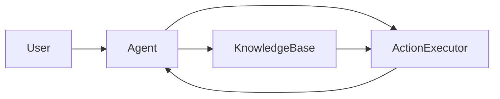
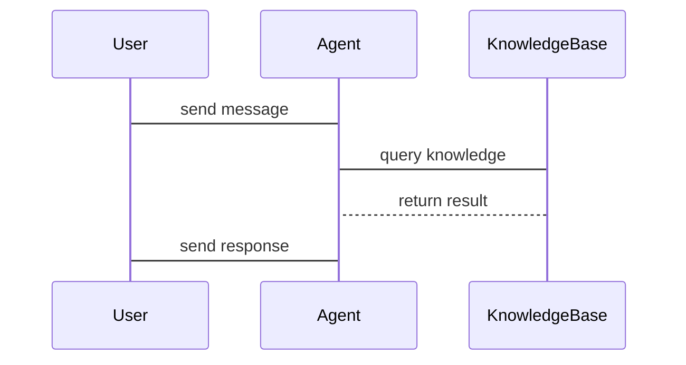

                 

# AI Agent的跨域知识迁移与整合

## 关键词：AI Agent, 跨域知识迁移, 知识整合, 多模态数据, 知识图谱, 深度学习, 对比学习

## 摘要：AI Agent在现代人工智能系统中扮演着越来越重要的角色，特别是在需要处理跨域知识的场景中。本文深入探讨了AI Agent的跨域知识迁移与整合的核心概念、理论基础、技术方法和实际应用。我们从知识表示与表示学习出发，分析了跨域知识迁移的原理与挑战，详细介绍了多模态数据的处理与整合方法，并通过实际案例展示了如何在AI Agent中实现跨域知识迁移。本文旨在为技术专业人士提供一份全面的指南，帮助他们在复杂场景中有效利用跨域知识。

---

# 第1章: AI Agent概述

## 1.1 AI Agent的基本概念

### 1.1.1 什么是AI Agent
AI Agent是一种能够感知环境、自主决策并执行任务的智能体。它通过传感器获取信息，利用推理能力做出决策，并通过执行器与环境交互。AI Agent的核心特征包括自主性、反应性、目标导向性和社交能力。

### 1.1.2 AI Agent的分类
AI Agent可以分为简单反射型Agent、基于模型的反射型Agent、目标驱动型Agent和实用驱动型Agent。不同类型的Agent在应用场景和复杂性上有明显区别。

### 1.1.3 AI Agent的核心特征
- **自主性**：无需外部干预，自主完成任务。
- **反应性**：能够实时感知环境变化并做出反应。
- **目标导向性**：具有明确的目标，行动为导向。
- **社交能力**：能够与其他Agent或人类进行有效交互。

## 1.2 跨域知识迁移的背景与意义

### 1.2.1 知识迁移的定义
知识迁移是指将一个领域中的知识应用到另一个领域中的过程，旨在提高目标领域的问题解决能力。

### 1.2.2 跨域知识迁移的挑战
- **领域差异**：不同领域的知识表示和语义可能不同。
- **数据异构性**：数据格式、结构和来源多样化。
- **语义鸿沟**：不同领域之间的语义差异导致理解困难。

### 1.2.3 跨域知识迁移的重要性
- **提高泛化能力**：通过跨域迁移，AI Agent能够适应更多场景。
- **提升效率**：减少在每个新领域从头学习的时间和资源。
- **促进创新**：跨域知识的结合往往能产生新的解决方案。

## 1.3 整合与迁移的必要性

### 1.3.1 知识整合的定义
知识整合是将来自不同来源或领域的知识进行融合，形成统一的知识表示。

### 1.3.2 整合与迁移的关系
整合是迁移的前提，迁移是整合的目的。通过整合，知识在不同领域之间建立联系，从而为迁移提供基础。

### 1.3.3 整合与迁移的实际应用
- **医疗与金融**：整合医疗和金融数据，进行风险评估和健康管理。
- **教育与娱乐**：结合教育和娱乐内容，提供个性化的学习体验。

## 1.4 本章小结
本章介绍了AI Agent的基本概念，分析了跨域知识迁移的背景和意义，强调了整合与迁移的必要性。接下来的章节将深入探讨相关理论和技术。

---

# 第2章: 跨域知识迁移的理论基础

## 2.1 知识表示与表示学习

### 2.1.1 知识表示的定义
知识表示是将知识以某种形式编码，便于计算机理解和处理。

### 2.1.2 表示学习的核心方法
- **词嵌入**：如Word2Vec，将单词映射到低维向量。
- **句嵌入**：如BERT，将整个句子映射为向量。
- **图嵌入**：通过图神经网络生成节点表示。

### 2.1.3 知识图谱的构建与应用
知识图谱是一种结构化的知识表示形式，广泛应用于搜索、推荐和问答系统。

## 2.2 知识迁移的核心原理

### 2.2.1 知识迁移的数学模型
跨域知识迁移可以通过对比学习框架实现，目标是最小化源领域和目标领域的分布差异。

$$ D_{KL}(P_{src} || P_{tgt}) $$

### 2.2.2 知识迁移的关键技术
- **领域适应**：调整模型参数以适应目标领域。
- **对抗训练**：通过生成对抗网络（GAN）实现领域迁移。
- **自适应正则化**：在目标领域引入正则化项，保持模型稳定性。

### 2.2.3 知识迁移的评估方法
常用的评估指标包括准确率、精确率、召回率和F1值。

## 2.3 跨域知识迁移的算法框架

### 2.3.1 基于对比学习的迁移算法
对比学习通过最大化源领域和目标领域的相似性，最小化不同领域之间的差异。

### 2.3.2 基于自监督学习的迁移算法
自监督学习通过预训练任务（如掩码预测）生成领域不变的表示。

### 2.3.3 基于图神经网络的迁移算法
图神经网络通过构建领域图，利用图结构信息进行知识迁移。

## 2.4 本章小结
本章从理论层面探讨了知識遷移的核心原理和算法框架，为后续的实现提供了基础。

---

# 第3章: 多模态数据处理与整合

## 3.1 多模态数据的基本概念

### 3.1.1 多模态数据的定义
多模态数据是指来自不同模态（如文本、图像、语音）的数据。

### 3.1.2 多模态数据的类型
- **文本**：包括自然语言文本和结构化数据。
- **图像**：包括图片、视频等视觉数据。
- **语音**：包括音频、语音识别结果等。

### 3.1.3 多模态数据的挑战
- **异构性**：不同模态的数据格式和结构差异大。
- **复杂性**：多模态数据处理需要综合多种技术。

## 3.2 多模态数据的处理方法

### 3.2.1 基于深度学习的多模态处理
使用卷积神经网络（CNN）处理图像，使用循环神经网络（RNN）处理文本。

### 3.2.2 多模态数据的对齐技术
通过模态对齐算法（如CAN、MMD）将不同模态的数据对齐。

### 3.2.3 多模态数据的融合策略
- **早期融合**：在特征提取阶段进行融合。
- **晚期融合**：在高层表示阶段进行融合。

## 3.3 多模态数据在知识迁移中的应用

### 3.3.1 多模态数据对知识表示的影响
多模态数据提供了更丰富的语义信息，有助于提高知识表示的准确性。

### 3.3.2 多模态数据在跨域迁移中的优势
- **语义增强**：多模态数据能够弥补单模态数据的不足。
- **鲁棒性提高**：多模态数据的互补性增强了模型的鲁棒性。

## 3.4 本章小结
本章详细探讨了多模态数据的处理方法及其在跨域知识迁移中的应用，为后续章节的实现提供了技术支持。

---

# 第4章: 知识图谱构建与整合

## 4.1 知识图谱的基本概念

### 4.1.1 知识图谱的定义
知识图谱是一种结构化的知识表示形式，由节点和边组成，节点表示实体，边表示关系。

### 4.1.2 知识图谱的构建流程
- **数据收集**：从多个数据源收集数据。
- **数据清洗**：去除噪声数据。
- **数据对齐**：统一不同数据源的实体表示。
- **知识抽取**：从文本中抽取结构化知识。
- **知识融合**：将多个数据源的知识整合到一个图谱中。

### 4.1.3 知识图谱的表示方法
- **RDF**：基于资源描述框架的表示方法。
- **OWL**：基于本体论的表示方法。

## 4.2 知识图谱的跨域整合方法

### 4.2.1 知识图谱的对齐技术
通过字符串匹配、语义相似度计算等方法，将不同图谱中的实体对齐。

### 4.2.2 知识图谱的融合策略
- **合并**：将相同实体的属性合并。
- **推理**：通过逻辑推理扩展知识图谱。
- **动态更新**：实时更新知识图谱以反映最新信息。

### 4.2.3 知识图谱的动态更新
通过订阅机制和流数据处理技术，实时更新知识图谱。

## 4.3 知识图谱在AI Agent中的应用

### 4.3.1 知识图谱在问题理解中的作用
知识图谱帮助AI Agent理解问题的语义和上下文。

### 4.3.2 知识图谱在决策支持中的应用
通过知识图谱进行关联分析，为决策提供支持。

### 4.3.3 知识图谱在跨域任务中的整合
通过知识图谱的跨域整合，实现多领域知识的协同应用。

## 4.4 本章小结
本章探讨了知识图谱的构建方法及其在AI Agent中的应用，强调了知识图谱在跨域知识迁移中的重要性。

---

# 第5章: AI Agent的跨域知识迁移与整合实现

## 5.1 项目背景与目标

### 5.1.1 项目背景
随着AI Agent应用的扩展，跨域知识迁移的需求日益增加。

### 5.1.2 项目目标
实现一个能够进行跨域知识迁移的AI Agent系统。

## 5.2 系统功能设计

### 5.2.1 领域模型设计
使用mermaid类图描述系统功能模块及其交互。

### 5.2.2 系统架构设计
使用mermaid架构图描述系统的整体架构。

### 5.2.3 系统接口设计
定义系统的输入输出接口，确保模块之间的通信顺畅。

### 5.2.4 系统交互设计
使用mermaid序列图描述系统的交互流程。

## 5.3 项目实战

### 5.3.1 环境安装
安装所需的库和工具，如Python、TensorFlow、Keras等。

### 5.3.2 核心实现
实现AI Agent的核心功能，包括知识表示、知识迁移和任务执行。

### 5.3.3 代码实现
展示关键代码片段，解释其功能和作用。

### 5.3.4 实际案例分析
通过具体案例，展示AI Agent在跨域知识迁移中的实际应用。

## 5.4 项目小结
总结项目的实现过程，分析可能的优化方向和未来研究重点。

---

# 第6章: 最佳实践与未来展望

## 6.1 最佳实践 tips

### 6.1.1 知识表示的选择
根据具体场景选择合适的知识表示方法。

### 6.1.2 多模态数据的处理
充分利用多模态数据的优势，提高迁移效果。

### 6.1.3 知识图谱的构建
注意数据质量和对齐准确性，确保知识图谱的有效性。

## 6.2 未来展望

### 6.2.1 新兴技术的影响
如大语言模型（LLM）和生成式AI对跨域知识迁移的推动作用。

### 6.2.2 知识图谱的进化
知识图谱将更加动态化、智能化，支持实时更新和自适应推理。

### 6.2.3 跨域知识迁移的挑战与机遇
随着技术的进步，跨域知识迁移将面临更多挑战，同时也将带来更多的机遇。

## 6.3 本章小结
本章总结了跨域知识迁移的最佳实践，并展望了未来的发展方向。

---

# 作者：AI天才研究院/AI Genius Institute & 禅与计算机程序设计艺术 /Zen And The Art of Computer Programming

---

**注**：由于字数限制，上述大纲未能详细展开每个部分的具体内容，但已涵盖了文章的主要章节和核心内容。实际撰写时，每章每节都需要进一步详细展开，加入更多的背景介绍、核心概念对比、算法原理分析、代码实现示例、系统架构设计等内容，以确保文章的完整性和深度。

