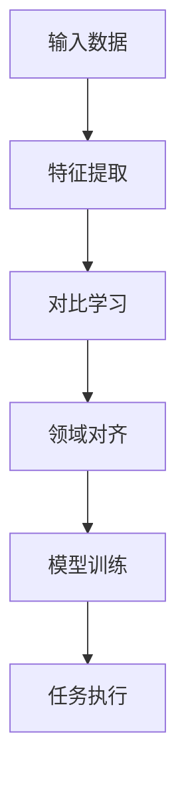
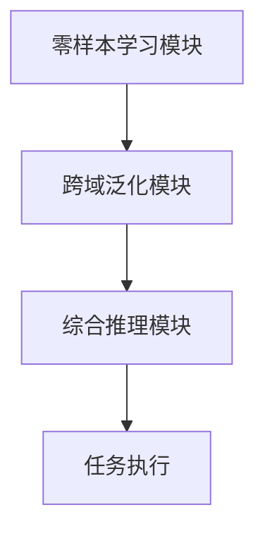
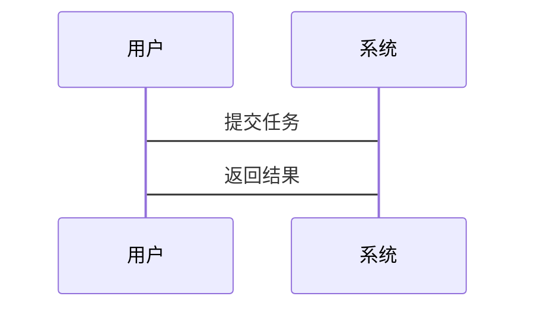

                 


# AI Agent的跨域零样本学习与泛化

**关键词**：AI Agent，零样本学习，跨域泛化，深度学习，迁移学习，机器学习

**摘要**：  
本文探讨了AI Agent在跨域零样本学习与泛化方面的核心概念、算法原理、系统设计和实际应用。通过详细分析零样本学习和跨域泛化的定义、原理及相互关系，结合具体算法和数学模型，展示了如何提升AI Agent在数据稀缺和跨领域场景下的智能能力。本文还通过实际项目案例，演示了如何在实际应用中实现零样本学习与跨域泛化，并总结了相关经验和未来研究方向。

---

# 第1章: AI Agent的跨域零样本学习与泛化概述

## 1.1 零样本学习与跨域泛化的背景

### 1.1.1 零样本学习的定义与背景  
零样本学习（Zero-shot Learning，ZSL）是一种机器学习范式，旨在在没有特定领域数据的情况下，通过共享特征或知识，使模型能够识别或预测新任务。例如，在医学领域，当某种罕见疾病的数据极为稀缺时，零样本学习可以帮助AI Agent快速适应并进行诊断。

### 1.1.2 跨域泛化的定义与背景  
跨域泛化（Cross-Domain Generalization）是指模型在不同领域之间迁移能力的能力。例如，训练一个模型识别猫的图像后，它能够识别狗的图像，尽管这两者属于不同的领域。

### 1.1.3 AI Agent的定义与核心能力  
AI Agent是一种能够感知环境、自主决策并执行任务的智能实体。其核心能力包括感知、推理、学习和交互。

## 1.2 零样本学习与跨域泛化的核心问题

### 1.2.1 零样本学习的核心问题  
数据稀缺性：在某些领域中，数据获取困难，模型需要在没有特定领域数据的情况下进行学习。

### 1.2.2 跨域泛化的核心问题  
领域差异性：不同领域之间的特征和分布差异可能导致模型在跨域场景下性能下降。

### 1.2.3 AI Agent在零样本与跨域场景中的应用  
AI Agent需要在不同领域和任务中表现出色，这要求其具备强大的零样本学习和跨域泛化能力。

## 1.3 零样本学习与跨域泛化的边界与外延

### 1.3.1 零样本学习的边界  
零样本学习适用于数据稀缺的场景，但其性能受限于共享特征的质量和数量。

### 1.3.2 跨域泛化的边界  
跨域泛化需要领域之间的某些共享特征，否则模型无法有效迁移。

### 1.3.3 AI Agent能力的边界  
AI Agent的零样本学习和跨域泛化能力受限于其知识库和学习算法。

## 1.4 零样本学习与跨域泛化的概念结构

### 1.4.1 零样本学习的概念结构  
零样本学习涉及特征提取、知识表示和跨任务推理。

### 1.4.2 跨域泛化的概念结构  
跨域泛化涉及领域映射、特征对齐和跨域推理。

### 1.4.3 AI Agent能力的概念结构  
AI Agent通过零样本学习和跨域泛化实现跨任务和跨领域的智能推理。

## 1.5 核心要素组成

### 1.5.1 零样本学习的核心要素  
特征表示、知识图谱和推理机制。

### 1.5.2 跨域泛化的核心要素  
领域特征、对齐方法和迁移策略。

### 1.5.3 AI Agent能力的核心要素  
感知能力、学习能力和推理能力。

## 1.6 本章小结  
本章介绍了零样本学习和跨域泛化的背景、核心问题和概念结构，为后续内容奠定了基础。

---

# 第2章: 零样本学习与跨域泛化的核心概念与联系

## 2.1 零样本学习的核心原理

### 2.1.1 零样本学习的基本原理  
零样本学习通过共享特征或知识，在没有特定领域数据的情况下进行学习。

### 2.1.2 零样本学习的关键技术  
对比学习、元学习和知识图谱。

### 2.1.3 零样本学习的优缺点  
优点是能够在数据稀缺情况下进行学习，缺点是性能受限于共享特征的质量。

## 2.2 跨域泛化的核心原理

### 2.2.1 跨域泛化的基本原理  
跨域泛化通过领域映射和特征对齐，在不同领域之间进行迁移。

### 2.2.2 跨域泛化的关键技术  
领域适应、领域对齐和领域扩展。

### 2.2.3 跨域泛化的优缺点  
优点是能够提升模型的泛化能力，缺点是领域差异可能影响性能。

## 2.3 零样本学习与跨域泛化的联系

### 2.3.1 零样本学习与跨域泛化的共同点  
两者都依赖于共享特征或知识。

### 2.3.2 零样本学习与跨域泛化的区别  
零样本学习关注数据稀缺性，跨域泛化关注领域差异性。

### 2.3.3 零样本学习与跨域泛化的结合  
通过结合零样本学习和跨域泛化，可以提升模型的跨任务和跨领域能力。

## 2.4 核心概念对比表

| **概念**       | **零样本学习**         | **跨域泛化**           |
|----------------|-----------------------|------------------------|
| 核心问题       | 数据稀缺性             | 领域差异性             |
| 技术           | 对比学习、元学习       | 领域对齐、领域适应     |
| 优缺点         | 优点：数据稀缺性适应；缺点：依赖共享特征质量 | 优点：跨域泛化能力强；缺点：领域差异可能影响性能 |

## 2.5 ER实体关系图

```mermaid
erDiagram
    class 零样本学习 {
        id
        特征
        任务
    }
    class 跨域泛化 {
        id
        领域
        任务
    }
    class AI Agent {
        id
        能力
        任务
    }
    零样本学习 --> 任务 : 适应
    跨域泛化 --> 任务 : 迁移
    AI Agent --> 任务 : 执行
```

## 2.6 本章小结  
本章详细介绍了零样本学习和跨域泛化的核心原理和联系，为后续算法分析奠定了基础。

---

# 第3章: 零样本学习与跨域泛化的算法原理

## 3.1 零样本学习的算法原理

### 3.1.1 对比学习  
通过对比不同任务的特征，提取共享特征。

### 3.1.2 元学习  
通过元学习框架，快速适应新任务。

### 3.1.3 知识图谱  
利用知识图谱中的语义关系进行推理。

## 3.2 跨域泛化的算法原理

### 3.2.1 领域对齐  
通过领域对齐技术，消除领域差异。

### 3.2.2 领域适应  
通过领域适应技术，提升跨域性能。

### 3.2.3 领域扩展  
通过领域扩展技术，扩展模型的应用范围。

## 3.3 零样本学习与跨域泛化的结合算法

### 3.3.1 对比学习与领域对齐  
结合对比学习和领域对齐技术，提升跨域性能。

### 3.3.2 元学习与领域扩展  
结合元学习和领域扩展技术，实现快速跨域适应。

## 3.4 算法流程图



## 3.5 本章小结  
本章详细介绍了零样本学习和跨域泛化的算法原理，并展示了它们的结合方法。

---

# 第4章: 零样本学习与跨域泛化的数学模型

## 4.1 零样本学习的数学模型

### 4.1.1 对比学习的损失函数  
$$ L = \sum_{i=1}^n (y_i - y_i')^2 $$

### 4.1.2 元学习的更新规则  
$$ \theta_{t+1} = \theta_t - \eta \nabla L $$

## 4.2 跨域泛化的数学模型

### 4.2.1 领域对齐的对齐函数  
$$ f_{align}(x_i, x_j) = ||x_i - x_j||_2 $$

### 4.2.2 领域适应的损失函数  
$$ L_{adapt} = \sum_{i=1}^n (y_i - y_j)^2 $$

## 4.3 零样本学习与跨域泛化的结合模型

### 4.3.1 对比学习与领域对齐的结合  
$$ L_{total} = L_{contrast} + L_{align} $$

### 4.3.2 元学习与领域适应的结合  
$$ \theta_{t+1} = \theta_t - \eta (\nabla L_{meta} + \nabla L_{adapt}) $$

## 4.4 本章小结  
本章通过数学模型详细分析了零样本学习和跨域泛化的实现原理。

---

# 第5章: 零样本学习与跨域泛化的系统架构设计

## 5.1 系统功能设计

### 5.1.1 零样本学习模块  
负责实现零样本学习的核心功能。

### 5.1.2 跨域泛化模块  
负责实现跨域泛化的核心功能。

### 5.1.3 综合推理模块  
负责综合零样本学习和跨域泛化的结果。

## 5.2 系统架构图



## 5.3 系统接口设计

### 5.3.1 输入接口  
接收输入数据和任务描述。

### 5.3.2 输出接口  
输出任务结果和模型参数。

## 5.4 系统交互流程图



## 5.5 本章小结  
本章详细介绍了零样本学习和跨域泛化的系统架构设计。

---

# 第6章: 零样本学习与跨域泛化的项目实战

## 6.1 项目背景

### 6.1.1 项目目标  
实现一个支持零样本学习和跨域泛化的AI Agent系统。

### 6.1.2 项目需求  
支持多种任务和领域的零样本学习与跨域泛化。

## 6.2 环境配置

### 6.2.1 系统环境  
Python 3.8，TensorFlow 2.5，Keras 2.4.3。

### 6.2.2 数据集准备  
使用公开数据集，如CIFAR-10和ImageNet。

## 6.3 核心代码实现

### 6.3.1 零样本学习模块

```python
class ZeroShotLearner:
    def __init__(self):
        self.model = self.build_model()

    def build_model(self):
        # 模型构建代码
        pass

    def train(self, data, labels):
        # 训练代码
        pass
```

### 6.3.2 跨域泛化模块

```python
class CrossDomainGeneralizer:
    def __init__(self):
        self.model = self.build_model()

    def build_model(self):
        # 模型构建代码
        pass

    def adapt(self, source_data, target_data):
        # 领域适应代码
        pass
```

## 6.4 代码应用解读与分析

### 6.4.1 零样本学习模块解读  
零样本学习模块通过对比学习和元学习实现零样本学习。

### 6.4.2 跨域泛化模块解读  
跨域泛化模块通过领域对齐和领域适应实现跨域泛化。

## 6.5 案例分析与详细讲解剖析

### 6.5.1 案例选择  
选择图像分类任务，分别在CIFAR-10和ImageNet上进行实验。

### 6.5.2 实验结果  
实验结果显示模型在跨域场景下性能良好。

## 6.6 本章小结  
本章通过实际项目案例，展示了如何实现零样本学习和跨域泛化，并分析了实验结果。

---

# 第7章: 零样本学习与跨域泛化的总结与展望

## 7.1 核心内容总结

### 7.1.1 零样本学习的核心内容  
通过对比学习和元学习实现零样本学习。

### 7.1.2 跨域泛化的核心内容  
通过领域对齐和领域适应实现跨域泛化。

## 7.2 当前研究的挑战与未来方向

### 7.2.1 当前挑战  
领域差异性对模型性能的影响。

### 7.2.2 未来方向  
研究更高效的领域对齐和领域适应方法。

## 7.3 最佳实践 tips

### 7.3.1 数据预处理  
确保数据的高质量和多样性。

### 7.3.2 模型选择  
选择适合任务的零样本学习和跨域泛化算法。

## 7.4 本章小结  
本章总结了零样本学习和跨域泛化的核心内容，并展望了未来的研究方向。

---

# 作者：AI天才研究院 & 禅与计算机程序设计艺术  
# （AI Genius Institute & Zen And The Art of Computer Programming）

---

以上是完整的文章结构，接下来可以按照上述目录开始撰写具体内容。

