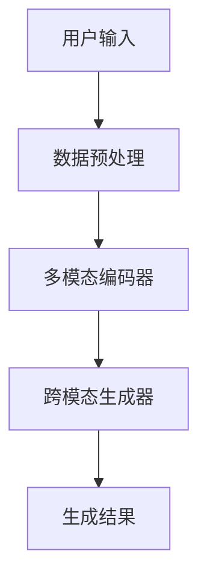
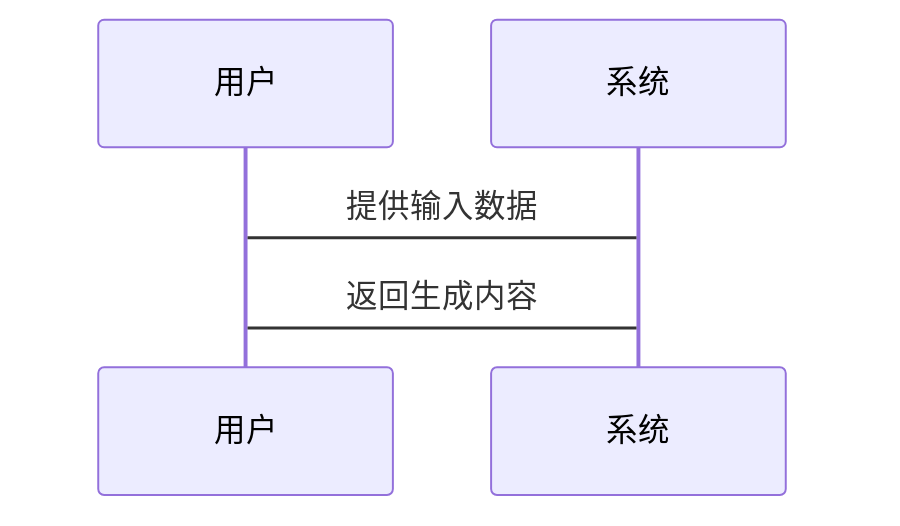
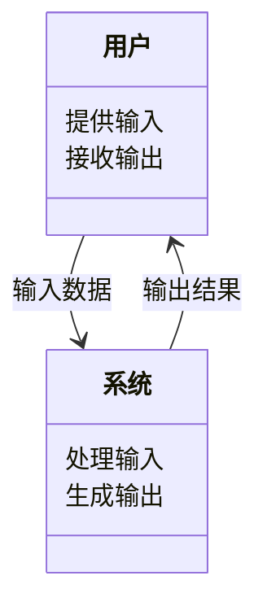

                 


# AI Agent的跨模态内容理解与生成系统

> **关键词**: AI Agent, 跨模态, 内容理解, 生成模型, 多模态数据, 深度学习, 自然语言处理  
> **摘要**: 本文探讨了AI Agent在跨模态内容理解与生成系统中的应用，详细分析了多模态数据处理、模型构建、算法原理、系统架构及实际项目案例。通过结合文本、图像、语音等多种数据类型，AI Agent能够实现更智能的内容理解和生成，为实际应用场景提供了强有力的技术支持。

---

## 第1章 AI Agent与跨模态技术概述

### 1.1 AI Agent的基本概念
AI Agent（人工智能代理）是一种能够感知环境、执行任务并做出决策的智能系统。它可以分为**反应式Agent**和**认知式Agent**两类：
- **反应式Agent**：基于当前感知做出实时反应，适用于实时交互场景。
- **认知式Agent**：具备复杂推理和规划能力，适用于复杂任务。

**跨模态技术**涉及多种数据类型的处理，包括文本、图像、语音等。AI Agent通过跨模态技术能够更好地理解用户需求并生成多样化的内容。

### 1.2 跨模态内容理解与生成的背景
跨模态技术在多个领域有广泛应用，如：
- **多模态对话系统**：结合文本和语音进行交互。
- **图像与文本生成**：如基于图像生成描述性文本。
- **视频内容分析**：通过视频和语音进行情感分析。

### 1.3 本书的核心目标与结构
本文旨在通过系统化的讲解，帮助读者掌握AI Agent在跨模态任务中的设计与实现方法。内容安排如下：
1. 第2章详细讲解跨模态数据的处理方法。
2. 第3章分析跨模态理解的核心算法。
3. 第4章设计跨模态生成系统的架构。
4. 第5章通过实际案例展示系统实现。

---

## 第2章 跨模态数据处理与模型构建

### 2.1 跨模态数据的处理方法
**多模态数据的融合**是跨模态处理的关键。常见的融合方式包括：
- **早期融合**：在特征提取前进行数据融合。
- **晚期融合**：在特征提取后进行数据融合。

**数据对齐**技术通过将不同模态的数据映射到同一空间，解决模态间语义差异问题。

### 2.2 跨模态模型的核心原理
**多模态编码器**负责将不同模态的数据转化为通用表示。例如：
- **文本编码器**：如BERT模型，将文本转化为词向量。
- **图像编码器**：如CNN和ViT，将图像转化为图像向量。

**跨模态注意力机制**通过关注不同模态的重要信息，提升模型的语义理解能力。

### 2.3 跨模态模型的训练策略
**多任务学习**通过同时优化多个任务目标，提升模型的泛化能力。例如，同时进行文本分类和图像识别。

**数据增强**通过生成更多样化的训练数据，提升模型的鲁棒性。

---

## 第3章 跨模态理解算法详解

### 3.1 多模态编码器的设计
**文本编码器**（如BERT）通过自注意力机制捕捉文本的语义信息。
$$
H = \text{BERT}(x)
$$
**图像编码器**（如ViT）将图像划分为 patches 并提取全局特征。

### 3.2 跨模态对比学习
**对比学习**通过最大化相同类别样本的相似性，提升模型的区分能力。跨模态对比学习公式为：
$$
L = -\log \frac{e^{s}}{e^{s} + \sum_{j=1}^{k} e^{s_j}}
$$
其中，$s$为正样本的相似性，$s_j$为负样本的相似性。

### 3.3 跨模态理解的数学模型
**编码器的数学表达式**：
$$
H = f_{\text{enc}}(x)
$$
**对比学习的损失函数**：
$$
L = -\log \frac{e^{s}}{e^{s} + \sum_{j=1}^{k} e^{s_j}}
$$

---

## 第4章 跨模态生成系统的算法原理

### 4.1 多模态生成模型
**多模态生成模型**结合多种数据类型，生成多样化的输出。例如，基于文本和图像生成描述性文本。

### 4.2 跨模态扩散模型
扩散模型通过逐步生成数据，提升生成质量。其数学模型如下：
$$
q(x_t | x_{t-1}) = \mathcal{N}(x_t; \mu_\theta(x_{t-1}), \sigma^2 I)
$$

### 4.3 跨模态生成的训练策略
**强化学习**通过奖励机制优化生成内容的质量。例如，使用GAN（生成对抗网络）进行跨模态生成。

---

## 第5章 跨模态生成系统的系统架构设计

### 5.1 系统功能设计
**系统功能模块**包括：
- 数据输入模块
- 模型处理模块
- 生成输出模块

### 5.2 系统架构设计
**系统架构图**如下：


### 5.3 系统接口设计
**系统接口**包括：
- 输入接口：接收多种数据类型。
- 输出接口：返回生成内容。

### 5.4 系统交互流程
**系统交互流程图**如下：


---

## 第6章 项目实战：多模态对话系统

### 6.1 项目背景与需求分析
**项目背景**：构建一个支持文本和语音交互的多模态对话系统。

### 6.2 系统设计
**系统设计图**如下：


### 6.3 系统实现
**Python核心代码**：
```python
import torch
class MultiModalAgent:
    def __init__(self, text_model, image_model):
        self.text_model = text_model
        self.image_model = image_model

    def process_input(self, input_data):
        if isinstance(input_data, str):
            return self.text_model.encode(input_data)
        elif isinstance(input_data, Image):
            return self.image_model.encode(input_data)
    
    def generate_output(self, input_features):
        # 跨模态生成逻辑
        pass
```

### 6.4 实际案例分析
通过具体案例展示系统的实际应用效果，分析其优缺点。

---

## 第7章 总结与展望

### 7.1 本书总结
本文系统地介绍了AI Agent在跨模态内容理解与生成中的应用，详细讲解了相关算法和系统设计。

### 7.2 未来研究方向
- 更高效的跨模态模型设计
- 更多样化的生成内容
- 更智能的交互方式

### 7.3 最佳实践 tips
- 在实际应用中，建议结合具体场景选择合适的模型。
- 注重数据质量，确保模型的泛化能力。

---

**作者：AI天才研究院 & 禅与计算机程序设计艺术**

