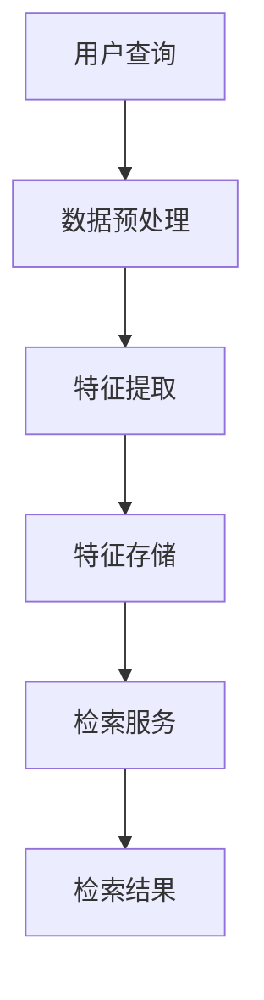

                 


# AI Agent的跨模态检索能力开发

## 关键词：AI Agent，跨模态检索，多模态数据，检索算法，系统架构，项目实战

## 摘要：  
本文深入探讨AI Agent的跨模态检索能力，从背景到核心概念，再到算法原理、系统架构设计、项目实战和最佳实践，全面解析跨模态检索技术的开发与应用。通过详细的技术分析和实际案例，帮助读者理解如何在AI Agent中实现高效的跨模态检索能力。

---

# 第一部分：AI Agent的跨模态检索能力开发背景与概念

## 第1章：跨模态检索的背景与问题描述

### 1.1 跨模态检索的背景  
跨模态检索是人工智能领域的重要技术，随着多模态数据（如文本、图像、音频、视频等）的广泛应用，跨模态检索的需求日益增长。例如，在电子商务中，用户可以通过输入文本描述来搜索图像商品；在社交媒体中，用户可以通过语音搜索相关视频内容。  

#### 1.1.1 多模态数据的兴起  
多模态数据的兴起源于数据采集技术的进步和应用场景的多样化。例如，图像识别、自然语言处理和语音识别等技术的发展，使得我们能够从多种模态中获取信息。  

#### 1.1.2 跨模态检索的定义与特点  
跨模态检索是指在不同数据模态之间进行信息检索的过程。其特点包括：  
1. **异构性**：不同模态的数据具有不同的特征和表示方式。  
2. **多样性**：支持多种模态的输入和输出。  
3. **高效性**：需要在大规模数据中快速找到相关结果。  

#### 1.1.3 跨模态检索的应用场景  
跨模态检索广泛应用于以下场景：  
- **电子商务**：通过文本描述搜索图像商品。  
- **社交媒体**：通过语音搜索相关视频内容。  
- **医疗健康**：通过病历文本检索相关医学图像。  

### 1.2 跨模态检索的核心问题  
跨模态检索的核心问题包括：  

#### 1.2.1 数据异构性问题  
不同模态的数据具有不同的特征空间，直接比较和检索存在困难。例如，文本和图像的特征维度差异较大。  

#### 1.2.2 特征对齐问题  
如何将不同模态的特征对齐，以便在检索时能够准确匹配。  

#### 1.2.3 检索效率与准确性的平衡  
在大规模数据中，如何在保证检索效率的同时，提高检索的准确性是一个挑战。  

### 1.3 跨模态检索的边界与外延  
跨模态检索的边界包括：  

#### 1.3.1 跨模态检索与其他检索技术的区别  
- **单模态检索**：在同一模态内进行检索，如文本检索、图像检索。  
- **跨模态检索**：在不同模态之间进行检索，如文本-图像检索、语音-视频检索。  

#### 1.3.2 跨模态检索的适用范围与局限性  
适用范围：  
- 支持多种模态数据的输入和输出。  
- 适用于需要跨模态信息融合的场景。  

局限性：  
- 对模型的计算能力要求较高。  
- 数据异构性可能导致检索精度下降。  

#### 1.3.3 跨模态检索的未来发展趋势  
- **多模态融合**：进一步提升不同模态数据的融合能力。  
- **实时性优化**：提高检索效率，支持实时检索。  
- **个性化检索**：基于用户偏好进行个性化检索。  

## 第2章：跨模态检索的核心概念与联系  

### 2.1 跨模态检索的核心概念  
跨模态检索的核心概念包括：  

#### 2.1.1 多模态数据的特征表示  
特征表示是跨模态检索的基础。例如，文本可以表示为词向量，图像可以表示为像素向量。  

#### 2.1.2 跨模态检索的模型结构  
跨模态检索模型通常包括编码器和解码器，用于将不同模态的数据映射到同一特征空间。  

#### 2.1.3 跨模态检索的评价指标  
常用的评价指标包括准确率、召回率、F1值等。  

### 2.2 跨模态检索的核心要素  
跨模态检索的核心要素包括：  

#### 2.2.1 数据模态的多样性  
支持多种模态数据的输入和输出。  

#### 2.2.2 特征提取的准确性  
准确提取不同模态的特征，以便在检索时能够匹配。  

#### 2.2.3 检索算法的高效性  
在大规模数据中快速找到相关结果。  

### 2.3 跨模态检索的核心原理  
跨模态检索的核心原理包括：  

#### 2.3.1 多模态数据的融合方法  
- **基于特征对齐的融合**：将不同模态的特征对齐到同一空间。  
- **基于注意力机制的融合**：通过注意力机制，聚焦重要模态信息。  

#### 2.3.2 跨模态检索的对齐策略  
- **端到端对齐**：通过深度学习模型自动学习特征对齐。  
- **显式对齐**：通过预处理将不同模态的特征对齐。  

#### 2.3.3 跨模态检索的优化方法  
- **损失函数优化**：通过损失函数引导模型优化。  
- **正则化优化**：通过正则化方法减少过拟合。  

---

# 第二部分：跨模态检索的算法原理与实现  

## 第3章：跨模态检索的算法原理  

### 3.1 跨模态检索的基本算法  

#### 3.1.1 基于相似度的检索算法  
基于相似度的检索算法通过计算不同模态数据之间的相似度进行检索。  

#### 3.1.2 基于概率的检索算法  
基于概率的检索算法通过概率模型计算检索结果的相关性。  

#### 3.1.3 基于深度学习的检索算法  
基于深度学习的检索算法通过神经网络模型提取特征并进行检索。  

### 3.2 跨模态检索的主流模型  

#### 3.2.1 图像-文本检索模型  
图像-文本检索模型通过将图像和文本映射到同一特征空间进行检索。  

#### 3.2.2 视频-文本检索模型  
视频-文本检索模型通过将视频和文本映射到同一特征空间进行检索。  

#### 3.2.3 音频-文本检索模型  
音频-文本检索模型通过将音频和文本映射到同一特征空间进行检索。  

### 3.3 跨模态检索的算法对比  

#### 3.3.1 不同检索算法的性能对比  
比较不同检索算法的性能，包括准确率、召回率等。  

#### 3.3.2 不同检索模型的优缺点分析  
分析不同检索模型的优缺点，帮助选择合适的模型。  

#### 3.3.3 算法选择的依据与策略  
根据具体应用场景选择合适的检索算法。  

## 第4章：跨模态检索的数学模型与公式  

### 4.1 跨模态检索的数学模型  

#### 4.1.1 多模态数据的表示方法  
- **文本表示**：使用词向量或BERT模型进行表示。  
- **图像表示**：使用CNN模型提取特征。  

#### 4.1.2 跨模态检索的相似度计算公式  
- **余弦相似度**：  
  $$ \text{similarity} = \frac{\mathbf{u} \cdot \mathbf{v}}{\|\mathbf{u}\| \|\mathbf{v}\|} $$  
- **欧氏距离**：  
  $$ \text{distance} = \sqrt{\sum_{i=1}^{n} (u_i - v_i)^2} $$  

#### 4.1.3 跨模态检索的损失函数  
- **对比损失**：  
  $$ \mathcal{L} = -\log(\text{similarity}(\mathbf{u}, \mathbf{v})) $$  

### 4.2 跨模态检索的核心公式  

#### 4.2.1 基于余弦相似度的检索公式  
$$ \text{similarity} = \frac{\mathbf{u} \cdot \mathbf{v}}{\|\mathbf{u}\| \|\mathbf{v}\|} $$  

#### 4.2.2 基于欧氏距离的检索公式  
$$ \text{distance} = \sqrt{\sum_{i=1}^{n} (u_i - v_i)^2} $$  

#### 4.2.3 基于概率的检索公式  
$$ P(r|d) = \frac{P(d|r)P(r)}{P(d)} $$  

---

# 第三部分：系统分析与架构设计  

## 第5章：系统分析与架构设计方案  

### 5.1 项目介绍与系统功能设计  
跨模态检索系统用于实现多种模态数据的检索功能，包括文本、图像、音频和视频的检索与匹配。  

### 5.2 系统架构设计  
系统架构设计包括：  

#### 5.2.1 系统功能模块  
- **数据预处理模块**：将多模态数据进行预处理，提取特征。  
- **特征存储模块**：将提取的特征存储到数据库中。  
- **检索服务模块**：根据输入查询，检索相关结果。  

#### 5.2.2 系统架构图  


### 5.3 系统接口设计  
系统接口包括：  

#### 5.3.1 数据输入接口  
支持多种模态数据的输入，如文本、图像、音频和视频。  

#### 5.3.2 特征提取接口  
将输入数据转换为特征向量。  

#### 5.3.3 检索接口  
根据输入查询，检索相关结果。  

### 5.4 系统交互流程图  
```mermaid
sequenceDiagram
    participant 用户
    participant 数据预处理模块
    participant 特征提取模块
    participant 检索服务模块
    用户 -> 数据预处理模块：提交查询请求
    数据预处理模块 -> 特征提取模块：提取特征
    特征提取模块 -> 检索服务模块：提交特征
    检索服务模块 -> 用户：返回检索结果
```

---

# 第四部分：项目实战  

## 第6章：跨模态检索项目实战  

### 6.1 环境安装  
需要安装以下环境：  
- Python 3.8及以上  
- PyTorch 1.9及以上  
- torchvision 0.15及以上  

### 6.2 核心代码实现  

#### 6.2.1 数据预处理代码  
```python
import torch
from torchvision import transforms

# 定义图像预处理变换
transform = transforms.Compose([
    transforms.Resize(256),
    transforms.CenterCrop(224),
    transforms.ToTensor(),
])
```

#### 6.2.2 特征提取代码  
```python
# 定义特征提取模型
class FeatureExtractor(torch.nn.Module):
    def __init__(self):
        super(FeatureExtractor, self).__init__()
        self.model = torch.hub.load('pytorch/vit:main', 'vit_base')

    def forward(self, x):
        features = self.model(x)
        return features
```

#### 6.2.3 检索服务代码  
```python
# 定义检索服务
class SearchService:
    def __init__(self):
        self.features_db = {}

    def add_feature(self, feature_id, feature):
        self.features_db[feature_id] = feature

    def search_feature(self, query_feature, top_k=5):
        similarities = {}
        for key, feature in self.features_db.items():
            similarity = torch.cosine_similarity(query_feature, feature)
            similarities[key] = similarity.item()
        # 按相似度降序排序
        sorted_items = sorted(similarities.items(), key=lambda x: x[1], reverse=True)
        return sorted_items[:top_k]
```

### 6.3 案例分析与代码解读  
通过实际案例分析，展示如何使用上述代码实现跨模态检索功能。  

### 6.4 项目小结  
总结项目实现的关键点和经验教训，为后续开发提供参考。

---

# 第五部分：最佳实践与总结  

## 第7章：最佳实践、小结与注意事项  

### 7.1 最佳实践  
- **数据预处理**：确保数据质量，减少噪声。  
- **特征提取**：选择合适的特征提取方法，提高检索精度。  
- **检索优化**：优化检索算法，提高检索效率。  

### 7.2 小结  
本文详细讲解了AI Agent的跨模态检索能力开发，从背景到核心概念，再到算法原理、系统架构设计和项目实战，帮助读者全面理解跨模态检索技术。  

### 7.3 注意事项  
- **数据隐私**：注意数据隐私保护，避免泄露用户信息。  
- **计算资源**：确保有足够的计算资源支持大规模数据处理。  
- **模型优化**：持续优化模型，提高检索精度和效率。  

---

# 附录：拓展阅读建议  

- **《Deep Learning for Visual Recognition》**  
- **《Neural Networks and Deep Learning》**  
- **《Modern Search Engines: Principles and Applications》  

---

作者：AI天才研究院 & 禅与计算机程序设计艺术

