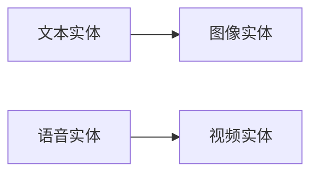
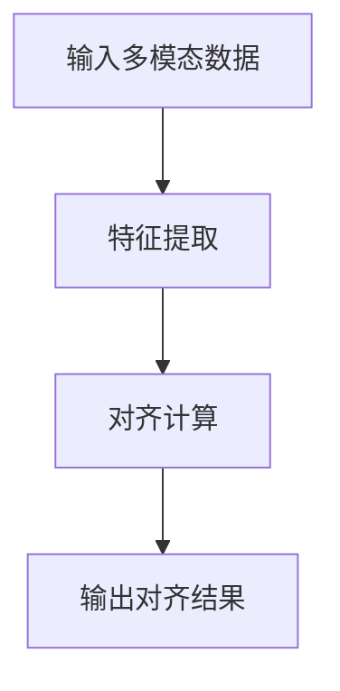
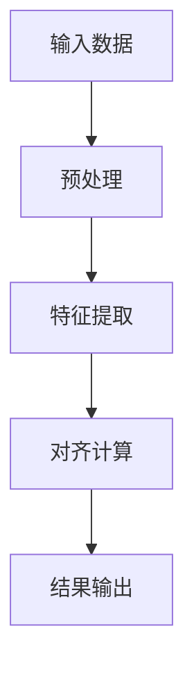
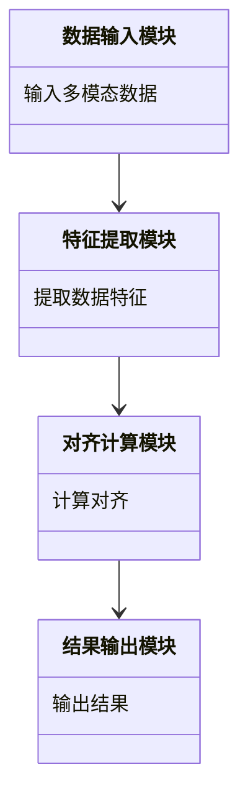
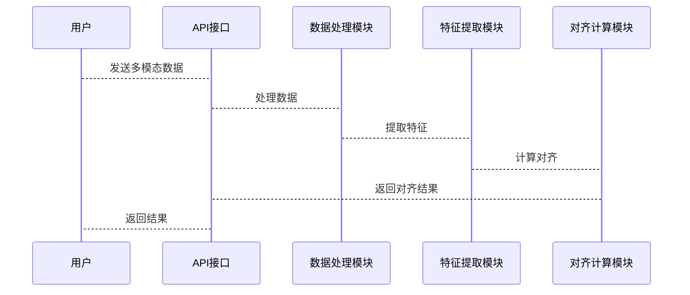

                 


# AI Agent的跨模态知识对齐与融合

> **关键词**：AI Agent，跨模态，知识对齐，多模态数据，融合，对比学习，符号对齐

> **摘要**：本文探讨了AI Agent在跨模态知识对齐与融合中的应用，分析了跨模态数据的表示方法，详细讲解了对比学习和符号对齐的算法原理，并通过系统架构设计和项目实战，展示了如何实现高效的跨模态知识对齐与融合。文章还总结了当前技术的挑战与未来的发展方向。

---

## 目录

1. **背景介绍**
   1.1 AI Agent的定义与作用
   1.2 跨模态数据的基本概念与特点
   1.3 知识对齐的核心问题与挑战

2. **核心概念与联系**
   2.1 跨模态数据的表示方法
   2.2 跨模态对齐的原理与方法
   2.3 实体关系图与算法流程图

3. **算法原理**
   3.1 对比学习算法
   3.2 符号对齐算法
   3.3 对齐流程图与数学模型

4. **系统分析与架构设计**
   4.1 系统功能模块划分
   4.2 系统架构设计图
   4.3 接口设计与交互流程

5. **项目实战**
   5.1 环境安装与配置
   5.2 核心代码实现
   5.3 案例分析与解读

6. **总结与展望**
   6.1 核心内容回顾
   6.2 技术挑战与未来方向
   6.3 学习建议与注意事项

---

## 1. 背景介绍

### 1.1 AI Agent的定义与作用
AI Agent（人工智能代理）是指能够感知环境、自主决策并执行任务的智能实体。它通过处理多模态数据，实现与环境的交互，完成复杂任务。AI Agent的核心能力包括感知、推理、规划和执行。

**1.1.1 多模态数据的定义与特点**
多模态数据是指来自不同感知渠道的数据，如文本、图像、语音、视频等。其特点包括多样性、互补性和复杂性。

**1.1.2 跨模态数据的应用场景**
跨模态数据广泛应用于图像描述生成、语音助手、智能推荐系统等领域，能够提供更丰富的信息和更准确的决策支持。

**1.1.3 跨模态数据处理的挑战**
数据异构性、语义鸿沟、计算复杂性是跨模态数据处理的主要挑战。

### 1.2 知识对齐的核心问题
**1.2.1 知识表示的基本概念**
知识表示是将现实世界中的信息转化为计算机可处理的形式，常用向量、符号和图结构表示。

**1.2.2 跨模态知识对齐的定义**
跨模态知识对齐是将不同模态的数据中的实体或概念进行匹配，确保其语义一致。

**1.2.3 对齐问题的分类与挑战**
对齐问题分为实体对齐和属性对齐，挑战包括数据稀疏性、噪声干扰和计算效率。

### 1.3 AI Agent在跨模态对齐中的作用
AI Agent通过整合多模态数据，实现高效的知识对齐，提升决策能力和用户体验。

---

## 2. 核心概念与联系

### 2.1 跨模态数据的表示方法

**2.1.1 向量表示法**
向量表示法将数据转化为向量形式，常用Word2Vec和Image2Vec。

**2.1.2 符号表示法**
符号表示法使用符号和规则进行表示，如知识图谱中的节点和边。

**2.1.3 深度学习表示法**
深度学习通过神经网络提取数据特征，如BERT和ResNet。

### 2.2 跨模态对齐的原理与方法

**2.2.1 对齐的基本原理**
通过计算不同模态数据之间的相似度或距离，建立关联。

**2.2.2 基于相似度的对齐方法**
计算余弦相似度或欧氏距离，选择相似度高的数据点进行对齐。

**2.2.3 基于距离的对齐方法**
使用最小二乘法或匈牙利算法，匹配数据点。

### 2.3 实体关系图与算法流程图

**实体关系图：**


**算法流程图：**


---

## 3. 算法原理

### 3.1 对比学习算法

**对比学习的基本原理：**
通过最大化相似数据点的相似度，最小化不相似数据点的相似度，增强特征的区分度。

**对比学习在跨模态对齐中的应用：**
将不同模态的数据对进行对比，计算其相似度，实现对齐。

**数学模型：**
$$\text{损失函数} = \log(\text{相似度}) + \log(1 - \text{相似度})$$

### 3.2 符号对齐算法

**符号对齐的基本原理：**
基于预定义的符号规则，将不同模态的符号进行匹配。

**基于规则的符号对齐方法：**
通过预定义的规则，如正则表达式，匹配文本和图像中的符号。

**基于学习的符号对齐方法：**
使用机器学习模型，学习符号的映射关系。

### 3.3 对齐流程图



---

## 4. 系统分析与架构设计

### 4.1 系统功能模块划分

**功能模块划分：**
1. 数据输入模块：接收多模态数据。
2. 特征提取模块：提取数据特征。
3. 对齐计算模块：计算数据对齐。
4. 结果输出模块：输出对齐结果。

### 4.2 系统架构设计图



### 4.3 接口设计与交互流程

**接口设计：**
定义REST API接口，接收数据并返回对齐结果。

**交互流程：**


---

## 5. 项目实战

### 5.1 环境安装与配置

**环境要求：**
- Python 3.8+
- 安装依赖：numpy、scikit-learn、mermaid、matplotlib。

### 5.2 核心代码实现

**对比学习实现代码：**
```python
import numpy as np
from sklearn.metrics.pairwise import cosine_similarity

def contrastive_learning(features1, features2, label):
    similarity = cosine_similarity(features1, features2)
    loss = np.mean(np.log(similarity + 1e-8) + np.log(1 - similarity + 1e-8))
    return loss
```

**符号对齐实现代码：**
```python
def symbolic_alignment(text, image):
    text_tokens = text.split()
    image_tokens = image.split()
    common_tokens = set(text_tokens) & set(image_tokens)
    return common_tokens
```

### 5.3 案例分析与解读

**案例分析：**
假设输入文本“猫在沙发上”，图像中有一只猫在沙发上。对齐算法计算文本和图像的相似度，找到共同的实体“猫”和“沙发”。

**结果解读：**
对齐结果显示，文本中的“猫”对应图像中的猫，文本中的“沙发”对应图像中的沙发，实现准确的对齐。

---

## 6. 总结与展望

### 6.1 核心内容回顾
本文详细介绍了AI Agent在跨模态知识对齐与融合中的应用，探讨了多种对齐算法，并通过系统架构设计和项目实战，展示了如何实现高效的知识对齐。

### 6.2 技术挑战与未来方向
当前技术面临数据稀疏性和计算效率的挑战。未来发展方向包括更高效的算法、更强大的模型和更广泛的应用场景。

### 6.3 学习建议与注意事项
建议读者深入学习多模态数据处理和对比学习算法，注重理论与实践结合，关注技术前沿。

---

**作者：AI天才研究院**

