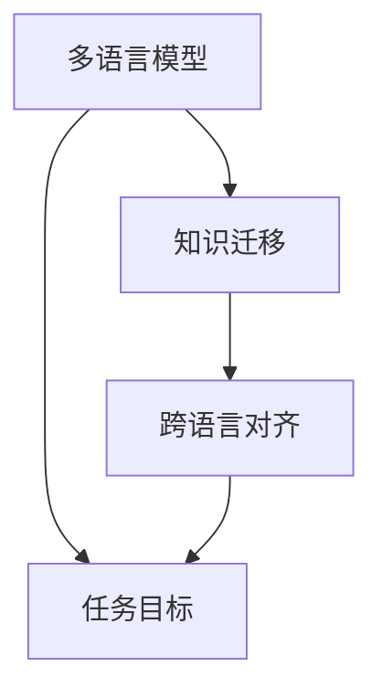
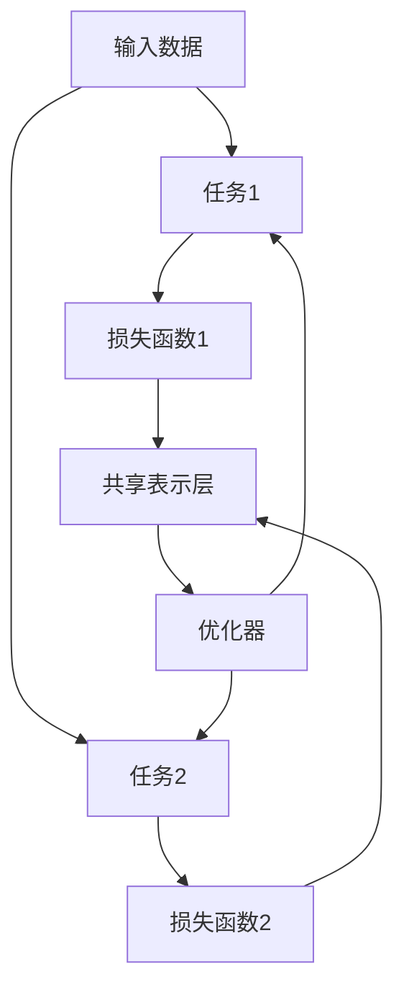
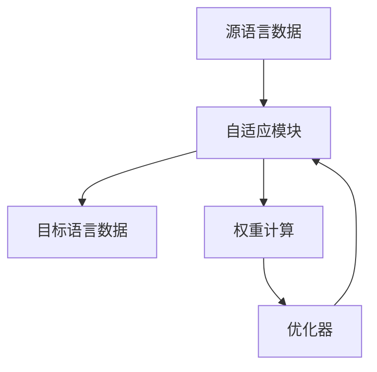
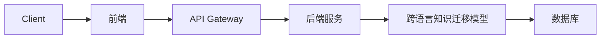

                 


# AI Agent的跨语言知识迁移技术

> **关键词**：跨语言知识迁移、AI Agent、多语言模型、迁移学习、自然语言处理

> **摘要**：  
跨语言知识迁移技术是人工智能领域的重要研究方向，旨在解决AI Agent在多语言环境下高效迁移和应用知识的挑战。本文从背景、核心概念、算法原理、数学模型、系统架构到项目实战，全面解析跨语言知识迁移技术的实现与应用。通过详细的技术分析和案例解读，帮助读者掌握跨语言知识迁移的核心原理和实际应用方法。

---

## 第一部分：背景介绍

### 第1章：跨语言知识迁移技术概述

#### 1.1 问题背景与描述

在多语言环境下，AI Agent需要能够理解并应用多种语言的知识，以实现跨语言的任务处理。然而，不同语言之间的语法、语义差异为知识迁移带来了巨大挑战。传统的单一语言模型难以应对跨语言场景的需求，导致AI Agent在多语言环境下的性能受限。

#### 1.2 核心问题解决思路

- **问题解决思路**：通过构建跨语言知识表示模型，利用迁移学习技术，将一种语言的知识迁移到其他语言，从而实现多语言任务的高效处理。
- **技术边界**：主要关注跨语言知识的表示和迁移，不涉及具体语言的语法解析或翻译任务。
- **外延**：跨语言知识迁移技术可应用于机器翻译、问答系统、文本分类等多种场景。

---

## 第二部分：核心概念与联系

### 第2章：跨语言知识迁移的核心原理

#### 2.1 核心概念解析

- **多语言模型**：能够处理多种语言数据的模型，通常基于预训练语言模型（如BERT、GPT）构建。
- **知识迁移**：将一种语言的知识迁移到另一种语言的过程，利用共享特征或跨语言对齐技术实现。
- **跨语言对齐**：通过语义对齐技术，建立不同语言之间的语义对应关系。

#### 2.2 概念对比与ER实体关系图

下表对比了跨语言知识迁移中的核心概念及其属性：

| 概念          | 属性               | 描述                                                         |
|---------------|--------------------|--------------------------------------------------------------|
| 多语言模型    | 输入语言           | 支持多种语言输入                                             |
| 知识迁移      | 迁移方式           | 直接迁移、自适应迁移                                         |
| 跨语言对齐     | 对齐策略           | 基于特征、基于语义                                           |

以下是核心概念的ER实体关系图：



---

## 第三部分：算法原理讲解

### 第3章：主流算法与实现

#### 3.1 多任务学习算法

多任务学习通过共享表示层，将多个任务的特征进行对齐，从而实现跨语言知识迁移。

##### 算法流程图（Mermaid）



##### Python实现示例

```python
import torch
import torch.nn as nn

class MultiTaskModel(nn.Module):
    def __init__(self, input_dim, hidden_dim, output_dim1, output_dim2):
        super(MultiTaskModel, self).__init__()
        self.shared_layer = nn.Linear(input_dim, hidden_dim)
        self.task1_layer = nn.Linear(hidden_dim, output_dim1)
        self.task2_layer = nn.Linear(hidden_dim, output_dim2)
    
    def forward(self, x):
        x = self.shared_layer(x)
        output1 = self.task1_layer(x)
        output2 = self.task2_layer(x)
        return output1, output2

# 示例数据
input_data = torch.randn(100, input_dim)
model = MultiTaskModel(input_dim, hidden_dim, output_dim1, output_dim2)
optimizer = torch.optim.Adam(model.parameters())
loss_fn1 = nn.MSELoss()
loss_fn2 = nn.MSELoss()

# 前向传播
outputs = model(input_data)
loss1 = loss_fn1(outputs[0], target1)
loss2 = loss_fn2(outputs[1], target2)
total_loss = loss1 + loss2

# 反向传播
optimizer.zero_grad()
total_loss.backward()
optimizer.step()
```

#### 3.2 自适应迁移学习算法

自适应迁移学习通过动态调整权重，实现跨语言知识的自适应迁移。

##### 算法流程图（Mermaid）



##### 权重计算公式

$$
w_{i} = \frac{\exp(\alpha x_i)}{\sum_{j} \exp(\alpha x_j)}
$$

其中，$\alpha$ 是调节参数，$x_i$ 是源语言任务的特征向量。

---

## 第四部分：数学模型与公式

### 第4章：关键模型解析

#### 4.1 多任务学习的数学模型

共享表示模型的损失函数为：

$$
L = \sum_{i=1}^{n} \lambda_i L_i
$$

其中，$\lambda_i$ 是任务权重，$L_i$ 是任务 $i$ 的损失函数。

#### 4.2 自适应迁移学习的公式

自适应权重计算公式：

$$
w_{i} = \frac{\exp(\alpha x_i)}{\sum_{j} \exp(\alpha x_j)}
$$

---

## 第五部分：系统分析与架构设计

### 第5章：系统设计与实现

#### 5.1 项目需求分析

- **功能需求**：支持多语言输入，实现跨语言知识迁移。
- **性能需求**：高效率处理多语言数据，确保实时响应。

#### 5.2 系统架构设计

以下是系统架构图：



---

## 第六部分：项目实战

### 第6章：跨语言知识迁移的实现

#### 6.1 环境安装

安装必要的库：

```bash
pip install torch transformers
```

#### 6.2 核心代码实现

```python
from transformers import AutoTokenizer, AutoModelForMaskedLM
import torch

# 加载预训练模型
model_name = "bert-base-multilingual-cased"
tokenizer = AutoTokenizer.from_pretrained(model_name)
model = AutoModelForMaskedLM.from_pretrained(model_name)

# 示例输入
input_ids = tokenizer("Hello world!", return_tensors="pt")
outputs = model(input_ids.input_ids)
```

---

## 第七部分：总结与展望

### 7.1 最佳实践 tips

- 在实际应用中，建议先进行小规模测试，确保模型的跨语言迁移效果。
- 使用预训练的多语言模型可以显著降低开发成本。

### 7.2 小结

本文系统地介绍了跨语言知识迁移技术的核心概念、算法原理、系统架构和项目实现。通过理论与实践结合，帮助读者掌握跨语言知识迁移的核心技术。

### 7.3 注意事项

- 在处理多语言数据时，需注意数据质量和文化差异。
- 确保模型的可解释性和透明度，避免潜在的偏见问题。

### 7.4 拓展阅读

- 《迁移学习实战》
- 《多语言自然语言处理技术》

---

## 作者：AI天才研究院/AI Genius Institute & 禅与计算机程序设计艺术/Zen And The Art of Computer Programming

---

本文通过系统性的分析与实践，深入探讨了AI Agent的跨语言知识迁移技术，为读者提供了从理论到实践的全面指导。

