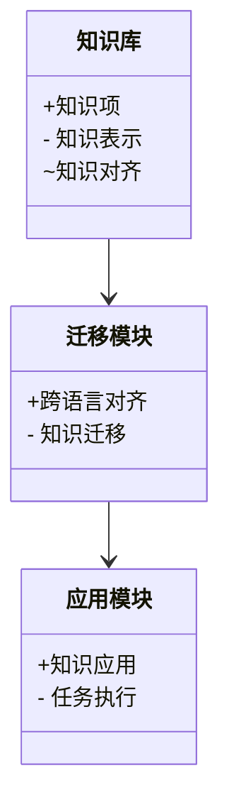

                 


# AI Agent的跨语言知识迁移技术

> 关键词：AI Agent, 跨语言知识迁移, 知识图谱, 多语言理解, 机器学习

> 摘要：AI Agent的跨语言知识迁移技术是人工智能领域的重要研究方向，旨在解决AI Agent在多语言环境下高效理解和知识共享的核心问题。本文从理论基础到实际应用，系统阐述了跨语言知识迁移的背景、原理、算法、系统架构以及项目实战，为读者提供全面的技术指南。

---

# {{此处是文章标题}}

> 关键词：{{此处列出文章的5-7个核心关键词}}

> 摘要：{{此处给出文章的核心内容和主题思想}}

---

# 第1章: AI Agent与跨语言知识迁移的背景介绍

## 1.1 AI Agent的基本概念

### 1.1.1 AI Agent的定义与特点

AI Agent（人工智能代理）是指能够感知环境、自主决策并执行任务的智能实体。其特点包括：

- **自主性**：能够在没有外部干预的情况下自主决策。
- **反应性**：能够实时感知环境并做出反应。
- **目标导向性**：具有明确的目标，并为实现目标而行动。

### 1.1.2 AI Agent的核心要素与功能

AI Agent的核心要素包括：

- **感知模块**：负责从环境中获取信息。
- **推理模块**：负责对感知到的信息进行分析和推理。
- **决策模块**：基于推理结果做出决策。
- **执行模块**：将决策转化为具体行动。

### 1.1.3 AI Agent的应用场景与领域

AI Agent的应用场景包括：

- **智能助手**：如Siri、Alexa等。
- **自动驾驶**：如自动驾驶汽车中的决策系统。
- **智能客服**：用于自动响应客户查询。

## 1.2 跨语言知识迁移的背景与意义

### 1.2.1 多语言环境下的知识共享需求

在多语言环境下，知识的共享和复用成为一个重要问题。例如，将中文知识库中的知识迁移到英文环境中，可以减少重复劳动，提高效率。

### 1.2.2 知识迁移技术的必要性

知识迁移技术可以解决以下问题：

- **数据稀疏性**：在小语种环境中，数据量有限，通过迁移可以弥补这一不足。
- **跨领域应用**：将某一领域的知识迁移到其他领域。

### 1.2.3 跨语言知识迁移的核心价值

跨语言知识迁移的核心价值在于：

- **提高效率**：通过知识迁移，减少重复劳动。
- **降低成本**：减少在多个语言环境下重新构建知识库的成本。
- **增强智能性**：使AI Agent能够理解并利用多种语言的知识。

## 1.3 本章小结

本章主要介绍了AI Agent的基本概念、核心要素及其应用场景，并重点阐述了跨语言知识迁移的背景和意义，为后续章节奠定了基础。

---

# 第2章: 跨语言知识迁移的核心概念与联系

## 2.1 跨语言知识迁移的基本原理

### 2.1.1 知识表示与编码

知识表示是跨语言迁移的基础。常用的表示方法包括：

- **符号表示**：使用符号（如概念、实体）表示知识。
- **向量表示**：使用高维向量表示知识。

### 2.1.2 跨语言对齐策略

跨语言对齐是将不同语言中的知识对齐的关键步骤。常用策略包括：

- **基于词汇的对齐**：通过词汇相似度进行对齐。
- **基于语义的对齐**：通过语义相似度进行对齐。

### 2.1.3 知识迁移的实现方式

知识迁移的实现方式包括：

- **直接迁移**：将源语言的知识直接应用于目标语言。
- **间接迁移**：通过中间语言进行知识转换。

## 2.2 跨语言知识迁移的关键技术

### 2.2.1 语言模型预训练

语言模型预训练是跨语言迁移的基础技术之一。常用的预训练模型包括：

- **BERT**：一种基于Transformer的预训练模型。
- **GPT**：生成式预训练模型。

### 2.2.2 知识图谱构建与对齐

知识图谱构建是跨语言迁移的重要步骤。常用的知识图谱构建方法包括：

- **基于规则的构建**：通过预定义规则构建知识图谱。
- **基于学习的构建**：通过机器学习方法构建知识图谱。

### 2.2.3 跨语言迁移学习

跨语言迁移学习是通过迁移学习技术实现跨语言知识迁移。常用的方法包括：

- **迁移特征提取**：提取跨语言的特征进行迁移。
- **多任务学习**：同时学习多个语言任务。

## 2.3 跨语言知识迁移的系统架构

### 2.3.1 知识表示层

知识表示层负责将知识表示为向量或符号。常用的表示方法包括：

- **向量空间模型**：将知识表示为向量。
- **符号逻辑模型**：将知识表示为符号逻辑。

### 2.3.2 跨语言对齐层

跨语言对齐层负责将不同语言中的知识对齐。常用的对齐方法包括：

- **词汇对齐**：通过词汇相似度进行对齐。
- **语义对齐**：通过语义相似度进行对齐。

### 2.3.3 知识迁移层

知识迁移层负责将对齐后的知识迁移到目标语言。常用的方法包括：

- **直接迁移**：将源语言的知识直接应用于目标语言。
- **特征迁移**：通过特征提取进行迁移。

## 2.4 本章小结

本章详细阐述了跨语言知识迁移的核心概念、关键技术及系统架构，为后续章节的算法实现和系统设计奠定了理论基础。

---

# 第3章: 跨语言知识迁移的算法原理

## 3.1 跨语言知识迁移的模型结构

### 3.1.1 编码器-解码器架构

编码器-解码器架构是跨语言迁移的常用模型结构。编码器负责将源语言的知识编码为向量，解码器负责将向量解码为目标语言的知识。

### 3.1.2 跨语言迁移的注意力机制

注意力机制可以帮助模型关注重要信息。在跨语言迁移中，注意力机制可以用于跨语言对齐。

### 3.1.3 知识嵌入的对齐方法

知识嵌入的对齐方法包括：

- **直接对齐**：将源语言和目标语言的嵌入直接对齐。
- **间接对齐**：通过中间语言进行嵌入对齐。

## 3.2 跨语言知识迁移的算法流程

### 3.2.1 数据预处理

数据预处理包括：

- **分词**：将文本分割为词语。
- **标注**：对文本进行语法标注。

### 3.2.2 模型训练

模型训练包括：

- **参数优化**：通过优化算法（如梯度下降）优化模型参数。
- **损失函数计算**：计算模型的损失函数并进行反向传播。

### 3.2.3 知识迁移

知识迁移包括：

- **跨语言对齐**：将源语言的知识对齐到目标语言。
- **知识应用**：将目标语言的知识应用于具体任务。

## 3.3 跨语言知识迁移的数学模型

### 3.3.1 编码器-解码器模型

编码器-解码器模型的数学表示如下：

$$
E(x) = \text{编码器}(x)
$$

$$
D(y) = \text{解码器}(y)
$$

### 3.3.2 跨语言对齐模型

跨语言对齐模型的数学表示如下：

$$
f_{align}(x, y) = \text{对齐}(x, y)
$$

## 3.4 本章小结

本章详细介绍了跨语言知识迁移的算法原理，包括模型结构、算法流程及数学模型，并通过具体例子说明了算法的实现过程。

---

# 第4章: 跨语言知识迁移的数学模型和公式

## 4.1 跨语言知识迁移的数学表示

### 4.1.1 知识表示的向量化

知识表示的向量化可以表示为：

$$
x_i = \text{向量}(x_i)
$$

### 4.1.2 跨语言对齐的数学公式

跨语言对齐的数学公式可以表示为：

$$
f_{align}(x_i, y_i) = \text{对齐}(x_i, y_i)
$$

## 4.2 跨语言知识迁移的损失函数

### 4.2.1 损失函数的定义

损失函数的定义如下：

$$
L = \frac{1}{N} \sum_{i=1}^{N} \text{损失}(x_i, y_i)
$$

### 4.2.2 损失函数的优化

损失函数的优化可以通过梯度下降方法进行：

$$
\theta_{t+1} = \theta_t - \eta \frac{\partial L}{\partial \theta_t}
$$

## 4.3 本章小结

本章详细推导了跨语言知识迁移的数学模型和公式，并通过具体例子说明了如何应用这些公式进行知识迁移。

---

# 第5章: 跨语言知识迁移的系统分析与架构设计

## 5.1 系统应用场景

跨语言知识迁移的系统应用场景包括：

- **多语言客服系统**：支持多种语言的客服对话。
- **跨语言信息检索**：在多语言环境下进行信息检索。

## 5.2 系统功能设计

### 5.2.1 领域模型设计

领域模型设计可以通过Mermaid类图表示：



### 5.2.2 系统架构设计

系统架构设计可以通过Mermaid架构图表示：


### 5.2.3 系统接口设计

系统接口设计包括：

- **知识库接口**：提供知识库的访问接口。
- **迁移模块接口**：提供跨语言对齐和知识迁移的接口。
- **应用模块接口**：提供知识应用和任务执行的接口。

## 5.3 本章小结

本章详细分析了跨语言知识迁移的系统应用场景，并通过Mermaid图展示了系统架构和接口设计。

---

# 第6章: 跨语言知识迁移的项目实战

## 6.1 项目环境配置

### 6.1.1 系统环境

- 操作系统：Linux/Windows/MacOS
- Python版本：3.8+

### 6.1.2 工具安装

- 安装Python库：`transformers`, `numpy`, `scikit-learn`

## 6.2 核心代码实现

### 6.2.1 数据预处理

```python
def preprocess_data(data):
    # 分词
    tokenized_data = [word_tokenize(sentence) for sentence in data]
    # 标注
    tagged_data = [pos_tag(sentence) for sentence in tokenized_data]
    return tagged_data
```

### 6.2.2 模型训练

```python
def train_model(train_data):
    # 初始化模型
    model = TransformerModel()
    # 训练模型
    model.train(train_data)
    return model
```

### 6.2.3 知识迁移

```python
def knowledge_alignment(source_data, target_data):
    # 对齐知识
    aligned_data = aligner.align(source_data, target_data)
    return aligned_data
```

## 6.3 项目案例分析

### 6.3.1 案例背景

假设我们有一个中文知识库，需要将其迁移到英文环境。

### 6.3.2 数据处理

```python
source_data = ["中国", "北京", "首都"]
target_data = ["China", "Beijing", "capital"]
```

### 6.3.3 知识迁移

```python
aligned_data = knowledge_alignment(source_data, target_data)
print(aligned_data)  # 输出对齐后的数据
```

## 6.4 项目总结

本章通过一个实际项目案例，详细介绍了跨语言知识迁移的实现过程，包括数据预处理、模型训练和知识迁移。

---

# 第7章: 跨语言知识迁移的最佳实践与未来展望

## 7.1 最佳实践

### 7.1.1 数据质量

确保数据质量和多样性，以提高迁移效果。

### 7.1.2 模型选择

根据具体任务选择合适的模型和算法。

### 7.1.3 性能优化

通过优化算法和调整参数提高系统性能。

## 7.2 未来展望

### 7.2.1 新兴技术

随着人工智能技术的发展，跨语言知识迁移将更加智能化和自动化。

### 7.2.2 应用场景

跨语言知识迁移将在更多领域得到应用，如多语言自然语言处理、跨语言信息检索等。

## 7.3 本章小结

本章总结了跨语言知识迁移的最佳实践，并展望了未来的发展方向。

---

# 结语

跨语言知识迁移是人工智能领域的重要研究方向，其应用前景广阔。通过本文的系统阐述，读者可以全面了解跨语言知识迁移的理论基础、算法实现和系统设计，并通过项目实战掌握其实现方法。

---

# 作者

作者：AI天才研究院/AI Genius Institute & 禅与计算机程序设计艺术 /Zen And The Art of Computer Programming

