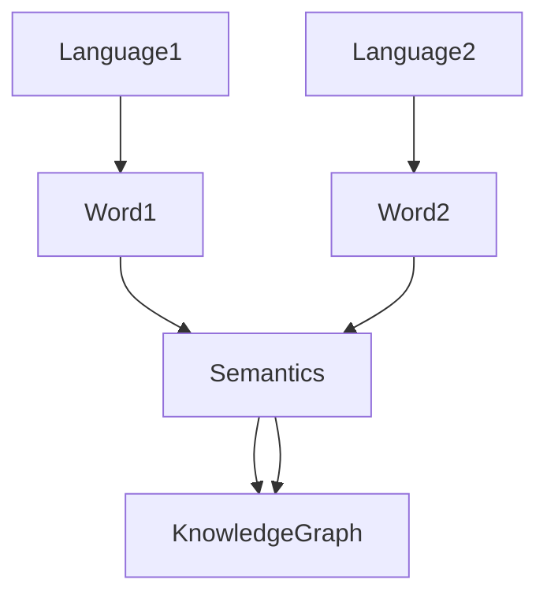
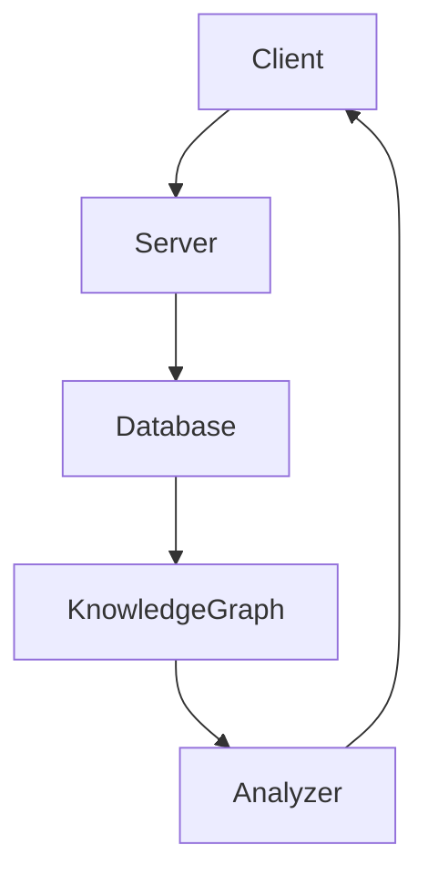

                 

# AI Agent的跨语言知识迁移：突破语言障碍

## 关键词：AI Agent, 跨语言知识迁移, 多语言学习, 知识图谱, 跨语言对齐

## 摘要：  
AI Agent的跨语言知识迁移是人工智能领域的重要研究方向，旨在解决语言障碍，使AI代理能够理解和处理多种语言的知识。本文从理论到实践，详细探讨了跨语言知识迁移的核心概念、算法原理、系统设计和项目实战，帮助读者全面理解并掌握跨语言知识迁移的技术与应用。

---

# 第1章: 跨语言知识迁移的背景与问题描述

## 1.1 跨语言知识迁移的背景

### 1.1.1 人工智能与自然语言处理的发展  
人工智能（AI）和自然语言处理（NLP）的结合推动了技术的快速发展。然而，当前的NLP模型大多局限于单一语言，难以应对多语言环境中的复杂问题。跨语言知识迁移的提出，正是为了解决这一局限性。

### 1.1.2 跨语言知识迁移的必要性  
在全球化的背景下，跨语言知识迁移的重要性日益凸显。企业、研究机构和开发者需要处理多语言数据，构建通用的AI系统，跨语言知识迁移成为不可或缺的技术手段。

### 1.1.3 当前技术的局限性  
现有技术在处理多语言数据时，存在知识表示不一致、跨语言对齐困难等问题。这些问题限制了AI Agent在多语言场景下的应用。

## 1.2 跨语言知识迁移的核心问题

### 1.2.1 知识表示的跨语言一致性  
不同语言中的知识表示可能存在差异，如何统一表示是跨语言知识迁移的核心挑战。

### 1.2.2 跨语言数据的对齐问题  
如何将不同语言的数据进行有效对齐，确保信息的一致性和准确性，是跨语言知识迁移的关键。

### 1.2.3 跨语言模型的可解释性  
跨语言模型的可解释性不足，影响了其在实际应用中的信任度和适用性。

## 1.3 跨语言知识迁移的目标与边界

### 1.3.1 跨语言知识迁移的目标  
构建统一的知识表示，实现多语言数据的高效对齐和知识共享。

### 1.3.2 跨语言知识迁移的边界  
限定于结构化知识的跨语言迁移，不涉及图像或语音等其他模态的数据。

### 1.3.3 跨语言知识迁移的外延  
跨语言知识迁移的应用场景包括多语言问答系统、跨语言信息检索等。

## 1.4 跨语言知识迁移的核心要素

### 1.4.1 多语言数据集  
构建包含多种语言的数据集，为跨语言知识迁移提供基础。

### 1.4.2 跨语言表示模型  
设计能够统一表示多语言知识的模型，为后续对齐和迁移提供支持。

### 1.4.3 知识图谱构建与迁移  
通过知识图谱构建技术，实现多语言知识的组织和共享。

## 1.5 本章小结  
本章从背景、问题、目标和核心要素四个方面，全面介绍了跨语言知识迁移的背景和核心概念。

---

# 第2章: 跨语言知识迁移的核心概念与原理

## 2.1 跨语言知识迁移的核心概念

### 2.1.1 多语言表示学习  
通过训练模型，使得不同语言的词汇和语义能够在统一的表示空间中对齐。

### 2.1.2 跨语言对齐  
将不同语言的词汇、短语或句子映射到相同的表示空间，实现跨语言信息的对齐。

### 2.1.3 知识图谱的跨语言一致性  
构建统一的多语言知识图谱，确保不同语言之间的知识一致性和可迁移性。

## 2.2 跨语言知识迁移的原理

### 2.2.1 跨语言表示学习的数学模型  
通过多语言嵌入模型（如Multilingual BERT）实现跨语言表示学习。

$$ \text{损失函数} = \sum_{i=1}^{n} \text{loss}(x_i, y_i) $$  

### 2.2.2 跨语言对齐的算法原理  
通过对比学习或对齐损失，优化多语言表示的对齐度。

### 2.2.3 知识图谱的构建与迁移  
通过知识抽取、融合和对齐技术，构建跨语言知识图谱。

## 2.3 跨语言知识迁移的核心要素对比

### 2.3.1 多语言表示学习的对比分析  
对比分析了多种多语言表示学习方法的优缺点，如XLM、Marian等。

### 2.3.2 跨语言对齐的对比分析  
分析了跨语言对齐的不同方法，如基于映射的对齐和基于对比学习的对齐。

### 2.3.3 知识图谱构建的对比分析  
对比了知识图谱构建的不同方法，如基于规则和基于统计的方法。

## 2.4 跨语言知识迁移的ER实体关系图

---

# 第3章: 跨语言知识迁移的算法原理与数学模型

## 3.1 跨语言知识迁移的算法原理

### 3.1.1 多语言表示学习算法  
通过预训练模型（如Multilingual BERT）实现多语言表示学习。

### 3.1.2 跨语言对齐算法  
通过对比学习或对齐损失优化跨语言表示。

### 3.1.3 知识图谱构建与迁移算法  
通过知识抽取、融合和对齐技术构建跨语言知识图谱。

## 3.2 跨语言知识迁移的数学模型

### 3.2.1 多语言表示学习的数学模型  
定义了多语言表示学习的损失函数和优化目标。

$$ L = \sum_{i=1}^{n} \text{cross-entropy}(x_i, y_i) $$  

### 3.2.2 跨语言对齐的数学模型  
通过对比学习实现跨语言对齐。

$$ L_{align} = \sum_{i=1}^{n} \text{contrastive}(x_i, y_i) $$  

### 3.2.3 知识图谱的构建与迁移的数学模型  
通过知识图谱的构建和对齐，实现多语言知识的统一表示。

---

# 第4章: 跨语言知识迁移的系统分析与架构设计

## 4.1 系统功能设计

### 4.1.1 多语言数据处理  
支持多种语言的数据输入和处理。

### 4.1.2 跨语言表示学习  
实现多语言表示学习和对齐。

### 4.1.3 知识图谱构建  
构建跨语言知识图谱，实现知识的共享和复用。

## 4.2 系统架构设计

---

# 第5章: 跨语言知识迁移的项目实战

## 5.1 环境安装

### 5.1.1 安装Python和相关库  
安装必要的Python库，如TensorFlow、Keras等。

## 5.2 系统核心实现

### 5.2.1 多语言表示学习代码  
实现多语言表示学习的代码示例。

## 5.3 代码应用解读与分析

### 5.3.1 代码功能解读  
详细解读代码的功能和实现细节。

## 5.4 实际案例分析

### 5.4.1 跨语言问答系统案例  
通过跨语言问答系统案例，展示跨语言知识迁移的应用。

---

# 第6章: 跨语言知识迁移的最佳实践与注意事项

## 6.1 跨语言知识迁移的最佳实践

### 6.1.1 数据预处理  
确保数据清洗和标注的准确性。

### 6.1.2 模型选择与优化  
选择合适的模型，并进行参数优化。

### 6.1.3 系统测试与部署  
进行全面的系统测试，并进行部署和监控。

## 6.2 跨语言知识迁移的注意事项

### 6.2.1 数据多样性  
确保训练数据的多样性，避免模型偏见。

### 6.2.2 模型可解释性  
提升模型的可解释性，增强用户信任。

### 6.2.3 系统性能优化  
优化系统性能，提升用户体验。

---

# 第7章: 附录

## 7.1 参考文献  
列出相关的参考文献和资料。

## 7.2 工具推荐  
推荐相关的工具和库。

## 7.3 术语表  
解释文章中的专业术语。

---

# 作者：AI天才研究院/AI Genius Institute & 禅与计算机程序设计艺术 /Zen And The Art of Computer Programming

