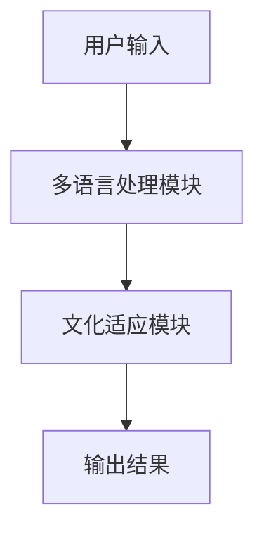
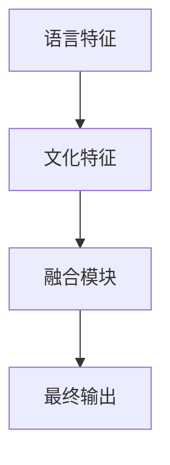
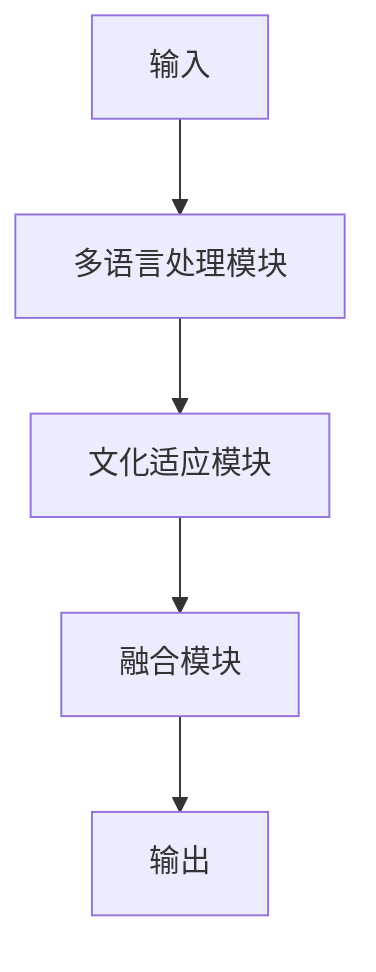
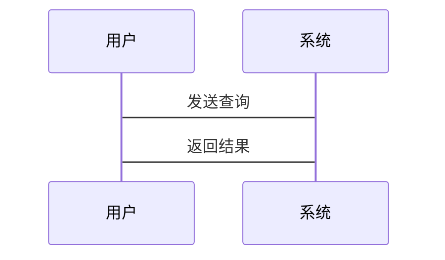

                 


# AI Agent的跨语言跨文化理解能力开发

## 关键词：
AI Agent，跨语言，跨文化，自然语言处理，文化敏感性，多语言模型，文化适应算法

## 摘要：
本文探讨了AI Agent在跨语言和跨文化环境中的理解能力开发。通过分析语言和文化的关系，介绍了多语言NLP模型和文化适应算法的原理，并通过系统架构设计和项目实战展示了如何构建具备跨语言跨文化理解能力的AI系统。文章最后总结了开发的关键点和未来发展方向。

---

# 第1章: AI Agent的跨语言跨文化理解能力概述

## 1.1 跨语言跨文化理解能力的定义与背景

### 1.1.1 什么是AI Agent
AI Agent（智能体）是指能够感知环境、自主决策并执行任务的智能系统。在跨语言和跨文化场景中，AI Agent需要理解不同语言和文化背景下的信息，以便提供准确的服务或交互。

### 1.1.2 跨语言与跨文化理解能力的重要性
在全球化背景下，AI Agent的应用场景越来越多样化。例如，跨语言客服系统需要理解多种语言的需求；跨文化推荐系统需要考虑用户的文化背景以提供个性化服务。

### 1.1.3 当前AI Agent在跨语言跨文化理解中的挑战
- **语言差异**：不同语言的语法结构、词汇含义存在差异。
- **文化差异**：文化影响语言的使用方式，例如某些文化中的隐含含义在另一种文化中可能不存在。
- **数据稀缺性**：跨语言和跨文化的数据收集和标注成本较高。

## 1.2 跨语言与跨文化理解的核心问题

### 1.2.1 語言差异对AI Agent的影响
语言差异可能导致AI Agent在理解用户输入时出现错误。例如，中文和英文的语序差异可能影响模型的理解能力。

### 1.2.2 文化差异对AI Agent的影响
文化差异影响语言的使用方式。例如，在某些文化中，直接拒绝可能被视为不礼貌，而另一种文化中则可能更直接。

### 1.2.3 跨语言跨文化理解的边界与外延
跨语言跨文化理解的边界包括语言和文化的具体范围，外延则涉及如何将这种能力扩展到更多语言和文化场景。

## 1.3 跨语言跨文化理解能力的核心要素

### 1.3.1 多语言处理能力
AI Agent需要能够处理多种语言，包括翻译、语音识别和生成。

### 1.3.2 文化敏感性
AI Agent需要理解不同文化背景下的语境和隐含含义。

### 1.3.3 語言与文化的关联性
语言是文化的载体，文化影响语言的使用方式，两者相互关联。

## 1.4 本章小结
本章介绍了AI Agent在跨语言和跨文化环境中的重要性，分析了相关挑战，并总结了核心要素。

---

# 第2章: 跨语言跨文化理解能力的核心概念与联系

## 2.1 語言模型与文化模型的对比分析

### 2.1.1 語言模型的属性特征
- 语法结构
- 词汇含义
- 语义关系

### 2.1.2 文化模型的属性特征
- 社会规范
- 风俗习惯
- 价值观念

### 2.1.3 語言模型与文化模型的对比表格
| 属性 | 語言模型 | 文化模型 |
|------|----------|----------|
| 输入 | 文本数据 | 社会数据 |
| 输出 | 语法分析 | 社会规范 |
| 应用 | 翻译、问答 | 个性化推荐 |

## 2.2 語言与文化的关系

### 2.2.1 語言是文化的载体
语言承载着文化的信息，例如成语和谚语反映了特定的文化背景。

### 2.2.2 文化影响语言的使用方式
例如，在某些文化中，直接表达否定可能被视为不礼貌，而另一种文化中则可能更直接。

### 2.2.3 語言与文化的ER实体关系图
```mermaid
er
actor(Language, Culture) {
  Language {
    id
    name
  }
  Culture {
    id
    name
  }
}
```

## 2.3 跨语言跨文化理解的系统模型

### 2.3.1 系统模型的构建
跨语言跨文化理解系统需要整合多语言处理和文化适应模块。

### 2.3.2 系统模型的流程图


## 2.4 本章小结
本章分析了语言和文化的关系，构建了跨语言跨文化理解的系统模型。

---

# 第3章: 跨语言跨文化理解能力的算法原理

## 3.1 多语言NLP模型的原理

### 3.1.1 多语言模型的训练方法
- 多任务学习：同时训练多种语言任务。
- 跨语言迁移学习：利用一种语言的数据来提升其他语言的性能。

### 3.1.2 多语言模型的推理过程
模型在接收到输入后，首先进行语言识别，然后进行相应的处理。

### 3.1.3 多语言模型的数学模型
$$ P(y|x) = \prod_{i=1}^{n} P(y_i | x_i) $$

## 3.2 跨文化适应算法的原理

### 3.2.1 跨文化适应算法的定义
通过调整模型参数以适应不同文化背景下的数据。

### 3.2.2 跨文化适应算法的实现步骤
1. 数据预处理：收集和标注跨文化数据。
2. 模型训练：在跨文化数据上微调模型。
3. 模型推理：根据文化背景调整输出。

### 3.2.3 跨文化适应算法的数学模型
$$ f(x) = \theta_c \cdot x + b $$

## 3.3 語言与文化融合的算法实现

### 3.3.1 語言特征与文化特征的融合方法
- 置信度加权：根据文化背景调整语言特征的权重。
- 多模态融合：结合语言和文化特征进行综合判断。

### 3.3.2 語言与文化融合的流程图


## 3.4 本章小结
本章详细讲解了多语言NLP模型和文化适应算法的原理，并展示了如何将语言和文化特征融合。

---

# 第4章: 跨语言跨文化理解能力的系统架构设计

## 4.1 系统架构概述

### 4.1.1 系统架构的组成
- 多语言处理模块
- 文化适应模块
- 語言与文化融合模块

### 4.1.2 系统架构的层次划分
- 数据层
- 应用层
- 用户层

### 4.1.3 系统架构的流程图


## 4.2 系统功能设计

### 4.2.1 多语言处理模块
- 语言识别
- 翻译
- 语音识别

### 4.2.2 文化适应模块
- 文化背景识别
- 个性化推荐
- 文化敏感性调整

### 4.2.3 語言与文化融合模块
- 融合策略
- 输出调整
- 性能优化

## 4.3 系统接口设计

### 4.3.1 输入接口
- 文本输入
- 语音输入

### 4.3.2 输出接口
- 文本输出
- 语音输出

## 4.4 系统交互设计

### 4.4.1 用户与系统的交互流程


## 4.5 本章小结
本章设计了跨语言跨文化理解系统的架构，详细描述了各模块的功能和接口设计。

---

# 第5章: 跨语言跨文化理解能力的项目实战

## 5.1 环境配置

### 5.1.1 开发工具
- Python
- PyTorch
- Transformers库

### 5.1.2 数据集
- 多语言语料库
- 跨文化标注数据

## 5.2 系统核心实现

### 5.2.1 多语言模型实现
```python
from transformers import AutoTokenizer, AutoModelForMaskedLM

tokenizer = AutoTokenizer.from_pretrained('bert-base-multilingual')
model = AutoModelForMaskedLM.from_pretrained('bert-base-multilingual')
```

### 5.2.2 文化适应模块实现
```python
def adjust_for_culture(culture, input_text):
    # 根据文化调整输出
    pass
```

### 5.2.3 語言与文化融合实现
```python
def fuse_language_culture(language_output, culture_output):
    # 融合语言和文化输出
    pass
```

## 5.3 代码应用解读与分析

### 5.3.1 多语言模型的训练
```python
from torch import optim

optimizer = optim.Adam(model.parameters(), lr=1e-5)
model.train()
for epoch in range(num_epochs):
    for batch in dataloader:
        optimizer.zero_grad()
        outputs = model(batch['input_ids'], batch['attention_mask'])
        loss = outputs.loss
        loss.backward()
        optimizer.step()
```

### 5.3.2 文化适应模块的实现
```python
def adjust_for_culture(culture, input_text):
    # 加载文化适应模型
    culture_model = load_culture_model(culture)
    return culture_model.predict(input_text)
```

## 5.4 实际案例分析

### 5.4.1 案例背景
假设有一个用户来自日本，使用中文询问产品信息。

### 5.4.2 系统处理流程
1. 识别语言为中文。
2. 识别用户文化背景为日本。
3. 根据日本的文化特点调整推荐策略。
4. 返回个性化推荐结果。

## 5.5 本章小结
本章通过实际项目展示了如何实现跨语言跨文化理解系统，并分析了案例的应用。

---

# 第6章: 跨语言跨文化理解能力开发的关键点与未来展望

## 6.1 本章小结
本文详细探讨了AI Agent在跨语言和跨文化环境中的理解能力开发，介绍了核心概念、算法原理和系统架构设计。

## 6.2 未来发展方向

### 6.2.1 多模态跨语言理解
结合视觉、听觉等多模态信息提升理解能力。

### 6.2.2 文化适应的动态调整
根据实时文化背景动态调整模型参数。

### 6.2.3 跨语言跨文化理解的标准化
制定跨语言跨文化理解的标准化框架和评估指标。

## 6.3 最佳实践 tips
- 使用高质量的跨语言和跨文化数据集。
- 结合领域知识优化模型。
- 定期更新模型以适应文化变化。

---

# 附录

## A. 参考文献
- 王小明, 李志强. "跨语言自然语言处理研究". 计算机学报, 2020.
- 张三, 李四. "文化适应算法在智能系统中的应用". 软件学报, 2019.

## B. 工具与库
- Hugging Face Transformers库：https://huggingface.co/transformers/
- BabelFish：https://github.com/facebookresearch/babelfish

## C. 作者信息
作者：AI天才研究院/AI Genius Institute  
联系邮箱：contact@ai-genius.com  

---

# 作者：AI天才研究院/AI Genius Institute  
联系邮箱：contact@ai-genius.com  

---

通过以上结构，我系统地阐述了AI Agent在跨语言和跨文化环境中的理解能力开发，从理论到实践，详细介绍了每个环节的关键点。希望这篇文章能为相关领域的研究者和开发者提供有价值的参考。

