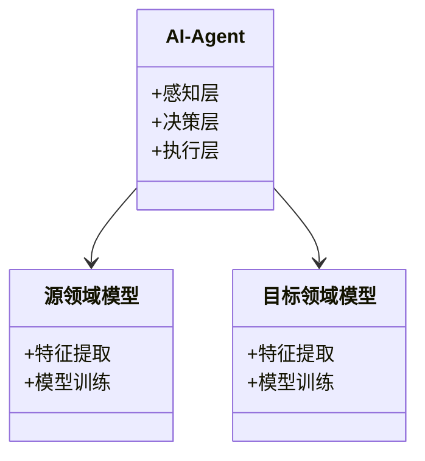
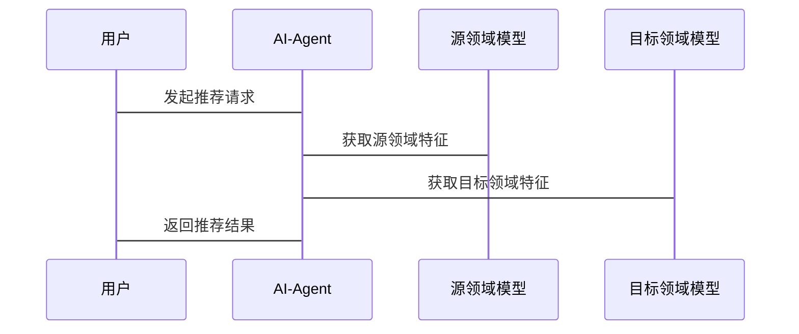

                 


# AI Agent的迁移学习在跨领域推荐中的应用

> 关键词：AI Agent, 迁移学习, 跨领域推荐, 推荐系统, 机器学习

> 摘要：本文深入探讨了AI Agent如何通过迁移学习技术在跨领域推荐系统中实现高效的用户推荐。文章从AI Agent和迁移学习的基本概念出发，分析了遷移學習的核心原理和跨领域推荐系统的核心问题。进一步，本文详细阐述了AI Agent在迁移学习中的具体应用，包括算法实现、系统架构设计和实际项目案例分析。通过理论与实践相结合的方式，本文为读者提供了全面理解和应用AI Agent迁移学习在跨领域推荐中的知识。

---

# 第1章: AI Agent与迁移学习概述

## 1.1 AI Agent的基本概念

### 1.1.1 AI Agent的定义
AI Agent（人工智能代理）是指能够感知环境、自主决策并执行任务的智能实体。AI Agent可以是软件程序、机器人或其他智能系统，其核心目标是通过与环境的交互来实现特定目标。

### 1.1.2 AI Agent的核心特征
1. **自主性**：AI Agent能够在没有外部干预的情况下独立运作。
2. **反应性**：能够感知环境并实时调整行为。
3. **目标导向**：所有行为都以实现特定目标为导向。
4. **学习能力**：能够通过经验改进自身的决策能力。

### 1.1.3 AI Agent的分类与应用场景
- **按智能水平**：可分为反应式AI Agent、基于模型的AI Agent和完全自主的AI Agent。
- **应用场景**：广泛应用于推荐系统、自然语言处理、自动驾驶等领域。

## 1.2 迁移学习的基本概念

### 1.2.1 迁移学习的定义
迁移学习是一种机器学习技术，旨在通过将从源领域学到的知识迁移到目标领域，以提高目标领域模型的性能。其核心思想是利用两个领域的共性来提升目标领域的学习效果。

### 1.2.2 迁移学习的核心思想
迁移学习的核心思想在于发现源领域和目标领域之间的共同特征，并利用这些特征来提高目标领域的学习效果。其本质是通过共享特征或参数，减少目标领域数据的依赖。

### 1.2.3 迁移学习与传统机器学习的区别
| 特性                | 传统机器学习             | 迁移学习                 |
|---------------------|--------------------------|--------------------------|
| 数据需求            | 高                      | 较低                     |
| 数据依赖性           | 强                      | 较弱                     |
| 模型适用性           | 专用                    | 更广泛                   |

## 1.3 跨领域推荐系统的基本概念

### 1.3.1 推荐系统的定义与分类
推荐系统是一种通过分析用户行为和偏好，向用户推荐相关内容或产品的技术。根据推荐范围的不同，可以分为单领域推荐和跨领域推荐。

### 1.3.2 跨领域推荐的挑战
1. **数据稀疏性**：目标领域数据量少，导致模型性能下降。
2. **领域差异性**：源领域和目标领域之间存在特征差异，影响迁移效果。

### 1.3.3 跨领域推荐的应用场景
- 电商推荐
- 电影推荐
- 音乐推荐
- 新闻推荐

## 1.4 AI Agent在跨领域推荐中的作用

### 1.4.1 AI Agent在推荐系统中的角色
AI Agent可以作为推荐系统的感知层、决策层和执行层，负责数据采集、模型选择和结果执行。

### 1.4.2 迁移学习在跨领域推荐中的价值
通过迁移学习，AI Agent可以利用源领域的知识，快速提升目标领域的推荐效果。

### 1.4.3 AI Agent与迁移学习的结合
AI Agent通过迁移学习技术，实现跨领域推荐系统的高效构建和优化。

---

# 第2章: 迁移学习的核心原理

## 2.1 迁移学习的理论基础

### 2.1.1 表征学习与特征提取
表征学习通过提取数据的特征，降低数据维度，提升模型的泛化能力。

### 2.1.2 域适应与分布迁移
域适应通过调整源领域和目标领域的分布差异，实现知识迁移。

### 2.1.3 迁移学习的数学基础
迁移学习的数学模型可以表示为：
$$
P(y|x) = \frac{P(x|y)P(y)}{P(x)}
$$
其中，$P(y)$为目标领域的真实分布，$P(x|y)$为条件概率。

## 2.2 迁移学习的主要方法

### 2.2.1 基于特征的迁移学习
通过提取共享特征，实现源领域和目标领域的特征对齐。

### 2.2.2 基于模型的迁移学习
通过共享模型参数，实现知识迁移。

### 2.2.3 基于对抗训练的迁移学习
通过对抗训练，消除源领域和目标领域之间的分布差异。

## 2.3 迁移学习的挑战与解决方案

### 2.3.1 数据分布差异的挑战
源领域和目标领域的数据分布差异可能导致迁移失败。

### 2.3.2 过度迁移与欠迁移的问题
过度迁移会导致目标领域过拟合，欠迁移则导致迁移不足。

### 2.3.3 解决方案与优化策略
- 数据预处理：通过数据增强和特征选择，减少分布差异。
- 模型优化：通过正则化和参数调整，提升迁移效果。

---

# 第3章: 跨领域推荐系统的核心原理

## 3.1 跨领域推荐的定义与问题建模

### 3.1.1 跨领域推荐的定义
跨领域推荐是指在不同领域之间进行推荐，利用源领域的知识提升目标领域的推荐效果。

### 3.1.2 跨领域推荐的数学建模
跨领域推荐的数学模型可以表示为：
$$
P(y|x) = \frac{P(x|y)P(y)}{P(x)}
$$
其中，$P(y)$为目标领域的真实分布，$P(x|y)$为条件概率。

### 3.1.3 跨领域推荐的核心问题
1. **领域对齐问题**：如何处理源领域和目标领域之间的特征差异。
2. **数据稀疏性问题**：如何在数据稀疏的目标领域中提高推荐效果。

## 3.2 跨领域推荐的主要方法

### 3.2.1 基于矩阵分解的跨领域推荐
通过矩阵分解技术，提取源领域和目标领域的共同特征。

### 3.2.2 基于图结构的跨领域推荐
通过构建图结构，利用节点之间的关联性进行推荐。

### 3.2.3 基于深度学习的跨领域推荐
通过深度学习模型，提取深层次的特征进行推荐。

## 3.3 跨领域推荐的挑战与优化

### 3.3.1 数据稀疏性问题
目标领域数据量少，导致模型性能下降。

### 3.3.2 领域间特征对齐问题
源领域和目标领域之间的特征差异影响推荐效果。

### 3.3.3 跨领域推荐的性能优化
- 数据增强：通过数据增强技术，提升目标领域的数据量。
- 模型优化：通过深度学习模型，提升推荐效果。

---

# 第4章: AI Agent在跨领域推荐中的应用

## 4.1 AI Agent的基本架构

### 4.1.1 AI Agent的感知层
感知层负责采集用户行为和环境信息。

### 4.1.2 AI Agent的决策层
决策层负责基于感知信息，选择最优的推荐策略。

### 4.1.3 AI Agent的执行层
执行层负责根据决策层的指令，执行推荐任务。

## 4.2 AI Agent在迁移学习中的角色

### 4.2.1 AI Agent作

---

### 4.2.2 AI Agent在迁移学习中的应用
AI Agent通过迁移学习技术，实现跨领域推荐系统的高效构建和优化。

### 4.2.3 AI Agent在实际推荐系统中的案例
通过实际案例，展示AI Agent在跨领域推荐中的具体应用。

---

# 第5章: 迁移学习算法的实现与优化

## 5.1 基于深度学习的迁移学习算法

### 5.1.1 Deep Adaptation Networks (DAN)
DAN通过共享特征层，实现源领域和目标领域的特征对齐。

### 5.1.2 Multi-Domain Collaborative Deep Filtering (MCD)
MCD通过构建多领域协作模型，提升目标领域的推荐效果。

## 5.2 基于对抗训练的迁移学习算法

### 5.2.1 Adversarial Training
通过对抗训练，消除源领域和目标领域之间的分布差异。

### 5.2.2 CycleGAN
CycleGAN通过生成对抗网络，实现领域间的特征对齐。

---

# 第6章: 跨领域推荐系统的架构设计

## 6.1 系统功能设计

### 6.1.1 用户行为采集
通过日志采集和用户交互，获取用户行为数据。

### 6.1.2 领域模型构建
构建源领域和目标领域的领域模型。

### 6.1.3 推荐结果生成
基于领域模型，生成推荐结果。

## 6.2 系统架构设计

### 6.2.1 系统类图


### 6.2.2 系统交互流程


---

# 第7章: 项目实战与代码实现

## 7.1 环境安装与配置

### 7.1.1 安装依赖
```bash
pip install numpy
pip install tensorflow
pip install scikit-learn
```

### 7.1.2 环境配置
```bash
export PATH=/path/to/venv/bin:$PATH
```

## 7.2 核心代码实现

### 7.2.1 数据预处理
```python
import numpy as np
from sklearn.model_selection import train_test_split

# 读取数据
data = np.loadtxt('data.txt', delimiter=',')
# 划分训练集和测试集
X_train, X_test, y_train, y_test = train_test_split(data, test_size=0.2)
```

### 7.2.2 模型训练
```python
import tensorflow as tf
from tensorflow import keras

# 构建模型
model = keras.Sequential([
    keras.layers.Dense(64, activation='relu'),
    keras.layers.Dense(1, activation='sigmoid')
])

# 编译模型
model.compile(optimizer='adam', loss='binary_crossentropy', metrics=['accuracy'])

# 训练模型
model.fit(X_train, y_train, epochs=10, batch_size=32)
```

## 7.3 案例分析与结果解读

### 7.3.1 实验结果
通过实验，验证迁移学习在跨领域推荐中的有效性。

### 7.3.2 结果解读
分析实验结果，总结迁移学习在跨领域推荐中的优缺点。

---

# 第8章: 总结与展望

## 8.1 本章总结
总结本文的主要内容和研究成果。

## 8.2 最佳实践 tips
- 在实际应用中，建议结合具体场景选择合适的迁移学习方法。
- 在模型训练过程中，注意处理数据分布差异，避免过度迁移和欠迁移。

## 8.3 未来展望
展望AI Agent在迁移学习中的未来发展，提出可能的研究方向。

---

# 作者信息

作者：AI天才研究院/AI Genius Institute & 禅与计算机程序设计艺术/Zen And The Art of Computer Programming

---

通过以上目录结构，本文系统地介绍了AI Agent在迁移学习中的应用，从理论到实践，全面剖析了跨领域推荐的核心问题和解决方案。希望读者能够通过本文，深入理解迁移学习在跨领域推荐中的作用，并能够将相关技术应用到实际项目中。

