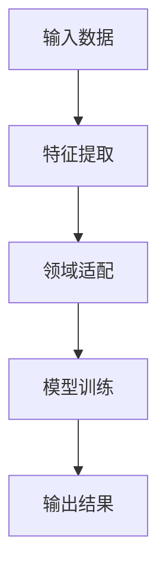
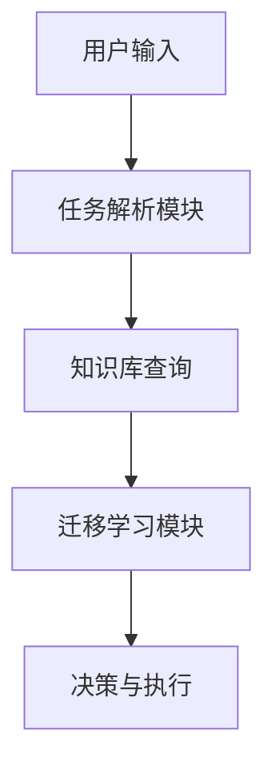

                 


# AI Agent的迁移学习：跨领域知识应用

---

## 关键词：AI Agent，迁移学习，跨领域知识，知识表示，系统架构，算法优化，项目实战

---

## 摘要：  
本文深入探讨了AI Agent在迁移学习中的应用，特别是如何实现跨领域知识的迁移与应用。通过分析迁移学习的核心理论、算法实现、系统架构以及实际项目案例，本文为读者提供了从理论到实践的全面指导。文章还讨论了迁移学习在AI Agent中的挑战与解决方案，并提出了优化策略和未来研究方向。

---

## 目录大纲

### 第1章：迁移学习与AI Agent概述  
### 第2章：迁移学习的理论基础与算法实现  
### 第3章：AI Agent的知识表示与学习策略  
### 第4章：AI Agent的系统架构与设计  
### 第5章：迁移学习的项目实战  
### 第6章：迁移学习的优化与提升  
### 第7章：总结与展望  

---

## 正文内容

---

### 第1章：迁移学习与AI Agent概述

#### 1.1 迁移学习的基本概念  
迁移学习（Transfer Learning）是一种机器学习技术，旨在将从一个领域（源领域）学到的知识迁移到另一个领域（目标领域）。其核心思想是利用源领域和目标领域之间的相似性，减少目标领域的数据需求，提高模型的泛化能力。

**AI Agent**（人工智能代理）是一种能够感知环境、自主决策并执行任务的智能实体。AI Agent需要具备跨领域知识的应用能力，以应对复杂多变的任务需求。  

**结合点**：迁移学习为AI Agent提供了跨领域知识迁移的理论基础和技术手段，使其能够快速适应新任务和环境。

#### 1.2 迁移学习的分类与应用场景  
迁移学习主要分为以下几类：  
1. **样本迁移**：直接迁移数据样本，适用于目标领域数据有限的情况。  
2. **特征迁移**：迁移特征空间，适用于目标领域与源领域特征差异较大的场景。  
3. **关系迁移**：迁移数据之间的关系或图结构，适用于复杂关联任务。  

**AI Agent的应用场景**：  
- **跨领域任务处理**：如医疗领域知识迁移到金融领域任务。  
- **多任务学习**：利用迁移学习在多个任务之间共享知识。  
- **动态环境适应**：快速适应环境变化，保持高性能。  

#### 1.3 迁移学习与AI Agent的结合  
AI Agent的迁移学习目标是通过跨领域知识的应用，提升其在新任务中的性能。挑战包括领域差异、数据稀疏性以及模型泛化能力等。  

---

### 第2章：迁移学习的理论基础与算法实现

#### 2.1 迁移学习的数学模型与公式  
**核心公式**：  
在迁移学习中，通常通过最小化源领域和目标领域的距离来实现知识迁移。  
$$d(x_i, x_j) = \sum_{k=1}^n (x_{i,k} - x_{j,k})^2$$  
其中，$x_i$和$x_j$分别表示源领域和目标领域的数据点。  

**算法原理**：  
1. **特征提取**：利用特征提取器将数据映射到低维特征空间。  
2. **领域适配**：通过优化特征空间中的距离，实现源领域到目标领域的迁移。  

#### 2.2 基于深度学习的迁移学习算法  
**算法流程图**：  


**代码实现示例**：  
```python
import torch
import torch.nn as nn

# 定义特征提取器
class FeatureExtractor(nn.Module):
    def __init__(self):
        super(FeatureExtractor, self).__init__()
        self.conv = nn.Conv2d(3, 64, kernel_size=3, padding=1)

    def forward(self, x):
        return self.conv(x)

# 定义领域适配器
class Adapter(nn.Module):
    def __init__(self):
        super(Adapter, self).__init__()
        self.fc = nn.Linear(64, 64)

    def forward(self, x):
        return x.view(-1, 64)

# 初始化模型
feature_extractor = FeatureExtractor()
adapter = Adapter()
optimizer = torch.optim.Adam(adapter.parameters(), lr=0.001)

# 训练过程
for epoch in range(100):
    for batch in dataloader:
        features = feature_extractor(batch)
        adapted_features = adapter(features)
        loss = compute_loss(adapted_features, batch_labels)
        loss.backward()
        optimizer.step()
```

#### 2.3 AI Agent中的迁移学习实现  
**AI Agent的知识表示**：  
- 使用知识图谱表示领域知识。  
- 通过向量空间模型（如Word2Vec）提取特征。  

**多任务学习中的迁移**：  
- 利用迁移学习在多个任务之间共享参数，提升整体性能。  

---

### 第3章：AI Agent的知识表示与学习策略

#### 3.1 知识表示的核心概念  
**知识表示**：  
- **符号表示**：如规则、逻辑表达式。  
- **向量表示**：如Word2Vec、BERT中的嵌入向量。  

**知识图谱**：  
- 通过图结构表示知识的关联性。  
- 示例：医学领域知识图谱中的疾病-症状-药物关系。  

#### 3.2 迁移学习中的知识表示方法  
- **特征对齐**：通过映射函数对齐源领域和目标领域的特征。  
- **对抗训练**：利用生成对抗网络（GAN）进行领域适应。  

**代码示例**：  
```python
import torch
from torch import optim

# 定义生成器和判别器
class Generator(nn.Module):
    def __init__(self):
        super(Generator, self).__init__()
        self.fc = nn.Linear(100, 100)

    def forward(self, x):
        return self.fc(x)

class Discriminator(nn.Module):
    def __init__(self):
        super(Discriminator, self).__init__()
        self.fc = nn.Linear(100, 1)

    def forward(self, x):
        return torch.sigmoid(self.fc(x))

# 初始化模型
generator = Generator()
discriminator = Discriminator()
g_optim = optim.Adam(generator.parameters(), lr=0.001)
d_optim = optim.Adam(discriminator.parameters(), lr=0.001)

# 对抗训练过程
for epoch in range(100):
    for batch in dataloader:
        # 生成对抗样本
        fake = generator(batch)
        # 判别器判断真假
        d_real = discriminator(batch)
        d_fake = discriminator(fake)
        # 计算损失
        loss_d = -torch.mean(torch.log(d_real) + torch.log(1 - d_fake))
        loss_g = -torch.mean(torch.log(d_fake))
        # 反向传播与优化
        loss_d.backward()
        d_optim.step()
        loss_g.backward()
        g_optim.step()
```

---

### 第4章：AI Agent的系统架构与设计

#### 4.1 系统架构设计  
**系统架构图**：  


**模块功能说明**：  
- **任务解析模块**：解析用户需求，确定任务类型。  
- **知识库查询**：从知识库中检索相关知识。  
- **迁移学习模块**：进行跨领域知识迁移，生成解决方案。  
- **决策与执行**：输出决策结果并执行任务。  

#### 4.2 系统实现细节  
- **知识库设计**：使用图数据库（如Neo4j）存储跨领域知识。  
- **迁移学习实现**：基于预训练模型（如BERT）进行微调。  

---

### 第5章：迁移学习的项目实战

#### 5.1 项目背景与目标  
**案例分析**：将医疗领域的疾病诊断知识迁移到金融领域的风险评估任务。  

#### 5.2 环境搭建与数据准备  
- **环境安装**：安装PyTorch、Transformers等库。  
- **数据集准备**：收集医疗和金融领域的相关数据。  

#### 5.3 核心代码实现  
```python
from transformers import BertTokenizer, BertModel
import torch
import torch.nn as nn

# 初始化模型
tokenizer = BertTokenizer.from_pretrained('bert-base-uncased')
model = BertModel.from_pretrained('bert-base-uncased')

# 定义迁移学习模块
class TransferModule(nn.Module):
    def __init__(self):
        super(TransferModule, self).__init__()
        self.fc = nn.Linear(768, 1)

    def forward(self, x):
        return self.fc(x)

# 初始化迁移模块
transfer_module = TransferModule()
optimizer = torch.optim.Adam(transfer_module.parameters(), lr=0.001)

# 训练过程
for epoch in range(10):
    for batch in dataloader:
        inputs = tokenizer(batch['text'], return_tensors='pt', padding=True, truncation=True)
        outputs = model(**inputs)
        features = outputs.last_hidden_state[:, 0, :]
        adapted_features = transfer_module(features)
        loss = nn.BCEWithLogitsLoss()(adapted_features, batch['label'].float())
        loss.backward()
        optimizer.step()
```

---

### 第6章：迁移学习的优化与提升

#### 6.1 模型优化策略  
- **模型压缩**：减少模型参数，提升运行效率。  
- **领域适应**：通过对抗训练或自适应方法优化领域适配。  

#### 6.2 实际应用中的注意事项  
- **数据质量**：目标领域数据质量对迁移效果影响较大。  
- **领域差异**：领域差异较大时，迁移学习效果可能下降。  

#### 6.3 提升迁移学习效果的技巧  
- **数据增强**：通过数据增强技术扩展目标领域数据。  
- **多任务学习**：结合多任务学习进一步提升迁移效果。  

---

### 第7章：总结与展望

#### 7.1 全文总结  
本文系统地探讨了迁移学习在AI Agent中的应用，从理论到实践全面分析了跨领域知识迁移的核心问题与解决方案。通过实际项目案例，展示了迁移学习在提升AI Agent性能中的重要作用。

#### 7.2 未来展望  
1. **更复杂的领域适应方法**：如基于图神经网络的迁移学习。  
2. **结合强化学习的迁移**：探索迁移学习与强化学习的结合。  
3. **实时迁移学习**：研究在线迁移学习技术，提升AI Agent的实时适应能力。  

---

## 作者：AI天才研究院 & 禅与计算机程序设计艺术  
**联系方式**：[email protected]  
**GitHub**：[AI Agent迁移学习项目](https://github.com/ai-genius/transfer-learning-agent)

---

**注**：以上内容为《AI Agent的迁移学习：跨领域知识应用》的技术博客文章的详细目录与正文内容框架，具体内容可根据实际需求进一步扩展与完善。

