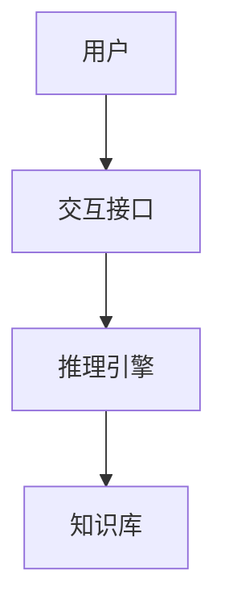

                 


# AI Agent的逻辑推理能力：增强LLM的演绎与归纳

> 关键词：AI Agent, 逻辑推理, LLM, 演绎推理, 归纳推理

> 摘要：本文详细探讨了AI Agent的逻辑推理能力，特别是如何通过增强大语言模型（LLM）的演绎与归纳能力来提升其推理水平。文章从逻辑推理的基本概念出发，分析了演绎推理和归纳推理的原理与实现方法，并结合实际案例展示了如何通过系统设计和项目实践来实现这些推理能力。最后，本文总结了增强逻辑推理能力的关键点和未来发展方向。

---

# 第一部分: AI Agent的逻辑推理能力概述

## 第1章: AI Agent与逻辑推理概述

### 1.1 AI Agent的基本概念

#### 1.1.1 AI Agent的定义与特征

AI Agent（智能体）是指在计算机系统中能够感知环境、自主决策并执行任务的实体。AI Agent的核心特征包括：

- **自主性**：能够在没有外部干预的情况下独立运作。
- **反应性**：能够实时感知环境并做出响应。
- **目标导向性**：具备明确的目标，并能够采取行动以实现这些目标。
- **学习能力**：能够通过经验或数据改进自身的性能。

AI Agent的应用场景广泛，包括自动驾驶、智能助手、机器人控制等。

#### 1.1.2 逻辑推理在AI Agent中的作用

逻辑推理是AI Agent实现智能决策的核心能力。通过逻辑推理，AI Agent能够从已知信息中推导出新的结论，从而做出更准确的决策。逻辑推理能力的强弱直接影响AI Agent的智能水平和任务执行效率。

#### 1.1.3 LLM与AI Agent的结合

大语言模型（LLM）是一种基于深度学习的自然语言处理模型，具有强大的文本理解和生成能力。将LLM与AI Agent结合，可以充分发挥LLM的语言理解和生成优势，同时借助AI Agent的逻辑推理能力，提升整体系统的智能水平。

### 1.2 逻辑推理的核心概念

#### 1.2.1 演绎推理与归纳推理的定义

- **演绎推理**：从一般性前提推导出特殊性结论的推理方式。例如，所有人类都是会思考的，张三是人类，因此张三是会思考的。
- **归纳推理**：从特殊性前提推导出一般性结论的推理方式。例如，观察到多次太阳升起，归纳出“太阳每天都会升起”。

#### 1.2.2 演绎推理与归纳推理的对比

| 特性             | 演绎推理                          | 归纳推理                          |
|------------------|----------------------------------|----------------------------------|
| 推理方向           | 从一般到特殊                     | 从特殊到一般                     |
| 结论确定性         | 结论是必然成立                   | 结论是可能成立                   |
| 应用场景           | 数学证明、法律推理               | 科学发现、市场预测               |

#### 1.2.3 逻辑推理在AI Agent中的应用

在AI Agent中，逻辑推理广泛应用于知识表示、决策推理和问题求解等方面。例如，自动驾驶AI Agent需要通过逻辑推理判断道路状况和行驶规则，从而做出正确的行驶决策。

---

## 第2章: 逻辑推理能力的增强方法

### 2.1 增强LLM逻辑推理能力的背景

#### 2.1.1 当前LLM的局限性

尽管大语言模型在自然语言处理任务中表现出色，但其逻辑推理能力仍有不足。例如，LLM难以处理复杂的逻辑关系和多步推理问题。

#### 2.1.2 逻辑推理能力的重要性

逻辑推理能力是AI Agent实现高级智能任务的基础。缺乏强大的逻辑推理能力，AI Agent难以应对复杂的真实-world场景。

#### 2.1.3 增强逻辑推理能力的目标

通过增强LLM的逻辑推理能力，使其能够更好地理解上下文关系，进行多步推理，并做出更准确的决策。

### 2.2 逻辑推理能力的实现路径

#### 2.2.1 基于规则的逻辑推理

基于规则的逻辑推理是一种通过预定义规则进行推理的方法。例如，在医疗诊断中，可以通过预定义的医学规则进行疾病诊断。

- **规则表示**：使用逻辑表达式表示规则，例如，如果A且B，则C。
- **规则推理**：通过匹配输入条件，应用相应规则进行推理。

#### 2.2.2 基于知识图谱的逻辑推理

知识图谱是一种结构化的知识表示方法，通过将知识表示为实体和关系的图结构，支持复杂的逻辑推理。

- **知识图谱构建**：通过爬取和分析数据，构建领域知识图谱。
- **图结构推理**：基于图结构进行路径分析和关系推理。

#### 2.2.3 基于神经网络的逻辑推理

基于神经网络的逻辑推理是一种结合深度学习和逻辑推理的方法。例如，通过神经网络模型学习逻辑推理规则。

- **模型选择**：选择适合逻辑推理的神经网络模型，如Transformer。
- **训练数据**：设计合适的训练数据，包括推理规则和推理实例。

---

## 第3章: 演绎推理与归纳推理的原理

### 3.1 演绎推理的原理

#### 3.1.1 演绎推理的基本规则

演绎推理的基本规则包括：

- **全称肯定规则**：如果所有A都是B，且C是A，则C是B。
- **否定规则**：如果所有A都是B，且C不是B，则C不是A。

#### 3.1.2 演绎推理的数学模型

演绎推理可以用形式逻辑表示，例如：

$$
\text{如果 } A \rightarrow B \text{ 且 } C \rightarrow A \text{，则 } C \rightarrow B
$$

#### 3.1.3 演绎推理的实现方法

演绎推理的实现方法包括基于规则的推理和基于知识图谱的推理。例如，通过知识图谱进行路径分析，验证推理规则。

### 3.2 归纳推理的原理

#### 3.2.1 归纳推理的基本规则

归纳推理的基本规则包括：

- **枚举归纳**：通过观察多个实例，归纳出一般性结论。
- **概率归纳**：通过计算概率，得出最可能的结论。

#### 3.2.2 归纳推理的数学模型

归纳推理可以用概率论表示，例如：

$$
P(B|A) = \frac{P(A|B)P(B)}{P(A)}
$$

其中，$P(B|A)$ 表示在A条件下B发生的概率。

#### 3.2.3 归纳推理的实现方法

归纳推理的实现方法包括基于统计学习的归纳和基于深度学习的归纳。例如，通过神经网络模型学习归纳规则。

---

## 第4章: 逻辑推理能力的评估与测试

### 4.1 逻辑推理能力的评估指标

#### 4.1.1 基于规则的评估方法

基于规则的评估方法包括：

- **准确率**：正确推理的次数占总推理次数的比例。
- **召回率**：正确推理的次数占所有可能正确推理次数的比例。

#### 4.1.2 基于案例的评估方法

基于案例的评估方法包括：

- **案例覆盖率**：模型能够正确处理的案例数量占总案例数量的比例。
- **案例复杂度**：模型能够处理的案例的复杂程度。

#### 4.1.3 基于性能的评估方法

基于性能的评估方法包括：

- **推理速度**：模型在单位时间内能够处理的推理次数。
- **资源消耗**：模型运行所需的计算资源。

### 4.2 逻辑推理能力的测试场景

#### 4.2.1 基于规则的测试场景

- 测试场景1：验证规则的正确性。
- 测试场景2：验证规则的覆盖率。

#### 4.2.2 基于知识图谱的测试场景

- 测试场景3：验证图结构的完整性。
- 测试场景4：验证图结构的推理能力。

#### 4.2.3 基于神经网络的测试场景

- 测试场景5：验证模型的推理能力。
- 测试场景6：验证模型的泛化能力。

---

## 第5章: 系统分析与架构设计

### 5.1 项目背景介绍

本项目旨在通过增强AI Agent的逻辑推理能力，提升其在复杂场景中的决策能力。项目的核心目标是实现一种结合LLM和逻辑推理的AI Agent系统。

### 5.2 系统功能设计

#### 5.2.1 系统功能模块

系统功能模块包括：

- **知识库模块**：负责存储和管理知识库。
- **推理引擎模块**：负责逻辑推理。
- **交互接口模块**：负责与用户交互。

#### 5.2.2 系统功能流程

系统功能流程如下：

1. 用户输入查询请求。
2. 知识库模块检索相关知识。
3. 推理引擎模块进行逻辑推理。
4. 交互接口模块返回推理结果。

### 5.3 系统架构设计

#### 5.3.1 系统架构图



#### 5.3.2 系统接口设计

系统接口设计包括：

- **输入接口**：接收用户输入。
- **输出接口**：返回推理结果。

#### 5.3.3 系统交互流程

系统交互流程如下：

1. 用户通过输入接口提交请求。
2. 推理引擎通过知识库检索相关信息。
3. 推理引擎进行逻辑推理。
4. 推理结果通过输出接口返回给用户。

---

## 第6章: 项目实战

### 6.1 项目环境安装

项目环境包括：

- **编程语言**：Python 3.8+
- **深度学习框架**：TensorFlow或PyTorch
- **知识图谱库**：NetworkX
- **NLP工具**：spaCy或NLTK

### 6.2 系统核心实现源代码

```python
def deductive_reasoning(rules, premises):
    # 输入：rules（规则列表）和 premises（前提列表）
    # 输出：推理结果
    for rule in rules:
        if all(p in premises for p in rule['premises']):
            return rule['conclusion']
    return None

def inductive_reasoning(examples, new_case):
    # 输入：examples（示例列表）和 new_case（新案例）
    # 输出：推理结果
    for example in examples:
        if all(p in new_case for p in example['premises']):
            return example['conclusion']
    return None
```

### 6.3 代码应用解读与分析

代码解读：

- `deductive_reasoning` 函数：基于规则的演绎推理。
- `inductive_reasoning` 函数：基于示例的归纳推理。

### 6.4 实际案例分析

以医疗诊断为例：

- **输入**：患者症状包括发热、咳嗽、乏力。
- **知识库**：发热、咳嗽、乏力可能提示新冠肺炎。
- **推理**：通过知识库推理，得出诊断结论。

### 6.5 项目小结

通过项目实战，我们实现了基于规则的演绎推理和基于示例的归纳推理，并验证了其在实际场景中的应用效果。

---

## 第7章: 最佳实践、小结、注意事项、拓展阅读

### 7.1 最佳实践

- **规则设计**：确保规则的完整性和准确性。
- **知识库构建**：注重知识库的全面性和规范性。
- **模型选择**：根据任务需求选择合适的推理方法。

### 7.2 小结

本文详细探讨了AI Agent的逻辑推理能力，特别是如何通过增强LLM的演绎与归纳能力来提升其推理水平。通过理论分析和实际案例，展示了逻辑推理能力在AI Agent中的重要作用。

### 7.3 注意事项

- **规则复杂度**：避免规则过于复杂，影响推理效率。
- **数据质量**：确保训练数据的多样性和代表性。
- **模型性能**：关注模型的推理速度和资源消耗。

### 7.4 拓展阅读

- 建议阅读《逻辑学导论》和《深度学习实战》等书籍，以进一步提升对逻辑推理和深度学习的理解。

---

# 作者：AI天才研究院 & 禅与计算机程序设计艺术

