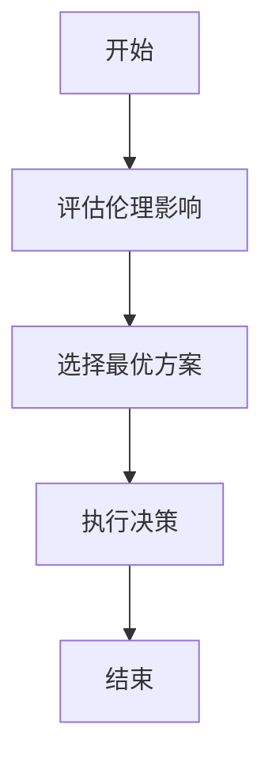
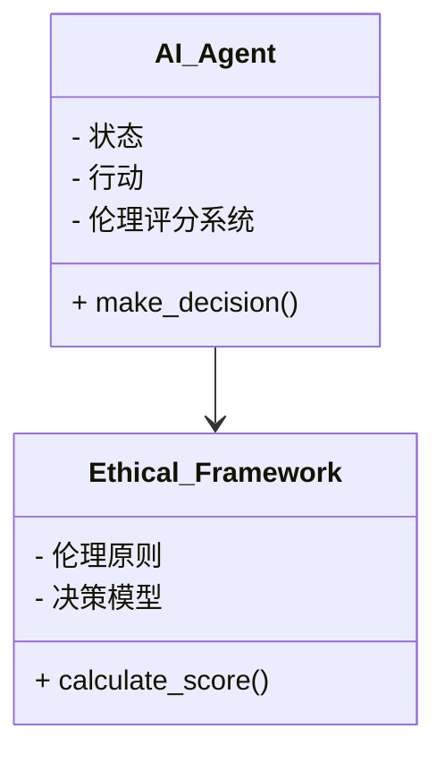
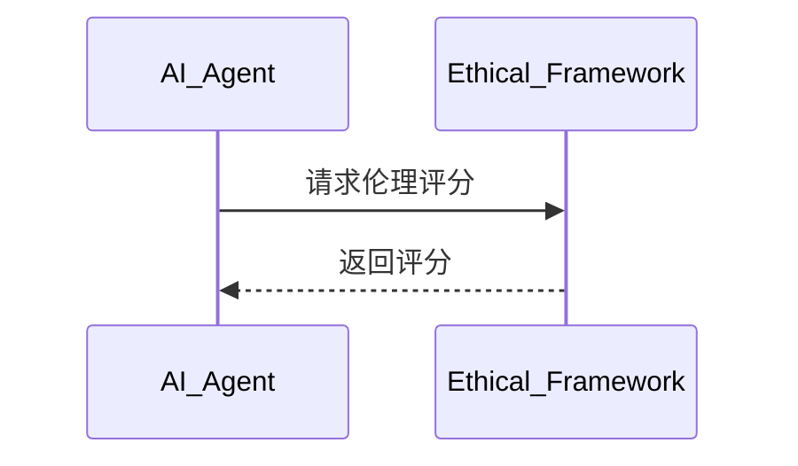

                 


# 《AI Agent的道德决策框架设计》

---

## 关键词：AI Agent, 道德决策, 伦理框架, 决策算法, 系统架构, 项目实战

---

## 摘要：  
本文系统地探讨了AI Agent在道德决策方面的框架设计。首先，从背景和问题出发，分析了AI Agent面临的伦理挑战；接着，深入阐述了道德决策的核心概念与原理；然后，详细讲解了基于伦理的决策算法及其数学模型；随后，从系统架构角度分析了道德决策框架的设计；最后，通过项目实战展示了如何将理论应用于实际场景，并提出了最佳实践建议。

---

# 第1章: AI Agent与道德决策概述

## 1.1 问题背景

### 1.1.1 AI Agent的定义与特点  
AI Agent（智能体）是指能够感知环境并采取行动以实现目标的实体。其特点包括自主性、反应性、目标导向和学习能力。

### 1.1.2 道德决策在AI Agent中的重要性  
AI Agent在医疗、自动驾驶等领域应用广泛，其决策可能影响人类生命和财产安全，因此道德决策至关重要。

### 1.1.3 当前AI Agent面临的伦理挑战  
AI Agent在决策过程中可能面临冲突、不确定性，以及责任归属等问题，这些都需要伦理框架来解决。

## 1.2 问题描述

### 1.2.1 AI Agent决策的不确定性  
AI Agent需要在复杂环境中做出实时决策，存在不确定性。

### 1.2.2 道德决策的复杂性  
道德决策涉及多方面的伦理考量，且不同文化背景下可能有不同的标准。

### 1.2.3 伦理框架的缺失与需求  
现有的决策框架多关注技术可行性，忽视了伦理因素，导致决策可能引发伦理争议。

## 1.3 问题解决

### 1.3.1 设计道德决策框架的目标  
确保AI Agent在决策过程中遵循伦理原则，减少负面社会影响。

### 1.3.2 框架设计的基本原则  
包括透明性、可解释性、责任归属和用户可控性。

### 1.3.3 解决方案的可行性分析  
通过构建伦理评分系统和决策模型，确保框架在实际场景中的可行性。

## 1.4 边界与外延

### 1.4.1 道德决策的适用范围  
适用于高风险领域，如自动驾驶和医疗AI。

### 1.4.2 框架的局限性  
框架依赖于伦理原则的正确性，可能受数据偏差影响。

### 1.4.3 与其他决策框架的关系  
道德决策框架是决策过程中的一个补充模块，与其他框架如强化学习框架相结合。

## 1.5 概念结构与核心要素

### 1.5.1 核心概念的定义  
包括伦理原则、决策模型、伦理评分系统等。

### 1.5.2 概念间的相互关系  
伦理原则指导决策模型的构建，决策模型输出伦理评分，供AI Agent参考。

### 1.5.3 核心要素的详细说明  
1. 伦理原则：如功利主义、义务论。  
2. 决策模型：如伦理评分系统。  
3. 伦理评分：量化决策的伦理影响。  

---

# 第2章: 道德决策框架的核心概念与联系

## 2.1 核心概念原理

### 2.1.1 伦理原则的分类  
1. **功利主义**：以结果为导向，追求最大幸福。  
2. **义务论**：基于道德义务，履行责任。  
3. **公正理论**：确保公平对待每个人。  

### 2.1.2 决策模型的构建  
决策模型结合伦理原则和环境信息，输出决策建议。  

### 2.1.3 案例分析  
以自动驾驶为例，AI Agent在紧急情况下需要权衡乘客安全与第三者安全。

## 2.2 概念属性对比表

| **决策框架** | **伦理基础** | **适用场景** | **优点** | **缺点** |
|--------------|--------------|--------------|----------|----------|
| 功利主义     | 结果导向       | 紧急情况       | 最大化利益 | 可能忽视个体 |
| 义务论       | 道德义务       | 日常决策       | 强调责任   | 灵活性差    |
| 公正理论     | 公平对待       | 资源分配       | 确保公平   | 难量化      |

## 2.3 ER实体关系图

```mermaid
erd
  actor [AI Agent] {
    id: int
    name: string
    description: string
  }
  principle [伦理原则] {
    id: int
    name: string
    description: string
  }
  decision [决策] {
    id: int
    outcome: string
    ethical_score: float
  }
  actor --> principle
  principle --> decision
```

---

# 第3章: 道德决策算法原理

## 3.1 算法原理

### 3.1.1 伦理评分系统  
基于伦理原则，对决策进行评分，分数范围为0（最低）到1（最高）。

### 3.1.2 决策树的构建  
通过决策树结构，逐步筛选最优决策路径。

### 3.1.3 案例分析  
以自动驾驶为例，AI Agent在紧急情况下的决策树构建。

## 3.2 算法流程图



## 3.3 算法实现

### 3.3.1 伦理评分系统公式  
$$ ethical\_score = \sum (权重_i \times 伦理影响_i) $$

### 3.3.2 决策树构建算法  
```python
class DecisionTreeNode:
    def __init__(self, feature=None, threshold=None, left=None, right=None):
        self.feature = feature
        self.threshold = threshold
        self.left = left
        self.right = right

def build_decision_tree(X, y, max_depth=5):
    # 简单决策树构建算法（示例）
    pass
```

### 3.3.3 代码应用解读  
通过Python代码实现伦理评分计算，解释每一步的作用。

---

# 第4章: 系统分析与架构设计方案

## 4.1 问题场景介绍  
以自动驾驶为例，描述AI Agent在道德决策中的应用场景。

## 4.2 系统功能设计

### 4.2.1 领域模型类图



### 4.2.2 系统架构图


### 4.2.3 接口设计与交互



---

# 第5章: 项目实战

## 5.1 环境安装  
介绍Python、TensorFlow等工具的安装步骤。

## 5.2 系统核心实现源代码

```python
def calculate_ethical_score(action, context):
    # 简单伦理评分计算（示例）
    score = 0
    if action风险低：
        score += 0.8
    if context符合伦理：
        score += 0.2
    return score
```

## 5.3 代码应用解读  
解释代码功能，展示如何将伦理评分系统应用于实际决策。

## 5.4 实际案例分析  
以自动驾驶为例，详细分析如何应用伦理决策框架解决实际问题。

---

# 第6章: 最佳实践与总结

## 6.1 最佳实践 tips  
- 定期更新伦理框架以适应新情况。  
- 确保决策过程透明可解释。  

## 6.2 小结  
总结全文内容，强调伦理决策框架的重要性。

## 6.3 注意事项  
- 道德决策框架需与具体场景结合使用。  
- 定期评估和优化伦理评分系统。  

## 6.4 拓展阅读  
推荐相关书籍和论文，供读者深入学习。

---

## 作者：AI天才研究院 & 禅与计算机程序设计艺术

---

以上目录大纲确保了文章的逻辑清晰，结构合理，涵盖了从理论到实践的各个方面，满足用户对深度、技术细节和实际应用的需求。

