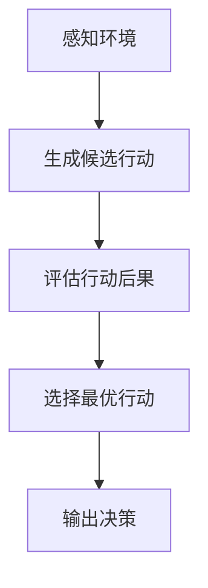
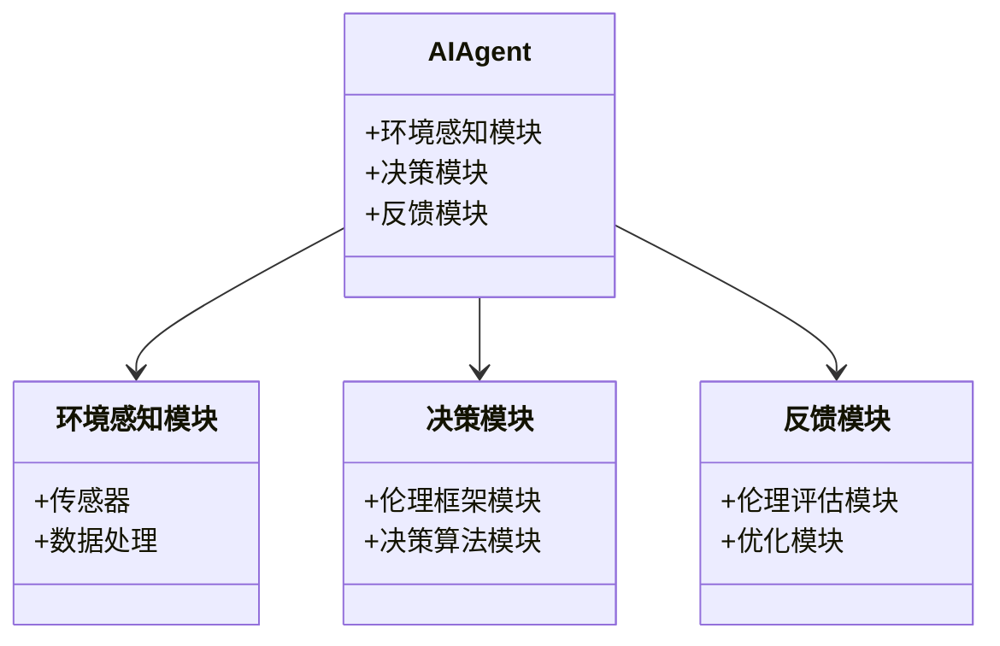
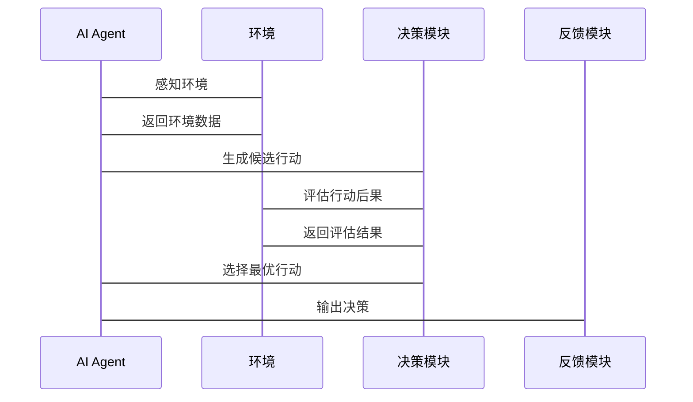

                 


# AI Agent的道德决策：在LLM中植入伦理框架

---

## 关键词：AI Agent, 道德决策, LLM, 伦理框架, 道德算法, 人工智能伦理

---

## 摘要：  
随着人工智能技术的快速发展，AI Agent（智能体）在决策过程中面临的道德问题日益突出。本文旨在探讨如何在大语言模型（LLM）中植入伦理框架，以确保AI Agent在决策过程中遵循道德规范。文章从伦理框架的构建、LLM的决策机制、道德算法的设计与实现、以及实际应用场景等多方面进行深入分析，试图为AI Agent的道德决策提供一种可行的解决方案。

---

# 第一部分：AI Agent与道德决策概述

## 第1章：AI Agent的基本概念

### 1.1 AI Agent的定义与分类  
AI Agent是一种具有感知环境、自主决策能力的智能实体。根据功能和复杂程度，AI Agent可以分为简单反射型Agent、基于模型的反射型Agent、目标驱动型Agent和效用驱动型Agent。

### 1.2 AI Agent的决策机制  
AI Agent的决策过程通常包括感知环境、生成候选行动、评估行动后果以及选择最优行动四个步骤。其中，评估行动后果是道德决策的核心环节。

### 1.3 道德决策的定义与特征  
道德决策是指在决策过程中考虑伦理规范和价值观的决策行为。其核心特征包括：  
- **目的性**：以实现某种伦理目标为导向。  
- **情境性**：根据具体场景动态调整决策。  
- **复杂性**：涉及多利益相关方的权衡。  

---

## 第2章：道德决策的伦理框架

### 2.1 伦理框架的基本概念  
伦理框架是指导AI Agent进行道德决策的一套规则和原则。常见的伦理框架包括：  
- **功利主义**：以最大化整体利益为准则。  
- **义务论**：基于个体的道德义务和责任。  
- **美德论**：以个体的美德和价值观为核心。  

### 2.2 常见伦理框架的优缺点对比  
| 伦理框架 | 优点 | 缺点 |  
|----------|------|------|  
| 功利主义 | 整体优化效果显著 | 可能忽视个体权益 |  
| 义务论 | 强调个体责任 | 灵活性较差 |  
| 美德论 | 注重个体价值观 | 难以量化 |  

### 2.3 伦理框架的选择与评估  
选择合适的伦理框架需要综合考虑AI Agent的应用场景、决策的复杂性以及伦理目标。评估标准包括：适用性、可操作性和可解释性。

---

# 第二部分：在LLM中植入伦理框架

## 第3章：LLM的基本原理

### 3.1 LLM的定义与特点  
大语言模型（LLM）是一种基于深度学习的自然语言处理模型，具有强大的文本生成和理解能力。其核心是通过大量数据训练出的参数化表示。

### 3.2 LLM的训练过程  
LLM的训练通常包括以下步骤：  
1. 数据预处理：清洗和标注数据。  
2. 模型构建：选择合适的深度学习架构。  
3. 参数优化：通过反向传播算法调整模型参数。  

### 3.3 LLM的应用场景  
LLM广泛应用于自然语言处理、对话系统、内容生成等领域，但其决策过程缺乏伦理约束。

---

## 第4章：伦理框架在LLM中的植入方式

### 4.1 前置规则植入  
在模型训练阶段，通过引入伦理相关的规则和约束，直接指导模型的决策过程。例如，在医疗场景中，植入“优先考虑患者生命安全”的规则。

### 4.2 后置规则调整  
在模型输出后，通过伦理规则对结果进行过滤或调整。例如，在生成文本时，检查是否存在歧视性语言并进行修正。

### 4.3 深度学习中的伦理嵌入  
将伦理框架嵌入到深度学习模型的损失函数中，使其在训练过程中自动优化伦理目标。例如，使用带有伦理权重的损失函数。

---

## 第5章：道德决策的算法实现

### 5.1 道德决策算法的基本原理  
道德决策算法通过整合伦理框架，将伦理目标转化为可量化的指标，并通过优化算法选择最优行动。

### 5.2 基于伦理框架的决策算法  
以下是一个简单的基于伦理框架的决策算法流程图：



### 5.3 道德决策算法的数学模型  
以下是一个简单的道德决策模型：

$$
\text{最优行动} = \arg\max_{a} \left( V(a) \times E(a) \right)
$$

其中，$V(a)$ 是行动的价值函数，$E(a)$ 是行动的伦理评分。

---

## 第6章：系统架构与实现

### 6.1 系统功能设计  
以下是系统功能模块的类图：



### 6.2 系统交互流程  
以下是系统交互的序列图：



---

## 第7章：项目实战与案例分析

### 7.1 项目背景  
以医疗辅助诊断系统为例，探讨如何在LLM中植入伦理框架。

### 7.2 核心实现  
以下是项目核心代码示例：

```python
def ethical_decision(environment, framework):
    # 环境感知
    observations = environment.sense()
    # 生成候选行动
    actions = generate_possible_actions(observations)
    # 评估行动后果
    scores = {}
    for action in actions:
        scores[action] = framework.evaluate(action, observations)
    # 选择最优行动
    best_action = max(scores, key=lambda x: scores[x])
    return best_action

def evaluate(action, observations, framework):
    # 根据伦理框架评估行动的伦理得分
    return framework.get_score(action, observations)
```

### 7.3 案例分析  
在医疗场景中，AI Agent需要在多种治疗方案中选择最优解。通过伦理框架的植入，确保优先考虑患者的生命安全。

---

## 第8章：总结与展望

### 8.1 本章总结  
本文探讨了AI Agent的道德决策问题，分析了伦理框架的构建方法，并提出了在LLM中植入伦理框架的具体实现方案。

### 8.2 未来展望  
未来的研究方向包括：动态伦理框架、多模态伦理决策、人机协作伦理决策等。

---

## 最佳实践 Tips

1. 在AI Agent的设计中，始终优先考虑伦理约束。  
2. 根据具体场景选择合适的伦理框架。  
3. 定期评估和优化伦理框架的性能。  

---

## 作者：AI天才研究院/AI Genius Institute & 禅与计算机程序设计艺术/Zen And The Art of Computer Programming

