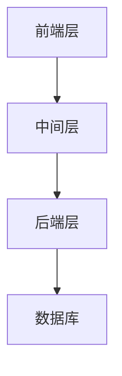
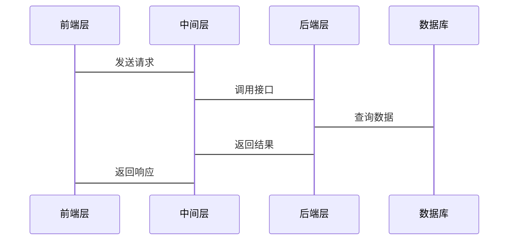

                 

# AI Agent的部署与扩展性考虑

> 关键词：AI Agent，部署，扩展性，系统架构，性能优化，负载均衡，分布式计算

> 摘要：AI Agent作为一种智能实体，其部署与扩展性是实现其广泛应用的关键。本文从AI Agent的背景与核心概念出发，详细探讨了AI Agent的部署过程和扩展性实现。通过分析AI Agent的设计原则、系统架构、性能优化等关键点，结合实际案例，为读者提供了一套完整的AI Agent部署与扩展性解决方案。本文内容涵盖了从理论到实践的全链条，旨在帮助技术人员更好地理解和应用AI Agent的相关技术。

---

## 第一部分: AI Agent的背景与核心概念

### 第1章: AI Agent的背景与核心概念

#### 1.1 AI Agent的定义与应用场景

**AI Agent**（人工智能代理）是一种能够感知环境、自主决策并执行任务的智能实体。它通过接收输入、分析信息、执行决策过程，并输出结果来实现特定目标。

**应用场景**：
- **智能助手**：如Siri、Alexa等，帮助用户完成日常任务。
- **自动驾驶**：通过感知环境并做出驾驶决策。
- **智能客服**：通过自然语言处理技术为用户提供服务。
- **工业自动化**：用于生产线上的机器人和自动化设备。

#### 1.2 AI Agent的部署需求

**部署的基本要求**：
- 稳定性：确保AI Agent在运行过程中不会出现崩溃或错误。
- 可靠性：确保AI Agent能够准确感知环境并做出正确的决策。
- 可扩展性：确保AI Agent能够适应不同的应用场景和负载需求。

**部署的挑战与问题**：
- **计算资源**：AI Agent需要大量的计算资源来处理复杂的任务。
- **数据处理**：AI Agent需要高效地处理和分析大量数据。
- **系统集成**：AI Agent需要与现有系统无缝集成，确保数据的流动和交互。

**部署的目标与意义**：
- 提供高效、可靠的AI服务。
- 实现AI Agent在实际场景中的广泛应用。

#### 1.3 AI Agent的扩展性需求

**扩展性的定义**：
AI Agent的扩展性指的是在面对更大负载、更多任务或更复杂环境时，能够通过增加资源或调整架构来保持性能和功能的能力。

**扩展性的关键因素**：
- **计算能力**：通过分布式计算、并行计算等方式提升处理能力。
- **存储能力**：通过扩展存储资源来处理更大规模的数据。
- **网络能力**：通过优化网络架构来提升数据传输效率。

**扩展性对AI Agent的重要性**：
- 支持AI Agent在更大规模的应用场景中运行。
- 提高AI Agent的性能和响应速度。
- 降低系统的单点故障风险。

---

## 第二部分: AI Agent的核心概念与原理

### 第2章: AI Agent的设计原则

#### 2.1 模块化设计

**模块化的定义**：
将AI Agent的功能分解为多个独立的模块，每个模块负责特定的任务。

**模块化设计的优势**：
- **可维护性**：每个模块独立开发和维护，降低了整体复杂度。
- **可扩展性**：通过增加或替换模块来扩展功能。
- **复用性**：模块可以在不同的项目中复用。

**模块化设计的实现**：
- 将AI Agent的功能划分为感知、决策、执行三个模块。
- 使用接口定义模块之间的交互。

#### 2.2 分层架构

**分层架构的定义**：
将AI Agent的结构划分为多个层次，每个层次负责不同的功能。

**分层架构的优势**：
- **清晰的职责划分**：每个层次专注于特定的功能。
- **灵活性**：通过调整各层的实现来优化系统性能。
- **可扩展性**：通过增加新的层次来扩展功能。

**分层架构的实现**：
- 数据层：负责数据的存储和管理。
- 业务逻辑层：负责业务逻辑的实现。
- 表现层：负责与用户或其他系统的交互。

#### 2.3 面向服务架构

**SOA的定义**：
通过定义服务接口和实现，将AI Agent的功能封装成服务，供其他系统调用。

**SOA的优势**：
- **松耦合**：服务之间通过接口交互，降低了耦合度。
- **灵活性**：可以根据需求动态调整服务。
- **可扩展性**：通过增加新的服务来扩展功能。

**SOA的实现**：
- 定义服务接口：使用WSDL或其他协议定义服务接口。
- 实现服务：通过编写代码实现服务逻辑。
- 注册与发现：通过服务注册中心实现服务的注册与发现。

#### 2.4 本章小结

通过模块化设计、分层架构和面向服务架构，我们可以实现AI Agent的高效开发和扩展。这些设计原则不仅提高了系统的可维护性和可扩展性，还为后续的部署和优化提供了良好的基础。

---

## 第三部分: AI Agent的部署过程

### 第3章: AI Agent的环境准备

#### 3.1 系统环境要求

**硬件要求**：
- CPU：建议使用多核处理器，以支持并行计算。
- 内存：根据任务需求选择合适的内存容量。
- 硬盘：建议使用SSD，以提高数据读写速度。

**软件要求**：
- 操作系统：建议使用Linux或Windows Server。
- 开发工具：如Python、Java、C++等开发语言的IDE。
- 依赖库：如TensorFlow、PyTorch等深度学习框架。

**网络要求**：
- 网络带宽：根据数据传输需求选择合适的带宽。
- 网络延迟：尽量选择低延迟的网络，以提高响应速度。

#### 3.2 开发工具安装

**开发工具的选择**：
- 根据项目需求选择合适的开发工具，如PyCharm、VS Code等。

**开发工具的安装**：
- 下载开发工具的安装包，按照提示完成安装。
- 配置开发工具的环境变量。

**开发工具的配置**：
- 配置开发工具的代码样式、调试选项等。

#### 3.3 依赖库的安装

**依赖库的种类**：
- 用于AI Agent开发的库，如TensorFlow、Keras等。
- 用于系统管理的库，如Docker、Kubernetes等。

**依赖库的安装**：
- 使用pip、apt-get等工具安装依赖库。
- 配置依赖库的版本，确保兼容性。

**依赖库的管理**：
- 使用虚拟环境管理不同的项目依赖。
- 使用Docker容器化管理依赖环境。

#### 3.4 本章小结

通过合理的环境准备和工具安装，我们可以为AI Agent的部署打下坚实的基础。选择合适的硬件、软件和网络环境，是确保AI Agent顺利运行的前提。

---

## 第四部分: AI Agent的扩展性实现

### 第4章: AI Agent的性能优化

#### 4.1 并行计算

**并行计算的定义**：
通过同时使用多个处理器或核心来加速计算任务。

**并行计算的优势**：
- 提高计算效率，缩短任务处理时间。
- 支持更大规模的数据处理。

**并行计算的实现**：
- 使用多线程或进程来实现并行计算。
- 使用分布式计算框架，如MapReduce、Distributed Dataflow。

#### 4.2 分布式计算

**分布式计算的定义**：
将计算任务分解为多个子任务，分别在不同的计算节点上执行。

**分布式计算的优势**：
- 提高计算能力，支持更大规模的数据处理。
- 通过任务分担降低单点故障风险。

**分布式计算的实现**：
- 使用分布式计算框架，如Hadoop、Spark。
- 使用分布式锁机制，避免数据冲突。

#### 4.3 负载均衡

**负载均衡的定义**：
将任务均匀地分配到不同的计算节点，以避免资源浪费和性能瓶颈。

**负载均衡的优势**：
- 提高系统的整体性能。
- 降低单个节点的负载压力。

**负载均衡的实现**：
- 使用负载均衡算法，如轮询、随机、最少连接数等。
- 使用负载均衡工具，如Nginx、F5等。

#### 4.4 本章小结

通过并行计算、分布式计算和负载均衡等技术，我们可以显著提高AI Agent的性能和扩展性。这些技术不仅能够支持更大规模的数据处理，还能够提高系统的稳定性和可靠性。

---

## 第五部分: AI Agent的系统架构设计

### 第5章: AI Agent的系统架构

#### 5.1 系统架构的定义

**系统架构的分类**：
- 单体架构：适合小型项目，但扩展性差。
- 分层架构：适合中型项目，结构清晰。
- 微服务架构：适合大型项目，具有良好的扩展性和灵活性。

**系统架构的选择**：
- 根据项目需求选择合适的架构。
- 考虑系统的可扩展性、可维护性和性能。

**系统架构的实现**：
- 使用分层架构或微服务架构来实现系统的模块化。
- 使用容器化技术，如Docker，来实现服务的独立部署。

#### 5.2 系统架构的优化

**系统架构优化的目标**：
- 提高系统的性能和响应速度。
- 提高系统的可扩展性和可维护性。

**系统架构优化的方法**：
- 使用缓存技术，如Redis，来降低数据库压力。
- 使用消息队列，如Kafka，来异步处理任务。
- 使用容器化技术，如Kubernetes，来实现服务的自动扩缩。

#### 5.3 系统架构的扩展

**系统架构扩展的目标**：
- 支持更大规模的数据处理和更多的用户请求。
- 提高系统的可用性和容错能力。

**系统架构扩展的方法**：
- 使用分布式架构，将服务部署到多个节点。
- 使用负载均衡技术，将任务均匀分配到不同的节点。
- 使用集群技术，如Raft、Paxos，来实现系统的高可用性。

#### 5.4 本章小结

通过合理的系统架构设计和优化，我们可以实现AI Agent的高效运行和扩展。选择合适的架构、优化系统的性能、扩展系统的规模，是确保AI Agent在实际应用中表现出色的关键。

---

## 第六部分: AI Agent的项目实战

### 第6章: AI Agent的部署实战

#### 6.1 项目背景

**项目目标**：
- 实现一个具备自然语言处理能力的智能客服AI Agent。

**项目需求**：
- 提供用户咨询、问题解答、订单处理等服务。
- 支持多语言、多渠道的交互方式。
- 实现高可用性和可扩展性。

#### 6.2 系统功能设计

**领域模型设计**：
- 用户实体：包括用户ID、用户信息、用户行为等。
- 服务实体：包括服务类型、服务接口、服务状态等。
- 交互实体：包括输入输出、日志记录、状态跟踪等。

**系统功能模块**：
- 用户认证模块：负责用户的登录、注册、权限管理。
- 自然语言处理模块：负责理解和生成自然语言文本。
- 任务执行模块：负责执行用户的请求并返回结果。

#### 6.3 系统架构设计

**系统架构设计**：
- 前端层：负责用户与系统的交互，如Web、移动端。
- 中间层：负责接收请求、调用后端服务，如API网关、消息队列。
- 后端层：负责业务逻辑的实现，如自然语言处理、任务执行。

**系统架构图**：

#### 6.4 系统接口设计

**系统接口设计**：
- 用户认证接口：用于用户的登录、注册。
- 自然语言处理接口：用于文本的理解和生成。
- 任务执行接口：用于任务的提交和结果的获取。

**系统接口图**：

#### 6.5 项目实战小结

通过实际项目的部署与扩展，我们可以看到AI Agent在实际应用中的复杂性和挑战。从系统设计到功能实现，每一步都需要仔细考虑和精心设计，才能确保系统的稳定性和可扩展性。

---

## 作者

作者：AI天才研究院/AI Genius Institute & 禅与计算机程序设计艺术 /Zen And The Art of Computer Programming

---

以上是《AI Agent的部署与扩展性考虑》的完整目录和内容大纲。接下来，我将根据以上目录，逐步展开每个章节的内容，进行详细的技术分析和讲解。

