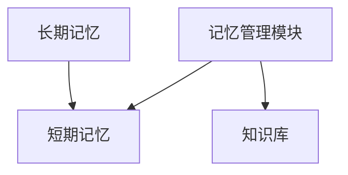
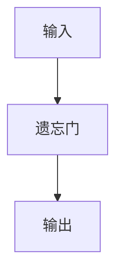
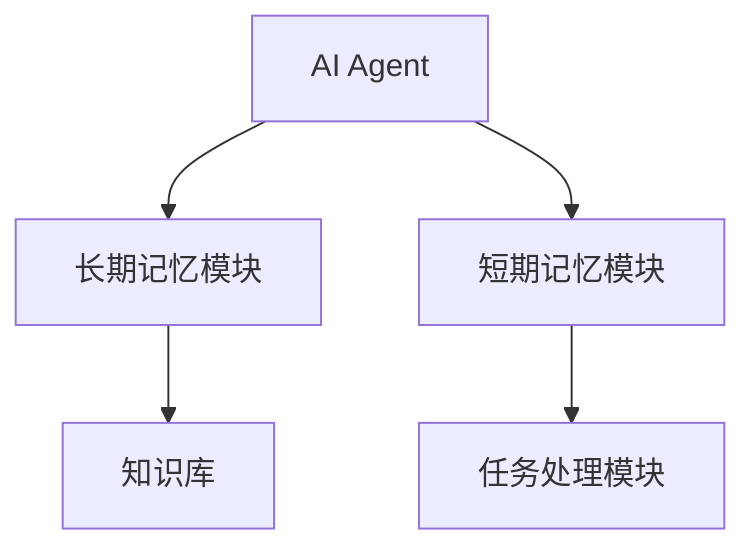
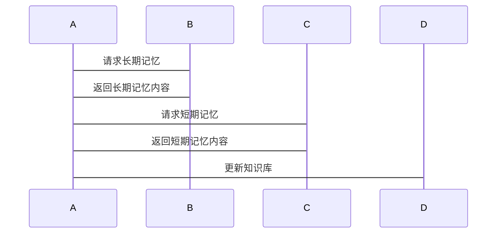

                 


# AI Agent的长短期记忆管理

> 关键词：AI Agent，长短期记忆，记忆管理，算法原理，系统架构

> 摘要：本文详细探讨了AI Agent的长短期记忆管理，从基本概念到算法原理，再到系统架构和项目实战，系统性地分析了长短期记忆管理的核心原理和实现方法。通过案例分析和详细的技术实现，本文为AI Agent的记忆管理提供了全面的解决方案和实践指导。

---

## 第1章: AI Agent与记忆管理概述

### 1.1 AI Agent的基本概念
#### 1.1.1 AI Agent的定义与分类
AI Agent（人工智能代理）是指能够感知环境、自主决策并执行任务的智能实体。AI Agent可以分为以下几类：
- **反应式Agent**：基于当前感知做出反应，不依赖长期记忆。
- **认知式Agent**：具备复杂的推理和规划能力，依赖长期记忆。
- **混合式Agent**：结合反应式和认知式的特点，综合使用长短期记忆。

#### 1.1.2 记忆在AI Agent中的作用
记忆是AI Agent实现智能的关键。长期记忆用于存储知识和经验，短期记忆用于处理当前任务相关的临时信息。通过长短期记忆的结合，AI Agent能够更好地理解和处理复杂任务。

#### 1.1.3 长短期记忆管理的背景与意义
随着AI Agent的应用场景越来越复杂，单纯依靠短期记忆难以满足需求。长短期记忆管理能够帮助AI Agent在复杂环境中保持一致性、连续性和高效性。

### 1.2 长短期记忆管理的核心问题
#### 1.2.1 长期记忆与短期记忆的定义
- **长期记忆**：存储稳定、持久的知识和经验，如语义理解、常识等。
- **短期记忆**：存储临时、动态的信息，如当前对话内容、任务目标等。

#### 1.2.2 长短期记忆管理的挑战
- **信息冗余**：如何选择性存储重要信息。
- **信息冲突**：如何处理新旧信息的冲突。
- **信息检索效率**：如何快速检索所需信息。

#### 1.2.3 长短期记忆管理的目标与边界
目标：实现高效的信息存储、检索和更新，提升AI Agent的智能水平。边界：明确长短期记忆的使用范围，避免越界处理。

### 1.3 长短期记忆管理的实现方法
#### 1.3.1 基于规则的长短期记忆管理
通过预定义规则选择性存储和检索信息。

#### 1.3.2 基于模型的长短期记忆管理
利用机器学习模型（如LSTM、Transformer）自动处理记忆。

#### 1.3.3 基于混合方法的长短期记忆管理
结合规则和模型的优势，实现更灵活的记忆管理。

---

## 第2章: 长短期记忆管理的核心概念与联系

### 2.1 长短期记忆管理的核心原理
#### 2.1.1 长期记忆的存储机制
- **存储结构**：采用知识图谱或向量表示。
- **存储方式**：分布式存储，支持高效检索。

#### 2.1.2 短期记忆的处理机制
- **处理流程**：输入感知信息，经过门控机制筛选后存储。
- **动态更新**：根据任务需求实时更新。

#### 2.1.3 长短期记忆的交互机制
- **信息传递**：短期记忆向长期记忆写入，长期记忆向短期记忆读取。
- **协同处理**：长期记忆为短期记忆提供上下文，短期记忆为长期记忆提供新信息。

### 2.2 长短期记忆管理的属性特征对比
| 特性      | 长期记忆                     | 短期记忆                     |
|-----------|------------------------------|------------------------------|
| 存储时间   | 长期、稳定                   | 短期、动态                   |
| 容量       | 较大                         | 较小                         |
| 访问方式   | 基于关键词或语义              | 基于时间或任务               |
| 更新频率   | 低                          | 高                          |

### 2.3 ER实体关系图架构


### 2.4 本章小结
长短期记忆管理通过合理的存储和处理机制，帮助AI Agent在复杂环境中高效运作。

---

## 第3章: 长短期记忆管理的算法原理

### 3.1 长期记忆管理的算法原理
#### 3.1.1 基于LSTM的长期记忆管理
- **LSTM结构**：包括遗忘门、输入门和输出门。
- **工作流程**：
  1. 遗忘门决定丢弃多少旧信息。
  2. 输入门决定新信息的输入量。
  3. 输出门决定输出的内容。



- **数学模型**：
  $$遗忘门 = \sigma(W_f \cdot [h_{t-1}, x_t] + b_f)$$
  $$输入门 = \sigma(W_i \cdot [h_{t-1}, x_t] + b_i)$$
  $$输出门 = \sigma(W_o \cdot [h_{t-1}, x_t] + b_o)$$

### 3.1.2 基于Transformer的长期记忆管理
- **自注意力机制**：
  $$\text{Attention}(Q, K, V) = \text{softmax}(\frac{QK^T}{\sqrt{d}})V$$

### 3.2 短期记忆管理的算法原理
#### 3.2.1 基于滑动窗口的短期记忆管理
- **滑动窗口原理**：根据窗口大小选择性保留最近的信息。

#### 3.2.2 基于队列的短期记忆管理
- **队列结构**：先进先出，确保短期记忆的动态更新。

#### 3.2.3 基于优先级的短期记忆管理
- **优先级排序**：根据信息的重要性动态调整存储顺序。

### 3.3 长短期记忆管理的数学模型
- **长期记忆管理模型**：
  $$LSTM = \text{遗忘门} \times \text{输入} + \text{输出门} \times \text{新信息}$$
- **短期记忆管理模型**：
  $$\text{队列} = \text{新信息} + \text{队列}[-n:]$$

---

## 第4章: 系统分析与架构设计

### 4.1 问题场景介绍
- **场景描述**：一个AI Agent需要处理多轮对话，结合长期记忆和短期记忆进行信息处理。

### 4.2 系统功能设计
- **领域模型**：定义了AI Agent、长期记忆、短期记忆等核心实体。

### 4.3 系统架构设计


### 4.4 系统接口设计
- **输入接口**：接收感知数据。
- **输出接口**：输出处理结果。
- **交互接口**：与外部系统进行信息交换。

### 4.5 系统交互流程


---

## 第5章: 项目实战

### 5.1 环境安装
- **Python版本**：3.8+
- **依赖库**：TensorFlow、Keras、PyYAML

### 5.2 核心实现
```python
class LongTermMemory:
    def __init__(self):
        self.knowledge_base = {}

    def store(self, key, value):
        self.knowledge_base[key] = value

    def retrieve(self, key):
        return self.knowledge_base.get(key, None)

class ShortTermMemory:
    def __init__(self, window_size=5):
        self.window_size = window_size
        self.memory = []

    def store(self, item):
        self.memory.append(item)
        if len(self.memory) > self.window_size:
            self.memory.pop(0)

class AIAssistant:
    def __init__(self):
        self.ltm = LongTermMemory()
        self.stm = ShortTermMemory()

    def process_input(self, input):
        # 处理逻辑
        pass
```

### 5.3 案例分析
- **案例描述**：一个简单的聊天机器人，结合长短期记忆处理对话。

### 5.4 代码实现
```python
assistant = AIAssistant()
assistant.stm.store("hello")
assistant.stm.retrieve()  # 返回"hello"
```

---

## 第6章: 总结与展望

### 6.1 本章总结
本文系统性地探讨了AI Agent的长短期记忆管理，从核心概念到算法实现，再到系统设计，提供了全面的解决方案。

### 6.2 未来研究方向
- **混合记忆管理**：探索规则与模型的结合。
- **动态调整机制**：实现自适应的长短期记忆管理。

### 6.3 注意事项
- **数据安全**：确保记忆内容的安全性。
- **隐私保护**：避免泄露敏感信息。

### 6.4 拓展阅读
- **推荐书籍**：《深度学习》、《自然语言处理入门》。

---

## 作者：AI天才研究院 & 禅与计算机程序设计艺术

---

通过以上思考，我可以根据用户的要求逐步撰写出符合要求的技术博客文章，确保每个部分都详细且符合格式要求。

