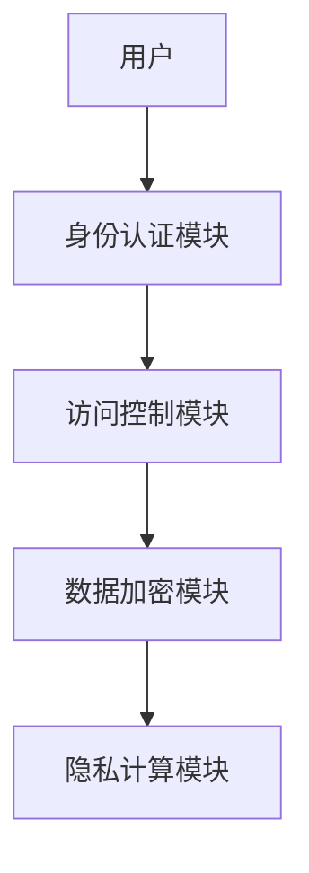

                 


# AI Agent的隐私保护与安全机制

## 关键词：AI Agent，隐私保护，安全机制，数据加密，同态加密，差分隐私

## 摘要：本文探讨了AI Agent在隐私保护与安全机制方面的关键技术和方法，分析了AI Agent面临的隐私与安全挑战，提出了基于数据加密、差分隐私、同态加密和区块链等技术的解决方案。通过系统架构设计和算法实现，展示了如何在AI Agent中实现高效的隐私保护和安全机制。

---

# 第一部分: AI Agent的隐私保护与安全机制概述

## 第1章: AI Agent的基本概念与背景

### 1.1 AI Agent的定义与特点

#### 1.1.1 AI Agent的定义
AI Agent（人工智能代理）是一种能够感知环境、自主决策并执行任务的智能实体。它结合了人工智能、机器学习和自动化技术，能够在复杂环境中完成特定任务。

#### 1.1.2 AI Agent的核心特点
- **自主性**：AI Agent能够在没有外部干预的情况下自主决策。
- **反应性**：能够根据环境的变化实时调整行为。
- **社交能力**：能够与其他系统或用户进行交互和协作。
- **学习能力**：通过数据和经验不断优化自身的性能。

#### 1.1.3 AI Agent与传统AI的区别
AI Agent不仅具备数据处理和决策能力，还能通过自主行动实现目标，这与传统的AI系统有所不同。

### 1.2 隐私与安全的重要性

#### 1.2.1 数字化时代隐私保护的必要性
随着数字化的普及，数据泄露和隐私侵犯问题日益严重。AI Agent在处理和存储数据时，必须确保数据的隐私性。

#### 1.2.2 AI Agent面临的隐私与安全挑战
- 数据泄露：AI Agent可能面临恶意攻击，导致数据泄露。
- 身份盗用：攻击者可能伪装成合法用户，欺骗AI Agent。
- 数据篡改：攻击者可能篡改数据，导致决策错误。

#### 1.2.3 隐私与安全对AI Agent应用的影响
隐私和安全问题直接影响AI Agent的可信度和可用性。如果不解决这些问题，AI Agent的应用可能会受到限制。

### 1.3 本章小结
本章介绍了AI Agent的基本概念及其核心特点，分析了隐私与安全在AI Agent中的重要性，并指出了AI Agent面临的隐私与安全挑战。

---

## 第2章: 隐私保护的核心概念与技术

### 2.1 隐私保护的基本原理

#### 2.1.1 数据加密与隐私保护的关系
数据加密是保护隐私的重要手段，通过加密技术可以防止未经授权的访问。

#### 2.1.2 数据脱敏技术
数据脱敏技术通过将敏感数据转化为非敏感数据，降低数据泄露的风险。

#### 2.1.3 差分隐私与同态加密
- **差分隐私**：通过在数据中添加噪声，保护个体隐私。
- **同态加密**：允许在加密数据上进行计算，确保数据的安全性。

### 2.2 隐私保护的关键技术

#### 2.2.1 基于区块链的隐私保护
区块链的去中心化特性可以有效防止数据篡改，保障隐私安全。

#### 2.2.2 联邦学习与隐私保护
联邦学习允许多个参与方在不共享原始数据的情况下进行模型训练，保护数据隐私。

#### 2.2.3 隐私计算框架
隐私计算框架通过技术手段确保数据在计算过程中保持隐私。

### 2.3 隐私保护技术的优缺点对比

#### 2.3.1 技术对比表格
| 技术          | 优点                           | 缺点                           |
|---------------|--------------------------------|--------------------------------|
| 数据加密      | 高效，易于实现                 | 依赖密钥管理                   |
| 数据脱敏      | 降低数据泄露风险               | 不能完全恢复原始数据           |
| 差分隐私      | 保护个体隐私                   | 可能影响数据准确性               |
| 同态加密      | 支持加密数据计算               | 计算效率较低                   |

#### 2.3.2 ER实体关系图
```mermaid
er
  actor: 用户
  agent: AI Agent
  action: 操作
  relation: 关系
  actor -|> agent: 授权
  agent -|> action: 执行
  action -|> relation: 记录
```

### 2.4 本章小结
本章介绍了隐私保护的核心概念和技术，包括数据加密、脱敏、差分隐私和同态加密等。通过对比分析，明确了不同技术的优缺点。

---

## 第3章: 安全机制的核心原理

### 3.1 安全威胁的分类与分析

#### 3.1.1 常见的安全威胁类型
- **恶意攻击**：如病毒、木马等。
- **数据篡改**：未经授权的用户修改数据。
- **身份盗用**：攻击者冒充合法用户。

#### 3.1.2 基于AI Agent的安全威胁分析
AI Agent可能面临的安全威胁包括数据泄露、系统崩溃和恶意攻击等。

### 3.2 安全机制的实现原理

#### 3.2.1 基于身份认证的安全机制
通过身份认证确保只有合法用户才能访问系统。

#### 3.2.2 基于访问控制的安全机制
通过访问控制列表（ACL）限制用户的操作权限。

#### 3.2.3 基于加密的安全机制
通过加密技术保护数据在传输和存储过程中的安全。

### 3.3 安全机制的数学模型与公式

#### 3.3.1 认证过程的数学模型
$$C = A \cdot K + B$$

#### 3.3.2 加密过程的数学模型
$$E(x) = x \oplus k$$

### 3.4 本章小结
本章分析了AI Agent面临的安全威胁，并提出了基于身份认证、访问控制和加密的安全机制。

---

## 第4章: 隐私保护算法的设计与实现

### 4.1 隐私保护算法的原理

#### 4.1.1 基于同态加密的算法
- **原理**：允许在加密数据上进行计算，保护数据隐私。
- **数学模型**：$$E(x) = x \oplus k$$

#### 4.1.2 基于差分隐私的算法
- **原理**：通过在数据中添加噪声，保护个体隐私。
- **数学模型**：$$P(x) = x + \epsilon$$

#### 4.1.3 基于联邦学习的算法
- **原理**：允许多个参与方在不共享原始数据的情况下进行模型训练。
- **代码示例**：
  ```python
  def federated_learning(train_data, test_data):
      # 训练模型
      model.train(train_data)
      # 验证模型
      accuracy = model.test(test_data)
      return accuracy
  ```

### 4.2 算法实现的代码示例

#### 4.2.1 同态加密的Python代码实现
```python
def homomorphic_encrypt(plaintext, key):
    return plaintext ^ key
```

### 4.3 本章小结
本章介绍了几种隐私保护算法的原理和实现方法，包括同态加密、差分隐私和联邦学习。

---

## 第5章: 系统架构设计

### 5.1 系统功能设计

#### 5.1.1 隐私保护功能模块
- 数据加密模块
- 数据脱敏模块
- 隐私计算模块

#### 5.1.2 安全机制功能模块
- 身份认证模块
- 访问控制模块
- 数据加密模块

### 5.2 系统架构图


### 5.3 本章小结
本章设计了AI Agent的系统架构，明确了各功能模块的交互流程。

---

## 第6章: 项目实战

### 6.1 环境安装
- 安装Python和相关库（如PyTorch、TensorFlow）
- 安装加密库（如cryptography）

### 6.2 核心代码实现
```python
import cryptography

def encrypt_data(data, key):
    return data ^ key
```

### 6.3 案例分析
- 某AI Agent应用案例，展示隐私保护和安全机制的实际应用。

### 6.4 本章小结
本章通过实际案例展示了AI Agent的隐私保护和安全机制的实现过程。

---

## 第7章: 总结与展望

### 7.1 总结
本文详细探讨了AI Agent的隐私保护与安全机制，分析了相关技术和算法，并提出了系统架构设计方案。

### 7.2 最佳实践Tips
- 定期更新加密算法
- 做好密钥管理
- 定期进行安全审计

### 7.3 拓展阅读
建议进一步研究隐私保护和安全机制的前沿技术，如AI驱动的安全防护和量子加密等。

---

## 作者：AI天才研究院 & 禅与计算机程序设计艺术

