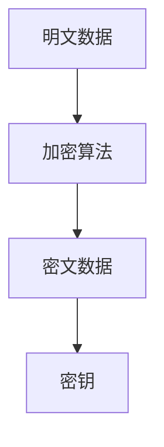
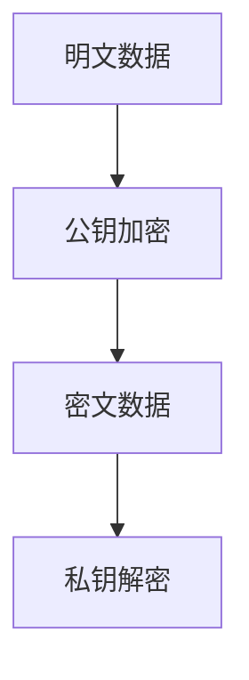
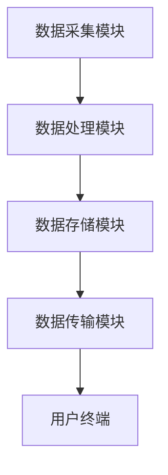

                 


好的，我明白了。我们先来构建《AI Agent的隐私保护：数据匿名化与加密》的完整内容。

---

# AI Agent的隐私保护：数据匿名化与加密

> **关键词**：AI Agent, 隐私保护, 数据匿名化, 数据加密, 安全算法, 隐私计算, 预测模型  
> **摘要**：  
> 随着AI Agent技术的广泛应用，隐私保护问题日益重要。本文深入探讨了AI Agent的隐私保护需求，重点介绍了数据匿名化与加密的核心概念、算法原理、系统设计与实现。通过详细分析数据匿名化和加密技术，结合实际案例，展示了如何在AI Agent中实现高效且安全的隐私保护。文章还总结了最佳实践和未来发展方向。

---

## 目录

1. **背景与概述**  
   1.1 AI Agent的基本概念  
   1.2 隐私保护的重要性  
   1.3 数据匿名化与加密的基本概念  

2. **数据匿名化与加密的核心概念**  
   2.1 数据匿名化的原理与技术  
   2.2 数据加密的原理与技术  
   2.3 数据匿名化与加密的区别与联系  

3. **数据匿名化与加密的算法原理**  
   3.1 数据脱敏算法的实现与应用  
   3.2 数据扰动算法的实现与应用  
   3.3 数据加密算法的实现与应用  

4. **系统分析与架构设计**  
   4.1 系统功能设计  
   4.2 系统架构设计  
   4.3 系统接口与交互设计  

5. **项目实战与案例分析**  
   5.1 项目背景与需求分析  
   5.2 系统实现与代码解读  
   5.3 实际案例分析与优化建议  

6. **最佳实践与未来展望**  
   6.1 隐私保护的最佳实践  
   6.2 数据匿名化与加密技术的未来发展方向  

---

## 1. 背景与概述

### 1.1 AI Agent的基本概念

AI Agent（智能体）是指能够感知环境、自主决策并执行任务的智能系统。它广泛应用于推荐系统、自动驾驶、智能客服等领域。AI Agent的核心特点包括：

- **自主性**：能够在没有外部干预的情况下完成任务。  
- **反应性**：能够实时感知环境并做出响应。  
- **目标导向**：以明确的目标为导向进行决策。  

AI Agent的分类可以根据功能分为简单反射型、基于模型的反应型、目标驱动型和效用驱动型。

### 1.2 隐私保护的重要性

在AI Agent的应用中，数据隐私问题尤为重要。例如，在自动驾驶中，车辆会收集大量用户数据（如位置、驾驶习惯等），这些数据可能包含敏感信息。如果这些数据被未经授权的第三方获取，可能导致隐私泄露、身份盗窃等问题。

隐私保护不仅是技术问题，还涉及法律和伦理要求。例如，GDPR（通用数据保护条例）规定，用户有权控制其个人数据的使用方式。因此，AI Agent的设计必须考虑隐私保护的需求。

### 1.3 数据匿名化与加密的基本概念

数据匿名化是指通过技术手段将数据中的敏感信息脱敏，使得无法通过处理后的数据还原出原始的敏感信息。例如，将用户的真实年龄替换为“大于25岁”或“小于25岁”。

数据加密则是通过数学算法对数据进行编码，使得只有拥有特定密钥的人才能解密数据。加密技术可以分为对称加密和非对称加密，分别适用于不同的场景。

数据匿名化与加密的区别在于，匿名化旨在隐藏数据的敏感信息，而加密旨在防止数据被未经授权的访问。两者的结合可以提供更强大的隐私保护能力。

---

## 2. 数据匿名化与加密的核心概念

### 2.1 数据匿名化的原理与技术

数据匿名化的实现通常包括以下步骤：

1. **数据收集**：从系统中收集原始数据。  
2. **数据处理**：对数据进行脱敏或扰动处理。  
3. **数据发布**：将处理后的数据发布给第三方。  

#### 2.1.1 数据脱敏技术

数据脱敏是通过删除、替换或泛化敏感信息来实现匿名化的过程。例如：

- **删除**：直接删除敏感字段（如身份证号）。  
- **替换**：将敏感字段替换为虚拟值（如将“张三”替换为“用户A”）。  
- **泛化**：将数据替换为更广泛的概念（如将“35岁”泛化为“成年”）。  

#### 2.1.2 数据扰动技术

数据扰动是通过添加噪声或随机化来保护隐私的技术。例如：

- **加噪法**：在数据中添加随机噪声，使得真实数据无法被准确还原。  
- **随机化**：通过随机化技术（如概率替换）保护数据。  

#### 2.1.3 数据重构技术

数据重构是通过重新组织数据结构来实现匿名化的技术。例如，将数据从关系型数据库转换为无关联的数据结构。

### 2.2 数据加密的原理与技术

数据加密的核心在于使用数学算法对数据进行编码。常见的加密算法包括：

1. **对称加密**：如AES算法，加密和解密使用相同的密钥。  
2. **非对称加密**：如RSA算法，加密和解密使用不同的密钥对。  
3. **哈希加密**：如MD5算法，用于验证数据的完整性。  

#### 2.2.1 对称加密技术

对称加密算法的优点是速度快，适用于大规模数据加密。例如：



#### 2.2.2 非对称加密技术

非对称加密算法的安全性更高，但计算复杂度较高。例如：



### 2.3 数据匿名化与加密的区别与联系

数据匿名化与加密的区别在于，匿名化主要用于隐藏数据的敏感信息，而加密主要用于防止未经授权的访问。两者的联系在于，匿名化通常需要依赖加密技术来实现数据的安全传输与存储。

---

## 3. 数据匿名化与加密的算法原理

### 3.1 数据脱敏算法的实现与应用

#### 3.1.1 数据脱敏算法的流程

数据脱敏算法的流程通常包括以下步骤：

1. **数据分类**：识别数据中的敏感字段。  
2. **脱敏处理**：根据敏感字段的类型选择合适的脱敏方法。  
3. **数据验证**：确保脱敏后的数据仍然满足业务需求。  

#### 3.1.2 数据脱敏算法的数学模型

数据脱敏可以看作是一种函数变换过程，即：

$$ f(x) = \text{脱敏后的数据} $$

其中，\( x \) 表示原始数据，\( f \) 表示脱敏函数。

#### 3.1.3 数据脱敏算法的实现代码

以下是一个简单的数据脱敏实现示例：

```python
def data_anonymization(data):
    # 定义敏感字段
    sensitive_fields = ['name', 'age', 'address']
    anonymized_data = {}
    for field in data:
        if field in sensitive_fields:
            # 对敏感字段进行脱敏处理
            if field == 'name':
                anonymized_data[field] = '用户' + str(hash(data[field]) % 100)
            elif field == 'age':
                anonymized_data[field] = '成年' if data[field] > 18 else '未成年'
            else:
                anonymized_data[field] = '地址已脱敏'
        else:
            anonymized_data[field] = data[field]
    return anonymized_data
```

---

## 4. 系统分析与架构设计

### 4.1 系统功能设计

AI Agent的隐私保护系统需要实现以下功能：

1. **数据采集**：从传感器或数据库中采集原始数据。  
2. **数据处理**：对数据进行匿名化处理。  
3. **数据存储**：将处理后的数据存储到数据库中。  
4. **数据传输**：通过加密通道传输数据。  

### 4.2 系统架构设计

以下是AI Agent隐私保护系统的架构图：



### 4.3 系统接口与交互设计

系统接口设计如下：

- 数据采集模块：负责从传感器或数据库中获取原始数据。  
- 数据处理模块：负责对数据进行脱敏和加密处理。  
- 数据存储模块：负责存储处理后的数据。  
- 数据传输模块：负责通过加密通道传输数据。  

---

## 5. 项目实战与案例分析

### 5.1 项目背景与需求分析

假设我们正在开发一个AI Agent系统，用于预测交通流量。系统需要处理大量的用户位置数据，这些数据可能包含用户的敏感信息（如经纬度）。为了保护用户隐私，我们需要对数据进行匿名化处理。

### 5.2 系统实现与代码解读

以下是系统的实现代码：

```python
import hashlib

def anonymize_geolocation(data):
    # 数据脱敏函数
    def hash_location(latitude, longitude):
        return hashlib.md5(f"{latitude},{longitude}".encode()).hexdigest()[:8]
    
    anonymized_data = []
    for point in data:
        lat, lon = point['latitude'], point['longitude']
        hashed = hash_location(lat, lon)
        anonymized_point = {
            'latitude': '已脱敏',
            'longitude': '已脱敏',
            'hashed_id': hashed
        }
        anonymized_data.append(anonymized_point)
    return anonymized_data

# 示例数据
data = [
    {'latitude': 37.7749, 'longitude': 122.4194},
    {'latitude': 34.0522, 'longitude': 118.2437}
]

# 调用脱敏函数
result = anonymize_geolocation(data)
print(result)
```

### 5.3 实际案例分析与优化建议

通过上述案例可以看出，数据脱敏可以有效保护用户隐私。然而，脱敏后的数据可能会失去部分准确性，因此需要在脱敏程度和数据可用性之间找到平衡。

---

## 6. 最佳实践与未来展望

### 6.1 隐私保护的最佳实践

- **最小化数据收集**：只收集必要的数据。  
- **数据匿名化**：对敏感数据进行脱敏处理。  
- **数据加密**：使用加密技术保护数据传输。  
- **访问控制**：限制只有授权人员才能访问敏感数据。  

### 6.2 数据匿名化与加密技术的未来发展方向

- **隐私计算**：研究如何在保护隐私的前提下进行数据计算。  
- **联邦学习**：通过分布式计算实现模型训练，而不共享原始数据。  
- **零知识证明**：在不泄露数据的情况下验证数据的真实性。  

---

## 作者：AI天才研究院/AI Genius Institute & 禅与计算机程序设计艺术 /Zen And The Art of Computer Programming

---

以上是文章的完整目录和内容概要。如果需要进一步扩展或补充细节，请随时告知！

