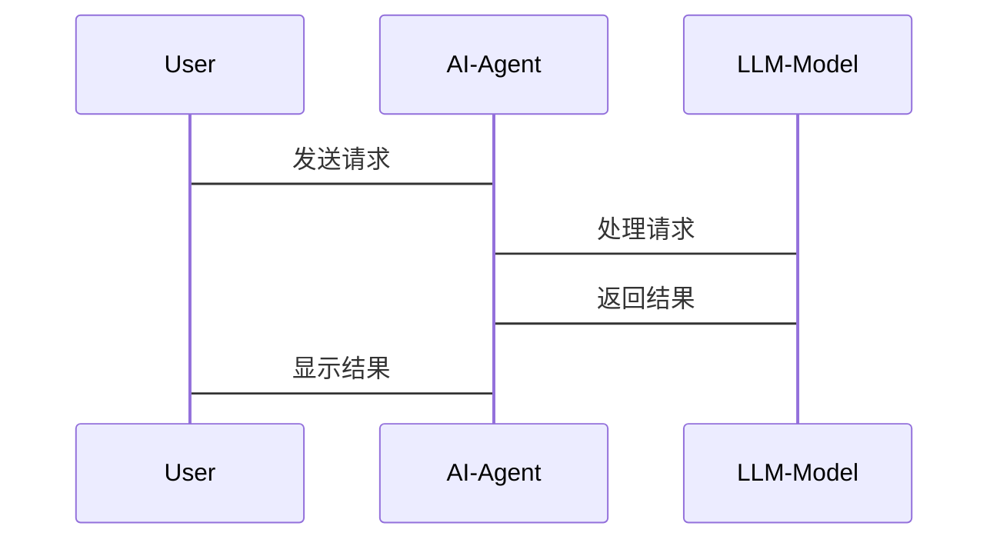

                 


# AI Agent的隐私保护：确保LLM应用的数据安全

## 关键词：AI Agent, 隐私保护, LLM, 数据安全, 大语言模型, 隐私泄露

## 摘要：AI Agent在利用大语言模型（LLM）进行智能任务处理时，面临着数据隐私泄露的重大风险。本文详细探讨了AI Agent在LLM应用中的隐私保护问题，从核心概念、算法原理、系统架构到实际项目实现，全面分析了如何确保数据安全，保护用户隐私。通过技术背景分析、原理阐述、系统设计、项目实战和总结，本文为AI Agent的隐私保护提供了系统性的解决方案和实践指导。

---

## 第一部分: AI Agent与隐私保护背景介绍

### 第1章: AI Agent的基本概念与问题背景

#### 1.1 AI Agent的定义与核心功能
- **AI Agent的定义**：AI Agent（人工智能代理）是一种能够感知环境、自主决策并执行任务的智能实体。它通过与用户或系统的交互，完成特定目标。
- **AI Agent的核心功能**：
  1. 感知环境：通过传感器或API获取信息。
  2. 自主决策：基于算法和模型做出选择。
  3. 执行任务：通过动作或输出结果完成目标。
- **AI Agent与传统AI的区别**：AI Agent强调自主性和目标导向，能够动态适应环境变化。

#### 1.2 LLM应用的隐私保护问题
- **问题背景**：随着LLM技术的广泛应用，AI Agent在处理用户数据时可能面临数据泄露风险。
- **问题描述**：
  1. 数据泄露风险：敏感信息可能在传输或存储过程中被窃取。
  2. 用户隐私暴露：用户的对话内容可能被模型记录或滥用。
  3. 模型滥用风险：恶意用户可能通过模型提取隐私信息。
- **解决方案**：通过数据加密、匿名化处理和访问控制等技术，保护用户隐私。

---

## 第二部分: AI Agent隐私保护的核心概念与联系

### 第2章: AI Agent与隐私保护的核心概念

#### 2.1 数据安全与隐私保护的基本概念
- **数据安全**：保护数据的机密性、完整性和可用性。
- **隐私保护**：防止未经授权的个人或组织访问敏感信息。
- **两者关系**：数据安全是隐私保护的基础，隐私保护是数据安全的目标。

#### 2.2 LLM应用中的隐私问题分析
- **数据泄露风险**：数据在传输或存储过程中被截获。
- **用户隐私暴露**：用户的对话内容可能被模型记录或滥用。
- **模型滥用风险**：恶意用户可能通过模型提取隐私信息。

#### 2.3 隐私保护的目标与边界
- **目标**：确保数据在生命周期中不被未经授权的访问。
- **边界**：明确哪些数据需要保护，保护的范围和程度。
- **平衡**：在隐私保护和功能需求之间找到平衡点。

### 第3章: 核心概念的原理与联系

#### 3.1 AI Agent隐私保护的原理分析
- **数据加密**：通过加密技术保护数据的机密性。
- **数据匿名化**：去除数据中的个人信息，使其无法被追溯。
- **数据访问控制**：通过权限管理限制数据访问范围。

#### 3.2 核心概念的属性特征对比
| 概念       | 描述                                                                 |
|------------|----------------------------------------------------------------------|
| 数据加密   | 将数据转化为密文，确保只有授权方能解密。                             |
| 数据匿名化 | 去除数据中的标识信息，降低隐私泄露风险。                             |
| 数据访问控制 | 通过权限管理，限制数据访问范围。                                   |

#### 3.3 ER实体关系图架构
```mermaid
erDiagram
    User {
        +string id
        +string username
        +string password
    }
    Role {
        +string role_id
        +string role_name
    }
    Permission {
        +string perm_id
        +string perm_name
    }
    User-|{ many }- Role : "用户角色"
    Role-|{ many }- Permission : "角色权限"
    User-|{ many }- Permission : "用户权限"
```

---

## 第三部分: AI Agent隐私保护的算法原理

### 第4章: 数据加密与解密的算法原理

#### 4.1 同态加密的原理
- **同态加密**：允许在加密数据上进行计算，结果仍是加密的。
- **数学模型**：$Enc(m) + Enc(m') = Enc(m + m')$，其中$Enc$是加密函数。

#### 4.2 差分隐私的实现
- **差分隐私**：通过在数据中添加噪声，保护个体隐私。
- **数学模型**：$P(D) \sim P(D')$，其中$D$和$D'$是两个相邻数据集。

#### 4.3 数据匿名化处理
- **方法**：去除或屏蔽敏感信息，如身份证号的部分位数。
- **案例**：将用户的真实年龄替换为“>=18”或“<18”。

### 第5章: 数据访问控制的算法实现

#### 5.1 基于角色的访问控制（RBAC）
- **角色与权限管理**：
  1. 用户被分配角色。
  2. 角色拥有特定权限。
  3. 用户通过角色获得权限。

#### 5.2 基于属性的访问控制（ABAC）
- **属性定义**：用户属性、资源属性、环境属性。
- **访问决策**：根据属性动态决定访问权限。

---

## 第四部分: AI Agent隐私保护的系统架构

### 第6章: 系统架构设计

#### 6.1 系统模块划分
- **数据采集模块**：接收用户输入并进行初步处理。
- **隐私保护模块**：应用加密和匿名化技术。
- **决策执行模块**：根据保护后的数据做出决策。
- **结果反馈模块**：将处理结果返回给用户。

#### 6.2 数据加密与隐私保护机制
- **数据加密**：在传输和存储过程中应用加密技术。
- **隐私保护**：在数据处理前进行匿名化处理。

#### 6.3 系统交互流程


---

## 第五部分: AI Agent隐私保护的项目实战

### 第7章: 项目实战与实现

#### 7.1 环境配置
- **工具安装**：安装Python、TensorFlow、Keras等库。
- **依赖管理**：使用virtualenv管理虚拟环境。

#### 7.2 核心代码实现
```python
import numpy as np
from transformers import AutoTokenizer, AutoModelForMaskedLM

# 加载预训练模型
model = AutoModelForMaskedLM.from_pretrained('bert-base-uncased')
tokenizer = AutoTokenizer.from_pretrained('bert-base-uncased')

# 数据匿名化处理
def anonymize_data(data):
    # 示例：去除用户ID
    return data.replace('userId:', '')

# 数据加密
def encrypt_data(data):
    # 示例：简单的凯撒加密
    return ''.join([chr(ord(c) + 1) for c in data])

# 解密函数
def decrypt_data(encrypted_data):
    return ''.join([chr(ord(c) - 1) for c in encrypted_data])

# 使用案例
data = 'userId:123456, username:alice'
encrypted = encrypt_data(data)
print(f'加密数据: {encrypted}')
decrypted = decrypt_data(encrypted)
print(f'解密数据: {decrypted}')
```

#### 7.3 实际案例分析
- **案例背景**：保护用户在与AI Agent交互中的对话内容。
- **实现步骤**：
  1. 数据匿名化：去除用户标识。
  2. 数据加密：在传输过程中加密对话内容。
  3. 解密与处理：AI Agent解密后处理请求。
  4. 结果反馈：返回加密结果，确保隐私安全。

---

## 第六部分: 总结与最佳实践

### 第8章: 总结与最佳实践

#### 8.1 小结
- AI Agent的隐私保护是确保LLM应用安全的关键。
- 通过数据加密、匿名化处理和访问控制，可以有效保护用户隐私。

#### 8.2 注意事项
- 定期进行安全审计，确保系统无漏洞。
- 加强用户教育，提高隐私保护意识。
- 遵守相关法律法规，确保合规性。

#### 8.3 拓展阅读
- 推荐阅读《数据隐私保护技术》和《人工智能的伦理与安全》。

---

## 作者：AI天才研究院/AI Genius Institute & 禅与计算机程序设计艺术/Zen And The Art of Computer Programming

---

这篇文章系统性地探讨了AI Agent在LLM应用中的隐私保护问题，从概念、原理到实际实现，为技术从业者和研究人员提供了全面的指导和参考。

