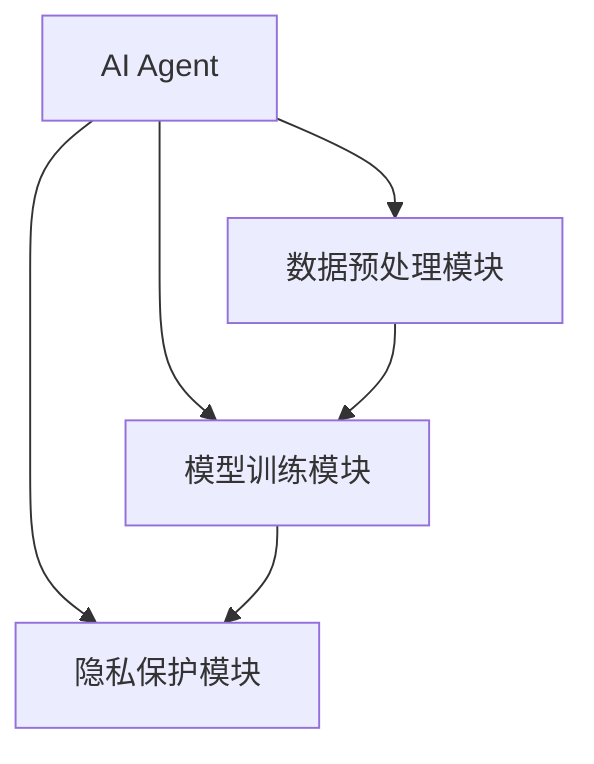
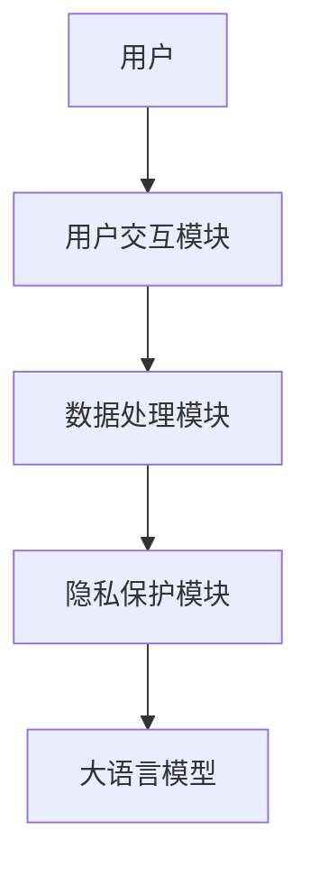
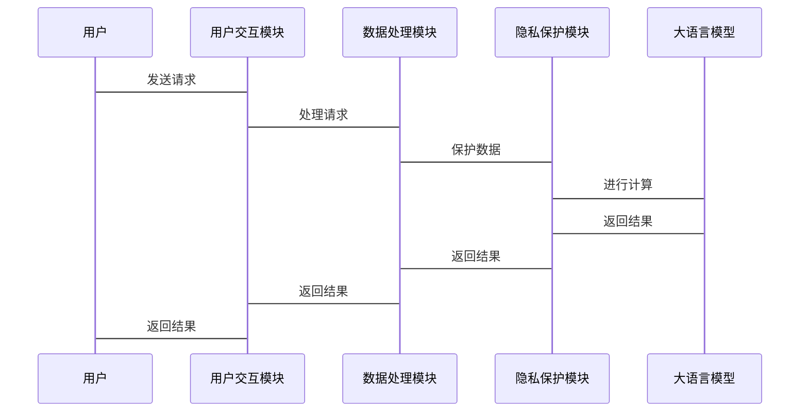

                 


# AI Agent的隐私计算：在保护数据隐私的同时应用LLM

## 关键词：AI Agent, 隐私计算, 数据隐私, 大语言模型, LLM, 加密技术, 隐私保护

## 摘要：  
在人工智能和大数据时代，数据隐私保护变得尤为重要。AI Agent作为智能系统的代表，如何在保护数据隐私的同时有效应用大语言模型（LLM）成为一项重要挑战。本文将详细探讨AI Agent与隐私计算的结合，分析其核心概念、算法原理、系统架构，并通过实际案例展示如何在保护数据隐私的前提下应用LLM技术。文章最后还将总结隐私计算的关键技术与未来发展方向。

---

# 正文

## 第一部分: AI Agent与隐私计算的背景介绍

### 第1章: AI Agent的基本概念

#### 1.1 AI Agent的定义与特点
- **AI Agent的定义**  
  AI Agent（人工智能代理）是一种智能实体，能够感知环境、执行任务并做出决策。它通常以软件或硬件形式存在，具备自主性和智能化特征。

- **AI Agent的核心特点**  
  - **自主性**：能够在没有外部干预的情况下自主决策和行动。
  - **反应性**：能够实时感知环境并做出响应。
  - **目标导向**：具有明确的目标，旨在优化任务执行效果。
  - **学习能力**：能够通过数据和经验不断优化自身的性能。

- **AI Agent与传统AI的区别**  
  AI Agent强调与环境的交互和自主决策，而传统AI更多关注数据处理和模式识别。

#### 1.2 隐私计算的核心概念
- **隐私计算的定义**  
  隐私计算是指在保护数据隐私的前提下，对数据进行处理和分析的技术。其核心目标是确保数据在计算过程中不被泄露或滥用。

- **隐私计算的关键技术**  
  - 数据加密技术：通过对数据进行加密处理，确保数据在传输和存储过程中的安全性。
  - 多方计算：允许多个参与方在不共享原始数据的情况下进行联合计算。
  - 同态加密：一种允许在加密数据上进行计算的技术，确保数据在计算过程中保持加密状态。

- **隐私计算的场景与应用**  
  隐私计算广泛应用于金融、医疗、社交网络等领域，特别是在需要处理敏感数据的场景中发挥重要作用。

### 第2章: AI Agent与隐私计算的结合

#### 2.1 AI Agent在隐私保护中的作用
- **AI Agent如何实现数据隐私保护**  
  AI Agent通过数据加密、访问控制和匿名化等技术，确保数据在传输和存储过程中的隐私性。

- **AI Agent在隐私计算中的优势**  
  AI Agent能够自主决策和执行任务，能够在不泄露敏感信息的前提下完成数据处理和分析。

- **AI Agent与隐私计算的结合场景**  
  例如，在医疗领域，AI Agent可以代理患者数据的处理，确保数据隐私的同时，帮助医生进行诊断。

#### 2.2 LLM在AI Agent中的应用
- **大语言模型的基本原理**  
  LLM（大语言模型）是一种基于深度学习的自然语言处理模型，能够理解和生成人类语言。其核心是通过大量数据训练的神经网络，具备强大的语言理解和生成能力。

- **LLM在AI Agent中的功能**  
  - **信息检索**：帮助AI Agent快速获取所需信息。
  - **对话生成**：实现与用户的自然语言交互。
  - **决策支持**：基于上下文信息做出智能决策。

- **LLM与隐私保护的结合**  
  通过隐私计算技术，AI Agent可以在不泄露用户隐私的前提下，利用LLM进行信息处理和分析。

---

## 第二部分: 隐私计算的核心技术

### 第3章: 数据加密与隐私保护

#### 3.1 数据加密技术
- **对称加密与非对称加密**  
  - 对称加密：加密和解密使用相同的密钥，速度快，适用于大量数据加密。
  - 非对称加密：加密和解密使用不同的密钥，安全性高，适用于身份验证和数字签名。

- **加密算法的选择与应用**  
  根据具体场景选择合适的加密算法，例如AES用于数据加密，RSA用于数字签名。

- **数据加密的实现步骤**  
  1. 数据预处理：将明文转换为可加密的格式。
  2. 选择加密算法：根据需求选择合适的加密算法。
  3. 加密过程：使用密钥对数据进行加密。
  4. 解密过程：使用对应的密钥对加密数据进行解密。

#### 3.2 隐私保护的数学模型
- **数据加密的数学公式**  
  对于对称加密，加密过程可以表示为：$C = E(K, P)$，其中$C$是密文，$K$是密钥，$P$是明文。解密过程为：$P = D(K, C)$。

- **加密算法的数学推导**  
  以AES加密为例，其加密过程涉及多个线性变换和非线性变换，确保数据的安全性。

- **加密模型的实现流程**  
  1. 数据输入：明文$P$进入加密模块。
  2. 加密处理：加密模块使用密钥$K$对$P$进行加密，生成密文$C$。
  3. 数据输出：密文$C$传输或存储。

### 第4章: 多方计算与隐私保护

#### 4.1 多方计算的基本原理
- **多方计算的定义**  
  多方计算是指多个参与方在不共享原始数据的前提下，通过协作完成计算任务。

- **多方计算的实现步骤**  
  1. 确定计算任务：明确需要计算的目标。
  2. 数据分割：将数据分割成多个部分，每个部分分配给不同的参与方。
  3. 协作计算：各参与方在本地数据上进行计算，并将结果汇总。
  4. 结果合并：将各参与方的计算结果合并，得到最终结果。

- **多方计算的应用场景**  
  在金融领域，多方计算可以用于多个机构之间的联合数据分析，同时保护各方的隐私数据。

#### 4.2 隐私保护的算法实现
- **多方计算的算法选择**  
  根据具体需求选择合适的多方计算协议，例如秘密共享、门限签名等。

- **多方计算的数学模型**  
  以秘密共享为例，秘密$S$可以被分成$k$个部分$S_1, S_2, \dots, S_k$，每个部分分配给不同的参与方。最终，通过收集足够多的部分可以恢复秘密$S$。

- **多方计算的实现流程**  
  1. 数据分割：将秘密$S$分割成多个部分$S_i$。
  2. 分发数据：将各部分$S_i$分发给不同的参与方。
  3. 计算任务：各参与方在本地数据上进行计算，生成中间结果。
  4. 结果汇总：将各参与方的中间结果汇总，得到最终结果。

---

## 第三部分: AI Agent的设计与实现

### 第5章: AI Agent的系统架构

#### 5.1 AI Agent的设计原则
- **模块化设计**：将AI Agent划分为多个功能模块，每个模块负责特定任务。
- **可扩展性**：确保系统能够适应未来的需求变化。
- **安全性**：在设计中优先考虑数据隐私和安全性。

#### 5.2 系统功能设计
- **数据预处理模块**：负责数据的清洗和转换，确保数据符合后续处理的要求。
- **模型训练模块**：利用大语言模型进行训练，提升AI Agent的智能水平。
- **隐私保护模块**：通过加密和访问控制等技术，保护数据隐私。

#### 5.3 系统架构图


### 第6章: AI Agent的实现过程

#### 6.1 环境搭建
- **安装必要的库和工具**：例如Python、TensorFlow、PyTorch等。
- **配置开发环境**：设置虚拟环境，安装所需的依赖项。

#### 6.2 核心代码实现
```python
# 数据预处理模块
def preprocess_data(data):
    # 数据清洗和转换
    pass

# 模型训练模块
def train_model(data):
    # 使用大语言模型进行训练
    pass

# 隐私保护模块
def encrypt_data(data):
    # 数据加密
    pass
```

#### 6.3 代码解读与分析
- **数据预处理**：通过对数据进行清洗和转换，确保数据的质量和一致性。
- **模型训练**：利用大语言模型对数据进行训练，提升AI Agent的智能水平。
- **数据加密**：通过加密技术，保护数据在传输和存储过程中的隐私性。

---

## 第四部分: 系统架构与安全

### 第7章: 系统架构设计

#### 7.1 问题场景介绍
- **系统目标**：设计一个基于AI Agent的隐私保护系统，确保数据隐私的同时，提供高效的智能服务。

#### 7.2 系统功能设计
- **用户交互模块**：实现用户与AI Agent之间的交互。
- **数据处理模块**：负责数据的采集、存储和处理。
- **隐私保护模块**：通过加密和访问控制，保护数据隐私。

#### 7.3 系统架构图


### 第8章: 系统接口设计

#### 8.1 系统接口介绍
- **API接口**：定义系统与其他模块之间的接口，确保数据的安全传输。
- **通信协议**：选择合适的通信协议，例如HTTPS，确保数据传输的安全性。

#### 8.2 系统交互流程


---

## 第五部分: 项目实战

### 第9章: 项目实现

#### 9.1 环境搭建
- **安装必要的库和工具**：例如Python、TensorFlow、PyTorch等。
- **配置开发环境**：设置虚拟环境，安装所需的依赖项。

#### 9.2 核心代码实现
```python
# 数据预处理模块
def preprocess_data(data):
    # 数据清洗和转换
    pass

# 模型训练模块
def train_model(data):
    # 使用大语言模型进行训练
    pass

# 隐私保护模块
def encrypt_data(data):
    # 数据加密
    pass
```

#### 9.3 代码解读与分析
- **数据预处理**：通过对数据进行清洗和转换，确保数据的质量和一致性。
- **模型训练**：利用大语言模型对数据进行训练，提升AI Agent的智能水平。
- **数据加密**：通过加密技术，保护数据在传输和存储过程中的隐私性。

---

## 第六部分: 总结与展望

### 第10章: 总结

#### 10.1 核心技术总结
- **数据加密技术**：通过对数据进行加密，确保数据在传输和存储过程中的安全性。
- **多方计算**：允许多个参与方在不共享原始数据的前提下进行联合计算。
- **大语言模型**：利用大语言模型提升AI Agent的智能水平，实现更复杂的任务。

#### 10.2 实践经验总结
- **项目小结**：通过项目实战，验证了AI Agent在保护数据隐私的同时，能够有效应用大语言模型。
- **注意事项**：在实际应用中，需要综合考虑数据隐私、计算效率和系统安全等多方面因素。

### 第11章: 未来展望

#### 11.1 未来发展方向
- **隐私保护技术的进一步发展**：探索更先进的加密技术和隐私保护方法。
- **大语言模型的优化**：提升大语言模型的性能和隐私保护能力。
- **多领域应用**：将AI Agent应用于更多领域，如医疗、金融、教育等。

#### 11.2 拓展阅读
- **推荐书籍**：《隐私计算：原理与应用》
- **推荐论文**：《基于大语言模型的隐私保护方法研究》

---

## 作者信息

作者：AI天才研究院/AI Genius Institute & 禅与计算机程序设计艺术 /Zen And The Art of Computer Programming

