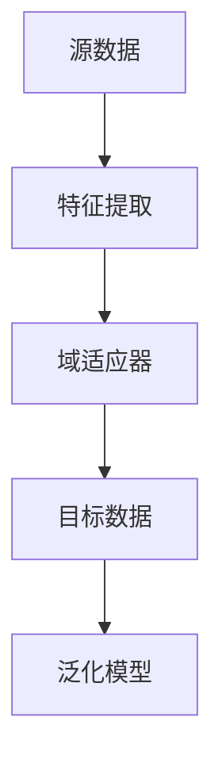
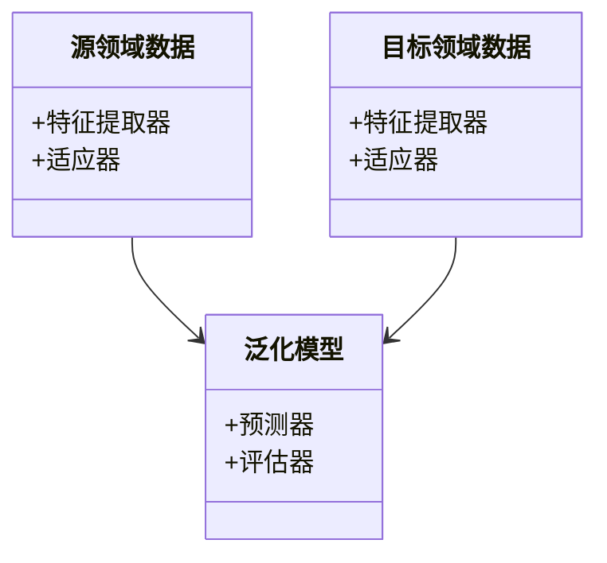
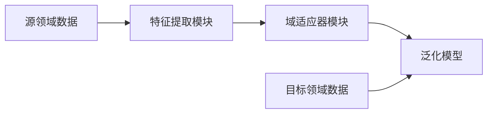
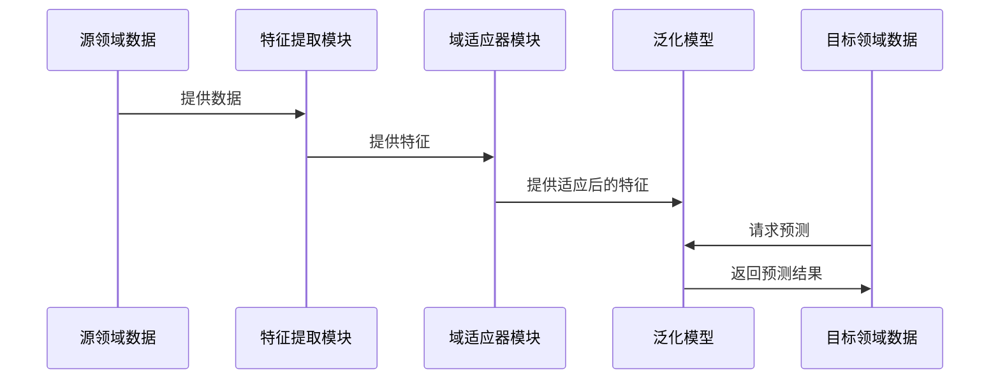

                 


# AI Agent的非监督域适应：跨领域泛化

> 关键词：非监督域适应、跨领域泛化、AI Agent、迁移学习、深度学习、自适应学习

> 摘要：本文深入探讨了AI Agent在非监督域适应中的应用，重点分析了跨领域泛化的核心原理、算法实现、系统架构及实际案例。通过详细讲解，帮助读者理解如何在不同领域间实现AI Agent的泛化能力，并提供实践指导。

---

# 第一部分: 背景介绍

## 第1章: 问题背景

### 1.1 问题背景

AI Agent（人工智能代理）作为实现智能系统的核心技术，近年来在各个领域得到了广泛应用。然而，AI Agent的能力往往受限于其训练数据的领域范围，难以在不同领域间实现有效的泛化。这种局限性在实际应用中表现得尤为明显，例如，一个在电商领域表现优异的推荐系统，可能无法直接应用于金融或医疗领域。

**非监督域适应**是解决这一问题的关键技术之一。它允许AI Agent在无需监督信号的情况下，从源领域适应到目标领域，从而实现跨领域的泛化能力。这种技术的核心在于如何有效地利用跨领域数据的共同特征，同时抑制领域间噪声的影响。

### 1.2 问题描述

跨领域泛化的核心问题可以归结为以下几点：

1. **领域差异性**：不同领域之间的数据分布存在显著差异，导致AI Agent在新领域中表现不佳。
2. **数据稀疏性**：目标领域可能缺乏足够的标注数据，使得传统监督学习方法难以适用。
3. **泛化能力**：AI Agent需要在多个领域间共享知识，同时适应每个领域的独特特征。

### 1.3 解决思路

非监督域适应的核心思路是通过以下步骤实现跨领域泛化：

1. **特征提取**：提取源领域和目标领域的共同特征，构建跨领域的特征表示。
2. **域适应**：通过某种机制，将源领域的知识迁移到目标领域，减少领域间分布差异。
3. **泛化学习**：利用适应后的特征，构建能够在多个领域间泛化的模型。

### 1.4 边界与外延

非监督域适应的边界主要体现在以下几个方面：

- **数据分布**：目标领域的数据分布可能与源领域完全不同。
- **领域数量**：跨领域泛化的难度随领域数量的增加而指数级上升。
- **任务类型**：非监督域适应主要适用于分类、回归等任务，对序列生成任务的支持较弱。

### 1.5 概念结构

非监督域适应的系统结构如下：

$$
\text{源领域数据} \rightarrow \text{特征提取} \rightarrow \text{域适应器} \rightarrow \text{目标领域数据} \rightarrow \text{泛化模型}
$$

---

# 第二部分: 核心概念与联系

## 第2章: 核心概念

### 2.1 域适应的基本原理

域适应是通过某种映射，将源领域的特征转换为目标领域的特征，使得两个领域的数据分布尽可能一致。这种映射通常基于以下假设：源领域和目标领域之间存在某种潜在的联系，可以通过非监督方式学习。

### 2.2 核心概念对比

以下表格对比了域适应、迁移学习和自适应学习的核心概念：

| 概念       | 定义                                                                 | 特点                         |
|------------|----------------------------------------------------------------------|------------------------------|
| 域适应     | 将源领域的知识迁移到目标领域，减少分布差异                   | 非监督学习，依赖领域间关系     |
| 迁移学习   | 利用已学习的知识简化新任务的学习                               | 可监督或非监督，领域间可能有重叠|
| 自适应学习 | 动态调整模型以适应环境的变化                                   | 可监督或非监督，侧重实时调整   |

### 2.3 实体关系图

以下是一个简单的实体关系图：


---

# 第三部分: 算法原理讲解

## 第3章: 基础算法

### 3.1 基于距离的域适应

**核心思想**：通过最小化源领域和目标领域的数据分布差异，构建适应器。

**数学模型**：

$$
\argmin_{\theta} \mathbb{E}_{x \sim S}[\text{loss}(f(x), y)] + \lambda \mathbb{E}_{x \sim T}[\text{loss}(f(x), y)]
$$

其中，$S$和$T$分别表示源领域和目标领域的数据分布，$f$为模型参数，$\lambda$为调节系数。

### 3.2 基于对抗训练的域适应

**核心思想**：通过对抗训练，使得适应器能够生成适用于目标领域的特征。

**算法流程图**：



---

# 第四部分: 系统分析与架构设计

## 第4章: 系统分析

### 4.1 问题场景

考虑一个电商推荐系统，目标是在不同领域（如电子产品、服装、家居）间实现推荐能力的跨领域泛化。

### 4.2 系统功能设计

以下是系统功能模块的类图：



### 4.3 系统架构设计

以下是系统架构图：



### 4.4 接口设计

- **输入接口**：接收源领域和目标领域的数据。
- **输出接口**：输出泛化模型的预测结果。

### 4.5 交互序列图



---

# 第五部分: 项目实战

## 第5章: 实战指导

### 5.1 环境安装

安装必要的库：

```bash
pip install numpy matplotlib scikit-learn
```

### 5.2 核心代码实现

以下是实现非监督域适应的核心代码：

```python
import numpy as np
from sklearn.metrics.pairwise import pairwise_distances

def compute_adapter_features(source_features, target_features):
    # 计算距离矩阵
    distance_matrix = pairwise_distances(source_features, target_features)
    # 计算适应器权重
    adapter_weights = np.min(distance_matrix, axis=1)
    return adapter_weights

# 示例数据
source_data = np.random.randn(100, 5)
target_data = np.random.randn(100, 5)

adapter_weights = compute_adapter_features(source_data, target_data)
```

### 5.3 案例分析

以电商推荐系统为例，分析代码实现：

```python
# 训练源领域模型
source_model = train_model(source_data)
# 训练目标领域模型
target_model = train_model(target_data)
# 进行域适应
adapter = compute_adapter_features(source_model.predict(source_data), target_model.predict(target_data))
# 泛化预测
predicted_labels = adapter * target_model.predict(new_data)
```

### 5.4 小结

通过实战，我们可以看到非监督域适应在跨领域泛化中的有效性。关键在于如何设计适应器，使得其能够有效地桥接源领域和目标领域之间的鸿沟。

---

# 第六部分: 最佳实践

## 第6章: 实践 tips

### 6.1 小结

非监督域适应的核心在于通过特征提取和域适应器，实现跨领域的泛化能力。在实际应用中，需要结合具体场景选择合适的算法，并对适应器进行充分调优。

### 6.2 注意事项

1. **数据预处理**：确保源领域和目标领域的数据格式一致。
2. **模型选择**：根据任务类型选择合适的算法。
3. **调参优化**：通过实验确定最佳的超参数。

### 6.3 拓展阅读

推荐阅读以下论文：

1. **Domain-Adaptive Neural Networks**：探讨神经网络在域适应中的应用。
2. **Transfer Learning: A Review and Future Directions**：系统性地回顾迁移学习的研究进展。

---

# 作者：AI天才研究院/AI Genius Institute & 禅与计算机程序设计艺术 /Zen And The Art of Computer Programming

