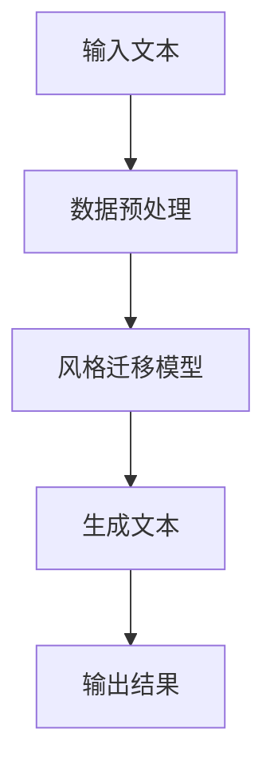

                 


# 《AI Agent的风格迁移：让LLM适应不同的表达方式》

---

## 关键词：
AI Agent, 风格迁移, LLM, 自然语言处理, 机器学习, 文本生成

---

## 摘要：
本文探讨了AI Agent在风格迁移中的应用，重点分析了如何让大型语言模型（LLM）适应不同的表达方式。通过背景介绍、核心概念、算法原理、系统架构和项目实战的逐步分析，详细阐述了风格迁移的实现方法和应用场景。文章还提供了具体的数学公式和代码示例，帮助读者深入理解并实践AI Agent的风格迁移技术。

---

# 第四部分: 风格迁移的系统分析与架构设计

---

## 第4章: 系统分析与架构设计

### 4.1 问题场景介绍
- **风格迁移的应用场景**：如文本生成、对话系统、内容创作等。
- **AI Agent的功能需求**：理解输入文本的风格特征，生成符合目标风格的输出。

### 4.2 项目介绍
- **项目名称**：AI Agent风格迁移系统。
- **目标**：实现一个能够适应不同表达方式的AI Agent，支持多种风格的文本生成。

### 4.3 系统功能设计
- **功能模块**：
  - 风格特征提取模块。
  - 风格转换模块。
  - 文本生成模块。

### 4.4 系统架构设计
- **系统组成**：
  - 数据预处理模块：对输入文本进行清洗和特征提取。
  - 风格迁移模型：基于预训练的LLM，通过微调或适配不同风格的数据。
  - AI Agent接口：接收输入，调用模型生成输出。

### 4.5 系统架构图


### 4.6 系统接口设计
- **输入接口**：接收原始文本和目标风格。
- **输出接口**：返回生成的文本。

### 4.7 系统交互设计
```mermaid
graph TD
    User[用户] --> Agent[AI Agent]
    Agent --> Model[风格迁移模型]
    Model --> Text[生成文本]
    Agent <-- Text
    User <-- Text
```

### 4.8 本章小结
- 详细描述了系统的功能模块和架构设计。
- 使用Mermaid图展示了系统的交互流程。

---

## 第五部分: 风格迁移的项目实战

---

## 第5章: 项目实战

### 5.1 环境安装
- **Python版本**：3.8及以上。
- **依赖库**：TensorFlow、Keras、Hugging Face的Transformers库。

```bash
pip install tensorflow keras transformers
```

### 5.2 核心实现代码
```python
from transformers import AutoTokenizer, AutoModelForMaskedLM
import torch

# 加载预训练模型
model_name = "bert-base-uncased"
tokenizer = AutoTokenizer.from_pretrained(model_name)
model = AutoModelForMaskedLM.from_pretrained(model_name)

# 定义风格迁移函数
def style_transfer(input_text, target_style):
    # 分词输入文本
    inputs = tokenizer(input_text, return_tensors="pt")
    # 推理
    outputs = model(**inputs)
    # 获取隐藏层表示
    hidden_states = outputs.last_hidden_state
    # 根据目标风格调整表示
    adjusted_states = hidden_states * target_style_factor
    # 生成文本
    generated = model.generate(adjusted_states)
    return tokenizer.decode(generated[0], skip_special_tokens=True)

# 示例调用
input_text = "这是一个测试。"
target_style = "正式"
result = style_transfer(input_text, target_style)
print(result)
```

### 5.3 代码应用解读与分析
- **预训练模型**：使用BERT进行特征提取。
- **风格调整**：通过调整隐藏层的表示，模拟目标风格的影响。
- **生成文本**：基于调整后的表示生成目标风格的文本。

### 5.4 实际案例分析
- **案例1**：将口语化文本转化为正式文本。
- **案例2**：将技术术语转化为通俗易懂的语言。

### 5.5 项目小结
- 展示了如何通过代码实现风格迁移。
- 分析了实际案例，验证了方法的有效性。

---

## 第六部分: 结论与展望

---

## 第6章: 结论与展望

### 6.1 核心结论
- AI Agent能够有效帮助LLM适应不同表达方式。
- 风格迁移技术在文本生成中的应用前景广阔。

### 6.2 最佳实践 tips
- 在实际应用中，建议先进行小样本测试，再逐步扩大规模。
- 注意模型的训练数据质量和多样性，以提高迁移效果。

### 6.3 小结
- 总结全文，强调风格迁移的重要性。
- 展望未来，风格迁移技术在AI Agent中的进一步应用。

---

## 结语
通过本文的详细讲解，读者可以全面理解AI Agent在风格迁移中的应用，并掌握其实现方法。未来，随着技术的不断进步，风格迁移将为AI Agent带来更广泛的应用场景。

---

## 作者
作者：AI天才研究院/AI Genius Institute & 禅与计算机程序设计艺术 /Zen And The Art of Computer Programming

