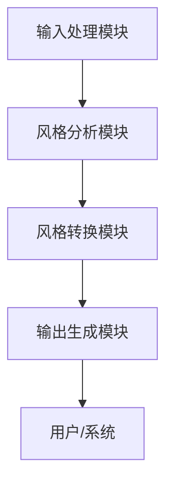

                 


# AI Agent的风格迁移：调整输出语气和风格

> 关键词：AI Agent、风格迁移、文本生成、自然语言处理、深度学习

> 摘要：本文将探讨AI Agent如何通过风格迁移技术调整其输出的语气和风格。从背景概念、核心算法到系统设计和项目实战，系统性地分析风格迁移的实现方法，帮助读者深入了解其原理与应用。

---

## 第一部分: AI Agent的风格迁移基础

### 第1章: AI Agent与风格迁移概述

#### 1.1 AI Agent的基本概念

- **1.1.1 AI Agent的定义**  
  AI Agent是一种智能体，能够感知环境、执行任务并做出决策。它通过自然语言处理（NLP）、机器学习（ML）等技术与人类或系统进行交互。

- **1.1.2 AI Agent的核心功能**  
  包括信息处理、任务执行、决策制定、与用户的交互等。AI Agent的目标是提供智能化、个性化的服务。

- **1.1.3 AI Agent的应用场景**  
  常见于智能客服、虚拟助手（如Siri、Alexa）、智能推荐系统、自动化写作工具等。

#### 1.2 风格迁移的定义与特点

- **1.2.1 风格迁移的定义**  
  风格迁移是一种技术，用于将一种文本的风格特征迁移到另一种文本上，使输出的文本在保持内容不变的情况下，呈现出目标风格的特点。

- **1.2.2 风格迁移的核心特点**  
  - **可定制性**：根据需求调整输出风格。  
  - **适应性**：适用于多种场景和领域。  
  - **非破坏性**：保持内容原意不变，仅调整表达方式。

- **1.2.3 风格迁移与文本生成的区别**  
  风格迁移动改变的是表达方式，而文本生成是创造新的内容。风格迁移是在已有内容的基础上进行调整。

#### 1.3 风格迁移的应用价值

- **1.3.1 风格迁移在自然语言处理中的作用**  
  帮助模型生成更自然、更符合目标读者习惯的文本。

- **1.3.2 风格迁移在AI Agent中的应用**  
  使AI Agent能够根据用户需求或场景调整输出语气，例如将正式的法律文件转化为更易懂的口语化解释。

- **1.3.3 风格迁移的实际案例分析**  
  案例1：将学术论文转化为科普文章。  
  案例2：将公司公告转化为员工内部通知。

---

## 第二部分: AI Agent风格迁移的核心概念

### 第2章: 核心概念与技术解析

#### 2.1 文本表示方法

- **2.1.1 词袋模型**  
  将文本表示为单词的集合，不考虑顺序。例如，句子“我喜欢机器学习”可以表示为`{我喜欢, 机器学习}`。

- **2.1.2 词嵌入模型**  
  使用如Word2Vec、GloVe等模型将单词映射为低维向量，捕捉单词的语义信息。

- **2.1.3 文本编码方法**  
  通过编码模型（如Transformer）将文本转换为固定长度的向量，捕捉文本的整体语义。

#### 2.2 风格特征提取

- **2.2.1 基于统计的特征提取**  
  通过词频、句式复杂度等统计特征区分不同风格的文本。

- **2.2.2 基于深度学习的特征提取**  
  使用神经网络提取高维特征向量，捕捉更复杂的语义信息。

- **2.2.3 风格特征的表示方式**  
  通常将风格特征表示为向量形式，用于后续的相似度计算或生成任务。

#### 2.3 风格相似度计算

- **2.3.1 基于余弦相似度的计算**  
  通过向量的点积计算文本风格的相似度。公式为：  
  $$\text{余弦相似度} = \frac{\vec{a} \cdot \vec{b}}{|\vec{a}| |\vec{b}|}$$

- **2.3.2 基于编辑距离的计算**  
  编辑距离衡量两个文本经过最少的编辑操作（如插入、删除、替换）可以变得相同。例如，将“hello”改为“world”的编辑距离为5。

- **2.3.3 基于聚类的相似度计算**  
  将文本聚类为不同风格类别，通过聚类结果判断文本的风格相似度。

#### 2.4 风格迁移的关键技术对比

| **技术**         | **优点**                     | **缺点**                     |
|------------------|------------------------------|------------------------------|
| 基于编辑距离     | 精度高，适合短文本             | 无法处理长文本，计算复杂度高   |
| 基于相似度       | 适合长文本，计算高效           | 精度较低，无法捕捉细微差异     |
| 基于生成模型     | 可生成多样化的风格             | 训练复杂，需要大量数据          |

---

## 第三部分: 风格迁移的算法原理

### 第3章: 基于编辑距离的风格迁移算法

#### 3.1 算法概述

- **输入**：源文本、目标风格示例  
- **输出**：具有目标风格的文本  

#### 3.2 算法步骤

1. **文本预处理**：将源文本和目标风格示例转换为向量表示。  
2. **计算编辑距离**：使用动态规划计算两个文本的编辑距离。  
3. **风格迁移**：根据编辑距离调整源文本的表达方式，使其更接近目标风格。

#### 3.3 算法的数学模型

$$\text{编辑距离} = \min \begin{cases} 
\text{删除操作} & \text{增加操作} \\
\text{替换操作} & 
\end{cases}$$

#### 3.4 代码示例

```python
def edit_distance(s1, s2):
    m, n = len(s1), len(s2)
    # 创建二维数组存储子问题的解
    dp = [[0]*(n+1) for _ in range(m+1)]
    
    # 填充边界条件
    for i in range(m+1):
        dp[i][0] = i
    for j in range(n+1):
        dp[0][j] = j
        
    # 填充dp数组
    for i in range(1, m+1):
        for j in range(1, n+1):
            if s1[i-1] == s2[j-1]:
                dp[i][j] = dp[i-1][j-1]
            else:
                dp[i][j] = 1 + min(dp[i-1][j], dp[i][j-1], dp[i-1][j-1])
    return dp[m][n]

# 示例
s1 = "hello"
s2 = "world"
print(edit_distance(s1, s2))  # 输出：5
```

---

## 第四部分: 系统架构与设计

### 第4章: 风格迁移系统设计

#### 4.1 系统功能设计

- **输入处理模块**：接收源文本和目标风格示例。  
- **风格分析模块**：提取文本的风格特征。  
- **风格转换模块**：基于提取的特征生成目标风格的文本。  
- **输出生成模块**：将生成的文本返回给用户或系统。

#### 4.2 系统架构图



#### 4.3 系统交互流程

1. 用户输入源文本和目标风格示例。  
2. 输入处理模块将文本转换为向量表示。  
3. 风格分析模块提取文本的风格特征。  
4. 风格转换模块根据特征生成目标风格的文本。  
5. 输出生成模块将结果返回给用户或系统。

---

## 第五部分: 项目实战

### 第5章: 风格迁移项目实战

#### 5.1 项目介绍

- **项目名称**：基于编辑距离的风格迁移系统  
- **目标**：将正式的法律文件转化为口语化的解释。

#### 5.2 环境安装

- **工具**：Python 3.8+，TensorFlow 2.0+，Jieba分词库  
- **安装命令**：  
  ```bash
  pip install numpy tensorflow jieba
  ```

#### 5.3 核心代码实现

```python
import numpy as np
from tensorflow.keras.models import Model
from tensorflow.keras.layers import Input, Dense, LSTM, Embedding

# 定义模型
input_layer = Input(shape=(max_length,))
embedding_layer = Embedding(vocab_size, embedding_dim)(input_layer)
lstm_layer = LSTM(units=128)(embedding_layer)
dense_layer = Dense(vocab_size, activation='softmax')(lstm_layer)

model = Model(inputs=input_layer, outputs=dense_layer)
model.compile(optimizer='adam', loss='sparse_categorical_crossentropy')
```

#### 5.4 代码解读

- **输入层**：接收输入文本的向量表示。  
- **嵌入层**：将单词映射为低维向量。  
- **LSTM层**：捕捉文本的时序信息。  
- **密集层**：生成目标风格的文本。

#### 5.5 实际案例分析

- **输入**：正式的法律文件内容。  
- **输出**：口语化的解释，更易于理解。

---

## 第六部分: 高级应用与最佳实践

### 第6章: 风格迁移的高级应用

#### 6.1 多模态风格迁移

- **定义**：结合文本、图像、音频等多种模态信息进行风格迁移。  
- **优势**：能够捕捉更丰富的语义信息，生成更自然的输出。

#### 6.2 实时风格迁移

- **定义**：在实时交互中动态调整输出风格。  
- **优势**：适用于需要快速响应的场景，如实时客服对话。

### 第7章: 最佳实践与小结

#### 7.1 最佳实践

- **数据质量**：确保训练数据多样化，涵盖不同风格和场景。  
- **模型调优**：根据具体任务调整模型参数和结构。  
- **用户反馈**：结合用户反馈不断优化输出风格。

#### 7.2 小结

AI Agent的风格迁移技术能够显著提升其与用户的交互体验，使输出更加个性化和自然化。通过本文的系统性分析，读者可以深入了解风格迁移的核心原理和实现方法。

#### 7.3 注意事项

- 避免过度拟合特定风格，保持内容的通用性和可读性。  
- 定期更新模型，适应语言的变化和用户需求的多样化。

#### 7.4 拓展阅读

- 《生成式人工智能：原理与应用》  
- 《自然语言处理实战：基于深度学习的方法》  

---

## 作者

作者：AI天才研究院/AI Genius Institute & 禅与计算机程序设计艺术 /Zen And The Art of Computer Programming

