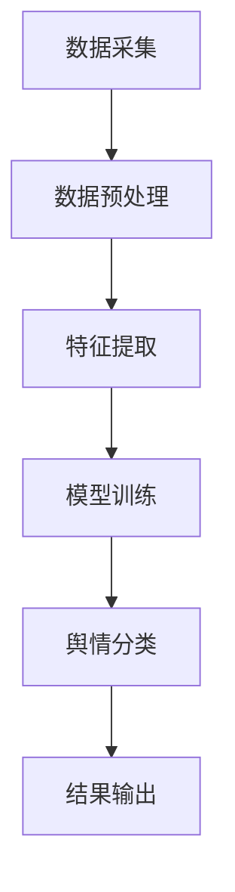
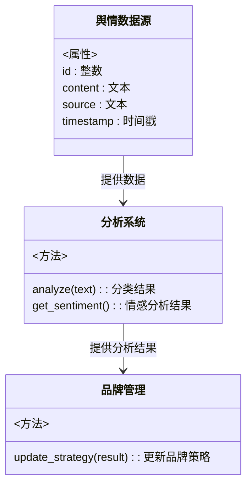
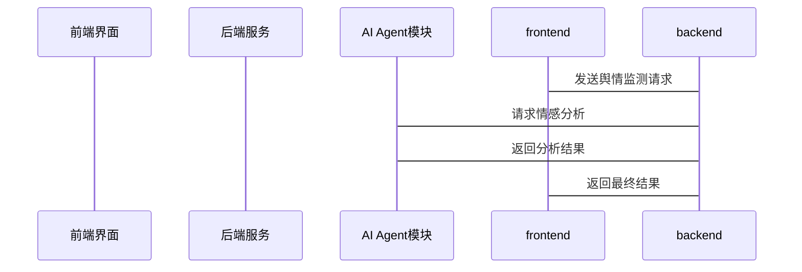

                 


# AI Agent辅助企业舆情监测与品牌管理的策略

---

## 关键词

- AI Agent  
- 企业舆情监测  
- 品牌管理  
- 自然语言处理  
- 机器学习  

---

## 摘要

在当今数字化时代，企业舆情监测和品牌管理的重要性日益凸显。企业需要实时掌握市场动态、消费者反馈以及品牌声誉，以快速响应市场变化并制定精准的品牌策略。传统的舆情监测方法依赖人工分析，效率低下且容易出错。而AI Agent（人工智能代理）的引入，为企业提供了更高效、更智能的解决方案。本文将深入探讨AI Agent在企业舆情监测与品牌管理中的应用策略，分析其核心算法、系统架构及实际应用场景，为企业提供一套高效的品牌管理与舆情监控方案。

---

## 第1章：AI Agent的基本概念与应用

### 1.1 AI Agent的定义与特点

AI Agent（人工智能代理）是指能够感知环境、自主决策并执行任务的智能实体。与传统软件不同，AI Agent具备以下特点：

1. **自主性**：能够自主决策，无需人工干预。
2. **反应性**：能够实时感知环境变化并做出响应。
3. **学习能力**：通过数据学习和优化，提升任务执行效率。
4. **适应性**：能够根据环境变化调整自身行为。

### 1.2 企业舆情监测的基本概念

企业舆情监测是指通过收集、分析和评估媒体、社交平台以及其他渠道的公开信息，了解消费者对企业及其产品的看法、态度和反馈的过程。其核心目标包括：

1. **品牌声誉管理**：通过分析消费者评价，维护品牌形象。
2. **市场趋势分析**：识别市场动态，洞察消费者需求。
3. **危机预警与应对**：及时发现潜在危机，制定应对策略。

### 1.3 品牌管理与舆情监测的关系

品牌管理的核心目标是提升品牌价值、增强品牌影响力。舆情监测是品牌管理的重要工具，通过实时监控市场反馈，帮助企业快速调整品牌策略。两者相辅相成，共同构建高效的品牌管理闭环。

### 1.4 AI Agent在企业舆情监测中的优势

AI Agent通过自动化处理、智能分析和实时响应，显著提升了企业舆情监测的效率和准确性。其优势包括：

1. **高效数据处理**：AI Agent能够快速处理海量数据，提取关键信息。
2. **智能分析**：通过自然语言处理和机器学习算法，实现舆情内容的深度分析。
3. **实时监控**：AI Agent能够7×24小时实时监控市场动态，确保企业能够及时应对突发事件。

---

## 第2章：AI Agent的核心算法与实现

### 2.1 基于规则的AI Agent算法

基于规则的AI Agent通过预定义的规则进行决策。其工作流程如下：

1. **数据采集**：从社交媒体、新闻网站等渠道获取舆情数据。
2. **数据预处理**：清洗数据，提取关键词和情感信息。
3. **规则匹配**：根据预定义规则，判断舆情内容的性质（正面、负面、中性）。
4. **结果输出**：生成舆情分析报告。

**代码示例：**

```python
# 基于规则的舆情分类算法
def classify_sentiment(text):
    positive_words = {"good", "excellent", "positive"}
    negative_words = {"bad", "terrible", "negative"}
    
    words = text.split()
    positive_count = sum(1 for word in words if word in positive_words)
    negative_count = sum(1 for word in words if word in negative_words)
    
    if positive_count > negative_count:
        return "positive"
    elif negative_count > positive_count:
        return "negative"
    else:
        return "neutral"
```

### 2.2 基于机器学习的AI Agent算法

基于机器学习的AI Agent通过训练模型实现舆情分类。常用的算法包括支持向量机（SVM）和随机森林（Random Forest）。

**流程图：**



**代码示例：**

```python
from sklearn.feature_extraction.text import TfidfVectorizer
from sklearn.svm import SVC

# 数据预处理与特征提取
vectorizer = TfidfVectorizer()
X = vectorizer.fit_transform(texts)

# 模型训练
model = SVC()
model.fit(X, labels)

# 预测
new_text = ["客户对产品非常满意"]
new_X = vectorizer.transform([new_text])
prediction = model.predict(new_X)
print("预测结果：", prediction)
```

### 2.3 混合型AI Agent算法

混合型AI Agent结合了规则和机器学习的优势，适用于复杂场景。其工作流程如下：

1. **规则初筛**：通过预定义规则快速筛选出明显正面或负面的舆情。
2. **机器学习精筛**：对初筛结果进行深度分析，提升分类准确性。
3. **结果整合**：将规则和机器学习的结果整合，输出最终分类结果。

**代码示例：**

```python
def hybrid_classify(text):
    rule_result = classify_sentiment(text)
    ml_result = model.predict(vectorizer.transform([text]))[0]
    if rule_result == "positive" and ml_result == "positive":
        return "positive"
    elif rule_result == "negative" and ml_result == "negative":
        return "negative"
    else:
        return "neutral"
```

---

## 第3章：AI Agent与舆情监测的实体关系分析

### 3.1 实体关系图

以下是AI Agent辅助舆情监测的核心实体关系图：

```mermaid
erDiagram
    client : 客户
    social_media : 社交媒体平台
    news_portal : 新闻网站
   舆情数据源
    [
    client -> social_media : 生成舆情数据
    client -> news_portal : 生成舆情数据
    ]
    [
    social_media --> 舆情数据源 : 提供实时数据
    news_portal --> 舆情数据源 : 提供实时数据
    ]
    [
    舆情数据源 --> 分析系统 : 传输数据
    分析系统 --> 品牌管理 : 提供分析结果
    ]
```

---

## 第4章：系统分析与架构设计

### 4.1 领域模型设计

以下是舆情监测系统的领域模型图：



### 4.2 系统架构设计

以下是舆情监测系统的架构图：


### 4.3 接口设计与交互流程

以下是系统交互流程图：



---

## 第5章：项目实战

### 5.1 环境安装

要实现AI Agent辅助的舆情监测系统，需要以下环境：

1. **Python 3.8+**
2. **Scikit-learn**
3. **NLTK**
4. **Flask（可选）**

### 5.2 系统核心实现

以下是实现AI Agent舆情监测的核心代码：

```python
from sklearn.feature_extraction.text import TfidfVectorizer
from sklearn.svm import SVC

# 数据预处理
def preprocess_text(text):
    return text.lower().replace("'", "''")

# 模型训练
def train_model(X_train, y_train):
    vectorizer = TfidfVectorizer(preprocessor=preprocess_text)
    X = vectorizer.fit_transform(X_train)
    model = SVC()
    model.fit(X, y_train)
    return model, vectorizer

# 预测函数
def predict_sentiment(model, vectorizer, text):
    X = vectorizer.transform([text])
    return model.predict(X)[0]
```

### 5.3 案例分析

假设某公司收到以下客户评论：

**评论1**： "产品功能强大，但价格偏高。"
**评论2**： "配送速度很快，服务态度好。"

通过AI Agent分析，评论1为中性，评论2为正面。公司可以根据分析结果调整定价策略和配送服务。

---

## 第6章：总结与展望

### 6.1 最佳实践

1. **数据质量**：确保数据来源可靠，数据清洗充分。
2. **模型优化**：根据实际需求调整模型参数，提升分类准确率。
3. **实时性**：确保系统能够实时处理舆情数据，快速响应。

### 6.2 小结

AI Agent通过智能化的舆情监测和分析，帮助企业实现了品牌管理的高效化和精准化。其核心算法和系统架构为企业的市场决策提供了有力支持。

### 6.3 注意事项

1. **数据隐私**：注意保护用户数据隐私，遵守相关法律法规。
2. **模型局限性**：AI Agent目前在处理复杂情感和语境时仍存在局限性，需结合人工审核。

### 6.4 拓展阅读

1. 《自然语言处理实战：基于Python的文本分析》
2. 《机器学习实战：基于Scikit-learn和TensorFlow》

---

## 作者

作者：AI天才研究院/AI Genius Institute & 禅与计算机程序设计艺术 /Zen And The Art of Computer Programming

