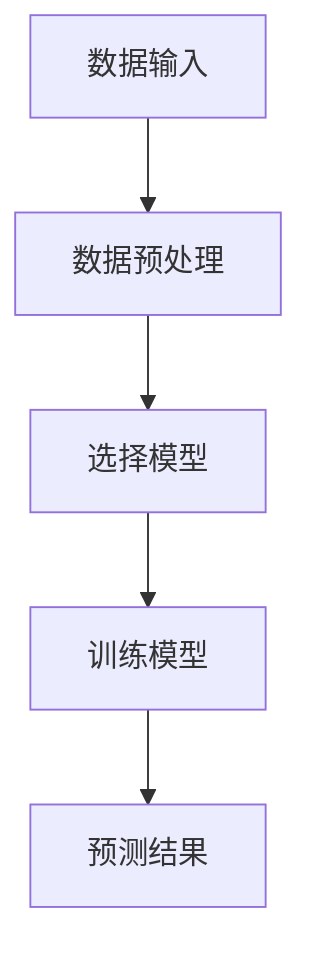
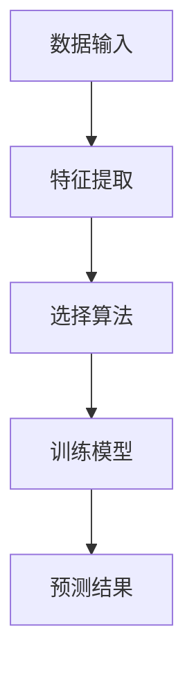
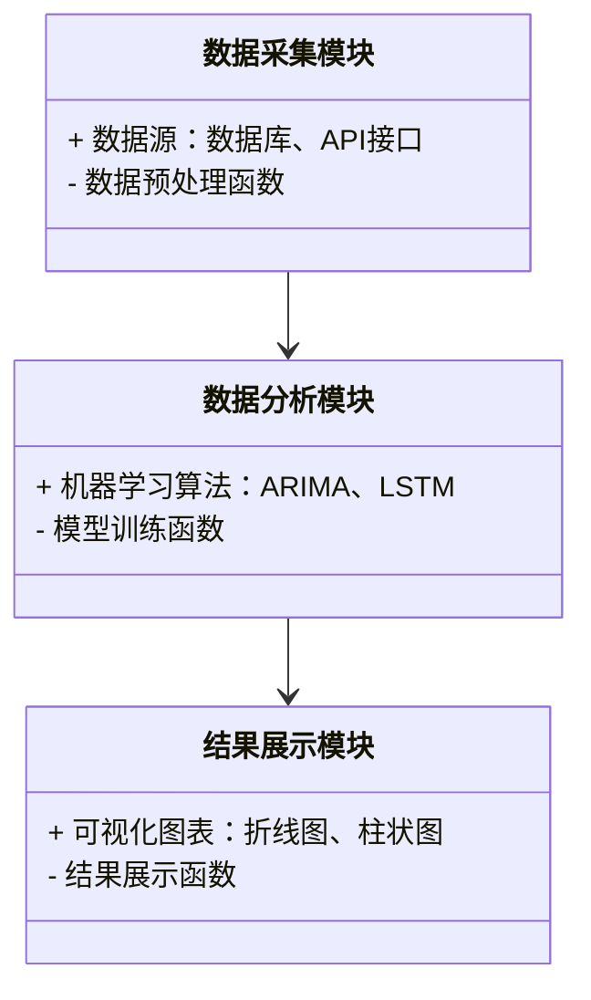
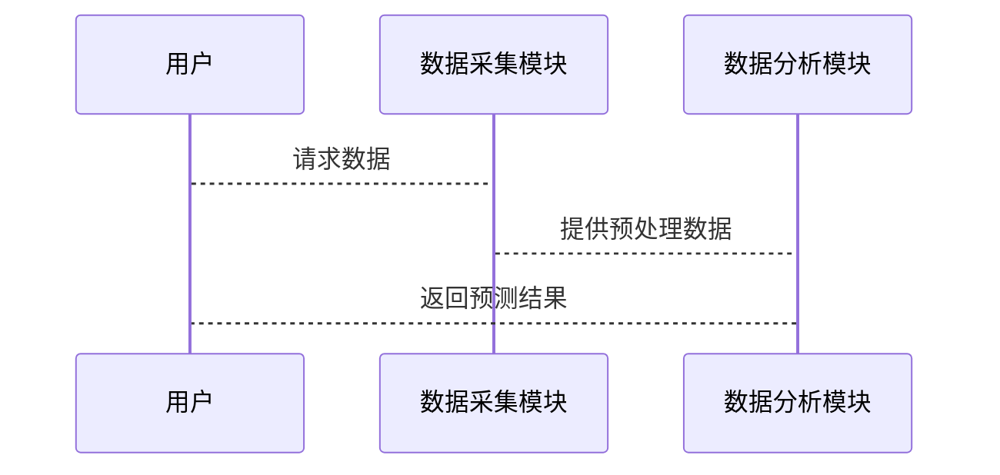

                 


# AI Agent辅助企业财务分析与预测

> 关键词：AI Agent，财务分析，财务预测，机器学习，时间序列分析，企业决策

> 摘要：本文探讨了AI Agent如何通过先进的机器学习算法和大数据分析技术，辅助企业进行财务分析与预测。文章详细介绍了AI Agent的核心概念、算法原理、数学模型、系统架构设计以及实际项目案例，为企业在财务领域应用AI技术提供了深入的分析和实践指导。

---

## 第一章: AI Agent与企业财务分析的背景介绍

### 1.1 AI Agent的基本概念

#### 1.1.1 AI Agent的定义与特点
AI Agent（人工智能代理）是一种能够感知环境、自主决策并执行任务的智能体。其特点包括智能性、自主性、反应性和社会性。在企业财务领域，AI Agent能够处理大量数据，识别模式，并提供决策支持。

#### 1.1.2 AI Agent在企业财务中的应用背景
随着企业数据的爆炸式增长，传统财务分析方法逐渐显现出效率低下、准确性不足的问题。AI Agent通过机器学习和大数据分析，能够快速处理复杂数据，提供实时反馈。

#### 1.1.3 问题背景与问题解决
企业在财务分析中面临数据复杂、预测不准确等问题。AI Agent通过自动化处理和智能预测，解决了这些问题，提高了企业的决策效率。

### 1.2 AI Agent的核心概念与联系

#### 1.2.1 AI Agent的原理与技术基础
AI Agent的原理包括感知、决策和执行。感知阶段通过数据采集和处理获取信息，决策阶段利用算法进行预测，执行阶段将结果应用于实际操作。

#### 1.2.2 核心概念属性对比表
| 概念       | 描述                                                                 |
|------------|----------------------------------------------------------------------|
| 感知       | 数据采集和处理                                                       |
| 决策       | 算法预测和分析                                                       |
| 执行       | 结果应用和反馈                                                       |

#### 1.2.3 ER实体关系图架构
```mermaid
erDiagram
    customer[客户]
    invoice[发票]
    transaction[交易]
    customer --> invoice: 生成
    invoice --> transaction: 记录
```

### 1.3 AI Agent在企业财务分析中的价值

#### 1.3.1 提高财务分析效率
AI Agent能够快速处理大量数据，减少人工操作，提高效率。

#### 1.3.2 增强财务预测准确性
通过机器学习算法，AI Agent能够识别数据中的复杂模式，提高预测的准确性。

#### 1.3.3 优化企业决策流程
AI Agent提供实时反馈和建议，帮助企业在财务决策中做出优化选择。

---

## 第二章: AI Agent辅助财务分析的算法原理

### 2.1 时间序列分析算法

#### 2.1.1 时间序列分析的基本概念
时间序列分析是对按时间顺序排列的数据进行建模和预测。常用方法包括ARIMA和LSTM。

#### 2.1.2 ARIMA模型原理
ARIMA（自回归积分滑动平均模型）适用于非平稳时间序列数据。其公式为：
$$ ARIMA(p, d, q) $$
其中，p为自回归阶数，d为差分阶数，q为滑动平均阶数。

#### 2.1.3 LSTM模型原理
LSTM（长短期记忆网络）通过门控机制处理长期依赖关系，适用于时间序列预测。

#### 2.1.4 算法流程图（使用mermaid）


### 2.2 机器学习算法在财务预测中的应用

#### 2.2.1 线性回归模型
线性回归用于预测变量与目标变量之间的线性关系，公式为：
$$ y = \beta_0 + \beta_1 x + \epsilon $$

#### 2.2.2 支持向量机（SVM）
SVM通过构建超平面进行分类或回归，适用于非线性数据的处理。

#### 2.2.3 随机森林与梯度提升树
随机森林通过集成学习提高模型的准确性和鲁棒性，梯度提升树则通过逐层优化模型。

#### 2.2.4 算法流程图（使用mermaid）


---

## 第三章: AI Agent辅助财务分析的数学模型

### 3.1 时间序列分析模型

#### 3.1.1 ARIMA模型公式
$$ ARIMA(p, d, q) $$

#### 3.1.2 LSTM模型公式
$$ a_t = \tanh(gate_t) $$
$$ gate_t = W_{z r} [h_{t-1}, x_t] $$
$$ h_t = a_t \cdot h_{t-1} + (1 - a_t) \cdot x_t $$

### 3.2 机器学习模型

#### 3.2.1 线性回归模型
$$ y = \beta_0 + \beta_1 x + \epsilon $$

#### 3.2.2 随机森林模型
$$ y = \sum_{i=1}^{n} \text{tree}_i(x) $$

---

## 第四章: 系统分析与架构设计方案

### 4.1 问题场景介绍
企业财务分析系统需要处理大量数据，实时预测和反馈。

### 4.2 项目介绍
本项目旨在开发一个基于AI Agent的企业财务分析与预测系统。

### 4.3 系统功能设计

#### 4.3.1 功能模块
- 数据采集模块：负责数据的获取和预处理。
- 数据分析模块：应用机器学习算法进行预测。
- 结果展示模块：将分析结果以可视化形式呈现。

#### 4.3.2 系统架构设计


### 4.4 系统接口设计

#### 4.4.1 接口描述
- 数据接口：从数据库获取财务数据。
- 分析接口：调用机器学习算法进行预测。
- 展示接口：将结果呈现给用户。

#### 4.4.2 系统交互设计


---

## 第五章: 项目实战

### 5.1 环境安装

#### 5.1.1 安装Python环境
使用Anaconda或virtualenv创建虚拟环境，安装必要的库：
- pandas、numpy、scikit-learn、keras、tensorflow

### 5.2 系统核心实现源代码

#### 5.2.1 数据预处理代码
```python
import pandas as pd
import numpy as np

# 数据加载
df = pd.read_csv('financial_data.csv')

# 数据清洗
df.dropna(inplace=True)
df['date'] = pd.to_datetime(df['date'])
df.set_index('date', inplace=True)

# 特征工程
from sklearn.preprocessing import StandardScaler

scaler = StandardScaler()
scaled_data = scaler.fit_transform(df['revenue'].values.reshape(-1, 1))
```

#### 5.2.2 模型训练代码
```python
from sklearn.ensemble import RandomForestRegressor
from sklearn.metrics import mean_absolute_error

# 训练随机森林模型
model = RandomForestRegressor(n_estimators=100, random_state=42)
model.fit(X_train, y_train)

# 模型预测
y_pred = model.predict(X_test)
print('预测结果:', y_pred)
print('预测误差:', mean_absolute_error(y_test, y_pred))
```

### 5.3 实际案例分析

#### 5.3.1 案例分析
以销售收入预测为例，详细分析数据预处理、模型选择和结果解读的过程。

#### 5.3.2 代码应用解读
解释上述代码的每一步功能，帮助读者理解如何在实际项目中应用这些技术。

### 5.4 项目小结
总结项目中的关键步骤，强调数据质量和模型调优的重要性。

---

## 第六章: 最佳实践与小结

### 6.1 最佳实践

#### 6.1.1 数据质量的重要性
确保数据的完整性和准确性，避免错误分析。

#### 6.1.2 模型调优的技巧
通过交叉验证和网格搜索优化模型性能。

### 6.2 小结
本文详细介绍了AI Agent在企业财务分析中的应用，从算法原理到项目实战，为企业提供了全面的指导。

### 6.3 注意事项
- 数据隐私和安全问题需要重视。
- 模型的可解释性在实际应用中同样重要。

### 6.4 拓展阅读
推荐相关书籍和论文，供读者深入学习。

---

## 参考文献

### 6.5.1 参考文献
1. Hyndman, R. J., & Athanasopoulos, G. (2018). Forecasting: principles and practice. OTexts.
2. LeCun, Y., Bengio, Y., & Hinton, G. (2015). Deep learning. Nature, 521(7555), 436-444.

---

## 作者信息

作者：AI天才研究院/AI Genius Institute & 禅与计算机程序设计艺术 /Zen And The Art of Computer Programming

---

## 延伸阅读

### 6.6.1 延伸阅读材料
- 时间序列分析经典教材《Forecasting: principles and practice》
- 深度学习领域的权威书籍《Deep learning》

