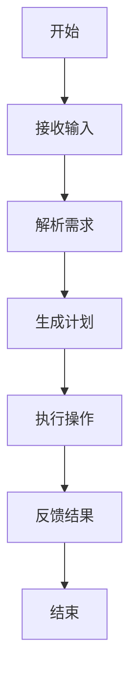
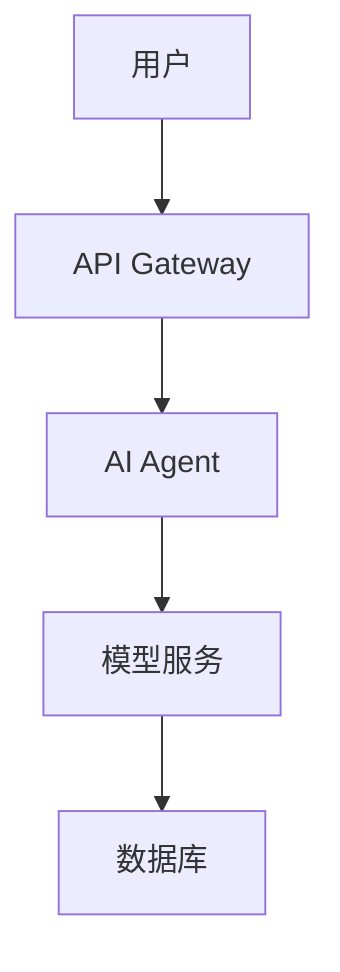
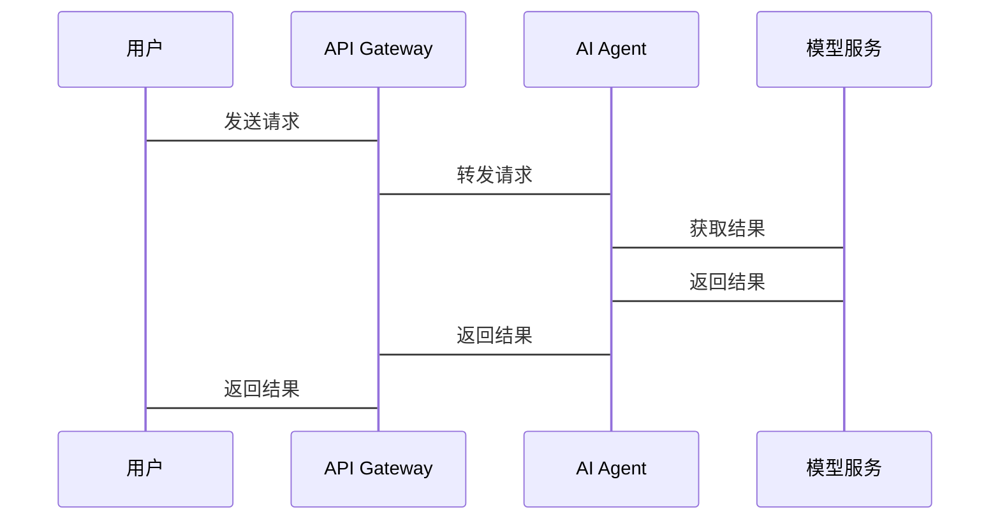

                 


# AI Agent辅助软件开发的方法

> 关键词：AI Agent, 软件开发, 人工智能, 算法原理, 系统架构, 项目实战

> 摘要：AI Agent作为一种新兴的辅助工具，在软件开发中展现出巨大的潜力。本文详细探讨了AI Agent的核心概念、算法原理、系统架构设计以及实际项目中的应用场景，帮助读者理解如何有效利用AI Agent提升开发效率和质量。

---

# 第1章: AI Agent的基本概念与背景

## 1.1 AI Agent的定义与特点

### 1.1.1 AI Agent的基本定义

AI Agent（人工智能代理）是一种能够感知环境、自主决策并执行任务的智能实体。它通过与环境交互，利用机器学习、自然语言处理等技术，为用户提供智能化的服务。AI Agent可以是软件程序、机器人或其他智能设备，其核心目标是通过自动化和智能化手段提高任务执行效率。

### 1.1.2 AI Agent的核心特点

AI Agent具有以下核心特点：

1. **智能性**：基于AI算法实现自主决策和问题解决。
2. **反应性**：能够实时感知环境变化并做出反应。
3. **学习性**：通过数据和经验优化自身行为。
4. **社交性**：支持与其他Agent、系统或人类进行交互。

### 1.1.3 AI Agent与传统软件开发的区别

与传统软件开发相比，AI Agent具有以下显著区别：

1. **自主性**：AI Agent能够自主决策，而传统软件通常依赖于明确的编程指令。
2. **适应性**：AI Agent能够根据环境变化自适应调整行为，而传统软件则需要人工干预。
3. **智能化**：AI Agent具备学习和推理能力，而传统软件通常只执行预定义的任务。

## 1.2 软件开发的现状与挑战

### 1.2.1 软件开发的复杂性

现代软件开发涉及复杂的系统设计、多团队协作和高并发需求，这些因素增加了开发的复杂性和难度。

### 1.2.2 开发效率与质量的平衡

开发效率与代码质量之间往往存在矛盾。提高效率可能牺牲代码质量，而追求高质量可能降低效率。

### 1.2.3 人工干预的局限性

人工干预在某些情况下可能效率低下，尤其是在处理大量重复性任务和复杂问题时。

## 1.3 AI Agent在软件开发中的应用前景

### 1.3.1 AI Agent的潜在应用场景

AI Agent在软件开发中的潜在应用场景包括代码生成、缺陷检测、性能优化和系统部署等。

### 1.3.2 企业采用AI Agent的优势

企业采用AI Agent可以显著提高开发效率、降低开发成本，并提升代码质量。

### 1.3.3 AI Agent应用的挑战与机遇

尽管AI Agent在软件开发中具有巨大潜力，但其应用也面临技术瓶颈、数据安全和隐私保护等挑战。

## 1.4 本章小结

本章介绍了AI Agent的基本概念、特点及其在软件开发中的应用前景。通过对比传统软件开发和AI Agent，读者可以理解AI Agent在提高开发效率和质量方面的巨大潜力。

---

# 第2章: AI Agent的核心概念与联系

## 2.1 AI Agent的原理

### 2.1.1 AI Agent的工作流程

AI Agent的工作流程包括感知环境、生成计划、执行操作和反馈结果四个阶段。

### 2.1.2 AI Agent与大模型的关系

AI Agent通常依赖于大模型（如GPT）提供生成能力和理解能力，但两者并非完全等同。

### 2.1.3 AI Agent的决策机制

AI Agent通过分析输入信息，结合内部知识库和上下文理解，生成最优决策。

## 2.2 AI Agent的核心要素

### 2.2.1 感知模块

感知模块负责接收输入信息并解析需求。

### 2.2.2 计划模块

计划模块根据需求生成执行计划。

### 2.2.3 执行模块

执行模块负责按照计划执行操作并返回结果。

## 2.3 AI Agent的属性特征对比表

| 特性 | 描述 |
|------|------|
| 智能性 | 基于AI算法实现自主决策 |
| 反应性 | 能够实时感知环境变化 |
| 学习性 | 可以通过经验优化行为 |
| 社交性 | 支持与其他Agent或人类交互 |

## 2.4 AI Agent的ER实体关系图

```mermaid
er
actor(Agent, User, System)
relation(Interaction, Command, Response)
```

## 2.5 本章小结

本章详细介绍了AI Agent的核心概念和原理，通过对比表和ER图展示了其内部结构和与其他实体的关系。

---

# 第3章: AI Agent的算法原理

## 3.1 AI Agent的算法流程



## 3.2 AI Agent的数学模型

### 3.2.1 状态空间模型

$$ S = \{s_1, s_2, ..., s_n\} $$

### 3.2.2 动作空间模型

$$ A = \{a_1, a_2, ..., a_m\} $$

### 3.2.3 奖励函数

$$ R(s, a) = r $$

## 3.3 AI Agent的决策算法

### 3.3.1 最大化期望奖励算法

$$ \arg\max_a \mathbb{E}[R(s, a)] $$

---

# 第4章: AI Agent的系统分析与架构设计

## 4.1 项目场景介绍

本项目旨在开发一个AI Agent辅助的软件开发平台，帮助开发人员提高编码效率和代码质量。

## 4.2 系统功能设计

系统功能包括代码生成、缺陷检测和性能优化。

## 4.3 系统架构设计



## 4.4 系统接口设计

系统接口包括REST API和WebSocket。

## 4.5 系统交互设计



---

# 第5章: AI Agent的项目实战

## 5.1 环境安装

安装Python和相关库（如TensorFlow、PyTorch）。

## 5.2 核心代码实现

```python
def generate_code(prompt):
    # 调用AI Agent生成代码
    pass

def detect_defects(code):
    # 调用AI Agent检测缺陷
    pass

def optimize_performance(code):
    # 调用AI Agent优化性能
    pass
```

## 5.3 案例分析

通过具体案例分析AI Agent在代码生成和缺陷检测中的应用。

## 5.4 项目总结

总结项目成果和经验教训。

---

# 第6章: AI Agent的最佳实践与注意事项

## 6.1 最佳实践

### 6.1.1 数据质量的重要性

确保训练数据的多样性和代表性。

### 6.1.2 模型的可解释性

保持模型的可解释性，便于调试和优化。

## 6.2 小结

AI Agent的应用需要综合考虑技术、数据和用户需求。

---

# 作者

作者：AI天才研究院/AI Genius Institute & 禅与计算机程序设计艺术 /Zen And The Art of Computer Programming

