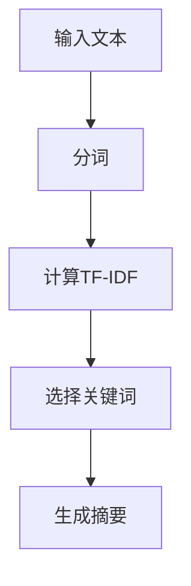
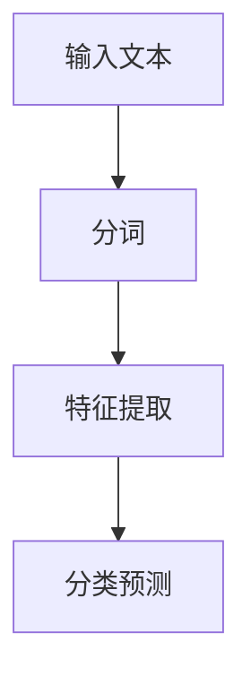
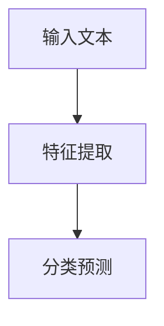
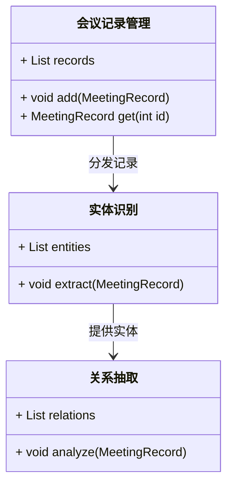
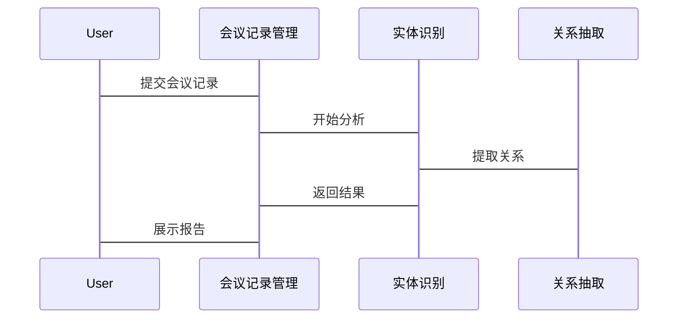

                 


# AI agents协作分析公司会议记录：洞察管理层思维

> **关键词：** AI代理，会议记录分析，自然语言处理，知识图谱，机器学习  
> **摘要：** 本文探讨了利用AI代理协作分析公司会议记录的方法，通过自然语言处理、机器学习等技术，揭示管理层思维和决策过程，为企业提供高效的战略支持。

---

## 第一章：背景介绍

### 1.1 问题背景

现代企业中，会议记录是管理层决策的重要依据。然而，传统的会议记录分析存在以下问题：

1. **信息分散**：会议记录通常以文本形式存储，缺乏结构化，难以快速提取关键信息。
2. **效率低下**：人工分析会议记录耗时长，容易遗漏重要信息。
3. **深度不足**：传统的记录分析难以洞察管理层的隐含意图和决策逻辑。

### 1.2 问题描述

AI代理可以通过以下方式解决这些问题：

- **自动化处理**：利用NLP技术快速提取关键信息。
- **深度分析**：通过机器学习模型揭示隐含的管理层思维。
- **协作优化**：提供结构化的分析结果，辅助后续决策。

### 1.3 问题解决

AI代理在会议记录分析中的作用包括：

- **数据预处理**：清洗和结构化会议记录。
- **信息提取**：识别关键实体和关系。
- **知识建模**：构建知识图谱，支持决策分析。

### 1.4 概念结构与核心要素

#### 对比分析表

| 概念 | 特征 | 优势 |
|------|------|------|
| NLP技术 | 文本处理与理解 | 高效提取信息 |
| 机器学习 | 数据建模与预测 | 深度分析 |
| 知识图谱 | 结构化知识表示 | 可视化洞察 |

#### ER实体关系图

```mermaid
erDiagram
    class 会议记录 {
        id
        会议主题
        参会人员
        时间
        内容
    }
    class 实体识别 {
        id
        实体类型
        实体名称
    }
    class 关系抽取 {
        id
        实体A
        实体B
        关系类型
    }
    会议记录 --> 实体识别 : 包含
    实体识别 --> 关系抽取 : 关联
```

---

## 第二章：核心概念与联系

### 2.1 AI代理的核心原理

- **NLP技术**：用于文本理解和生成。
- **机器学习**：用于模式识别和预测。
- **知识图谱**：用于结构化知识存储和推理。

### 2.2 会议记录分析的关键技术

- **文本摘要**：提取会议重点。
- **实体识别**：识别关键人物和术语。
- **情感分析**：分析情绪倾向。

### 2.3 概念对比分析

| 技术 | 输入 | 输出 |
|------|------|------|
| 文本摘要 | 长文本 | 简洁总结 |
| 实体识别 | 文本段落 | 实体列表 |
| 情感分析 | 文本内容 | 情感分数 |

---

## 第三章：算法原理

### 3.1 文本摘要算法

#### 流程图



#### Python代码

```python
from sklearn.feature_extraction.text import TfidfVectorizer

def text_summary(text):
    vectorizer = TfidfVectorizer()
    tfidf = vectorizer.fit_transform([text])
    words = vectorizer.get_feature_names_out()
    scores = tfidf.toarray()[0]
    keywords = [words[i] for i in range(len(words)) if scores[i] > 0.2]
    return keywords
```

#### 数学公式

$$ \text{TF-IDF}(t) = \text{TF}(t) \times \text{IDF}(t) $$

### 3.2 实体识别

#### 流程图



#### Python代码

```python
import spacy

nlp = spacy.load("en_core_web_sm")
def entity_recognition(text):
    doc = nlp(text)
    entities = []
    for ent in doc.ents:
        entities.append((ent.text, ent.label_))
    return entities
```

#### 数学公式

$$ \text{CRF}(x) = \arg\max_{y} \sum_{i=1}^{n} \log P(y_i | y_{i-1}, x_i) $$

### 3.3 情感分析

#### 流程图



#### Python代码

```python
from transformers import pipeline

sentiment_pipeline = pipeline("sentiment-analysis")
def sentiment_analysis(text):
    result = sentiment_pipeline(text)
    return result[0]["label"], result[0]["score"]
```

---

## 第四章：系统分析与架构设计

### 4.1 应用场景

- **数据采集**：从会议记录中提取文本。
- **数据处理**：清洗和结构化。
- **模型训练**：基于历史数据训练模型。
- **结果展示**：生成可视化报告。

### 4.2 系统功能设计

#### 类图



### 4.3 系统架构设计

#### 架构图


### 4.4 接口设计

- **输入接口**：接收会议记录文本。
- **输出接口**：返回结构化分析结果。

### 4.5 交互流程

#### 序列图



---

## 第五章：项目实战

### 5.1 环境配置

- **Python 3.8+**
- **依赖库**：spaCy, transformers, sklearn

### 5.2 核心实现

#### 代码示例

```python
from spacy.lang.zh import Chinese

# 初始化中文模型
nlp = Chinese()
doc = nlp("今天会议讨论了新产品战略，各部门负责人需要密切配合。")
entities = [(ent.text, ent.label_) for ent in doc.ents]
print(entities)
```

### 5.3 实际案例分析

- **案例背景**：某公司战略会议记录。
- **分析结果**：识别关键决策点和关联关系。

---

## 第六章：总结与展望

### 6.1 方法优势

- **高效性**：自动化处理提升效率。
- **深度性**：揭示隐含管理层思维。
- **可扩展性**：支持多种场景应用。

### 6.2 展望

- **技术进步**：更先进的NLP模型。
- **应用场景**：拓展到更多领域。

### 6.3 注意事项

- **数据隐私**：确保会议记录的安全性。
- **模型优化**：定期更新和训练模型。

### 6.4 拓展阅读

- 推荐书籍：《自然语言处理入门》
- 推荐工具：spaCy, Hugging Face

---

**作者：AI天才研究院/AI Genius Institute & 禅与计算机程序设计艺术 /Zen And The Art of Computer Programming**

