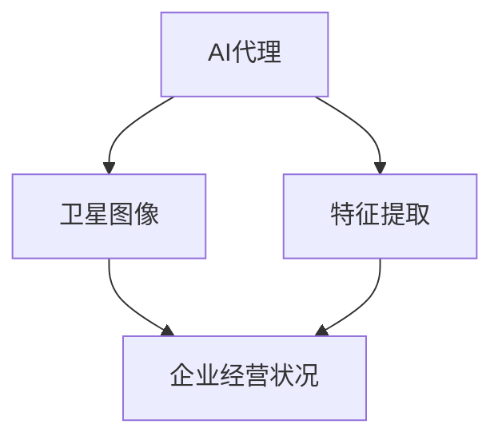
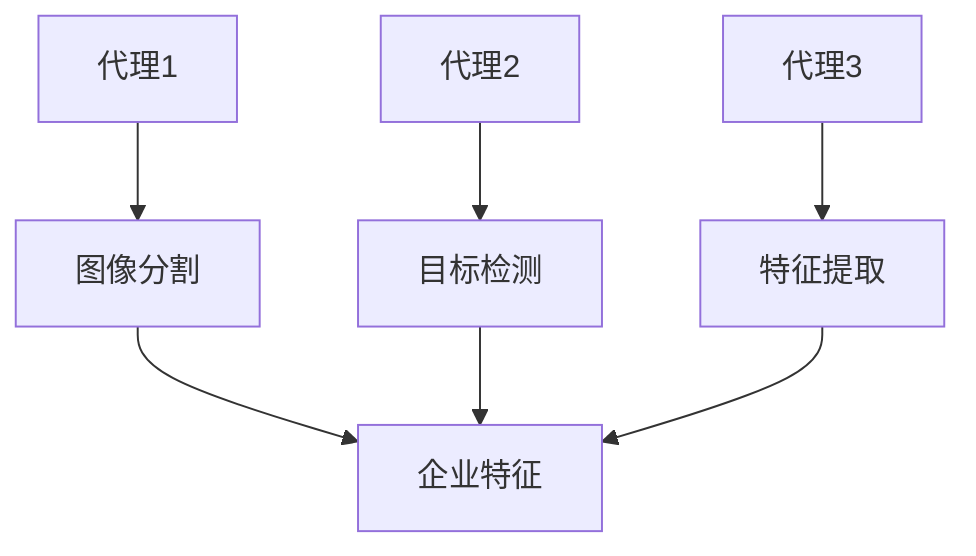
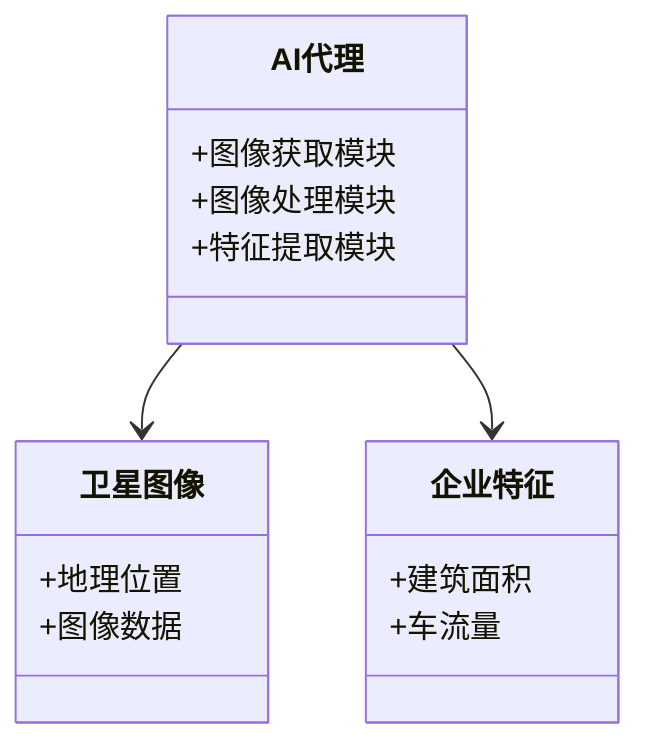
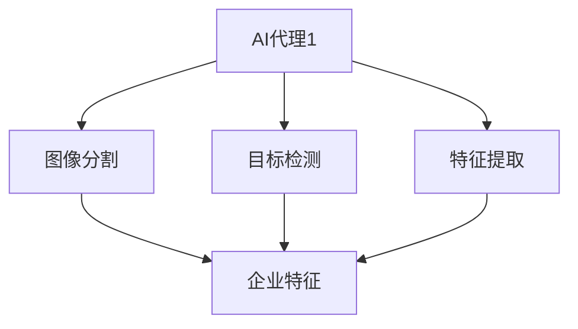

                 


# AI agents协作分析卫星图像：评估公司实际经营状况

> 关键词：AI代理, 卫星图像分析, 企业经营评估, 多代理协作, 图像处理, 数据分析

> 摘要：本文详细探讨了AI代理如何协作分析卫星图像，以评估公司实际经营状况。通过分析卫星图像中的地理和经济信息，AI代理可以辅助企业进行更精准的决策。文章从问题背景、核心概念、算法原理、系统架构、项目实战到最佳实践，全面阐述了AI代理在卫星图像分析中的应用。

---

# 第一部分: AI代理协作分析卫星图像的背景与核心概念

## 第1章: 问题背景与问题描述

### 1.1 问题背景
#### 1.1.1 卫星图像分析的现状与挑战
卫星图像分析是现代技术的重要组成部分，广泛应用于地理测绘、环境监测和商业分析。然而，传统的图像分析方法依赖人工操作，效率低下且容易出错。如何利用AI技术提高分析效率和准确性，成为当前的研究热点。

#### 1.1.2 企业经营状况评估的传统方法
企业经营状况通常通过财务报表、市场数据等文本信息进行评估，但这种方法缺乏直观性和实时性。通过卫星图像分析，可以获取企业的地理位置、建筑规模等直观信息，为评估提供新的视角。

#### 1.1.3 AI代理在图像分析中的潜在价值
AI代理具有并行处理和自主学习的能力，能够高效分析大量卫星图像数据。通过协作，AI代理可以分工合作，提高分析效率和准确性。

### 1.2 问题描述
#### 1.2.1 卫星图像分析的目标
卫星图像分析的目标是提取地理、经济和社会信息，为商业决策提供支持。

#### 1.2.2 企业经营状况评估的关键指标
企业经营状况评估的关键指标包括地理位置、建筑规模、交通流量等。这些指标可以通过卫星图像中的特征提取得到。

#### 1.2.3 AI代理协作的具体应用场景
AI代理协作可以应用于图像分割、目标检测和特征提取等任务，提高分析效率和准确性。

### 1.3 问题解决思路
#### 1.3.1 AI代理在卫星图像分析中的作用
AI代理可以处理大量图像数据，提取关键特征，为后续分析提供支持。

#### 1.3.2 多代理协作的优势
多代理协作可以分工合作，提高处理效率和准确性。例如，一个代理负责图像分割，另一个负责目标检测。

#### 1.3.3 数据处理与分析的流程
数据处理与分析的流程包括图像获取、预处理、特征提取、模型训练和结果分析。

### 1.4 问题的边界与外延
#### 1.4.1 卫星图像分析的边界条件
卫星图像分析的边界条件包括数据质量和分辨率限制。此外，分析结果的准确性受算法和数据的影响。

#### 1.4.2 企业经营评估的范围界定
企业经营评估的范围包括地理位置、建筑规模、交通流量等，但不包括内部财务数据。

#### 1.4.3 AI代理协作的适用场景与限制
AI代理协作适用于图像处理任务，但对需要复杂决策的任务效果有限。

### 1.5 核心概念与结构
#### 1.5.1 核心概念的定义与属性
- AI代理：具备自主学习和协作能力的智能体。
- 卫星图像：用于提取地理和经济信息的数据。
- 企业经营状况：通过图像分析得出的公司运营情况。

#### 1.5.2 核心概念之间的关系
AI代理通过处理卫星图像，提取特征，辅助企业经营评估。

#### 1.5.3 核心概念的实体关系图


---

## 第2章: 核心概念与联系

### 2.1 AI代理的核心原理
#### 2.1.1 AI代理的基本概念
AI代理是具备感知、决策和执行能力的智能体，能够处理复杂任务。

#### 2.1.2 AI代理的主要功能
- 数据获取
- 信息处理
- 决策制定

#### 2.1.3 AI代理的协作机制
通过分布式计算和任务分配，AI代理可以协作完成复杂任务。

### 2.2 卫星图像处理的关键技术
#### 2.2.1 卫星图像的获取与预处理
卫星图像获取后需要进行去噪和增强处理，以提高分析准确性。

#### 2.2.2 图像分割与目标检测
图像分割将图像划分为多个区域，目标检测识别特定对象。

#### 2.2.3 图像特征提取与分析
通过提取纹理、形状等特征，分析图像中的经济信息。

### 2.3 企业经营状况评估的指标体系
#### 2.3.1 企业经营状况的主要指标
- 建筑面积
- 车流量
- 周边环境

#### 2.3.2 卫星图像与企业经营的关联性
卫星图像中的特征与企业经营状况密切相关，例如车流量反映业务繁忙程度。

#### 2.3.3 指标体系的构建与优化
构建指标体系时，需考虑数据的可获取性和相关性，通过优化提升评估准确性。

### 2.4 核心概念之间的关系
#### 2.4.1 AI代理与卫星图像处理的结合
AI代理处理卫星图像数据，提取特征，辅助评估。

#### 2.4.2 卫星图像与企业经营评估的关联
通过分析卫星图像，提取企业相关的经济和社会特征。

#### 2.4.3 多代理协作的系统架构


---

## 第3章: 算法原理

### 3.1 图像分割算法
#### 3.1.1 图像分割的数学模型
图像分割通常使用卷积神经网络（CNN），例如U-Net模型。

#### 3.1.2 图像分割的实现步骤
1. 预处理：归一化和增强。
2. 模型训练：使用标注数据训练模型。
3. 推理：对新图像进行分割。

#### 3.1.3 图像分割的Python实现
```python
import tensorflow as tf
from tensorflow.keras import layers

def unet_model():
    inputs = layers.Input((256, 256, 3))
    conv1 = layers.Conv2D(64, (3,3), activation='relu')(inputs)
    conv2 = layers.Conv2D(128, (3,3), activation='relu')(conv1)
    # 其他层略去...
    return model

model = unet_model()
model.compile(optimizer='adam', loss='binary_crossentropy', metrics=['accuracy'])
```

### 3.2 目标检测算法
#### 3.2.1 目标检测的数学模型
目标检测常用YOLO算法，通过回归和分类预测目标的位置和类别。

#### 3.2.2 目标检测的实现步骤
1. 预处理：调整图像大小和归一化。
2. 模型训练：使用标注数据训练模型。
3. 推理：检测新图像中的目标。

#### 3.2.3 目标检测的Python实现
```python
import tensorflow as tf
from tensorflow.keras import layers

def yolo_model():
    inputs = layers.Input((416, 416, 3))
    # 模型主体略去...
    return model

model = yolo_model()
model.compile(optimizer='adam', loss='sparse_categorical_crossentropy', metrics=['accuracy'])
```

### 3.3 特征提取算法
#### 3.3.1 特征提取的数学模型
使用主干网络如ResNet提取图像特征，再通过全连接层进行分类。

#### 3.3.2 特征提取的实现步骤
1. 预处理：调整图像大小和归一化。
2. 提取特征：使用预训练模型提取特征。
3. 分类：通过全连接层预测类别。

#### 3.3.3 特征提取的Python实现
```python
import tensorflow as tf
from tensorflow.keras import layers

def feature_extractor():
    base_model = tf.keras.applications.ResNet50(weights='imagenet', include_top=False)
    model = tf.keras.Sequential()
    model.add(base_model)
    model.add(layers.Flatten())
    model.add(layers.Dense(128, activation='relu'))
    model.add(layers.Dense(10, activation='softmax'))
    return model

model = feature_extractor()
model.compile(optimizer='adam', loss='sparse_categorical_crossentropy', metrics=['accuracy'])
```

---

## 第4章: 系统分析与架构设计

### 4.1 问题场景介绍
AI代理协作分析卫星图像的系统用于评估企业经营状况，支持商业决策。

### 4.2 系统功能设计
#### 4.2.1 领域模型


#### 4.2.2 系统架构


### 4.3 接口与交互设计
#### 4.3.1 系统接口
- 图像获取接口：接收卫星图像数据。
- 分析结果接口：返回企业特征。

#### 4.3.2 系统交互流程
1. AI代理接收卫星图像数据。
2. 处理图像，提取特征。
3. 返回企业特征结果。

---

## 第5章: 项目实战

### 5.1 环境安装
安装Python、TensorFlow和相关库，配置开发环境。

### 5.2 核心代码实现
实现图像分割、目标检测和特征提取模块，整合AI代理协作。

### 5.3 实际案例分析
通过具体案例展示AI代理协作分析卫星图像的过程和结果。

### 5.4 项目小结
总结项目成果，分析优缺点，提出改进建议。

---

## 第6章: 最佳实践与小结

### 6.1 最佳实践
- 数据预处理：确保数据质量。
- 算法选择：根据任务选择合适的模型。
- 系统优化：提高处理效率。

### 6.2 小结
AI代理协作分析卫星图像为企业经营评估提供了新的视角，通过多代理协作提高效率和准确性。

### 6.3 注意事项
- 数据隐私：确保数据安全。
- 算法优化：持续改进模型性能。

### 6.4 拓展阅读
推荐相关书籍和论文，供读者深入学习。

---

# 结语

AI代理协作分析卫星图像是一项具有广阔前景的技术，通过不断优化算法和系统设计，可以为企业经营评估提供更有力的支持。

---

作者：AI天才研究院 & 禅与计算机程序设计艺术

