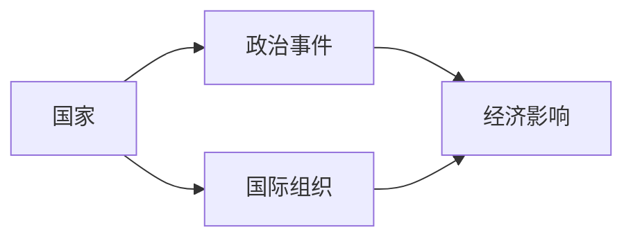
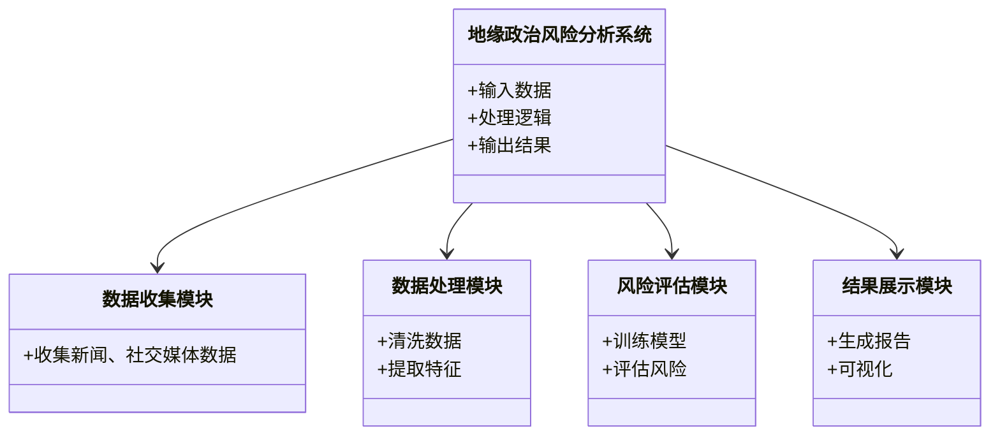
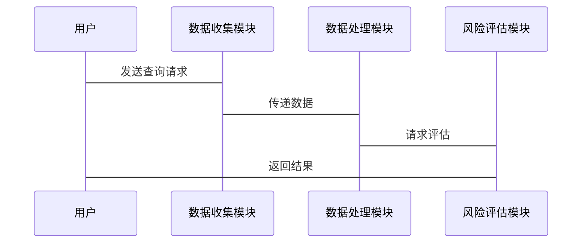

                 


# AI agents协作分析地缘政治风险：全球价值投资的必备工具

## 关键词：AI代理，地缘政治风险，全球投资，自然语言处理，风险评估，协作分析

## 摘要：  
本文详细探讨了AI代理在分析地缘政治风险中的应用，揭示了其在全球价值投资中的重要性。通过结合自然语言处理和协作分析技术，AI代理能够实时监控和评估地缘政治事件，为投资者提供精准的风险评估和决策支持。文章从核心概念、算法原理、系统设计到实战应用，全面解析了AI代理如何成为全球价值投资的必备工具。

---

# 正文

## 第1章: AI代理与地缘政治风险分析基础

### 1.1 AI代理的基本概念

#### 1.1.1 AI代理的定义与分类  
AI代理（Artificial Intelligence Agents）是指能够感知环境、执行任务并做出决策的智能实体。它们可以分为简单反射代理和基于模型的代理，后者能够通过学习和推理优化决策过程。AI代理广泛应用于自动化系统、数据分析和风险管理等领域。

#### 1.1.2 地缘政治风险的定义  
地缘政治风险是指由于政治、经济、文化和社会等因素变化引发的不确定性，可能对企业或投资产生负面影响。这些风险包括战争、政局不稳、政策变化等。

#### 1.1.3 AI代理在地缘政治风险分析中的作用  
AI代理通过处理大量非结构化数据，识别潜在风险信号，帮助投资者快速做出决策。例如，利用自然语言处理技术分析新闻报道和社交媒体，识别地缘政治事件的潜在影响。

### 1.2 地缘政治风险的特征与分类  

#### 1.2.1 地缘政治风险的多维性  
地缘政治风险涉及政治、经济、社会等多个维度。例如，政策变化可能影响企业运营，而社会动荡可能影响市场稳定性。

#### 1.2.2 地缘政治风险的分类与影响  
地缘政治风险可以分为短期风险（如政策变动）和长期风险（如地缘政治格局变化）。不同风险对投资的影响也不同，例如贸易限制可能导致供应链中断。

#### 1.2.3 AI代理如何识别地缘政治风险  
AI代理通过实时监控新闻、社交媒体和官方声明，利用自然语言处理技术识别关键词和情感倾向，评估潜在风险。

---

## 第2章: 地缘政治风险分析的核心概念

### 2.1 地缘政治风险的实体关系分析  

#### 2.1.1 Mermaid实体关系图  


地缘政治风险涉及国家、政治事件、经济影响和国际组织等实体。通过分析这些实体之间的关系，AI代理可以更准确地预测风险。

### 2.2 AI代理协作的原理  

#### 2.2.1 AI代理协作的基本原理  
AI代理协作是指多个AI代理协同工作，利用各自的优势完成复杂任务。例如，一个代理负责数据收集，另一个负责风险评估。

#### 2.2.2 AI代理协作的数学模型  
$$ R = f(R_1, R_2, ..., R_n) $$  
其中，$R$表示综合风险评估，$R_i$表示各个AI代理的风险评估结果，$f$表示整合函数。

#### 2.2.3 AI代理协作的流程图  


---

## 第3章: 地缘政治风险分析的算法原理

### 3.1 基于自然语言处理的地缘政治风险分析  

#### 3.1.1 NLP技术在地缘政治风险分析中的应用  
自然语言处理（NLP）技术用于分析文本数据，识别关键词和情感倾向。例如，通过分析新闻标题和评论，识别潜在的地缘政治风险。

#### 3.1.2 基于词袋模型的风险评估  
词袋模型将文本表示为单词的集合，通过统计关键词出现的频率，评估文本的情感倾向。例如，负面关键词的出现频率增加可能表明风险上升。

#### 3.1.3 基于深度学习的文本分析  
深度学习模型（如LSTM和Transformer）可以更准确地捕捉文本的情感和语义信息。例如，通过训练模型识别地缘政治事件的相关文本，预测风险。

### 3.2 地缘政治风险分析的数学模型  

#### 3.2.1 风险评估的数学公式  
$$ R = \sum_{i=1}^{n} w_i \cdot x_i $$  
其中，$R$表示综合风险，$w_i$表示特征$x_i$的权重，$x_i$表示特征值。

#### 3.2.2 情感分析的数学模型  
$$ S = \text{sigmoid}(w_1 x_1 + w_2 x_2 + ... + w_n x_n) $$  
其中，$S$表示情感倾向（0表示负面，1表示正面），$x_i$表示特征值，$w_i$表示权重。

---

## 第4章: 系统分析与架构设计

### 4.1 问题场景介绍  

#### 4.1.1 投资者面临的地缘政治风险  
投资者需要实时监控地缘政治风险，评估其对投资的影响。例如，贸易摩擦可能影响企业的供应链。

### 4.2 系统功能设计  

#### 4.2.1 领域模型的Mermaid类图  


### 4.3 系统架构设计  

#### 4.3.1 Mermaid架构图  


### 4.4 接口设计与交互  

#### 4.4.1 系统接口设计  
系统提供API接口，允许投资者调用风险评估服务。例如，通过API获取实时风险评估结果。

#### 4.4.2 Mermaid交互序列图  


---

## 第5章: 项目实战

### 5.1 环境安装  

#### 5.1.1 Python环境安装  
安装Python和必要的库，例如：
- `numpy`
- `pandas`
- `scikit-learn`
- `transformers`

#### 5.1.2 系统依赖安装  
安装NLP库和深度学习框架，例如：
- `spaCy`
- `tensorflow`

### 5.2 核心代码实现  

#### 5.2.1 数据收集模块  
```python
import requests
import json

def collect_data(url):
    response = requests.get(url)
    return json.loads(response.text)
```

#### 5.2.2 数据处理模块  
```python
from sklearn.feature_extraction.text import TfidfVectorizer

def preprocess_data(data):
    texts = [item['text'] for item in data]
    vectorizer = TfidfVectorizer()
    X = vectorizer.fit_transform(texts)
    return X
```

#### 5.2.3 风险评估模块  
```python
from transformers import pipeline

def evaluate_risk(X):
    classifier = pipeline("sentiment-analysis")
    results = []
    for text in X:
        result = classifier(text)
        results.append(result)
    return results
```

### 5.3 案例分析  

#### 5.3.1 实际案例分析  
以中美贸易摩擦为例，分析新闻数据，评估其对供应链的影响。

#### 5.3.2 代码应用解读  
解释代码的功能，展示如何通过AI代理分析地缘政治风险。

---

## 第6章: 总结与展望

### 6.1 最佳实践 Tips  

- 定期更新模型，以适应新的地缘政治变化。
- 结合多模态数据（文本、图像等）提高风险评估的准确性。

### 6.2 小结  
本文详细介绍了AI代理在地缘政治风险分析中的应用，展示了其在全球价值投资中的重要性。

### 6.3 注意事项  

- 数据隐私问题需要注意，确保合法合规。
- 风险评估结果仅供参考，投资者需结合实际情况做出决策。

### 6.4 拓展阅读  

- 《自然语言处理实战》
- 《深度学习在金融中的应用》
- 《地缘政治学入门》

---

# 作者：AI天才研究院/AI Genius Institute & 禅与计算机程序设计艺术 /Zen And The Art of Computer Programming

