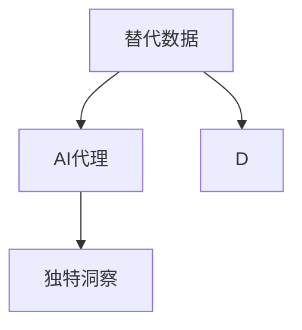
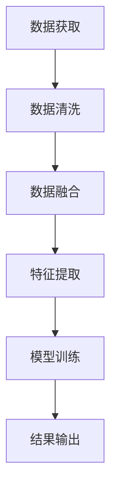
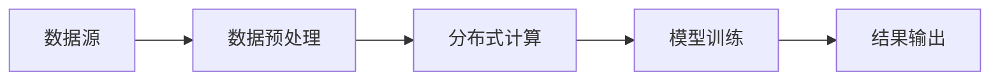
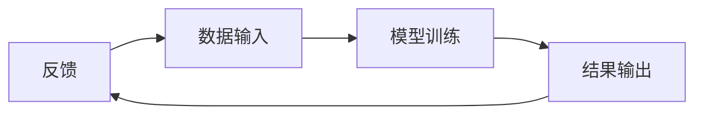

                 


# AI agents协作分析替代数据：获取独特洞察

**关键词：** AI代理，协作分析，替代数据，独特洞察，数据处理，算法原理，系统架构

**摘要：** 本文探讨了AI代理协作分析替代数据的方法，旨在通过系统化的分析流程和创新的算法设计，挖掘数据中的独特洞察。文章详细介绍了AI代理协作的基本原理，替代数据的处理流程，以及如何利用这些信息生成有价值的见解。同时，本文还分析了实现这一过程所需的系统架构和算法原理，并通过具体案例展示了如何在实际项目中应用这些方法。通过本文的分析，读者能够全面理解AI代理协作在数据分析中的作用及其实际应用价值。

---

## 目录

### 第1章: AI代理协作与替代数据概述

#### 1.1 问题背景
- 1.1.1 数据分析的现状与挑战
- 1.1.2 替代数据的定义与特点
- 1.1.3 AI代理在数据分析中的作用

#### 1.2 问题描述
- 1.2.1 替代数据的获取与处理
- 1.2.2 AI代理协作的必要性
- 1.2.3 数据分析的独特性与洞察价值

#### 1.3 问题解决
- 1.3.1 AI代理协作的基本原理
- 1.3.2 替代数据的处理流程
- 1.3.3 独特洞察的生成机制

#### 1.4 边界与外延
- 1.4.1 替代数据的边界条件
- 1.4.2 AI代理协作的适用范围
- 1.4.3 数据分析的独特性与局限性

#### 1.5 概念结构与核心要素
- 1.5.1 替代数据的核心要素
- 1.5.2 AI代理协作的核心要素
- 1.5.3 独特洞察的核心要素

### 第2章: AI代理协作的核心概念与联系

#### 2.1 核心概念原理
- 2.1.1 替代数据的特征
- 2.1.2 AI代理协作的机制
- 2.1.3 独特洞察的生成过程

#### 2.2 属性对比表格
- 2.2.1 替代数据与传统数据的对比
- 2.2.2 AI代理协作与其他数据分析方法的对比
- 2.2.3 独特洞察与传统分析结果的对比

#### 2.3 ER实体关系图


### 第3章: AI代理协作的算法原理

#### 3.1 分布式计算与数据融合
- 3.1.1 分布式计算的基本原理
- 3.1.2 数据融合的实现方法
- 3.1.3 算法流程图


#### 3.2 独特洞察的生成算法
- 3.2.1 联合概率分布模型
$$P(A|B) = \frac{P(B|A)P(A)}{P(B)}$$
- 3.2.2 协同过滤算法
$$sim(i,j) = \frac{\sum_{k} r_{ik}r_{jk}}{\sqrt{\sum_{k}r_{ik}^2} \sqrt{\sum_{k}r_{jk}^2}}$$
- 3.2.3 代码示例
```python
def collaborative_filtering(user_data):
    # 数据预处理
    user_data = normalize(user_data)
    # 计算相似度
    similarity_matrix = compute_similarity(user_data)
    # 生成推荐
    recommendations = generate_recommendations(similarity_matrix)
    return recommendations
```

### 第4章: 系统分析与架构设计方案

#### 4.1 系统功能设计
- 4.1.1 数据获取与预处理
- 4.1.2 分布式计算模块
- 4.1.3 独特洞察生成模块

#### 4.2 系统架构设计


#### 4.3 接口设计
- 4.3.1 数据输入接口
- 4.3.2 模型训练接口
- 4.3.3 结果输出接口

#### 4.4 交互设计


### 第5章: 项目实战

#### 5.1 环境安装
- 安装Python
- 安装相关库（如NumPy、Pandas、Scikit-learn）

#### 5.2 核心代码实现
- 数据预处理代码
```python
import pandas as pd

def preprocess_data(data):
    # 删除缺失值
    data = data.dropna()
    # 标准化处理
    data = (data - data.mean()) / data.std()
    return data
```

- 分布式计算代码
```python
import distributed

def distributed_computation(data):
    # 分片数据
    data_partitions = distributed.split_data(data)
    # 并行计算
    results = distributed.map(data_partitions, compute)
    # 合并结果
    return distributed.reduce(results)
```

#### 5.3 案例分析
- 数据集选择与处理
- 模型训练与验证
- 结果分析与解读

#### 5.4 项目小结
- 项目目标达成情况
- 遇到的问题与解决方案
- 经验总结与改进建议

### 第6章: 总结与展望

#### 6.1 小结
- 本章总结了AI代理协作分析替代数据的主要方法和实现过程
- 强调了系统设计与算法优化的重要性

#### 6.2 注意事项
- 数据质量对结果的影响
- 模型选择与调优
- 系统性能优化

#### 6.3 未来展望
- 更高效的数据处理方法
- 更智能的AI代理协作机制
- 更广泛的应用场景

#### 6.4 拓展阅读
- 推荐相关书籍和论文
- 提供进一步学习的资源

---

**作者：** AI天才研究院 & 禅与计算机程序设计艺术

