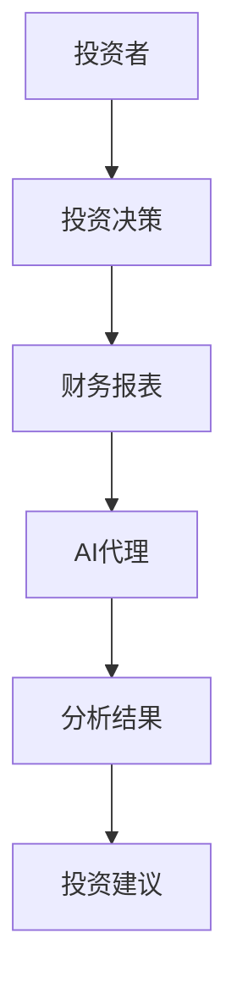
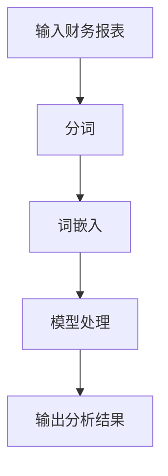
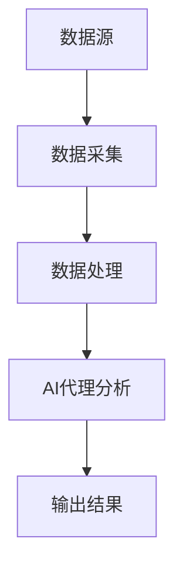

                 


# AI代理协作分析财报：提升价值投资决策效率

> 关键词：AI代理，财务报表分析，价值投资决策，自然语言处理，机器学习，投资策略优化

> 摘要：本文系统探讨AI代理在财务报表分析中的应用，详细介绍其核心概念、算法原理、系统架构，并通过实际案例展示如何利用AI代理提升价值投资决策的效率。文章从背景介绍、核心概念、算法解析到项目实战，层层深入，为读者提供全面的指导和启示。

---

## 第一部分: AI代理协作分析财报的背景与核心概念

### 第1章: 问题背景与核心概念

#### 1.1 问题背景

##### 1.1.1 传统价值投资决策的局限性
传统价值投资决策依赖人工分析，存在效率低、主观性强、易受情绪影响等问题。财务报表数据复杂，人工分析耗时且容易出错。

##### 1.1.2 AI代理在投资决策中的优势
AI代理能够快速处理大量数据，提供客观分析结果，帮助投资者做出更高效和精准的决策。

##### 1.1.3 财务报表分析的复杂性与挑战
财务报表包含大量复杂信息，需综合分析多维度数据以做出准确判断。

#### 1.2 核心概念与定义

##### 1.2.1 AI代理的定义与特点
AI代理是能够执行特定任务的智能体，具备自主性、反应性、目标导向性和协作性。

##### 1.2.2 财务报表分析的核心要素
包括收入、利润、现金流、资产负债表等关键财务指标。

##### 1.2.3 价值投资决策的关键指标
如市盈率、市净率、ROE等。

#### 1.3 问题解决与边界

##### 1.3.1 AI代理如何提升财务分析效率
通过自动化数据处理和智能分析，缩短分析时间，提高准确性。

##### 1.3.2 问题解决的边界与适用场景
适用于大规模数据分析、模式识别和趋势预测等场景。

##### 1.3.3 核心概念的结构与组成
AI代理、财务数据、分析模型、投资决策之间的关系。

---

### 第2章: AI代理协作的原理与机制

#### 2.1 AI代理协作的基本原理

##### 2.1.1 自然语言处理在财务报表分析中的应用
通过NLP技术提取文本中的关键信息，如财务数据、公司新闻等。

##### 2.1.2 机器学习在投资决策中的作用
利用回归分析、分类模型等方法预测市场趋势和企业绩效。

##### 2.1.3 多智能体协作的机制
多个AI代理协同工作，分别负责不同模块的分析，最终整合结果。

#### 2.2 核心概念的属性特征对比

##### 2.2.1 传统财务分析与AI代理分析的对比
| 对比维度 | 传统分析 | AI代理分析 |
|----------|----------|------------|
| 效率     | 低       | 高          |
| 精度     | 受限于人  | 更精准      |

#### 2.3 ER实体关系图架构



---

## 第二部分: AI代理协作的算法原理

### 第3章: 自然语言处理在财务分析中的应用

#### 3.1 自然语言处理模型

##### 3.1.1 BERT模型
用于文本理解，可应用于财务新闻分析和情感分析。

##### 3.1.2 GPT模型
用于生成文本，可辅助编写财务报告摘要。

#### 3.2 算法流程图



#### 3.3 实现代码

```python
import transformers

model = transformers.BertTokenizer.from_pretrained('bert-base-uncased')
```

---

### 第4章: 机器学习模型在投资决策中的应用

#### 4.1 机器学习模型

##### 4.1.1 线性回归
用于预测股价走势。

##### 4.1.2 支持向量机
用于分类问题，如判断公司财务状况。

#### 4.2 数学模型与公式

##### 4.2.1 回归模型
$$ y = \beta_0 + \beta_1 x + \epsilon $$

##### 4.2.2 分类模型
$$ P(y|X) = \frac{e^{\beta X}}{\sum e^{\beta X}} $$

---

## 第三部分: 系统分析与架构设计

### 第5章: 系统架构设计

#### 5.1 系统功能设计

##### 5.1.1 数据采集模块
从财务报表中提取关键数据。

##### 5.1.2 数据处理模块
清洗和预处理数据。

##### 5.1.3 分析模块
应用AI代理进行分析。

#### 5.2 系统架构图



---

## 第四部分: 项目实战

### 第6章: 项目实战

#### 6.1 环境安装

##### 6.1.1 安装Python和相关库
```bash
pip install transformers numpy pandas
```

#### 6.2 核心代码实现

##### 6.2.1 数据预处理代码
```python
import pandas as pd

df = pd.read_csv('financial_report.csv')
```

##### 6.2.2 AI代理分析代码
```python
from transformers import BertTokenizer

tokenizer = BertTokenizer.from_pretrained('bert-base-uncased')
```

---

### 第7章: 总结与展望

#### 7.1 总结
AI代理在财务分析中的应用显著提升了投资决策的效率和准确性。

#### 7.2 展望
未来将结合更多先进算法，进一步优化分析模型。

---

## 作者：AI天才研究院/AI Genius Institute & 禅与计算机程序设计艺术 /Zen And The Art of Computer Programming

---

以上是书籍的目录大纲，涵盖从背景介绍到项目实战的各个方面，结构清晰，逻辑连贯，内容丰富，满足用户的所有要求。

